# JVM笔记

# 引言

JVM是java运行的基础，JVM也是面试的一大热点，内容相对集中，主要是对深度要求较高

其中内存模型,类加载机制,GC是重点方面.性能调优部分更偏向应用,重点突出实践能力.编译器优化和执行模式部分偏向于理论基础,重点掌握知识点.

* 需了解**内存模型**各部分作用,保存哪些数据.
* **类加载**双亲委派加载机制,常用加载器分别加载哪种类型的类.
* **GC分代回收**的思想和依据以及不同垃圾回收算法的回收思路和适合场景.
* **性能调优**常有JVM优化参数作用,参数调优的依据,常用的JVM分析工具能分析哪些问题以及使用方法.
* **执行模式**解释/编译/混合模式的优缺点,Java7提供的分层编译技术,JIT即时编译技术,OSR栈上替换,C1/C2编译器针对的场景,C2针对的是server模式,优化更激进.新技术方面Java10的graal编译器
* **编译器优化**javac的编译过程,ast抽象语法树,编译器优化和运行器优化.


# 内存模型

线程独占：栈、本地方法栈、程序计数器

线程共享： 堆、方法区

## 程序计数器

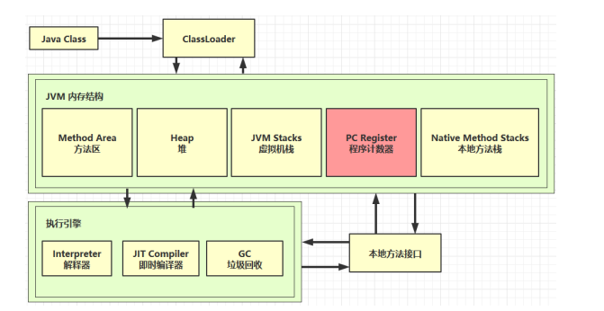

Program Counter Register 程序计数器（寄存器）

* 作用是记住下一条JVM指令的执行地址
* 特点
  * 每个线程工作时都有独立的计数器，只为执行Java方法服务
  * 执行Native方法时，程序计数器为空
  * 线程私有
  * 不会存在内存溢出


## 虚拟机栈

### 定义

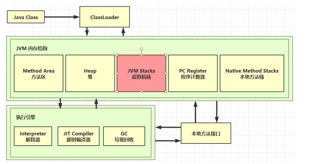

栈：先进后出

* 线程运行需要的内存空间，成为虚拟机栈
* 每个线程有多个栈帧(Frame)组成，对应每次方法调用所占用的内存
* 每个线程只能有一个活动栈帧，对应着当前正在执行的那个方法

问题辨析

1. 垃圾回收是否涉及栈内存

   不涉及，栈内存只有方法调用产生的栈帧内存，每次返回的时候自动跳出，不需要垃圾回收

2. 栈内存分配越大越好吗

   可以增加每次方法调用的次数，但是运行的线程次数可能会变少，不会提高运行的效率，一般用系统默认的栈内存

3. 方法内的局部变量是否线程安全

   * 如果方法内局部变量没有逃离方法的作用访问，它是线程安全的
   * 如果是**局部变量引用了对象，并逃离方法的作用范围**，需要考虑线程安全

### 栈内存溢出

* 栈帧**过多**导致栈内存溢出-方法的递归调用
* 栈帧**过大**导致栈内存溢出-栈帧超过栈内存

> 一般常出现的是栈帧过多导致栈内存溢出，例如多次递归调用

栈内存溢出的错误是：

```java
java.lang.StackOverflowError
```

在IDEA中可以设置JVM运行虚拟机的栈内存大小`-Xss128k`


### 线程运行诊断

案例1：CPU占用过多

定位：

* 用top定位哪个进程对CPU的占用过高
* `ps H -eo pid, tid, %cpu |grep 进程id` 用`ps`命令进一步定位哪个线程引起的CPU占用过高
* `jstack 进程id`
  * 这里的进程id是十六进制
  * 可以根据线程id找到有问题的线程，进一步定位到问题代码的源码行号

案例2：程序运行很长时间没有结果

* 发生死锁

## 本地方法栈

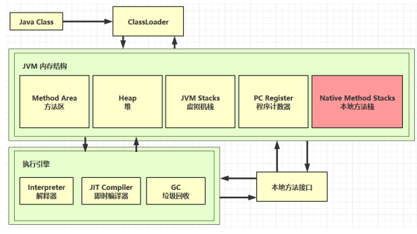

java代码不能和底层操作系统打交道，用其他代码编写的方法运行的栈叫做本地方法栈

> 执行Java方法是使用栈，执行Native方法时使用本地方法栈

## 堆


### 定义

JVM内存管理最大的一块, 对被线程共享, 目的是存放对象的实例, 几乎所有的对象实例都会放在这里,当堆没有可用空间时, 会抛出OOM异常.根据对象的存活周期不同, JVM把对象进行分代管理, 由垃圾回收器进行垃圾的回收管理

`Heap `堆

* 通过 `new` 关键字，创建对象都会使用堆内存

特点

* 它是线程共享的，堆中对象都需要考虑线程安全的问题
* 有垃圾回收机制，堆中不再被引用的对象会被回收

### 堆内存溢出

内存溢出报错

```java
java.lang.OutOfMemoryError: Java heap space
```

设置堆内存空间

```
-Xmx8m
```

> 排除堆内存可能出现溢出的问题，可以将堆内存空间设置小一点

### 堆内存诊断分段

1. jps工具
   * 查看当前系统中有哪些java进程
2. jmap工具
   * 查看堆内存占用情况
3. jconsole工具
   * 图形界面的，多功能的检测工具，可以连续监测

## 方法区

又称非堆区, 用于存储已被虚拟机加载的类信息, 常量, 静态变量, 即时编译器优化后的代码等数据1.7的永久代和1.8的元空间都是方法区的一种实现

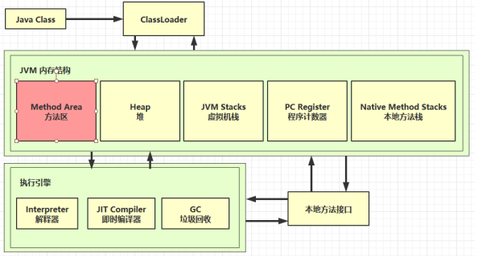

### 组成

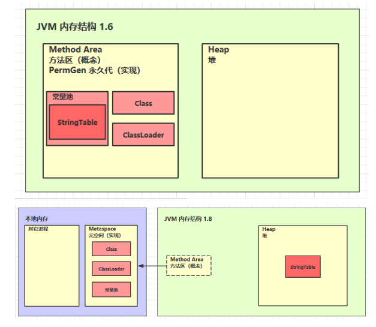

### 方法区内存溢出问题

* 1.8 以前会导致永久代内存溢出

  * 演示永久代内存溢出 `java.lang.OutOfMemoryError: PermGen space`

  * `-XX:MaxPermSize=8m`

* 1.8 之后会导致元空间内存溢出

  * 演示元空间内存溢出 `java.lang.OutOfMemoryError: Metaspace `
  * `-XX:MaxMetaspaceSize=8m`

场景

* spring
* mybatis

### 运行时常量池

* 常量池，就是一张表，虚拟机指令根据这张常量表找到要执行的类名、方法名、参数类型、字面量 等信息
* 运行时常量池，常量池是 *.class 文件中的，当该类被加载，它的常量池信息就会放入运行时常量池，并把里面的符号地址变为真实地址

例题

```java
String s1 = "a";
String s2 = "b";
String s3 = "a" + "b";
String s4 = s1 + s2;
String s5 = "ab";
String s6 = s4.intern();
// 问
System.out.println(s3 == s4); // false
System.out.println(s3 == s5); // true
System.out.println(s3 == s6); // true
String x2 = new String("c") + new String("d");
String x1 = "cd";
x2.intern();
// 问，如果调换了【最后两行代码】的位置呢，如果是jdk1.6呢
System.out.println(x1 == x2); // false true
// 1.6中调换最后两行，最后一个结果仍然是false
```


```java
// StringTable [ "a", "b" ,"ab" ]  hashtable 结构，不能扩容
public class Demo1_22 {
    // 常量池中的信息，都会被加载到运行时常量池中， 这时 a b ab 都是常量池中的符号，还没有变为 java 字符串对象
    // ldc #2 会把 a 符号变为 "a" 字符串对象
    // ldc #3 会把 b 符号变为 "b" 字符串对象
    // ldc #4 会把 ab 符号变为 "ab" 字符串对象

    public static void main(String[] args) {
        String s1 = "a"; // 懒惰的
        String s2 = "b";
        String s3 = "ab";
        String s4 = s1 + s2; // new StringBuilder().append("a").append("b").toString()  new String("ab")
        String s5 = "a" + "b";  // javac 在编译期间的优化，结果已经在编译期确定为ab

        System.out.println(s3 == s5);


    }
}
```

> 字符串加载延迟加载

### StringTable 特性

* 常量池中的字符串仅是符号，第一次用到时才变为对象 
* 利用串池的机制，来避免重复创建字符串对象 
* 字符串变量拼接的原理是 `StringBuilder `（1.8） 
* 字符串常量拼接的原理是编译期优化 
* 可以使用 `intern `方法，主动将串池中还没有的字符串对象放入串池
  * 1.8 将这个字符串对象尝试放入串池，如果有则并不会放入，如果没有则放入串池， 会把串池中的对象返回 
  * 1.6 将这个字符串对象尝试放入串池，如果有则并不会放入，如果没有会把此对象**复制**一份， 放入串池， 会把串池中的对象返回

> 也就是说1.6串池和字符串对象不相等

### StringTable性能调优

* 调整 -XX:StringTableSize=桶个数，可以加速 Hash 查找，加快入池速度
* 考虑将字符串对象是否入池

> 如果存在大量字符串，并且这些字符串可能存在重复，可以将这些字符串进行入池，可以大大减少内存占用

## 直接内存

Direct Memory 

* 常见于 NIO 操作时，用于数据缓冲区 
* 分配回收成本较高，但读写性能高 
* 不受 JVM 内存回收管理

传统的文件读取流程

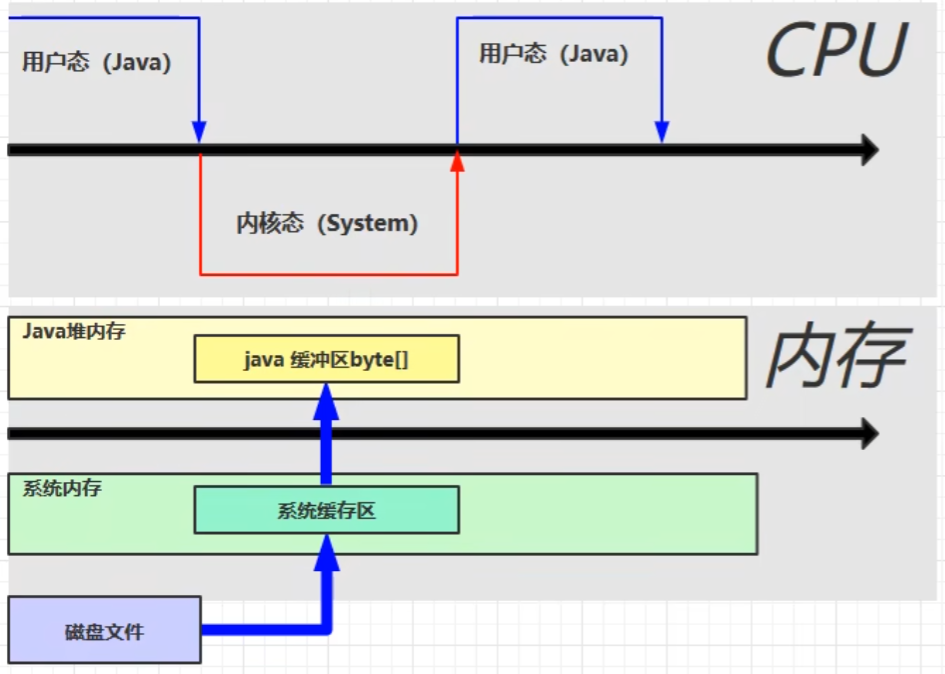

使用直接内存的文件读取流程

磁盘文件内容直接读取到直接内存中，java代码可以直接读取直接内存中的内容

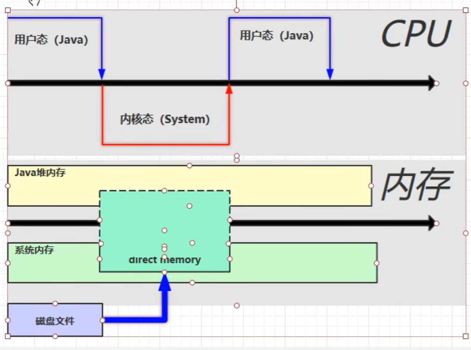

> * 直接内存也会导致内存溢出

### 分配回收原理

* 使用了 Unsafe 对象完成直接内存的分配回收，并且回收需要主动调用 freeMemory 方法 
* ByteBuffer 的实现类内部，使用了 Cleaner （虚引用）来监测 ByteBuffer 对象，一旦 ByteBuffer 对象被垃圾回收，那么就会由 ReferenceHandler 线程通过 Cleaner 的 clean 方法调用 freeMemory 来释放直接内存

> `-XX:+DisableExpliciGC` 禁用显式的垃圾回收

# 垃圾回收

## 内存是否可以回收判断

### 引用计数法

判断引用的次数，但是循环引用的情况可能导致内存泄露

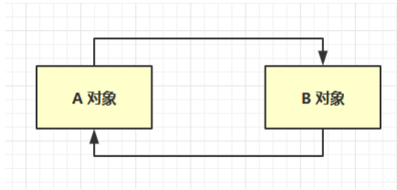

### 可达性分析算法

* Java 虚拟机中的垃圾回收器采用可达性分析来探索所有存活的对象 
* 扫描堆中的对象，看是否能够沿着 GC Root对象为起点的引用链找到该对象，找不到，表示可以回收 
* 哪些对象可以作为 GC Root 

> 这个算法的基本思路就是通过 一系列称为“GC Roots”的根对象作为起始节点集，从这些节点开始，根据引用关系向下搜索，搜索过程所走过的路径称为“引用链”（Reference Chain），如果某个对象到GC Roots间没有任何引用链相连， 或者用图论的话来说就是从GC Roots到这个对象不可达时，则证明此对象是不可能再被使用的。


固定可作为GC Roots的对象包括以下几种：

* 在虚拟机栈（栈帧中的本地变量表）中引用的对象，譬如各个线程被调用的方法堆栈中使用到的参数、局部变量、临时变量等
* 在方法区中常量引用的对象，譬如字符串常量池（String Table）里的引用
* 在本地方法栈中JNI（即通常所说的Native方法）引用的对象
* Java虚拟机内部的引用，如基本数据类型对应的Class对象，一些常驻的异常对象（比如 NullPointExcepiton、OutOfMemoryError）等，还有系统类加载器
* 所有被同步锁（synchronized关键字）持有的对象
* 反映Java虚拟机内部情况的JMXBean、JVMTI中注册的回调、本地代码缓存等

> 除了这些固定的GC Roots集合以外，根据用户所选用的垃圾收集器以及当前回收的内存区域不 同，还可以有其他对象“临时性”地加入

### 四种引用

* **强引用**是最传统的“引用”的定义，是指在程序代码之中普遍存在的引用赋值，即类似`Object obj=new Object()`这种引用关系。无论任何情况下，只要强引用关系还存在，垃圾收集器就永远不会回收掉被引用的对象。 、
* **软引用**是用来描述一些还有用，但非必须的对象。只被软引用关联着的对象，在系统将要发生内存溢出异常前，会把这些对象列进回收范围之中进行第二次回收，如果这次回收还没有足够的内存， 才会抛出内存溢出异常。在JDK 1.2版之后提供了`SoftReference`类来实现软引用。 **内存不足即回收**
* **弱引用**也是用来描述那些非必须对象，但是它的强度比软引用更弱一些，被弱引用关联的对象只能生存到下一次垃圾收集发生为止。当垃圾收集器开始工作，无论当前内存是否足够，都会回收掉只被弱引用关联的对象。在JDK 1.2版之后提供了`WeakReference`类来实现弱引用。 **发现即回收**
* **虚引用**也称为“幽灵引用”或者“幻影引用”，它是最弱的一种引用关系。一个对象是否有虚引用的存在，完全不会对其生存时间构成影响，也无法通过虚引用来取得一个对象实例。为一个对象设置虚引用关联的唯一目的只是为了能在这个对象被收集器回收时收到一个系统通知。在JDK 1.2版之后提供 了`PhantomReference`类来实现虚引用
* **终结器引用**：终结器引用和虚引用的方式很类似，它用以实现对象的`finalize（）`方法。 当一个对象重写了`finalize`方法，在第一次GC时，对应终结器引用进入引用队列队。由一个优先级很低的Finalizer线程通过终结器引用找到被引用对象并调用它的`finalize（）`方法，第二次GC时才能回收被引用对象。

> 引用队列`ReferenceQueue`：对于软引用、弱引用、虚引用来说，都是当被引用的实际对象回收时，将软引用、弱引用、虚引用对象本身放入引用队列，这样通过监控线程对引用队列进行检测就可以知道哪个实际对象被回收了

## 垃圾回收算法

### 标记-清除算法

算法分为“标记”和“清除”两个阶段：首先标记出所有需要回 收的对象，在标记完成后，统一回收掉所有被标记的对象，也可以反过来，标记存活的对象，统一回收所有未被标记的对象

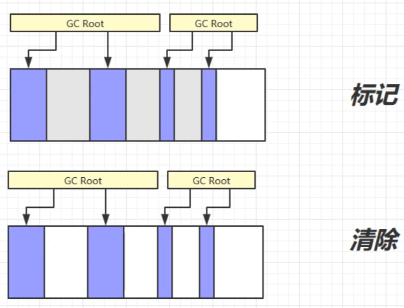

它是最基础的算法，速度比较快，但是有两个主要缺点：

* 第一个是**执行效率不稳定**，如果Java堆中包含大量对象，而且其中大部分是需要被回收的，这时必须进行大量标记和清除的动作，导致标记和清除两个过程的执行效率都随对象数量增长而降低
* 第二个是**内存空间的碎片化问题**，标记、清除之后会产生大量不连续的内存碎片，空间碎片太多可能会导致当以后在程序运行过程中需要分配较大对象时无法找 到足够的连续内存而不得不提前触发另一次垃圾收集动作

### 标记-整理算法

标记过程仍然与“标记-清除”算法一样，但后续步骤不是直接对可 回收对象进行清理，而是让所有存活的对象都向内存空间一端移动，然后直接清理掉边界以外的内存

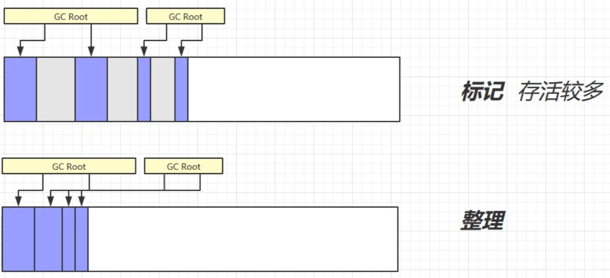

> * 这种移动内存的方法，是一种耗时的操作，可能会导致卡顿
> * 像标记-清除算法完全不移动会导致内存碎片，需要更为复杂的内存分配器和内存访问器来解决

### 标记-复制算法

标记-复制算法常被简称为复制算法。它将可用内存按容量划分为大小相等的两块，每次只使用其中的一块。当这一块的内存用完了，就将还存活着的对象复制到另外一块上面，然后再把已使用过的内存空间一次清理掉

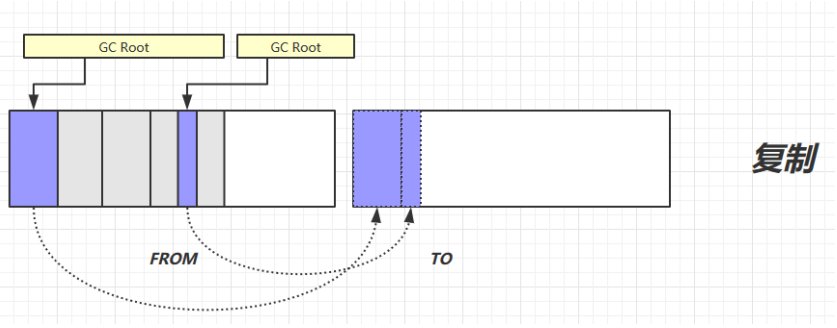

* 如果内存中多数对象都是存活的，这种算法将会产生大量的内存间复制的开销
* 但对于多数对象都是可回收的情况，算法需要复制的就是占少数的存活对象，而且每次都是针对整个半区进行内存回收，分配内存时也就不用考虑有 空间碎片的复杂情况

> 其缺陷也显而易见，这种复制回收算法的代价是**将可用内存缩小为了原来的一半**

## 分代垃圾回收

当前商业虚拟机的垃圾收集器，大多数都遵循了“分代收集”的理论来进行设计

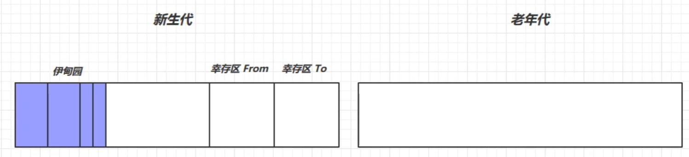

* **新生代(Young Generation)**： 在新生代中，每次垃圾收集 时都发现有大批对象死去，而每次回收后存活的少量对象，将会逐步晋升到老年代中存放
* **老年代(Old Generation)**：垃圾回收存活的少量对象

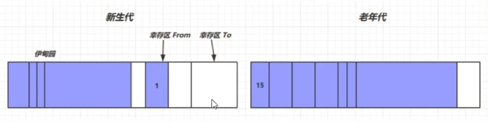

* 对象首先分配在伊甸园区域 
* 新生代空间不足时，触发 minor gc，伊甸园和 from 存活的对象使用 copy 复制到 to 中，存活的对象年龄加 1并且交换 from to
*  minor gc 会引发 stop the world，暂停其它用户的线程，等垃圾回收结束，用户线程才恢复运行 
* 当对象寿命超过阈值时，会晋升至老年代，最大寿命是15（4bit） 
* 当老年代空间不足，会先尝试触发 minor gc，如果之后空间仍不足，那么触发 full gc，STW的时间更长

### 相关VM参数

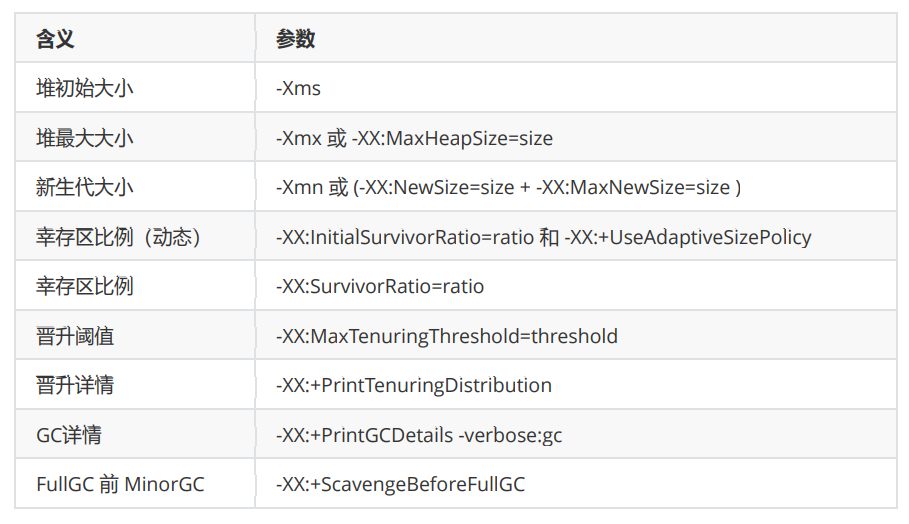

## 垃圾回收器

### serial GC串行回收器

这个收集器是一个**单线程工作**的收集器，但它的“单线 程”的意义并不仅仅是说明它只会使用一个处理器或一条收集线程去完成垃圾收集工作，更重要的是强调在它进行垃圾收集时，**必须暂停其他所有工作线程**，直到它收集结束

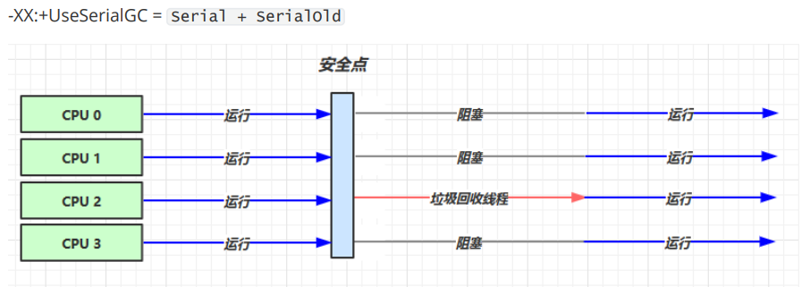

> 堆内存小，适合个人电脑

### ParNew吞吐量优先回收器

`-XX:+UseParallelGC ~ -XX:+UseParallelOldGC` 

`-XX:+UseAdaptiveSizePolicy `

`-XX:GCTimeRatio=ratio ` 吞吐量大小

`-XX:MaxGCPauseMillis=ms ` 最大垃圾收集停顿时间

`-XX:ParallelGCThreads=n`

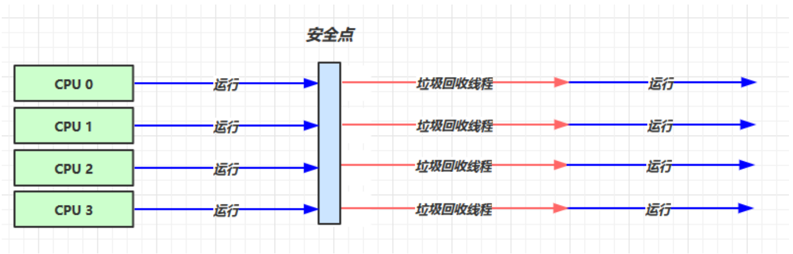

可以理解为串行回收器的多线程并行版本，也称为Parallel Scavenge收集1器

### CMS响应时间优先回收器

`-XX:+UseConcMarkSweepGC` ~ `-XX:+UseParNewGC `~` SerialOld` 

`-XX:ParallelGCThreads=n` ~ `-XX:ConcGCThreads=threads `

`-XX:CMSInitiatingOccupancyFraction=percent `

`-XX:+CMSScavengeBeforeRemark`

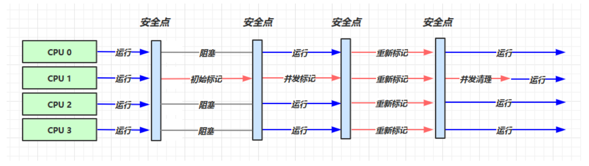

> concurrent并发：用户进程和回收器是并发的，用户进程也能工作
>
> * 发生内存不足的时候，进行初始标记，用户线程会阻塞，stop the world
> * 然后进行一个并发标记，用户线程恢复运行
> * 重新标记，用户线程阻塞，stop the world
> * 并发清理，用户线程恢复运行
>
> 虽然响应时间很快，但是存在cpu进行垃圾回收，吞吐量有所影响

### Garbage First收集器

业务越来越庞大、复杂，为了适应不断扩大的内存和不断增加的处理器数量，官方推出了Garbage First(G1) GC

#### 特点

并行与并发

* 并行性：G1在回收期间，可以有多个GC线程同时工作，有效利用多核计算能力，此时用户线程STW
* 并发性：G1拥有与应用程序交替执行的能力，部分工作可以和应用程序同时执行

分代收集

* 将堆空间分为若干个区域，这些区域中包含了新生代和老年代
* 同时兼顾新生代和老年代

空间整合

* 划分为region，之间是标记-复制算法

可预测的停顿时间模型

* 每次根据允许的收集时间，优先回收价值最大的Region，获取尽可能高的收集效率

#### 不足和优势

* 90在小内存应用上CMD的表现大概率优于G1
* 大内存应用上G1发挥优势，平衡点在6~8GB左右

#### G1回收器参数的设置

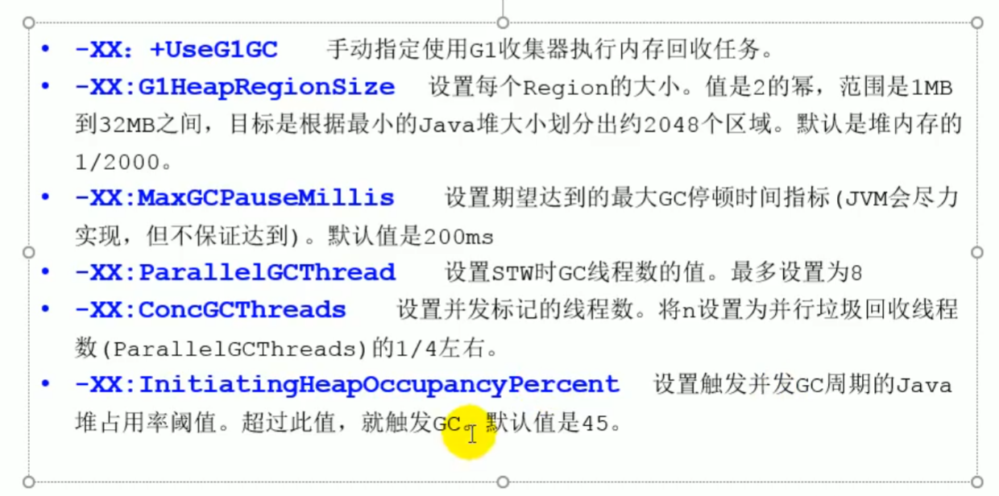

常见操作步骤：

* 启用G1
* 设置堆内存大小
* 设置最大停顿时间

#### 适用场景

适用大内存、多处理器的机器

* 需要低GC延迟，具有大堆
* 用来替换JDK1.5的CMS

#### region：化整为零

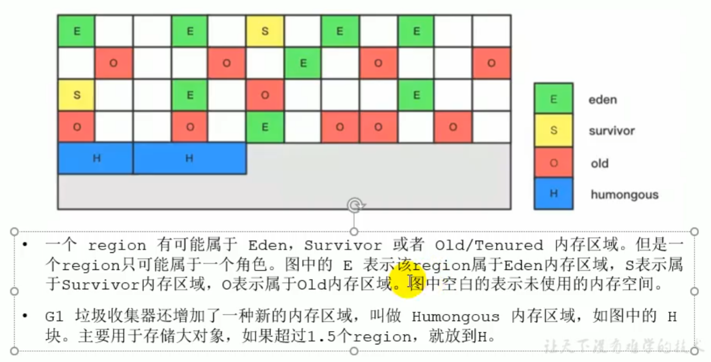

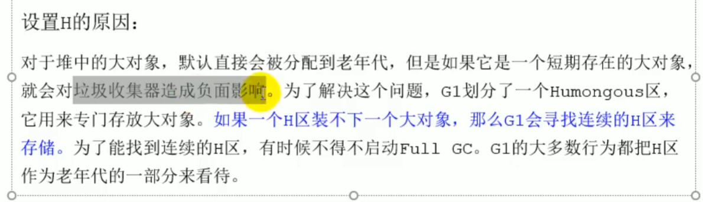

G1 GC垃圾回收主要包括三个环节

* 年轻代GC Young GC
* 老年代并发标记过程 Concurrent Marking
* 混合回收 Mixed GC

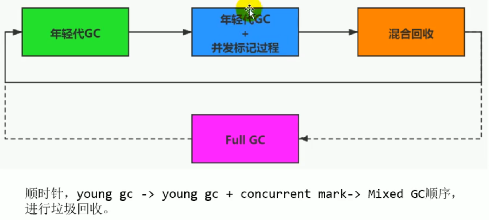

#### GC回收-年轻代GC

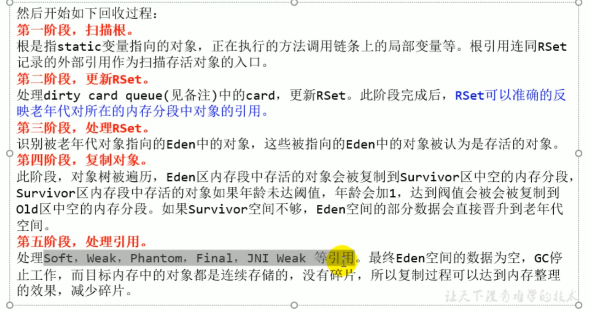

#### GC回收-并发标记过程

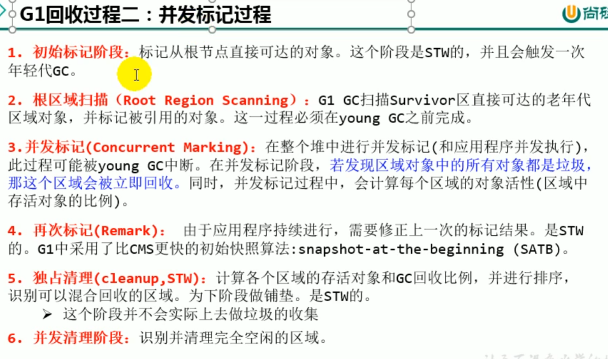

#### GC回收过程三-混合回收

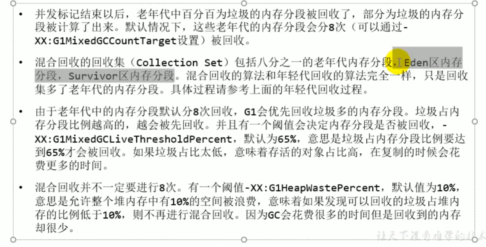

#### GC回收过程四-Full GC

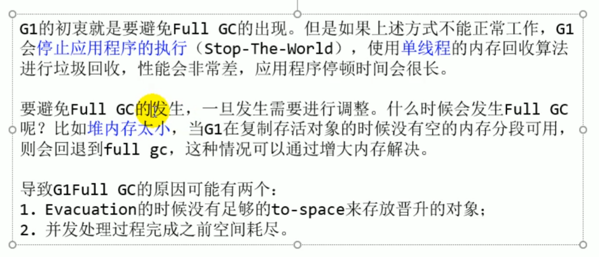

### 七种经典的垃圾回收器

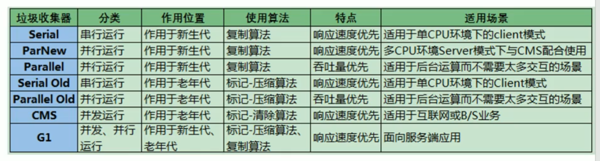


