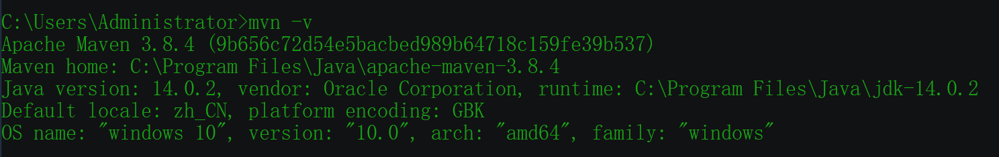
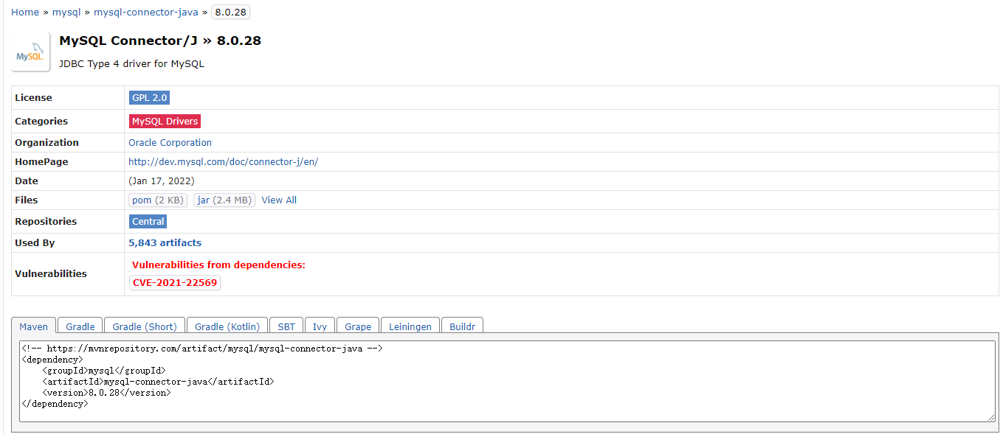
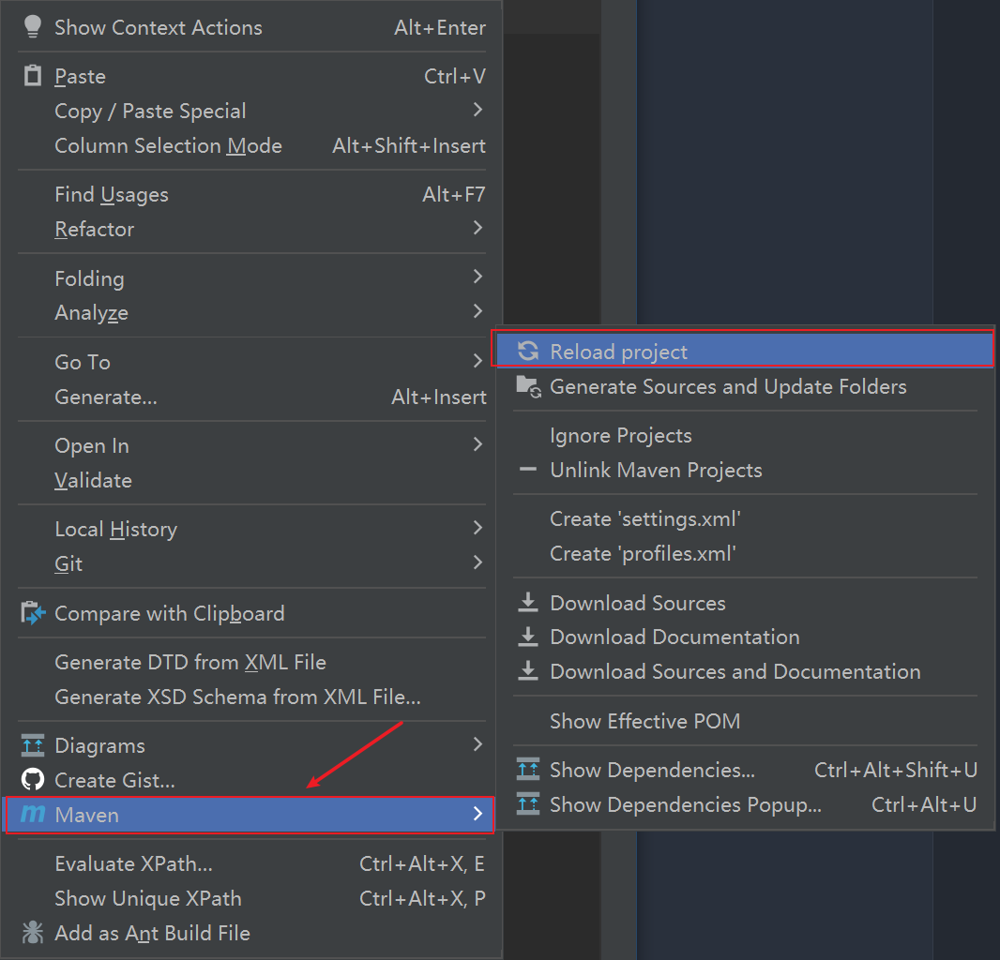

# Maven配置

`Maven`是Apache公司的一个开源项目，主要用来管理java项目，对`jar`包进行统一的管理，为了方便之后编写java项目，尝试学习一下`Maven`的操作

## Maven下载配置

### Maven下载

直接从官网[^1]下载：[Maven官网下载地址](https://maven.apache.org/download.cgi)


将下载好的jar包解压到磁盘中


> 将解压后文件夹放在想要保存的路径下，笔者这里选择的是`C:\Program Files\Java\`路径，放在`Java`同级路径下，方便同一管理

### 环境变量配置

然后就是配置环境变量，在系统变量中添加`MAVEN_HOME`，变量值为`MAVEN`的路径，笔者这里是`C:\Program Files\Java\apache-maven-3.8.4`


然后在用户变量中找到`Path`，双击之后在后面添加`%MAVEN_HOME%\bin`


然后打开命令行窗口查看是否配置成功，输入命令行`mvn -v`



这里就成功地完成了Maven的下载和配置，但是还有重要的一步就是镜像源的设置，`Maven`默认的镜像源在国外，下载比较缓慢，这里修改为国内的镜像源

### 镜像源修改

找到之前`Maven`解压之后的文件路径`C:\Program Files\Java\apache-maven-3.8.4\conf`，在该文件路径下有一个`settings.xml`，打开该文件，用记事本或者其他编辑器都可以，修改其中的镜像源信息

```xml
<mirrors>
    <mirror>
        <id>alimaven</id>
        <name>aliyun maven</name>
        <url>http://maven.aliyun.com/nexus/content/groups/public/</url>
        <mirrorOf>central</mirrorOf>
    </mirror>
    <mirror>
        <id>central</id>
        <name>Maven Repository Switchboard</name>
        <url>http://repo1.maven.org/maven2/</url>
        <mirrorOf>central</mirrorOf>
    </mirror>
    <mirror>
        <id>repo2</id>
        <mirrorOf>central</mirrorOf>
        <name>Human Readable Name for this Mirror.</name>
        <url>http://repo2.maven.org/maven2/</url>
    </mirror>
    <mirror>
        <id>ibiblio</id>
        <mirrorOf>central</mirrorOf>
        <name>Human Readable Name for this Mirror.</name>
        <url>http://mirrors.ibiblio.org/pub/mirrors/maven2/</url>
    </mirror>
    <mirror>
        <id>jboss-public-repository-group</id>
        <mirrorOf>central</mirrorOf>
        <name>JBoss Public Repository Group</name>
        <url>http://repository.jboss.org/nexus/content/groups/public</url>
    </mirror>
    <!-- 中央仓库在中国的镜像 -->
    <mirror>
        <id>maven.net.cn</id>
        <name>oneof the central mirrors in china</name>
        <url>http://maven.net.cn/content/groups/public/</url>
        <mirrorOf>central</mirrorOf>
    </mirror>
  </mirrors>
```

到这一步基本上就完成了`Maven`的下载和配置

## 使用IDEA创建Maven项目

打开IDEA，选择`File->New->Project`，然后选择`Maven`，再选择对应的`Project SDK`，之后直接点击`Next`


然后在弹出的窗口中选择项目`Name`，这个可以自定义，然后就是项目存放地址，注意养成良好的项目管理习惯，最后点击`Finish`


然后就完成了IDEA创建`Maven`项目，如果有需要的插件需要添加到项目中，可以在[MVN REPOSITORY](https://mvnrepository.com/)[^2]中搜索对应的依赖，然后将对应的代码贴在`Maven`项目下的`pom.xml`文件中的对应位置



然后在`pom.xml`文件编辑页面点击右键，选择`Maven->Reload project`



## 参考

[^1]: [Maven官网](https://maven.apache.org/download.cgi)
[^2]: [MVN REPOSITORY](https://mvnrepository.com/)
