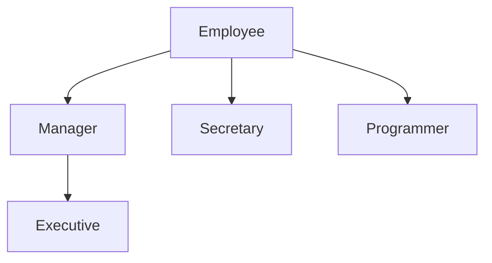

# 第5章 继承

## 5.1 类、超类和子类

### 5.1.1 定义子类

由继承`Employee`类来定义`Manager`类的格式

```java
public class Manager extends Employee
{
	// 添加方法和域
}
```

* 已存在的类称为超类（superclass）、基类（base class）或父类（parent class）
* 新类称为子类（subclass）、派生类（derived class）或孩子类（child class）

> 在设计类的时候，应该将通用的方法放在超类中，而将具有特殊用途的方法放在子类中

### 5.1.2 覆盖方法

使用`super`调用超类的方法

```java
public double getSalary()
{
	double baseSalary = super.getSalary();
	return baseSalary + bonus;
}
```

### 5.1.3 子类构造器

```java
public Manager(String name, double salary, int year, int month, int day)
{
	super(name, salary, year, month, day);
	bonus = 0;
}
```

这里的`super`是调用超类`Employee`中含有参数`name`, `salary`, `year`, `month`和`day`参数的构造器的简写形式

使用`super`调用构造器的语句必须是子类构造器的第一条语句

> 如果子类构造器没有显式地调用超类的构造器，则将自动地调用超类默认（没有参数）的构造器。如果超类没有不带参数的构造器，并且在子类的构造器中又没有显式地调用超类的其他构造器，则Java编译器将报告错误。

`chap5/ManagerTest.java`

```java
package chap5;

public class ManagerTest
{
    public static void main(String[] args)
    {
        Manager boss = new Manager("Carl Cracker", 80000, 1987, 12, 15);
        boss.setBonus(5000);

        Employee[] staff = new Employee[3];

        staff[0] = boss;
        staff[1] = new Employee("Harry Hacker", 50000, 1989, 10, 1);
        staff[2] = new Employee("Tommy Tester", 40000, 1990, 3, 15);

        for(Employee e : staff)
            System.out.println("name = " + e.getName() + ", salary = " + e.getSalary());
    }
}
```

`chap5/Employee.java`

```java
package chap5;

import java.time.*;

public class Employee {
    private String name;
    private double salary;
    private LocalDate hireDay;

    public Employee(String name, double salary, int year, int month, int day)
    {
        this.name = name;
        this.salary = salary;
        hireDay = LocalDate.of(year, month, day);
    }

    public String getName()
    {
        return name;
    }

    public double getSalary()
    {
        return salary;
    }

    public LocalDate getHireDay()
    {
        return hireDay;
    }

    public void raiseSalary(double byPercent)
    {
        double raise = salary * byPercent / 100;
        salary += raise;
    }
}
```

`chap5/Manager.java`

```java
package chap5;

public class Manager extends Employee{
    
    private double bonus;

    /**
     * Manager Class which extends from Employee
     * @param name the employee's name
     * @param salary the salary
     * @param year the hire year
     * @param month the hire month
     * @param day the hire day
     */
    public Manager(String name, double salary, int year, int month, int day)
    {
        super(name, salary, year, month, day);
        bonus = 0;
    }

    public double getSalary()
    {
        double baseSalary = super.getSalary();
        return baseSalary + bonus;
    }

    public void setBonus(double bonus)
    {
        this.bonus = bonus;
    }
}
```

### 5.1.4 继承层次

继承并不仅仅限于一个层次，可以由`Manager`派生`Executive`类

在继承层次中，从某个特定的类到其祖先的路径被称为该类的继承链（inheritance chain）



### 5.1.5 多态

对象变量是*多态的*，一个`Employee`变量既可以引用一个`Employee`类对象，也可以引用一个`Employee`类的任何一个之类的对象，即==可以将一个子类的对象赋给超类变量，子类的引用可以赋给超类变量==

```java
Manager boss = new Manager("Carl Cracker", 80000, 1987, 12, 15);
Employee[] staff = new Employee[3];
staff[0] = boss;
```

可以调用

```java
boss.setBonus(5000);
```

但是不能调用

```java
staff[0].setBonus(5000); // Error
```

这是因为`staff[0]`声明的类型是`Employee`，而`setBonus`不是`Employee`类的方法

==不能将一个超类的引用赋给子类变量==

```java
Manager m = staff[i]; // Error
```

不是所有的雇员都是经理，如果赋值成功，`m`有可能引用一个不是经理的`Employee`对象，当在后面调用`m.setBonus()`时有可能发生运行时错误

### 5.1.6 理解方法调用

对于方法`x.f(args)`，调用过程的详细描述

* 编译器才爱看对象的声明类型和方法名
* 接下来，编译器将CAD看调用方法时提供的参数类型，根据匹配的参数类型选择对应方法，这个过程叫做**重载解析**（overloading resolution），如果编译器没有找到与参数类型匹配的方法，或者发现经过类型转换之后有多个方法与之匹配，就会报告一个错误
* 如果是`private`、`static`、`final`方法或者构造器，那么编译器将可以准确地知道应该调用哪个方法，我们称这种调用方法称为**静态绑定**（static binding），相对的，调用方法依赖于隐式参数的实际类型，这个叫做动态绑定
* 当程序运行，并且采用动态绑定调用方法时，虚拟机一定调用与`x`所引用对象的实际类型最合适的那个类的方法。假设`x`的实际类型是`D`，它是`C`类的子类。如果`D`类定义了方法`f(String)`，就直接调用它；否则，将在`D`类的超类中寻找`f(String)`，以此类推。

### 5.1.7 组织继承：`final`类和方法

希望阻止人们利用某个类定义之类，不允许扩展的类被称为`final`类

```java
public final class Executive extends Manager
{
	// ...
}
```

类中的特定方法也可以被声明为`final`，如果这样做，之类就不能覆盖这个方法（`final`类中的所有方法自动地成为`final`方法）

```java
public class Employee
{
	// ...
	public final String getName()
	{
		return name;
	}
	// ...
}
```

> 如果将一个类声明为`final`，只有其中的方法自动地成为`final`,而不包括域。

### 5.1.8 强制类型转换

对象引用的转换语法与数值表达式的类型转换类似，仅需要用一对圆括号将目标类名括起来，并放置在需要转换的对象引用之前就可以了

```java
Manager boss = (Manager) staff[0];
```

将数组中引用经理的元素复原成`Manager`类，以便能够访问新增加的所有变量

如果试图在继承链上进行向下的类型转换，并且“谎报”有关对象包含的内容，会发生`ClassCastException`

```java
Manager boss = (Manager) staff[1]; // Error
```

* 只能在继承层次内进行类型转换
* 在将超类转换为子类之前，应该使用`instanceof`进行检查

### 5.1.9 抽象类

为了提高程序的清晰度，包含一个或多个抽象方法的类本身必须被声明为抽象的

```java
public abstract class person
{
	...
	public abstract String getDescription();
}
```

除了抽象方法之外，抽象类还可以包含具体数据和具体方法。例如，Person类还保存着姓名和一个返回姓名的具体方法

```java
public abstract class person
{
    private String name;
    public Person(String name)
    {
        this.name = name;
    }
    public abstract String getDescription();
    
    public String getName()
    {
        return name;
    }
}
```

抽象方法充当着占位的角色，它们的具体实现在子类中。扩展抽象类可以有两种选择:

* 一种是在抽象类中定义部分抽象类方法或不定义抽象类方法，这样就必须将子类也标记为抽象类
* 另一种是定义全部的抽象方法，这样一来，子类就不是抽象的了

类即使不包含抽象方法，也可以将类声明为抽象类

抽象类不能被实例化。也就是说，如果将一个类声明为`abstract`,就不能创建这个类的对象

```java
new Person("Madao33"); // Error
```

需要注意的是，可以定义一个抽象类的**对象变量**，但是它只能引用非抽象之类的对象

```java
Person p = new Student("Madao33", "Computer Science");
```

`p`是一个抽象类`Person`的变量，`Person`引用了一个非抽象子类`Student`的实例

`chap5/abstractClasses/PersonTest.java`

```java
package chap5.abstractClasses;

public class PersonTest {

    public static void main(String[] args)
    {
        Person[] people = new Person[2];

        // fill the people array with Student and Employee objects
        people[0] = new Employee("Harry Hacker", 50000, 1989, 10, 1);
        people[1] = new Student("Maria Morris", "computer science");

        for(Person p : people)
            System.out.println(p.getName() + ", " + p.getDescription());
    }
}
```

`chap5/abstractClasses/Person.java`

```java
package chap5.abstractClasses;

public abstract class Person {
    public abstract String getDescription();

    private String name;

    public Person(String name)
    {
        this.name = name;
    }

    public String getName()
    {
        return name;
    }
}
```

`chap5/abstactClasses/Employee.java`

```java
package chap5.abstractClasses;

import java.time.*;

public class Employee extends Person{
    private double salary;
    private LocalDate hireDay;
    
    public Employee(String name, double salary, int year, int month, int day)
    {
        super(name);
        this.salary = salary;
        hireDay = LocalDate.of(year, month, day);
    }

    public double getSalary()
    {
        return salary;
    }

    public LocalDate getHireDay()
    {
        return hireDay;
    }

    public String getDescription()
    {
        return String.format("an employee with a salary of $%.2f", salary);
    }

    public void raiseSalary(double byPercent)
    {
        double raise = salary * byPercent / 100;
        salary += raise;
    }
}
```

`abstactClasses/Student.java`

```java
package chap5.abstractClasses;

public class Student extends Person{
    private String major;

    /**
     * 
     * @param name the student's name
     * @param major the student's major
     */
    public Student(String name, String major)
    {
        super(name);
        this.major = major;
    }
    
    public String getDescription()
    {
        return "a student major in " + major;
    }
}
```

### 5.1.10受保护访问

最好将类中的域标记为`private`,而方法标记为`public`。任何声明为`private`的内容对其他类都是不可见的

在有些时候，人们希望超类中的某些方法允许被子类访问，或允许子类的方法访问超类的某个域。为此，需要将这些方法或域声明为`protected`。例如，如果将超类`Employee`中的`hireDay`声明为`proteced`,而不是私有的，`Manager`中的方法就可以直接地访问它。

归纳一个Java用于控制可见性的4个访问修饰符

* 仅对本类可见-`private`
* 对所有类可见-`public`
* 对本包和所有之类可见-`protected`
* 对本包可见-默认（很遗憾），不需要修饰符

## 5.2 `Object`：所有类的超类

`Object`类是`Java`中所有类的始祖，如果没有明确指出超类，`Object`就被认为是这个类的超类

可以使用`Object`类型的变量引用任何类型的对象

```java
Object obj = new Employee("madao33", 35000);
```

> `Java`中，只有基本类型（primitive）不是对象，所有的数组类型，不管是对象数组还是基本类型的数据都扩展了`Object`类

### 5.2.1 `equals`方法

`Object`类中的`equals`方法用于检测一个对象是否等于另外一个对象

在子类中定义`equals`方法时，首先调用超类的`equals`，如果检测失败，对象就不可能相等

```java
public class Manager extends Employee
{
    // ...
    public boolean equals(Object otherObject)
    {
        if(!super.equals(otherObject)) return false;
        // super.equals checked that this and otherObject belong to the same class
        Manager other = (Manager) otherObject;
        return bonus = other.bonus;
    }
}
```

### 5.2.2 相等测试与继承

`Java`语言规范要求`equals`方法具有下面的特性

* ==自反性==： 对于任何非空引用`x`, `x.equals(x)`应该返回`true`
* ==对称性==：对于任何引用`x`和`y`，当且仅当`y.equals(x)`返回`true`, `x.equals(y)`也应该返回`true`
* ==传递性==：对于任何引用`x, y`和`z`，如果`x.equals(y)`返回`true`，`y.equals(z)`返回`true`，`x.equals(z)`也应该返回`true`
* ==一致性==：如果`x`和`y`引用的对象没有发生变化，反复调用`x.equals(y)`应该返回同样的结果
* 对于任意非空引用`x`，`x.equals(null)`应该返回`false`

### 5.2.3 `hashCode`方法

散列码（`hashcode`)是由对象导出的一个整型值。散列码是没有规律的。如果`x`和`y是`两个不同的对象，`x.hashCode()`与`y.hashCode()`基本上不会相同。`String`类使用下列算法计算散列码

```java
int hash = 0;
for(int i = 0; i < length(); i++)
	hash = 31 * hash + charAt(i);
```

由于`hashCode`方法定义在`Object`类中，因此每个对象都有一个默认的散列码，其值为对象的存储地址

* 字符串拥有相同的散列码，这是因为字符串的散列码是由内容导出的
* 字符串缓冲`sb`和`tb`有不同的散列码，这是因为在`StringBuffer`类中没有定义`hashCode`方法，它的散列码是由`Object`类的默认`hashCode`方法导出的对象存储地址

### 5.2.4 `toString`方法

`toString`用于返回表示对象值的字符串，例如`Employee`类的`toString`方法实现

```java
public String toString()
{
	return getClass().getName() + "[name=" + name 
        + ", salary = " + salary
        + ", hireDay = " + hireDay
        + "]";
}
```

子类`Manager`的`toString`实现

```java
public class Manager extends Employee
{
	// ...
	public String toString()
    {
        return super.toString()\
            + "[bonus=" + bonus
            + "]";
    }
}
```

`toString`方法的主要原因是：只要对象与一个字符串通过操作符`+`连接起来，`Java`编译就会自动地调用`toString`方法，以便获得这个对象的字符串描述

`chap5/equals/EqualsTest.java`

```java
package chap5.equals;

public class EqualsTest 
{
    public static void main(String[] args)
    {
        Employee alice1 = new Employee("Alice Adams", 75000, 1987, 12, 15);
        Employee alice2 = alice1;
        Employee alice3 = new Employee("Alice Adams", 75000, 1987, 12, 15);
        Employee bob = new Employee("Bob Brandson", 50000, 1989, 10, 1);

        System.out.println("alice1 == alice1:" + (alice1 == alice2));
        System.out.println("alice1 == alice3:" + (alice1 == alice3));
        System.out.println("alice1.equals(alice3):" + alice1.equals(alice3));
        System.out.println("alice1.equals(bob):" + alice1.equals(bob));
        System.out.println("bob.toString():" + bob);

        Manager carl = new Manager("Carl Cracker", 80000, 1987, 12, 15);
        Manager boss = new Manager("Carl Cracker", 80000, 1987, 12, 15);
        boss.setBonus(5000);
        System.out.println("boss.toString(): " + boss);
        System.out.println("carl.equals(boss): " + carl.equals(boss));
        System.out.println("alice1.hashCode():" + alice1.hashCode());
        System.out.println("alice3.hashCode():" + alice3.hashCode());
        System.out.println("bob.hashCode():" + bob.hashCode());
        System.out.println("carl.hashcode():" + carl.hashCode());
    }
}
```

`chap5/equals/Employee.java`

```java
package chap5.equals;

import java.time.*;
import java.util.Objects;

public class Employee {
    private String name;
    private double salary;
    private LocalDate hireDay;

    public Employee(String name, double salary, int year, int month, int day)
    {
        this.name = name;
        this.salary = salary;
        hireDay = LocalDate.of(year, month, day);
    }

    public String getName()
    {
        return name;
    }

    public double getSalary()
    {
        return salary;
    }

    public LocalDate getHireDay()
    {
        return hireDay;
    }

    public void raiseSalary(double byPercent)
    {
        double raise = salary * byPercent / 100;
        salary += raise;
    }

    public boolean equals(Object otherObject)
    {
        if(this == otherObject)
            return true;
        
        if(otherObject==null)
            return false;
        
        if(getClass()!=otherObject.getClass())
            return false;
        
        Employee other = (Employee) otherObject;

        return Objects.equals(name, other.name) && salary == other.salary && Objects.equals(hireDay, other.hireDay);
    }

    public int hashCode()
    {
        return Objects.hash(name, salary, hireDay);
    }

    public String toString()
    {
        return getClass().getName() + "[name=" + name + ", salary=" + salary + ", hireDay=" + hireDay + "]";
    }
}
```

`chap5/equals/Manager.java`

```java
package chap5.equals;

public class Manager extends Employee{
    
    private double bonus;

    /**
     * Manager Class which extends from Employee
     * @param name the employee's name
     * @param salary the salary
     * @param year the hire year
     * @param month the hire month
     * @param day the hire day
     */
    public Manager(String name, double salary, int year, int month, int day)
    {
        super(name, salary, year, month, day);
        bonus = 0;
    }

    public double getSalary()
    {
        double baseSalary = super.getSalary();
        return baseSalary + bonus;
    }

    public void setBonus(double bonus)
    {
        this.bonus = bonus;
    }

    public boolean equals(Object otherObject)
    {
        if(!super.equals(otherObject)) return false;
        Manager other = (Manager) otherObject;
        // super.equals checked that this and other belong to the same class
        return bonus == other.bonus;
    }

    public int hashCode()
    {
        return super.hashCode() + 17 * new Double(bonus).hashCode();
    }

    public String toString()
    {
        return super.toString() + "[bonus=" + bonus + "]";
    }
}

```

## 5.3 泛型数组列表

ArrayList是一个采用类型参数（typeparameter)的泛型类（genericclass)。为了指定数组列表保存的元素对象类型，需要用一对尖括号将类名括起来加在后面

```java
ArrayList<Employee> staff = new ArrayList<Employee>();
```

在`Java SE 7` 中，可以省去右边的类型参数

```java
ArrayList<Employee> staff = new ArrayList<>();
```

可以结合`new`操作符使用菱形语法。编译器会检查新值是什么。如果赋值给一个变量，或传递到某个方法，或者从某个方法返回，编译器会检査这个变量、参数或方法的泛型类型，然后将这个类型放在o中。在这个例子中，`newArrayListo()`将赋至一个类型为`ArrayList<Employee>`的变量，所以泛型类型为`Employee`。

使用`add`方法可以将元素添加到数组列表中

```java
staff.add(newEmployee("HarryHacker", ...));
staff.add(newEraployee("TonyTester", ...));
```

如果调用`add`且内部数组已经满了，数组列表就将自动地创建一个更大的数组，并将所有的对象从较小的数组中拷贝到较大的数组中

如果已经清楚或能够估计出数组可能存储的元素数量，就可以在填充数组之前调用`ensureCapacity`方法

```java
staff.ensureCapacity(100);
```

还可以把初始容量传递给`ArrayList`构造器

```java
ArrayList<Employee> staff = new ArrayList<>(100);
```

> * 如果为数组分配100个元素，那么数组就有100个元素可以使用
>
>   ```java
>   Employee[] staff = new Employee[100]; // size is 100
>   ```
>
> * 容量为100个元素的数组列表只是拥有保存100个元素的潜力（实际上，重新分配空间的话，将会超过丨00),但是在最初，甚至完成初始化构造之后，数组列表根本就不含有任何元素。

`size`方法将返回数组列表中包含的实际元素数目，等价于数组的`length`方法

```java
staff.size()
```

* 一旦能够确认数组列表的大小不再发生变化，就可以调用`trimToSize`方法这个方法将存储区域的大小调整为当前元素数量所需要的存储空间数目，垃圾回收器将回收多余的存储空间

* 一旦整理了数组列表的大小，添加新元素就需要花时间再次移动存储块，所以应该在确认不会添加任何元素时，再调用`trimToSize`。

### 5.3.1 访问数据列表元素

* 设置第 `i` 个元素

  ```java
  staff.set(i, harry);
  ```

  相当于

  ```java
  a[i] = harry;
  ```

  > 使用`add`方法为数组添加新元素，而不要使用`set`方法，他只能替换数组中已经存在的元素内容

* 使用`get`获取数组列表中的元素

  ```java
  Employee e = staff.get(i);
  ```

  等价于

  ```java
  Employee e = a[i];
  ```

可以利用`toArray`方法将数组列表元素拷贝到一个数组中，方便访问

```java
Employee[] a = new Employee[staff.size()];
staff.toArray(a);
```

遍历数组列表同样可以使用`for each`

```java
for(Employee e : staff)
    do something with e;
```

`chap5/arrayList/ArrayListTest.java`

```java
package chap5.arrayList;

import java.util.ArrayList;

public class ArrayListTest {
    public static void main(String[] args)
    {
        ArrayList<Employee> staff = new ArrayList<>();

        staff.add(new Employee("Madao33", 20000, 1997, 6, 8));
        staff.add(new Employee("TheXun", 18000, 1996, 9, 18));
        staff.add(new Employee("MianBaoShu", 20020, 1996, 10, 10));

        for(Employee e : staff)
            e.raiseSalary(5);

        for(Employee e : staff)
            System.out.println("name=" + e.getName() + ", salary=" + e.getSalary() + ", hireDay=" + e.getHireDay());
    }
    
}
```

其中`Employee`类可以参考`chap5/equals/Employee.java`

### 5.3.2 类型化与原始数组列表的兼容性

编译器在对类型转换进行检查之后，如果没有发现违反规则的现象，就将所有的类型化数组列表转换成原始`ArrayList`对象

## 5.4 对象包装器与自动装箱

基本类型都冇一个与之对应的类，`Integer`类对应基本类型`int`。通常，这些类称为包装器（wrapper)

* 对象包装器类是不可变的，即一旦构造了包装器，就不允许更改包装在其中的值
* 对象包装器类还是`final`,因此不能定义它们的子类

对象包装器有

* `Integer`
* `Long`
* `FLoat`
* `Double`
* `Short`
* `Byte`
* `Character`
* `Void`
* `Boolean`

所以定义整型数组列表，也就是定义一个`Integer`对象的数组列表

```java
ArrayList<Integer> list = new ArrayList<>();
```

> 由于每个值分别包装在对象中，所以`ArrayList<lnteger>`的效率远远低于`int[]`数组。因此，应该用它构造小型集合，其原因是此时程序员操作的方便性要比执行效率更加重要

一个方便的特性是

```java
list.add(3);
```

将自动变成

```java
list.add(Integer.valueof(3));
```

这种变换被称为**自动装箱**（autoboxing）

相反地，当将一个`Integer`对象赋给一个`int`值时，将会自动拆箱，也就是说，编译器将下列语句

```java
int n = list.get(i);
```

翻译成

```java
int n = list.get(i).intValue();
```

可以将自增操作符应用与一个包装器引用

```java
Integer n = 3;
n++;
```

编译器将自动地插人一条对象拆箱的指令，然后进行自增计算，最后再将结果装箱

`==`运算符也可以应用与对象包装器对象，但是检测的是对象是否指向同一个存储区域，所以判断其内容是否相同，调用`equals`方法

```java
Integer a = 1000;
Integer b = 1000;
System.out.println(a == b); // false
System.out.println(a.equals(b)); // true
```

> 自动装箱规范要求`boolean`、`byte`、`char`$\leq$127，介于-128~127之间的`short`和`int`被包装到固定的对象中。例如，如果在前面的例子中将`a`和`b`初始化为100，对它们进行比较的结果一定成立

自动装箱有以下几点需要注意

* 由于包装器类引用可以为`null`,所以自动装箱有可能会抛出一个`NullPointerException`异常

  ```java
  Integer n = null;
  System.out.println( 2 * n); // Throws NullPointerException
  ```

* 如果在一个条件表达式中混合使用`Integer`和`Double`类型，`Integer`值就会拆箱，提升为`double`,再装箱为`Double`

  ```java
  Integer n = 1;
  Double x = 2.0;
  System.out.println(true ? n : x); // Prints 1.0
  ```

* 装箱和拆箱是编译器认可的，而不是虚拟机

## 5.5 参数数量可变的方法

`printf`方法的定义

```java
public class PrintScream
{
	public PrintScream printf(String fmt, Object... args)
	{
		return format(fmt, args);
	}
}
```

用户自己也可以定义可变参数的方法，并将参数指定为任意类型，甚至是基本类型

计算若干个数值的最大值

```java
public static double max(double... values)
{
    double largest = Double.NEGATIVE_INFINITY;
    for(double v : values)
        if(v > largest)
            largest = v;
    return largest;
}

// test
System.out.println(max(3.1, 40.4, -5)); // output 40.4
```

## 5.6 枚举类

典型的枚举例子

```java
public enum Size {SMALL, MEDIUM, LARGE, EXTRA_LARGE};
```

这个声明定义的类型是一个类，它刚好有4个实例，在此尽量不要构造新对象，因此，在比较两个枚举类型的值时，永远不需要调用`equals`，而直接使用`==`就可以了

所有的枚举类型都是`Enum`类的子类，它们继承了这个类的许多方法

* `toString` 这个方法返回枚举常量名

  `Size.SMALL.toString()`返回字符串`“SMALL”`

* `valueOf` 恰好是`toString`的逆方法

  `Size s = Enum.valueOf(Size.calss, "SMALL");`

  将`s`设置成`Size.SMALL`

* ` values` 返回一个包含全部枚举值的数组

  `Size[] value = Size.values()`

* `ordinal` 返冋`enum`声明中枚举常量的位置，位置从0开始计数。例如：`Size.MEDIUM.ordinal()`返回1

枚举方法测试代码

`chap5/enums/EnumTest.java`

```java
package chap5.enums;

import java.util.*;

public class EnumTest {
    public static void main(String[] args)
    {
        Scanner in = new Scanner(System.in);
        System.out.println("Enter a size: (SMALL, MEDIUM, LARGE, EXTRA_LARGE)");
        String input = in.next().toUpperCase();
        Size size = Enum.valueOf(Size.class, input);
        System.out.println("size=" + size);
        System.out.println("abbreviation=" + size.getAbbreviation());
        if(size == Size.EXTRA_LARGE)
            System.out.println("Good job--you paid attention to the _.");
    }
}

enum Size
{
    SMALL("S"), MEDIUM("M"), LARGE("L"), EXTRA_LARGE("XL");

    private Size(String abbreviation) { this.abbreviation = abbreviation;}
    public String getAbbreviation() { return abbreviation;}

    private String abbreviation;
}
```

## 5.7 反射

能够分析类能力的程序称为**反射**（reflective），反射机制可以用来

* 在运行时分析类的能力
* 在运行时查看对象，例如编写一个`toString`方法供所有类使用
* 实现通用的数组操作代码
* 利用`Method`对象，这个对象很像C++中的函数指针

### 5.7.1 `Class`类

Java运行时系统始终为所有的对象维护一个被称为运行时的类型标识，这个信息跟踪着每个对象所属的类，可以使用专门的Java类访问这些信息

```java
Employee e;
...
Class cl = e.getClass();
```

如果类在一个包里，包的名字也作为类名的一部分

```java
Random generator = new Random();
Class cl = generator.getClass();
System.out.println(cl.getName());
```

### 5.7.2 捕获异常

当程序运行过程中发生错误时，就会**抛出异常**。抛出异常比终止程序要灵活的多

将可能抛出已检査异常的一个或多个方法调用代码放在`try`块中，然后在`catch`子句中提供处理器代码

```java
try{
	// statements that might throw exceptions
}catch(Exception e)
{
    // handler action
}
```

示例

```java
try{
    String name = "java.util.Random";
    Class cl2 = Class.forName(name);
    System.out.println(cl2);
}catch(Exception e){
    e.printStackTrace();
}
```

### 5.7.3 利用反射分析类的能力

在`java.lang.reflect`包中有三个类`Field`、`Method`和`Constructor`分别用于描述类的域、方法和构造器

可以用以下程序查看类内部的构造

`chap5/reflection/ReflectionTest.java`

```java
package chap5.reflection;

import java.lang.reflect.Constructor;
import java.lang.reflect.Field;
import java.lang.reflect.Method;
import java.lang.reflect.Modifier;
import java.util.*;

public class ReflectionTest {
    public static void main(String[] args)
    {
        // read class name from command line args or ues input
        String name;
        if(args.length > 0) name = args[0];
        else{
            Scanner in = new Scanner(System.in);
            System.out.println("Enter class name (e.g. java.util.Date): ");
            name = in.next();
        }

        try
        {
            // print class name and superclass name (if != Object)
            Class cl = Class.forName(name);
            Class supercl = cl.getSuperclass();
            String modifiers = Modifier.toString(cl.getModifiers());
            if(modifiers.length() > 0) System.out.print(modifiers + " ");
            System.out.print("class " + name);
            if(supercl != null && supercl != Object.class) System.out.print(" extends " + supercl.getName());

            System.out.print("\n{\n");
            printConstructors(cl);
            System.out.println();
            printMethods(cl);
            System.out.println();
            printFields(cl);
            System.out.println("}");
        }catch(ClassNotFoundException e){
            e.printStackTrace();
        }
        System.exit(0);
    }

    public static void printConstructors(Class cl)
    {
        Constructor[] constructors = cl.getDeclaredConstructors();

        for(Constructor c : constructors)
        {
            String name = c.getName();
            System.out.print("  ");
            String modifiers = Modifier.toString(c.getModifiers());
            if(modifiers.length() > 0) System.out.print(modifiers + " ");
            System.out.print(name + "(");

            // print parameter types
            Class[] paramTypes = c.getParameterTypes();
            for(int j = 0; j < paramTypes.length; j++)
            {
                if(j > 0) System.out.print(", ");
                System.out.print(paramTypes[j].getName());
            }
            System.out.println(");");
        }
    }

    public static void printMethods(Class cl)
    {
        Method[] methods = cl.getDeclaredMethods();

        for(Method m : methods)
        {
            Class retType = m.getReturnType();
            String name = m.getName();

            System.out.print("  ");
            // print modifiers, return type and method name
            String modifiers = Modifier.toString(m.getModifiers());
            if(modifiers.length() > 0) System.out.print(modifiers + " ");
            System.out.print(retType.getName() + " " + name + "(");

            // print parameter types
            Class[] paramTypes = m.getParameterTypes();
            for(int j = 0; j < paramTypes.length; j++)
            {
                if(j > 0) System.out.print(", ");
                System.out.print(paramTypes[j].getName());
            }
            System.out.println(");");
        }
    }

    public static void printFields(Class cl)
    {
        Field[] fields = cl.getDeclaredFields();

        for(Field f : fields)
        {
            Class type = f.getType();
            String name = f.getName();
            System.out.print("  ");
            String modifiers = Modifier.toString(f.getModifiers());
            if(modifiers.length() > 0) System.out.print(modifiers + " ");
            System.out.println(type.getName() + " " + name + "");
        }
    }    
}
```

## 5.8 继承的设计技巧

1. 将公共操作和域放在超类
2. 不要使用受保护的域
3. 使用继承实现`is-a`关系
4. 除非所有继承的方法都有意义，否则不要使用继承
5. 在覆盖方法时，不要改变预期的行为
6. 使用多态，而非类型信息
7. 不要过多地使用反射


