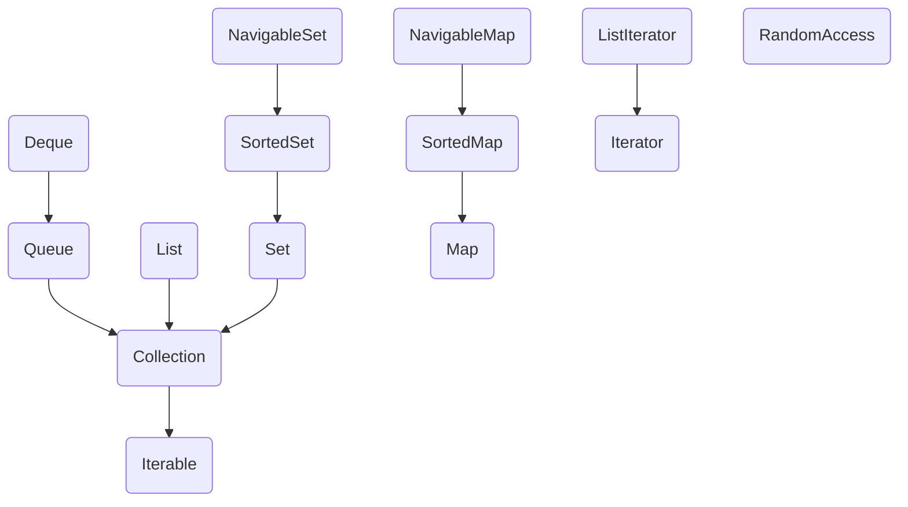

# 第9章 集合

`Java`标准库中的集合类，用以*数据结构（Data Structures）*

## 9.1 `Java`集合框架

### 9.1.1 将集合的接口与实现分离

`Java`集合类库将接口(`interface`)与实现(`implementation`)分离。

例如队伍接口的最简形式可能类似下面这样：

```java
public interface Queue<E>
{
	void add(E element);
    E remove();
    int size();
}
```

这个接口没有说明队伍是如何实现的，每一个实现都可以通过一个实现了`Queue`接口的类表示

```java
public class CircularArrayQueue<E> implements Queue<E>
{
	private int head;
	private int tail;
	
	CircularArrayQueue(int capacity) {...}
    public void add(E element) { ... }
    public E remove() {...}
    public int size() { ... }
    private E[] elements;
}

public class LinkedListQueue<E> implements Queue<E>
{
	private int head;
	private int tail;
	
	CircularArrayQueue(int capacity) {...}
    public void add(E element) { ... }
    public E remove() {...}
    public int size() { ... }
    private E[] elements;
}
```

> 实际上，`Java`标准类库中没有名为`CircularArrayQueue`和`LinkedListQueue`的类，这里只是做一个简单的说明，解释一下集合接口和实现在概念上的不同。如果需要一个循环数组队列，就可以使用`ArrayDeque`类，如果需要的是一个链表队列，就可以直接使用`LinkedList`类，这个类实现了`Queue`接口
>
> 在`API`文档中，有另外一组名字以`Abstract`开头的类，例如`AbstractQueue`，这些类是为类库实现者而设计的。如果要实现自己的队伍类，会发现扩展`AbstractQueue`类要比实现`Queue`接口中的方法轻松的多。

### 9.1.2 `Collection`接口

`Java`类库中，集合类的基本接口是`Collection`接口，这个接口有两个基本方法：

```java
public inteface Collection<E>
{
	boolean add(E element);
	Iterator<E> iterator();
}
```

* `add`方法用于想集合中添加元素
* `iterator`方法用于返回一个实现`Iterator`接口的对象，可以使用这个迭代器对象依次访问集合中的元素

### 9.1.3 迭代器

`Iterator`接口包含4个方法：

```java
public interface Iterator<E>
{
    E next();
    boolean hasNext();
    void remove();
    default void forEachRemaining(Consumer<? super E> action);
}
```

如果想要查看及恶化中的所有元素，就请求一个迭代器，并在`hasNext`返回`true`时反复调用`next`方法

```java
Collection<String> c = ... ;
Iterator<String> iter = c.iterator();
while(iter.hasNext())
{
    String element = iter.next();
    // do something with element;
}
```

或者是使用`for each`循环

```java
for(String eleemnt : c)
{
    // do something with element
}
```

在`Java SE 8`中，甚至不用写循环，可以调用`forEachRemaining`方法并提供一个`lambda`表达式（它会处理一个元素）

```java
iterator.forEachRemaining(element -> do something with element);
```

`Iterator`接口的`remove`方法将会删除上次调用`next`方法时返回的元素，注意在调用`remove`之前没有调用`next`将是不合法的

### 9.1.4 泛型实用方法

`Collection`和`Iterator`都是泛型接口，可以编写操作任何集合类型的实用方法

### 9.1.5 集合框架中的接口

Java集合框架为不同类型的集合定义了大量接口，如下流程图所示



## 9.2 具体的集合

`Java`库中的具体集合，除了以`Map`结尾的类之外，其他类都实现了`Collection`接口，而以`Map`结尾的类实现了`Map`接口

|     集合类型      |                         描述                         |
| :---------------: | :--------------------------------------------------: |
|    `ArrayList`    |           一种可以动态增长和缩减的索引序列           |
|   `LinkedList`    | 一种可以在任何位置进行高效地插入和删除操作的有序序列 |
|   `ArrayDeque`    |             一种用循环数组实现的双端队列             |
|     `HashSet`     |              一种没有重复元素的无序集合              |
|     `TreeSet`     |                      一种有序集                      |
|     `EnumSet`     |                一种包含枚举类型值的集                |
|  `LinkedHashSet`  |             一种可以记住元素插人次序的集             |
|  `PriorityQueue`  |            一种允许高效删除最小元素的集合            |
|     `HashMap`     |             一种存储键/值关联的数据结构              |
|     `TreeMap`     |               —种键值有序排列的映射表                |
|     `EnumMap`     |             一种键值属于枚举类型的映射表             |
|  `LinkedHashMap`  |         一种可以记住键/值项添加次序的映射表          |
|   `WeakHashMap`   |   一种其值无用武之地后可以被垃圾回收器回收的映射表   |
| `IdentityHashMap` |      一种用`=`而不是用`equals`比较键值的映射表       |

### 9.2.1 链表

在`Java`程序设计语言中，所有链表实际上都是**双向链接(doubly linked)**的——即每个结点都存放着指向前驱结点的引用。如下代码是`Java`中使用`LinkedList`添加3个元素之后再将第2个元素删除的代码

```java
List<String> staff = new LinkedList<>(); //LinkedList implements List
staff.add("Amy");
staff.add("Bob")；
staff,add("Carl");
Iteratoriter=staff.iterator();
String first =iter.next()；//visit first element
String second =iter.next(); //visit second element
iter.remove(); //remove last visited element
```

如果多次调用`add`方法，将按照提供的次序将元素添加到链表中。他们被依次添加到迭代器当前位置之前

### 9.2.2数组列表

`ArrayList`封装了一个动态再分配的对象数组，可以使用`get`和`set`方法随机地访问每个元素

### 9.2.3 散列集

散列集为每个对象计算一个整数，成为散列码(hash code)

* 散列码的计算只与散列的对象状态有关，而与散列表中的其他对象无关
* 在`Java`中，散列表用链表数组实现

```java
package chap9.set;

import java.util.*;

public class SetTest {
    public static void main(String[] args) {
        Set<String> words = new HashSet<>();
        long totalTime = 0;

        try (Scanner in = new Scanner(System.in)) {
            while (in.hasNext()) {
                String word = in.next();
                long callTime = System.currentTimeMillis();
                words.add(word);
                callTime = System.currentTimeMillis() - callTime;
                totalTime += callTime;
            }
        }

        Iterator<String> iter = words.iterator();
        for (int i = 1; i < 20 && iter.hasNext(); i++)
            System.out.println(iter.next());
        
        System.out.println("...");
        System.out.println(words.size() + " distinct words. " + totalTime + " milliseconds.");
    }
}
```

### 9.2.4 树集

`TreeSet`是一个有序集合(sorted collection)。可以以任意顺序将元素插入到集合中

```java
SortedSet<String> sorter = new TreeSet<>();
sorter.add("Bob");
sorter.add("Amy");
sorted.add("Carl");
for(String s : sorted)	System.out.println(s);
```

> 排序是用树结构完成的(当前实现使用的是红黑树(red-black tree)
>
> 要使用树集，必须能够比较元素。这些元素必须实现`Comparable`接口，或者构造集时必须提供一个`Comparator`

`treeSet/TreeSetTest.java`

```java
package chap9.treeSet;

import java.util.*;

public class TreeSetTest {

    public static void main(String[] args){
        SortedSet<Item> parts = new TreeSet<>();
        parts.add(new Item("Toaster", 1234));
        parts.add(new Item("Widget", 4562));
        parts.add(new Item("Modem", 9912));
        System.out.println(parts);

        NavigableSet<Item> sortByDescription = new TreeSet<>(Comparator.comparing(Item::getDescription));

        sortByDescription.addAll(parts);
        System.out.println(sortByDescription);
    }    
}
```

`treeSet/Item.java`

```java
package chap9.treeSet;

import java.util.*;

public class Item implements Comparable<Item> {
    private String description;
    private int partNumber;

    public Item(String aDescription, int aPartNumber) {
        description = aDescription;
        partNumber = aPartNumber;
    }

    public String getDescription() {
        return description;
    }

    public String toString() {
        return "[description=" + description + ", partNumber=" + partNumber + "]";
    }

    public boolean equals(Object otherObject) {
        if (this == otherObject) return true;
        if (otherObject == null) return false;
        if (getClass() != otherObject.getClass()) return false;
        Item other = (Item) otherObject;
        return Objects.equals(description, other.description) && partNumber == other.partNumber;
    }

    public int hashCode() {
        return Objects.hash(description, partNumber);
    }

    public int compareTo(Item other) {
        int diff = Integer.compare(partNumber, other.partNumber);
        return diff != 0 ? diff : description.compareTo(other.description);
    }
}

```

### 9.2.5 队伍和双端队列

**队列**可以让人们有效地在尾部添加一个元素，在头部删除一个元素

**双端队列**，可以让人们有效地在头部和尾部同时添加或删除元素

### 9.2.6 优先级队伍

优先级队列（`priority queue`)中的元素可以按照任意的顺序插人，却总是按照排序的顺序进行检索

优先级队列使用了一个优雅且高效的数据结构，称为堆(`heap`)

`priorityQueue/PriorityQueueTest.java`

```java
package chap9.priorityQueue;

import java.util.*;
import java.time.*;

public class PriotityQueueTest {
    public static void main(String[] args) {
        PriorityQueue<LocalDate> pq = new PriorityQueue<>();
        pq.add(LocalDate.of(1906, 12, 9));
        pq.add(LocalDate.of(1815, 12, 10));
        pq.add(LocalDate.of(1903, 12, 3));
        pq.add(LocalDate.of(1910, 6, 22));

        System.out.println("Iterating over elements...");
        for (LocalDate data : pq)
            System.out.println(data);
        System.out.println("Removing elements...");
        while (!pq.isEmpty())
            System.out.println(pq.remove());
    }    
}
```

## 9.3 映射

映射是知道某些键的信息，并想要查找与之对应的元素，用来存放键/值对

### 9.3.1 基本映射操作

`Java`类库为映射提供了两个通用的实现，以下两个类都实现了`Map`接口

* `HashMap`
* `TreeMap`

> * 如果不按照排列顺序访问键，最后选择散列-`HashMap`
>   * `HashMap`顾名思义，底层实现是哈希映射
> * `TreeMap`是一个能比较元素大小的`Map`集合，会对传入的`key`进行大小排序，可以使用元素自然大小排序，也可以使用集合中自定义的比较器来排序
>   * `TreeMap`的实现是红黑树，形成了一棵二叉树
>
> 键必须是唯一的，对同一键调用两次`put`方法，第二个值就会取代第一个值
>
> 做`leetcode`遇到一个使用`TreeMap`的题，列一下`TreeMap`相关的API
>
> ```java
> public interface NavigableMap<K,V> extends SortedMap<K,V> {
> 
>     //返回小于key的第一个元素：
>     Map.Entry<K,V> lowerEntry(K key);
> 
>     //返回小于key的第一个键：
>     K lowerKey(K key);
> 
>     //返回小于等于key的第一个元素：
>     Map.Entry<K,V> floorEntry(K key);
> 
>     //返回小于等于key的第一个键：
>     K floorKey(K key);
> 
>     //返回大于或者等于key的第一个元素：
>     Map.Entry<K,V> ceilingEntry(K key);
> 
>     //返回大于或者等于key的第一个键：
>     K ceilingKey(K key);
> 
>     //返回大于key的第一个元素：
>     Map.Entry<K,V> higherEntry(K key);
> 
>     //返回大于key的第一个键：
>     K higherKey(K key);
> 
>     //返回集合中第一个元素：
>     Map.Entry<K,V> firstEntry();
> 
>     //返回集合中最后一个元素：
>     Map.Entry<K,V> lastEntry();
> 
>     //返回集合中第一个元素，并从集合中删除：
>     Map.Entry<K,V> pollFirstEntry();
> 
>     //返回集合中最后一个元素，并从集合中删除：
>     Map.Entry<K,V> pollLastEntry();
> 
>     //返回倒序的Map集合：
>     java.util.NavigableMap<K,V> descendingMap();
> 
>     NavigableSet<K> navigableKeySet();
> 
>     //返回Map集合中倒序的Key组成的Set集合：
>     NavigableSet<K> descendingKeySet();
> 
>     java.util.NavigableMap<K,V> subMap(K fromKey, boolean fromInclusive,
>                                        K toKey, boolean toInclusive);
> 
>     java.util.NavigableMap<K,V> headMap(K toKey, boolean inclusive);
> 
>     java.util.NavigableMap<K,V> tailMap(K fromKey, boolean inclusive);
> 
>     SortedMap<K,V> subMap(K fromKey, K toKey);
> 
>     SortedMap<K,V> headMap(K toKey);
> 
>     SortedMap<K,V> tailMap(K fromKey);
> }
> ```
>
> 

`map/MapTest.java`

```java
package chap9.map;

import java.util.*;

public class MapTest {
    public static void main(String[] args) {
        Map<String, String> staff = new HashMap<>();
        staff.put("144-25-5464", new String("AmyLee"));
        staff.put("567-24-2546",new String("HarryHacker"));
        staff.put("157-62-7935",new String("CaryCooper"));
        staff.put("456-62-5527",new String("FrancescaCruz"));
        //print all entries
        System.out.println(staff);
        //remove an entry
        staff.remove("567-24-2546");
        //replace an entry
        staff.put("456-62-5527",new String("FrancescaHiller"));
        //look up avalue
        System.out.println(staff.get("157-62-7935"));
        //iterate through all entries
        staff.forEach((k,v)->System.out.println("key=" + k + ", value=" + v));
    }
}
```

### 9.3.2 更新映射项

处理映射的一个难点就是更新映射项，例如统计单次出现的频度

```java
counts.put(word, counts.get(word) + 1);
```

但是如果单词第一次出现，就会出现`NullPointerException`异常，一个简单的补救措施是

```java
counts.put(word, counts.getOrDefault(word, 0) + 1);
```

另一种方法是调用`putIfAbsent`方法。只有当键原先不存在时才会放入一个值`0`

```java
counts.putIfAbsent(word, 0);
counts.put(word, counts.get(word) + 1);
```

### 9.3.3 映射视图

可以通过即可一样使用映射的`keySet`

```java
Set<String> keys = map.keySet();
for(String key : keys)
{
	// do something with key
}
```

如果想要同时查看键和值，可以通过枚举条目来避免查找值

```java
for(Map.Entry<String, Employee> entry: staff.entrySet())
{
	String k = entry.getKey();
	Employee v = entry.getValue();
	// do something with k, v
}
```

## 9.5 算法

泛型集合接口有一个很大的优点，即算法只需要实现一次。`Java`类库中的算法虽然没有`C++`类库的丰富，但是也包含了基本的排序、二分查找等实用算法

### 9.5.1 排序与混排

`Collections`类中的`sort`方法可以对实现了`List`接口的集合进行排序

```java
List<String> staff = new LinkedList<>();
// fill collection
Collections.sort(staff);
```

 这个方法假定列表元素实现了`Comparable`接口。如果想采用其他方式对列表进行排序，可以使用`List`接口的`sort`方法并传入一个`Comparator`对象

```java
staff.sort(Comparator.comparingDouble(Employee::getSalary));
```

> `sort`方法的实现是直接将所有元素转入一个数组，对数组进行排序，然后，再将排序后的序列复制回列表。
>
> 集合类库中使用的排序算法比快速排序要慢一些，快速排序是通用排序算法的传统选择。但是，归并排序有一个主要的优点：稳定，即不需要交换相同的元素。

`Collections`类有一个算法`shuffle`,其功能与排序刚好相反，即随机地混排列表中元素的顺序。例如：

```java
ArrayList<Card> cards = ...;
Collections.shuffle(cards);
```

`shuffle/ShuffleTest.java`

```java
package chap9.shuffle;

import java.util.*;

public class ShuffleTest {
    public static void main(String[] args)
    {
        List<Integer> numbers = new ArrayList<>();
        for(int i = 1; i <= 49; i++)
            numbers.add(i);
        Collections.shuffle(numbers);
        List<Integer> winningCombination = numbers.subList(0, 6);
        Collections.sort(winningCombination);
        System.out.println(winningCombination);
    }   
}
```

### 9.5.2 二分查找

`Collections`类的`binarySearch`方法实现了这个算法。注意，集合必须是排好序的，否则算法将返回错误的答案。如果集合没有采用`Comparable`接口的`compareTo`方法进行排序，

```java
i = Collections.binarySearch(c, element);
i = Collections.binarySearch(c, element, comparator);
```

### 9.5.3 简单算法

在`Collections`类中包含了几个简单且很有用的算法，例如查找集合中最大元素的示例

### 9.5.4 批操作

```java
// 删除所有coll2中元素
coll1.removeAll(coll2);
// 删除所有未在coll2中出现的元素
coll1.retainAll(coll2);
// 从一个子列表中选出前10个元素
relocated.addAll(staff.subList(0, 10))
```

### 9.5.5 集合与数组的转换

* 将数组转换为集合

  ```java
  String[] values = ...;
  HashSet<String> staff = new HashSet<>(Arrays.asList(values));
  ```
  
* 从集合中得到数组

  ```java
  Objects[] values = staff.toArray(); 
  ```

  但是`toArray`方法返回的数组是一个`Object[]`数组，不能改变它的类型，实际上，必须使用`toArray`方法的一个变体形式

  ```java
  // 提供一个所需类型并且长度为0的数组
  String[] values = staff.toArray(new String[0]);
  // 或者构造一个指定大小的数组
  staff.toArray(new String[staff.size()]);
  ```

### 9.5.6 编写自己的算法

如果编写自己的算法（实际上，是以集合作为参数的任何方法)，应该尽可能地使用接口，而不要使用具体的实现

## 9.6 遗留的集合

### 9.6.1 `Hashtable`类

`Hashtable`类与`HashMap`类的作用一样，实际上，它们拥有相同的接口。与`Vector`类的方法一样。`Hashtable`的方法也是同步的。如果对同步性或与遗留代码的兼容性没有任何要求，就应该使用`HashMap`。如果需要并发访问，则要使用`ConcurrentHashMap`

### 9.6.2 枚举

遗留集合使用`Enumeration`接口对元素序列进行遍历，`Enumeration`接口有两个方法，即`hasMoreElements`和`nextElement`

```java
Enumeration<Employee> e = staff.elements();
while(e.hasMoreElements())
{
    Employee e = e.nextElement();
    // ...
}
```

### 9.6.3 属性映射

属性映射是一个类型非常特殊的映射结构，有以下三个特性

* 键与值都是字符串
* 表可以保存到一个文件中，也可以从文件中加载
* 使用一个默认的辅助表

> 实现属性映射的`Java`平台类成为`Properties`
>
> 属性映射通常用于程序的特殊配置选项

### 9.6.4 栈

`Stack`是从`Java 1.0`版开始就包含在标准类库中的，以下是`Stack`的几个常用的方法

```
Stack<Integer> stack = new Stack<Integer>();
// push
Stack.push(1);
Stack.push(2);
// pop
System.out.println(stack.pop())
// peek
System.out.println(stack.peek())
// isEmpty
System.out.println(stack.isEmpty())
```

### 9.6.5 位集

`BitSet`类提供了一个便于读取、设置或清除各个位的接口

```java
// 获取第i位状态，处于"开"，返回true，否则，返回false
bucketOfBits.get(i);
// 将第i位置为"开"
bucketOfBits.set(i);
// 将第i位置为"关"
bucketOfBits.clear(i);
```
