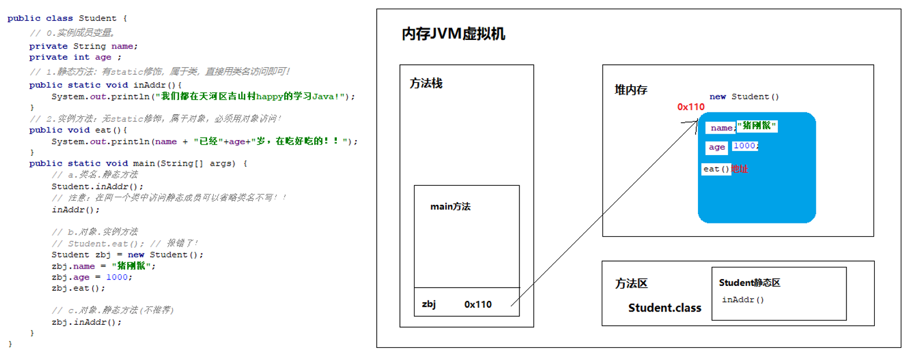
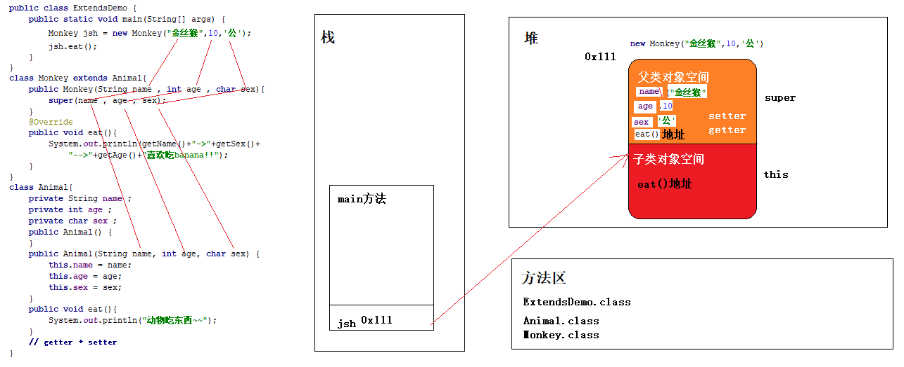
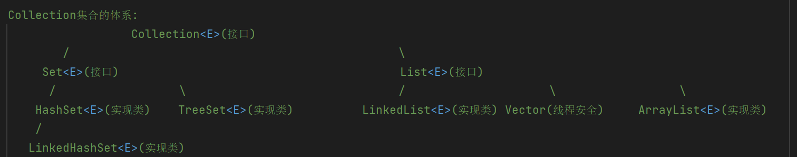
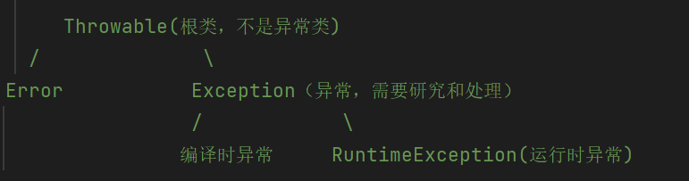

# Java进阶简介

主要的知识点来自于黑马程序员的视频：`BV1TE41177mP`

# day1-复习回顾、静态、继承、引用类型使用

## 定义类

- 类名的首字母应该大写，满足**驼峰写法**
- 一个Java文件可以定义多个类。但是只有一个类是用`public`修饰，`public`修饰的类名必须称为`Java`文件名。

- 类中有且仅有5大成分（五大金刚）

  - **成员变量Field**：描述类或者对象的属性信息的。
  - **成员方法Method**：描述类或者对象的行为的。
  - **构造器（构造方法,Constructor）**: 初始化类的一个对象返回。
    - 有参构造器
    - 无参构造器
  - **代码块**

  - **内部类**

## 封装

- 面向对象的三大**特征**之一：**封装，继承，多态**。 
- 形成了规范，即使毫无意义还是会这样写代码！
- 合理隐藏，合理暴露。
- 封装的规范：成员变量私有，方法一般公开，提供成套的`getter`和`setter`方法暴露成员变量的取值和赋值，`public`修饰符
- 封装的作用：提高安全性，提高代码的组件化思想。
- 封装已经成为`Java`代码的规范，即使毫无意义，我们也要这样写代码（成员变量私有，方法公开）

## this关键字

- `this`代表了当前对象的引用。
- `this`可以出现在构造器和方法中。
- `this`出现在构造器中代表构造器正在初始化的对象。
- `this`出现在方法中，哪个对象调用方法，`this`就代表哪个对象。
- `this`可以访问对象的成员变量，区分成员变量是局部的还是对象中的成员变量。

## static关键字

`Java`是通过成员变量是否有`static`修饰来区分是类的还是属于对象的

* 没有`static`修饰的方法和变量是属于每个对象的
* 有`static`修饰的方法和成员变量属于类的

按照有无`static`修饰，成员变量和方法可以分为：

**成员变量**：

* **静态成员变量**（类变量）：有`static`修饰的成员变量称为静态成员变量也叫类变量，属于类本身的，**直接用类名访问**即可。
* **实例成员变量**：无`static`修饰的成员变量称为实例成员变量，属于类的每个对象的，**必须用类的对象来访问**。

> * 同一个类中访问静态成员变量可以省略类名不写
> * 对象也可以访问静态成员变量，但是不推荐，静态成员变量属于类，如果用对象访问静态成员变量容易混淆

成员变量访问内存


```java
public class Student{
    // 1.静态成员变量:有static修饰，属于类本身，直接用类名访问即可！
    public static String schoolName = "黑马";
    // 2.实例成员变量:无static修饰，属于类的对象的，必须用对象访问！
    private String name;
    private int age ;

    public static void main(String[] args) {
        // 1.类名.静态成员变量
        System.out.println(Student.schoolName);
        // 注意：同一个类中访问静态成员变量可以省略类名不写
        System.out.println(schoolName);

        // 2.对象.实例成员变量
        //System.out.println(Student.name); // 报错！
        Student swk = new Student();
        swk.name = "孙悟空";
        System.out.println(swk.name);
        System.out.println(swk.age);

        // 3.对象.静态成员变量(不推荐)
        // 静态成员变量属于类，直接用类名访问即可。
        System.out.println(swk.schoolName);
    }
}
```

**成员方法**：

* **静态方法**：有`static`修饰的成员方法称为静态方法也叫类方法，属于类本身的，**直接用类名访问**即可。
* **实例方法**：无`static`修饰的成员方法称为实例方法，属于类的每个对象的，**必须用类的对象**来访问。

> * 静态方法属于类，有static修饰，直接用类名访问即可。
> * 实例方法属于对象，无static修饰，必须先创建对象，然后用对象来访问。
> * 静态方法也可以被对象共享访问，但是不推荐，因为静态方法直接用类名访问即可。



```java
public class Student {
    // 0.实例成员变量。
    private String name;
    private int age ;

    // 1.静态方法：有static修饰，属于类，直接用类名访问即可！
    public static void inAddr(){
        System.out.println("我们都在天河区吉山村happy的学习Java!");
    }

    // 2.实例方法：无static修饰，属于对象，必须用对象访问！
    public void eat(){
        System.out.println(name + "已经"+age+"岁，在吃好吃的！！");
    }

    public static void main(String[] args) {
        // a.类名.静态方法
        Student.inAddr();
        // 注意：在同一个类中访问静态成员可以省略类名不写！！
        inAddr();

        // b.对象.实例方法
        // Student.eat(); // 报错了！
        Student zbj = new Student();
        zbj.name = "猪刚鬣";
        zbj.age = 1000;
        zbj.eat();

        // c.对象.静态方法(不推荐)
        zbj.inAddr();
    }
}
```

关于`static`常考的八类题：

* 实例方法是否可以直接访问实例成员变量？可以的，因为它们都属于对象。
* 实例方法是否可以直接访问静态成员变量？可以的，静态成员变量可以被共享访问。
* 实例方法是否可以直接访问实例方法? 可以的，实例方法和实例方法都属于对象。
* 实例方法是否可以直接访问静态方法？可以的，静态方法可以被共享访问！
* 静态方法是否可以直接访问实例变量？ 不可以的，实例变量必须用对象访问！！
* 静态方法是否可以直接访问静态变量？ 可以的，静态成员变量可以被共享访问。
* 静态方法是否可以直接访问实例方法? 不可以的，实例方法必须用对象访问！！
* 静态方法是否可以直接访问静态方法？可以的，静态方法可以被共享访问！！

> **也就是说实例方法啥都可以访问，静态方法只能访问静态方法或者静态变量**

## 继承

### 继承的概述

面向对象的三大特征：封装、继承和多态

继承是Java中一般到特殊的关系，是一种子类到父类的关系。例如：学生类继承了人类。  猫类继承了动物类。

被继承的类称为：父类/超类。继承父类的类称为：子类

* 继承可以**提高代码的复用性**
* 子类直接继承父类，就可以直接使用父类的这些代码了（相同代码重复利用）

子类继承了一个父类，子类就可以直接得到父类的属性（成员变量）和行为（方法）了。

### 继承的例子

```java
class Animal{

}

class Cat extends Animal{

}
```

> - 继承的优势可以把相同的代码定义在父类中，子类可以直接继承使用。
> - 这样就可以**提高代码的复用性**：相同代码只需要在父类中写一次就可以了。

### 子类不能继承父类的内容

- 子类继承父类，子类就得到了父类的属性和行为。
- 但是并非所有父类的属性和行为等子类都可以继承。

**子类不能继承父类的东西**：子类不能继承父类的构造器，子类有自己的构造器。（没有争议的）

有争议的观点（拓展）：

**子类是否可以继承父类的私有成员**（私有成员变量，私有成员方法）?

* **子类是可以继承父类的私有成员的，只是不能直接访问而已**。
* 以后可以暴力去访问继承自父类的私有成员~~~

**子类是否可以继承父类的静态成员？**

* **子类是不能继承父类的静态成员的**
* **子类只是可以访问父类的静态成员**，父类的静态成员只有一份可以被子类共享访问。
* **共享并非继承**

### 成员变量的访问特点

**就近原则**：子类有找子类，子类没有找父类，父类没有就报错

```java
class Animal{
    public String name = "动物名称";
}

class Cat extends Animal{
    public String name = "子类名称";
    public void show(){
        String name = "局部名称";
        System.out.println(name); // 局部名称
        System.out.println(this.name); // 子类名称
        System.out.println(super.name); // 父类名称
    }
}
```

> - `this`代表了当前对象的引用，可以用于访问当前子类对象的成员变量。
> - `super`代表了父类对象的引用，可以用于访问父类中的成员变量。

### 成员方法的访问特点

就近原则：子类有找子类，子类没有找父类，父类没有就报错

子类对象优先使用子类已有的方法，也就是说父类的方法被重写

```java
public class TestDemo {
    public static void main(String[] args) {
        Cat cat = new Cat();
        cat.run(); // 子类的
        cat.eat(); // 父类的
        // cat.go(); // 报错！
    }
}

class Animal{
    public void run(){
        System.out.println("动物可以跑~~~~");
    }

    public void eat(){
        System.out.println("吃东西~~~~");
    }
}

class Cat extends Animal {
    public void run(){
        System.out.println("🐱跑的贼溜~~~~");
    }
}
```

### 方法重写

子类继承了父类，子类就得到了父类的某个方法。但是子类觉得父类的这个方法不好用或者无法满足自己的需求，子类重写一个与父类申明一样的方法来覆盖父类的该方法，子类的这个方法就进行了方法重写。

方法重写的校验注解： `@Override`

- `Java`建议在重写的方法上面加上一个`@Override`注解。
- 方法一旦加了这个注解，那**就必须是成功重写父类**的方法，否则报错！
- `Override`优势：**可读性好，安全，优雅**

方法重写的具体要求：

* 子类重写方法的**名称和形参列表必须与父类被重写方法一样**。
* 子类重写方法的返回值类型申明要么与父类一样，要么比父类方法**返回值类型范围更小**。（以后再了解）
* 子类重写方法的修饰符权限应该与父类被重写方法的**修饰符权限相同或者更大**。（以后再了解）
* 子类重写方法申明抛出的异常应该与父类被重写方法申明抛出的**异常一样或者范围更小**！（以后再了解）

```java
class Wolf extends Animal{
    // 进行了方法重写！！
    // 子类重写方法的名称和形参列表必须与父类被重写方法一样
    // 子类重写方法的返回值类型申明要么与父类一样，要么比父类方法返回值类型范围更小
    // 子类重写方法的修饰符权限应该与父类被重写方法的修饰符权限相同或者更大
    @Override
    public void run(){
        System.out.println("🐺跑的贼快~~~");
    }
}

class Animal{
    public void run(){
        System.out.println("动物可以跑步~~~");
    }
}
```

> - 方法重写是子类重写一个与父类申明一样的方法覆盖父类的方法。
> - 方法重写建议加上`@Override`注解。
> - 方法重写的核心要求：方法名称形参列表必须与被重写方法一致！！
> - 建议**申明不变，重新实现**。

调用父类被重写的方法使用`super`

```java
class SportMan extends People{
    @Override
    public void run(){
        System.out.println("运动员跑的贼快~~~~~");
    }

    public void go(){
        super.run(); // 父类被重写的方法
        run(); // 子类的
    }
}

class People{
    public void run(){
        System.out.println("人会跑~");
    }
}
```

> `super`可以用在子类的实例方法中调用父类被重写的方法

静态方法和私有方法**不可以**被重写

```java
class Mac extends Computer{
//    @Override
    public void go(){
    }

    // @Override
    public static void test(){
    }
}

class Computer{
    public static void test(){
        System.out.println("super test");
    }

    private void go(){

    }
}
```

### 继承后构造器的特点

子类的全部构造器默认一定会**先访问父类的无参数构造器，再执行子类自己的构造器**，主要的原因是

* 子类的构造器的第一行默认有一个`super()`调用父类的无参数构造器，写不写都存在
* 子类继承父类，子类就得到了父类的属性和行为
* 当我们调用子类构造器初始化子类对象数据的时候，必须先调用父类构造器初始化继承自父类的属性和行为

### super调用父类构造器

`super(...)`可以根据参数选择调用父类的某个构造器

```java
class Monkey extends Animal{

    public Monkey(String name, int age, char sex) {
        super(name , age , sex) ; // 根据参数匹配调用父类构造器
    }

    public void eatBanana(){
        System.out.println(getName()+"-->"+getAge()+"-->"+getSex()+"在吃🍌~~~");
    }
}

class Animal{
    private String name;
    private int age;
    private char sex;

    public Animal() {
    }

    public Animal(String name, int age, char sex) {
        this.name = name;
        this.age = age;
        this.sex = sex;
    }

    public String getName() {
        return name;
    }

    public void setName(String name) {
        this.name = name;
    }

    public int getAge() {
        return age;
    }

    public void setAge(int age) {
        this.age = age;
    }

    public char getSex() {
        return sex;
    }

    public void setSex(char sex) {
        this.sex = sex;
    }
}
```

`super`调用父类构造器的内存分布图



### this和super关键字使用总结

`this`代表了当前对象的引用（继承中指代子类对象）：

* `this` 子类成员变量
* `this`子类成员方法
* `this(...)` 可以根据参数匹配访问本类其他构造器

`super`代表了父类对象的引用（继承中指代了父类对象空间）

* `super` 父类成员变量
* `super`父类的成员方法
* `super(...)`可以根据参数匹配访问父类的构造器

`this(...)`和`super(...)`**必须放在构造器的第一行**，否则报错

所以`this(...)`和`super(...)`**不能同时出现在构造器中**

```java
class Student{
    private String name ;
    private int age ;
    private String schoolName ;

    public Student() {
    }

    public Student(String name , int age){
        // 借用兄弟构造器的功能！
        this(name , age , "黑马");
    }

    public Student(String name, int age, String schoolName) {
        this.name = name;
        this.age = age;
        this.schoolName = schoolName;
    }

    public String getName() {
        return name;
    }

    public void setName(String name) {
        this.name = name;
    }

    public int getAge() {
        return age;
    }

    public void setAge(int age) {
        this.age = age;
    }

    public String getSchoolName() {
        return schoolName;
    }

    public void setSchoolName(String schoolName) {
        this.schoolName = schoolName;
    }
}
```

### 继承的特点

* **单继承**：一个类只能继承一个直接父类

  * 如果是多继承可能会出现类的**二义性**

    ```java
    class A{
        public void test(){
            System.out.println("A");
        }
    }
    class B{
        public void test(){
            System.out.println("B");
        }
    }
    class C extends A , B {
        public static void main(String[] args){
            C c = new C();
            c.test(); // 出现了类的二义性！所以Java不能多继承！！
        }
    }
    ```

* **多层继承**：一个类可以间接继承多个父类

* 一个类可以有多个子类

* 一个类要么默认继承了`Object`类，要么间接继承了`Object`类，`Object`类是`Java`的祖宗类

## 引用类型作为方法参数和返回值

* 除了基本数据类型都是引用数据类型
* 引用类型可以作为方法的参数类型和返回值类型
* 引用数据类型可以在一切可以使用类型的地方使用

```java
public class TestDemo {
    public static void main(String[] args) {
        Dog jinMao = new Dog();
        go(jinMao);

        System.out.println("--------------");
        Dog dog = createDog();
        dog.run();
    }

    // 引用类型作为方法的返回值:创建一个狗对象返回！
    public static Dog createDog(){
//        Dog taiDi = new Dog();
//        return taiDi;
         return new Dog();
    }

    // 引用类型作为方法参数: 提供一个方法让狗进入比赛~~~
    public static void go(Dog a){
        System.out.println("比赛开始。。。");
        a.run();
        System.out.println("比赛结束。。。");
    }
}

class Dog{
    public void run(){
        System.out.println("🐕跑的贼溜~~~");
    }
}
```

## 引用类型作为成员变量的类型

`Address.java`

```java
public class Address {
    private String code;
    private String name;
    private double x;
    private double y;

    public Address() {
    }

    public Address(String code, String name, double x, double y) {
        this.code = code;
        this.name = name;
        this.x = x;
        this.y = y;
    }
}
```

`Student.java`

```java
public class Student {
    private String name;
    private int age ;
    // 地址信息:复合类型。
    // 引用类型作为成员变量的类型
    private Address address;
}
```

# day2-抽象类、接口、代码块、final、单例、枚举

## 抽象类

### 抽象类的概述

父类指导之类一定要完成某个功能，但是每个之类完成的情况是不一样的。子类以后也只会用自己重写的功能，那么父类的该功能就可以定义成抽象方法，子类重写调用自己的方法。所以父类的该功能就可以定义为抽象的方法。拥有冲向方法的类必须定义为抽象类。

> **抽象方法**：没有方法体，只有方法签名，必须用`abstract`修饰的方法就是抽象方法。
>
> **抽象类**：拥有抽象方法的类必须定义成抽象类，必须用`abstract`修饰。

```java
class Wolf extends Animal{
    @Override
    public void run(){
        System.out.println("🐺跑的贼贼溜~~~");
    }
}

// 抽象类：拥有了抽象方法的类必须定义成抽象类。抽象类必须加上abstract修饰。
abstract class Animal{
    // 抽象方法：没有方法体，只有方法签名，必须加上abstract修饰。
    public abstract void run();
}
```

### 抽象类的使用

抽象类是为了被子类继承

```java
class Manager extends Employee{
    @Override
    public void work() {
        System.out.println("班主任需要管理班级~~~~");
    }

     @Override
     public void run() {

     }
 }

class Techer extends Employee{
    @Override
    public void work() {
        System.out.println("老师需要授课~~~~");
    }

    @Override
    public void run() {

    }
}

// 员工（老师，班主任 ） 每个员工都要工作，但是工作内容不一样。
abstract class Employee{
    public abstract void work();
    public abstract void run();
}
```

> * 一个类继承了抽象类，必须重写完抽象类的全部抽象方法，否则这个类必须定义成抽象类。
> * 因为拥有抽象方法的类必须定义成抽象类。

### 抽象类的特征

抽象类的特征是：**有得有失**

* 抽象类得到了拥有对象的能力
* 抽象类失去了创建对象的能力，即抽象类不能创建对象

> **抽象类是否有构造器，是否可以创建对象**，为什么?
>
> 抽象类作为类一定**有构造器**，而且必须有构造器。**提供给子类继承后调用父类构造器**使用的。
>
> 抽象类虽然有构造器，但是抽象类**绝对不能创建对象**。抽象类中可能存在抽象方法，**抽象方法不能执行**。抽象在学术上本身意味着不能实例化。

### 抽象类的意义

抽象类存在的意义有两点：

* **被继承**：抽象类就是为了被子类继承，否则抽象类将毫无意义
* 抽象类体现的**模板思想**：部分实现，部分抽象，可以使用抽象类设计一个模板模式

### 抽象类设计模板模式

**设计模式**：就是前人或者软件行业在生产实战中发现的优秀软件设计架构和思想。后来者可以直接用这些架构或者思想就可以设计出优秀的软件，提高开发效率，提高软件可扩展性和可维护性。

模板设计模式就是一种经典的设计模式思想

**模板设计模型的作用**：优化代码架构，提高代码的复用性，相同功能的重复代码无需重复书写。可以做到部分实现，部分抽象，抽象的东西交给使用模板的人重写实现

```java
class Teacher extends Template{
    @Override
    public String writeMain() {
        return "\t\t我爸就是好，有多好，做他儿子才能懂~~~";
    }
}

class Student extends Template{
    @Override
    public String writeMain() {
        return "\t\t我爸爸很牛，我爸爸是马云，就是爽，很有钱~~~~";
    }
}
// 1.写一个模板类：代表了作文模板。
abstract class Template{
    private String title = "\t\t\t\t\t\t《我的爸爸》";
    private String one = "\t\t我的爸爸很牛逼，到底有多牛呢，请看如下说明：";
    private String last = "\t\t以上就是我的爸爸，简直太好了，下辈子还要做他儿子！";

    // 2.提供一个写作文方法
    public void write(){
        System.out.println(title);
        System.out.println(one);
        // 正文：正文部分模板是不知道怎么写的！应该把正文部分定义成抽象方法
        // 交给使用模板的子类重写！
        System.out.println(writeMain());
        System.out.println(last);
    }

    // 正文部分定义成抽象方法，交给子类重写！！
    public abstract String writeMain();
}
```

### 抽象类的注意事项

1. 抽象类不能创建对象，如果创建，编译无法通过而报错。只能创建其非抽象子类的对象。
   理解：假设创建了抽象类的对象，调用抽象的方法，而抽象方法没有具体的方法体，没有意义。

2. 抽象类一定有而且是必须有构造器，是供子类创建对象时，初始化父类成员使用的。
   理解：子类的构造器中，有默认的super()，需要访问父类构造器。

3. 抽象类中，不一定包含抽象方法，但是有抽象方法的类必定是抽象类。

4. 抽象类的子类，必须重写抽象父类中所有的抽象方法，否则子类也必须定义成抽象类。

5. 抽象类存在的意义是为了被子类继承，抽象类体现的是模板思想。
   理解：抽象类中已经实现的是模板中确定的成员，
   抽象类不确定如何实现的定义成抽象方法，交给具体的子类去实现。

## 接口

### 接口的概述

接口体现的是规范思想，实现接口的子类必须重写完接口的全部抽象方法

接口是更加彻底的抽象，在JDK 1.8之前接口中只能是抽象方法和常量

定义格式

```java
修饰符 interface 接口名称{
	// 在JDK 1.8 之前接口中只能是抽象方法和常量
}
```

成分研究（JDK 1.8之前）

* 接口中抽象方法默认加上`public abstract`修饰，可以省略不写

* 常量是指有`public static final`修饰的成员变量，**有且仅能被复制一次**，值不能改变

  常量名称规范要求全部大写，多个单词下划线连接

  常量修饰`public static final`可以省略不写，默认会加上

```java
public interface InterfaceDemo {
     // 2.常量
     // 只有一份，在执行的过程中其值必须有，但是不能改变！
     // 常量是public static final修饰
     // 常量的名称建议字母全部大写，多个单词用“_”连接
     // 在接口中常量可以省略public static final不写，默认会加上该三个修饰符！
     //public static final String SCHOOL_NAME = "黑马";
     String SCHOOL_NAME = "黑马";


     // 1.抽象方法
     // public abstract void run();
     // 接口中的抽象方法默认会加上public abstract修饰,所以可以省略不写。
     void run();
     void work();
}
```

### 接口的基本实现

子类和父类是继承，实现类和接口是实现关系。接口是用来被类实现的，实现接口的类是实现类

子类–>继承–>父类

实现类–>实现–>接口

类实现接口的格式：

```java
修饰符 class 实现类名称 implements 接口1,接口2,接口3,....{

}
```

例如

```java
// 实现类 实现 SportMan接口
// 一个类实现接口必须重写完接口中全部抽象方法，否则这个类必须定义成抽象类！！
class PingPongMan implements SportMan{
    private String name;
    public PingPongMan(String name){
        this.name = name;
    }
    @Override
    public void run() {
        System.out.println(name+"必须天天运动。正在🏃训练~~~‍");
    }

    @Override
    public void win() {
        System.out.println(name+"参加比赛中~~~‍");
    }
}

// 定义一个接口：表示运动员的规范
interface SportMan{
    void run(); // 跑步
    void win(); // 比赛得奖
}
```

> * 接口的使命就是要求实现接口的类必须有`run()`和`win()`方法
> * 接口可以多实现
> * 一个类实现接口必须重写完接口中全部抽象方法，否则这个类必须定义成抽象类

### 接口的多实现

* 类与类是单继承
* 类和接口是多实现

一个类如果实现了多个接口，必须重写完全部接口中的全部抽象方法，否则这个类必须定义为抽象类

```java
class PingPongMan implements SportMan , Law{

    @Override
    public void rule() {

    }

    @Override
    public void run() {

    }

    @Override
    public void win() {

    }
}

interface Law{
    void rule();
    void run();
}

interface SportMan{
    void run();
    void win();
}
```

### 接口与接口的多继承

* 类与类是单继承关系：一个类只能继承一个直接父类
* 类与接口是多继承关系：一个类可以同时实现多个接口
* 接口与接口是多继承关系：一个接口可以同时继承多个接口

接口与接口的多继承，用一个接口合并多个接口

```java
class PingPongMan implements SportMan{

    @Override
    public void eat() {

    }

    @Override
    public void rule() {

    }

    @Override
    public void run() {

    }

    @Override
    public void goAbroad() {

    }
}

interface Food{
    void eat();
}

interface Law{
    void rule();
}

// 接口与接口的多继承！
interface SportMan extends Law , Food {
    void run();
    void goAbroad();
}
```

### JDK1.8之后接口新增的方法

JDK1.8开始之后接口新增的三个方法，了解即可

* **默认方法**	就是之前写的实例方法
  * 必须用`default`修饰
  * 默认会加`public`修饰
  * 只能用接口的实现类的对象来调用
* **静态方法**
  * 可以直接加`static`修饰
  * 默认会加`public`修饰
  * 接口的静态方法只能用接口的类名称调用
* **私有方法**    从JDK 1.9开始才支持的
  * 其实就是私有的实例方法，必须加`private`修饰
  * 只能在**本接口**被其他的默认方法或者私有方法访问

```java
public class InterfaceDemo {
    public static void main(String[] args) {
        // 1.默认方法调用：必须用接口的实现类对象调用。
        PingPongMan zjk = new PingPongMan();
        zjk.run();
        zjk.work();

        // 2.接口的静态方法必须用接口的类名本身来调用。
        InterfaceJDK8.inAddr();
    }
}

class PingPongMan implements InterfaceJDK8{
    @Override
    public void work() {
        System.out.println("工作中。。。");
    }
}

interface InterfaceJDK8{
    // 之前的抽象方法！！
    void work();

    // a.默认方法（就是之前写的普通实例方法）
    // 必须用接口的实现类的对象来调用。
    default void run(){
        go();
        System.out.println("开始跑步🏃‍~~~~");
    }

    // b.静态方法
    // 注意：接口的静态方法必须用接口的类名本身来调用
    static void inAddr(){
        System.out.println("我们在吉山区~~~~");
    }

    // c.私有方法（就是私有的实例方法）: JDK 1.9才开始有的。
    //  -- 只能在本接口中被其他的默认方法或者私有方法访问。
    private void go(){
        System.out.println("开始。。");
    }
}
```

### 接口的注意事项

* 如果实现了多个接口，多个接口存在同名的**静态方法**并不会从冲突，原因是只能通过各自接口方法访问各自静态方法
* 当一个类，即继承一个父类，又实现若干个接口时，父类的成员方法与接口中的默认方法重名时，之类**就近**选择执行父类的成员方法
* 当一个类实现多个接口时，多个接口存在同名的默认方法，实现类必须重写这个方法

## 代码块

代码块按照有无`static`修饰可以分为：静态代码块、实例代码块

### 静态代码块

静态代码块：必须用`static`修饰，必须放在类下，与类一起优先加载执行

静态代码块可以用于执行类的方法之前进行静态资源的初始化操作

```java
public class CodeDemo01 {
    public static String schoolName ;
    public static ArrayList<String> lists = new ArrayList<>();

    // 静态代码块,属于类，与类一起加载一次!
    static {
        System.out.println("静态代码块被触发执行~~~~~~~");
        // 在静态代码块中进行静态资源的初始化操作
        schoolName = "黑马";
        lists.add("3");
        lists.add("4");
        lists.add("5");
    }

    public static void main(String[] args) {
        System.out.println(schoolName);
        System.out.println(lists);
    }
}
```

### 实例代码块

* 实例代码块直接用`{}`括起来，无需`static`修饰
* 会和类的对象一起加载，每次创建对象的时候，实例代码块会被加载且自动执行一次
* 实例代码块的代码在底层实际上是提取到每个构造器中去执行的，**实例代码块属于对象**
* 实例代码块可以在创建对象之前进行实例资源的初始化操作

```java
public class CodeDemo02 {
    private String name;
    private ArrayList<String> lists = new ArrayList<>();
    // 实例代码块！属于对象！与对象一起加载!
    {
        name = "小手";
        lists.add("东");
        lists.add("南");
        lists.add("西");
        lists.add("北");
        System.out.println("实例代码块被触发执行一次~~~~~~~~");
    }

    public CodeDemo02(){

    }
    public CodeDemo02(String name){

    }

    public static void main(String[] args) {
        CodeDemo02 c = new CodeDemo02();
        System.out.println(c.name);
        System.out.println(c.lists);
        new CodeDemo02();
        new CodeDemo02();
    }
}
```

## final关键词

`final`可以用于修饰类、方法、变量

* `final`修饰类：类不能被继承了
* `final`修饰方法：方法不能被重写
* `final`修饰变量：变量有且仅能被赋值一次
  * 局部变量-只能赋值一次，不能在更改
  * 实例成员变量
    * 显示初始化，在定义成员变量的时候立马赋值
    * 实例代码块中赋值一次
    * 构造器初始化，在构造器中赋值一次

`final`和`abstract`的关系

互斥关系，不能同时修饰类或者同时修饰方法

**常量**：有`public static final`修饰，名称字母全部大写，多个单词用下划线连接

## 单例设计模式

**单例**的意思是一个类永远只存在一个对象，不能创建多个对象

* 开发中有很多类的对象我们只需要一个对象，例如虚拟机，任务管理器对象
* 对象越多越占内存，有时候只需要一个对象就可以实现业务，单例可以节约内存，提高性能

### 饿汉单例设计模式

通过类获取单例对象的时候，对象已经提前准备做好了

设计步骤：

* 定义一个类，把**构造器私有**
* 定义一个静态变量存储一个对象
* 提供一个返回单例对象的方法

```java
// 饿汉单例设计模式
class Singleton01{
    //  b.定义一个静态变量存储一个对象( 在用类获取对象的时候，对象已经提前为你创建好了。)
    private static final Singleton01 INSTANCE = new Singleton01();
    //  a.定义一个类，把构造器私有。
    private Singleton01(){
    }
    // c.提供一个返回单例对象的方法。
    public static Singleton01 getInstance(){
        return INSTANCE;
    }
}
```

### 懒汉单例设计模式

通过类获取单例对象的时候发现没有对象才会去创建一个对象

设计步骤：

* 定义一个类，把**构造器私有**
* 定义一个静态成员变量用于存储一个对象
* 提供一个返回单例对象的方法，判断对象不存在才创建一次，存在直接返回

```java
// 懒汉单例设计模式
class Singleton02{
    //  b.定义一个静态变量存储一个对象(这里不能创建对象，需要的时候才创建，这里只是一个变量用于存储对象！)
    public static Singleton02  instance ;

    //   a.定义一个类，把构造器私有。
    private Singleton02(){

    }
    //  c.提供一个返回单例对象的方法。
    public static Singleton02 getInstance(){
        if(instance == null){
            // 第一次来拿单例对象！需要创建一次对象，以后直接返回！！
            instance = new Singleton02();
        }
        return instance;
    }
}
```

## 枚举

枚举类的作用：是为了做信息的标志和信息分类

### 枚举类基本语法

```java
修饰符 enum 枚举名称{
	// 第一行罗列的必须的枚举类的对象名称
}
```

例如

```java
enum Sex{
    BOY , GIRL;
}

// 枚举
enum Season {
    SPRING , SUMMER , AUTUMN , WINTER;
}
```

枚举类反编译以后的源代码

```Java
public final class Season extends java.lang.Enum<Season> {
    public static final Season SPRING = new Season();
    public static final Season SUMMER = new Season();
    public static final Season AUTUMN = new Season();
    public static final Season WINTER = new Season();

    public static Season[] values();
    public static Season valueOf(java.lang.String);
}
```

### 枚举类的特点

* 枚举类是`final`修饰的，不能被继承
* 枚举类默认继承了枚举类型`java.lang.Enum`
* 枚举类的第一行罗列的是枚举类的对象，而且是用常量存储的
* 所以枚举类的第一行写的都是常量名称，默认存储了枚举对象
* 枚举类的构造器默认是私有的
* 枚举类相当于是多例设计模式

> `Java`建议做信息标志和信息分类应该使用**枚举**实现，比较优雅，可以实现可读性，而且入参受限制，不能乱输入

# day3-多态、包、权限修饰符、内部类、object类、Date类

## 多态==重点==

面向对象的三大特征：封装、继承、多态

多态的形式：

```java
父类类型 变量名 = new 子类/实现类构造器;
变量名.方法名();
```

```java
public class PolymorphicDemo {
    public static void main(String[] args) {
        //  父类类型 对象名称 = new 子类构造器;
        Animal dlam = new Cat();
        dlam.run(); // 对于方法的调用：编译看左边，运行看右边。
        System.out.println(dlam.name); // 对于变量的调用：编译看左边，运行看左边。

        Animal taiDi = new Dog();
        taiDi.run(); // 对于方法的调用：编译看左边，运行看右边。
        System.out.println(taiDi.name); // 对于变量的调用：编译看左边，运行看左边。
    }
}

class Dog extends Animal{
    public String name = "🐶名称Dog";
    @Override
    public void run(){
        System.out.println("🐕跑的贼快~~~~！");
    }
}

class Cat extends Animal{
    public String name = "🐱名称Cat";
    @Override
    public void run(){
        System.out.println("🐱跑的飞快~~~~！");
    }
}

class Animal{
    public String name = "动物名称Animal";
    public void run(){
        System.out.println("动物跑！");
    }
}
```

**多态的概念：**同一个类型的对象，执行同一个行为，在不同的状态下会表现出不同的行为特征

**多态的识别技巧：**

* 对于方法的调用：编译看左边，运行看右边
* 对于变量的调用：编译看左边，运行看左边

**多态的使用前提**

* 必须存在继承或者实现关系
* 必须存在父类类型的变量引用子类类型的对象
* 需要存在方法重写

### 多态的优劣势

优势：

* 在多态形式下，右边对象可以实现组件化切换，业务功能也随之改变，便于扩展和维护。可以实现类与类之间的解耦
* 实际开发中，父类类型作为方法形式参数，传递之类对象给方法，可以传递一切子类对象进行方法的调用，更能体现出多态的扩展性与便利

劣势：

* **多态形式下，不能直接调用子类特有的功能**。编译看左边！！左边父类没有子类独有的功能，所以代码在编译阶段就直接报错了

### 引用类型自动类型转换

基本数据类型的转换

* 小范围类型的变量或者值可以**直接赋值**给大范围类型的变量。
* 大范围类型的变量或者值**必须强制类型转换**给小范围类型的变量。

所以引用类型转换的思想也一样

子类类型的对象或者变量可以自动类型转换赋值给父类类型的变量

> 引用类型的自动类型转换并不能解决多态的劣势

### 引用类型的强制类型转换

父类类型的变量或者对象必须强制类型转换成子类类型的变量，否则报错!

```java
类型 变量名称 = (类型)(对象或者变量)
```

注意：有**继承/实现关系**的两个类型就可以进行强制类型转换，编译阶段一定不报错！但是运行阶段可能出现：类型转换**异常** `ClassCastException`

Java建议在进行强制类型转换之前先判断变量的真实类型，再强制类型转换!

`变量 instanceof 类型`： 判断前面的变量是否是后面的类型或者其子类类型才会返回`true`

```java
public class PolymorphicDemo {
    public static void main(String[] args) {
        Animal a = new Wolf();
        a.run();
        // a.catchSheep(); // 报错！

        // 1.把动物类型的变量a 转换成 真实的狼类型
        Wolf w = (Wolf) a;
        w.catchSheep();

        // 2.多态下类型转换异常问题研究（重点）
        Animal a1 = new Cat();
        //Wolf w1 = (Wolf) a1; // 编译阶段没有报错！在运行阶段出现ClassCastException类型转换成！

        if(a1 instanceof Cat){
            Cat c1 = (Cat) a1;
            c1.catchMouse();
        }else if(a1 instanceof Wolf){
            Wolf w1 = (Wolf) a1;
            w1.catchSheep();
        }
    }
}

class Wolf extends Animal{
    @Override
    public void run(){
        System.out.println("狼跑的飞快~~~");
    }

    public void catchSheep(){
        System.out.println("🐺抓🐏");
    }
}

class Cat extends Animal{
    @Override
    public void run(){
        System.out.println("猫跑的贼快~~~");
    }

    public void catchMouse(){
        System.out.println("🐱抓🐀~~");
    }
}

class Animal{
    public void run(){
        System.out.println("动物可以跑~~");
    }
}
```

### 多态接口的综合案例

```java
public class Demo {
    public static void main(String[] args) {
        // 1.买一部电脑
        Computer c = new Computer();
        // 2.买一个鼠标
        USB xiaoMi = new Mouse("小米鼠标");
        c.install(xiaoMi);
        // 3.买一个键盘
        KeyBoard sfy = new KeyBoard("双飞燕键盘");
        c.install(sfy);
    }
}

class Computer{
    // 提供一个安装USB设备的入口
    public void install(USB usb){
        usb.connect();

        // usb.dbclick();
        // usb可能是鼠标，也可能键盘 .....
        if(usb instanceof Mouse){
            Mouse m = (Mouse) usb;
            m.dbclick();
        }else if(usb instanceof KeyBoard){
            KeyBoard k = (KeyBoard) usb;
            k.keyDown();
        }

        usb.unconnect();
    }
}

// 定义2个USB设备：鼠标，键盘。
class Mouse implements USB{
    private String name;

    public Mouse(String name) {
        this.name = name;
    }

    // 双击
    public void dbclick(){
        System.out.println(name+"双击了，老铁，6666666~~~~");
    }

    @Override
    public void connect() {
        System.out.println(name+"成功接入了设备~~~~");
    }

    @Override
    public void unconnect() {
        System.out.println(name+"成功拔出了设备~~~~");
    }
}

class KeyBoard implements USB{
    private String name;

    public KeyBoard(String name) {
        this.name = name;
    }

    // 按键
    public void keyDown(){
        System.out.println(name+"写下了，来了，老弟~~记得点亮小💗💗....");
    }

    @Override
    public void connect() {
        System.out.println(name+"成功接入了设备~~~~");
    }

    @Override
    public void unconnect() {
        System.out.println(name+"成功拔出了设备~~~~");
    }
}

// 定义USB的规范，必须要完成接入和拔出的功能！！
interface USB{
    void connect();    // 接入
    void unconnect();  // 拔出
}
```

## 内部类

内部类是类的五大成分之一：成员变量、方法、构造器、代码块、内部类

内部类是定义在一个类里面的类

内部类有什么用

* 可以提供更好的封装性
* 内部类有更多的权限修饰符
* 其封装有更多的控制
* 可以体现出组件的思想

内部类的分类：

* 静态内部类
* 实例内部类（成员内部类）
* 局部内部类
* **匿名内部类**

### 静态内部类

有`static`修饰，属于外部类本身，会加载一次

成分研究：

* 类有的成分它都有，静态内部类属于外部类本身，只会加载一次
* 所以它的特点与外部类是完全一样的，只是位置在别人里面而已。

外部类=宿主

内部类=寄生

静态内部类的访问格式：

```
外部类名称.内部类名称
```

静态内部类创建对象的格式：

```
外部类名称.内部类名称 对象名称 = new 外部类名称.内部类构造器;
```

静态内部类的访问拓展：

* 静态内部类中是否可以直接访问外部类的静态成员?可以的，外部类的静态成员只有一份，可以被共享！
* 静态内部类中是否可以直接访问外部类的实例成员?不可以的,外部类的是成员必须用外部类对象访问！！

```java
class Outter{
    public static int age1 = 12;
    private double salary;

    // 静态内部类：有static修饰，属于外部类本身，只会加载一次
    public static class Inner{
        private String name;
        private int age;
        public static String schoolName = "黑马";

        public void show() {
            System.out.println(name+"-->"+age+"岁~");
            System.out.println(age1);
            //System.out.println(salary);
        }

        public Inner() {
        }

        public Inner(String name, int age) {
            this.name = name;
            this.age = age;
        }

        public String getName() {
            return name;
        }

        public void setName(String name) {
            this.name = name;
        }

        public int getAge() {
            return age;
        }

        public void setAge(int age) {
            this.age = age;
        }

    }
}
```

### 实例内部类（成员内部类）

无`static`修饰的内部类，属于外部类的每个对象的，跟着对象一起加载的

实例内部类的成分特点：

* 实例内部类中不能定义静态成员，其他都可以定义
* 可以定义常量

实例内部类的访问格式：

```
外部类名称.内部类名称
```

创建对象的格式：

```
外部类名称.内部类名称 对象名称 = new 外部类构造器.new 内部构造器;
```

拓展：

* 实例内部类中是否可以直接访问外部类的静态成员

  可以的，外部类的静态成员可以被共享访问

* 实例内部类中是否可以访问外部类的实例成员

  可以的，实例内部类属于外部类对象，可以直接访问当前外部类对象的实例成员

> 实例内部类属于外部类对象，需要用外部类对象一起加载，**实例内部类可以访问外部类的全部成员**

```java
public class InnerClass {
    public static void main(String[] args) {
        // 实例内部类属于外部类对象。实例内部类的宿主是外部类对象！！
        Outter.Inner in = new Outter().new Inner();
        in.show();
    }
}
// 外部类
class Outter{
    public static int age = 1;
    private double salary;

    // 实例内部类：无static修饰，属于外部类的对象
    public class Inner{
        private String name ;

        public static final String schoolName = "黑马";
        // 不能在实例内部类中定义静态成员！！！
//      public static String schoolName = "黑马";
//      public static void test(){
//
//      }

        // 实例方法
        public void show(){
            System.out.println(name+"名称！");
            System.out.println(age);
            System.out.println(salary);
        }

        public String getName() {
            return name;
        }

        public void setName(String name) {
            this.name = name;
        }
    }
}
```

### 局部内部类

定义在方法中，在构造器中，代码块中，for循环中定义的内部类，就是局部内部类。

局部内部类中的成分特点：

* 只能定义实例成员，不能定义静态成员
* 可以定义常量的

```java
public class InnerClass {

    static {
        abstract class A{

        }
    }

    public static void main(String[] args) {
        class A{
            private String name;

            public void test(){
            }
            public String getName() {
                return name;
            }

            public void setName(String name) {
                this.name = name;
            }
        }
        A a = new A();
        a.test();
    }

    public static void test(){
       class Animal{

       }

       class Cat extends Animal{

       }
    }
}
```

### 匿名内部类

就是一个没有名字的局部内部类

匿名内部类目的是为了：简化代码，也是开发中常用的形式

匿名内部类的格式：

```java
new 类名|抽象类|接口(形参){
方法重写。
}
```

 匿名内部类的特点：

* 匿名内部类是一个没有名字的内部类
* 匿名内部类一旦写出来，就会立即创建一个匿名内部类的对象返回
* 匿名内部类的对象的类型相当于是当前`new`的那个的类型的子类类型。

```java
public class Anonymity {
    public static void main(String[] args) {
        Animal a = new Animal(){
            @Override
            public void run() {
                System.out.println("猫跑的贼溜~~");
            }
        };
        a.run();
        a.go();

        Animal a1 = new Animal() {
            @Override
            public void run() {
                System.out.println("狗跑的贼快~~~");
            }
        };
        a1.run();
        a.go();


    }
}
abstract class Animal{
    public abstract void run();

    public void go(){
        System.out.println("开始go~~~");
    }
}
```

匿名内部类的使用形式

```java
public class Anonymity02 {
    public static void main(String[] args) {
        Swim bozai = new Swim() {
            @Override
            public void swimming() {
                System.out.println("老师🏊‍的贼溜~~~~");
            }
        };
        go(bozai);

        Swim boniu = new Swim() {
            @Override
            public void swimming() {
                System.out.println("波妞学生快乐的狗爬式~~~");
            }
        };
        go(boniu);

        go(new Swim() {
            @Override
            public void swimming() {
                System.out.println("波妞2学生快乐的狗爬式~~~");
            }
        });
    }

    // 提供一个方法让全部角色进入比赛
    public static void go(Swim s){
        System.out.println("开始。。。。");
        s.swimming();
        System.out.println("结束。。。。");
    }
}

interface Swim{
    void swimming();
}
```

## 包和权限修饰符

## 包

* 分门别类的管理各种不同的技术。
* 企业的代码必须用包区分。便于管理技术，扩展技术，阅读技术。

定义包的格式：

`package 包名;`

必须放在类名的最上面
一般工具已经帮我们做好了

包名的命名规范：

* 一般是公司域名的倒写+技术名称：
* http://www.itheima.com => com.itheima.技术名称
* 包名建议全部用英文，多个单词用”.“连接，必须是合法标识符，不能用关键字

注意

* 相同包下的类可以直接访问
* 不同包下的类必须导包,才可以使用
* 导包格式：`import 包名.类名;`

### 权限修饰符

权限修饰符：有四种（`private `-> `default`-> `protected `- > `public` ）

可以修饰成员变量，修饰方法，修饰构造器，内部类，不同修饰符修饰的成员能够被访问的权限将受到限制!


## Object类

`Object`类是Java中的祖宗类

* 一个类要么默认继承了`Object`类，要么间接继承了`Object`类
* `Object`类的方法是一切子类都可以直接使用的，所以我们要学习`Object`类的方法。

`Object`类的常用方法：

* `public String toString():`

  * 默认是返回当前对象在堆内存中的地址信息

    `com.itheima._12Object类的详细使用.Student@735b478`

  * 默认的地址信息格式：类的全限名@内存地址

  * 直接输出对象名称，默认会调用toString()方法，所以直接输出对象可以省略toString()不写。

  * 实际开发中直接输出对象，输出对象的地址其实是没有意义的。

  * 所以`toString`方法存在的意义是为了被子类重写，以便能够返回对象的数据内容输出。因为实际开发中我们输出对象更多的时候是希望看到对象的数据内容信息

> * 开发中如果希望输出对象看到对象的内容，只需要重写`toString()`方法即可
> * 所以`toString`方法存在的意义是为了被子类重写

* `public boolean equals(Object o)`
  * 默认是比较两个对象的地址是否相同。相同返回`true`，反之
  * 直接比较两个对象的地址是否相同完全可以用`==`替代`equals`，所以`equals`存在的意义是为了被子类重写，以便程序员可以自己来定制比较规则

只要两个对象的内容一样，我们就认为他们是相等的。

> `equals`存在的意义是为了被子类重写，以便程序员自己来定制比较规则

```java
@Override
    public boolean equals(Object o) {
        // 1.判断是否自己和自己比较，如果是同一个对象比较直接返回true
        if (this == o) return true;
        // 2.判断被比较者是否为null ,以及是否是学生类型。
        if (o == null || this.getClass() != o.getClass()) return false;
        // 3.o一定是学生类型，强制转换成学生，开始比较内容！
        Student student = (Student) o;
        return age == student.age &&
                sex == student.sex &&
                Objects.equals(name, student.name);
    }

    // 重写Object的toString()以便返回对象的内容数据

    @Override
    public String toString() {
        return "Student{" +
                "name='" + name + '\'' +
                ", age=" + age +
                ", sex=" + sex +
                '}';
    }
```

> idea可以自动生成`equals()`和`toString()`，直接按下快捷键`ALT+INSERT`，选择`generate`即可

## Objects类

* `Objects`类与`Object`还是继承关系
* `Objects`类是从JDK 1.7开始之后才有的。

`Objects`的方法：

* `public static boolean equals(Object a, Object b)`

  * 比较两个对象的

  * 底层进行非空判断，从而可以**避免空指针异常**。更安全，推荐使用

    ```java
    public static boolean equals(Object a, Object b) {
    	return a == b || a != null && a.equals(b);
    }
    ```

  * `public static boolean isNull(Object obj)`

    判断变量是否为`null`,为`null`返回`true`, 反之`false`

## Date类

Java是面向对象的，会用一个类代表一个事物

`Date`类在Java中代表的是系统当前此刻日期时间对象。

`Date`类：

包：`java.util.Date`

* 构造器：
  `public Date()` 创建当前系统的此刻日期时间对象。
  `public Date(long time)`

```java
import java.util.Date;

public class DateDemo01 {
    public static void main(String[] args) {
        // a.创建一个日期对象代表了系统此刻日期时间对象
        Date d = new Date();
        System.out.println(d);

        // b.拿当前日期对象的时间毫秒值
        long time = d.getTime();
        System.out.println(time);
    }
}
```

* 方法

  `public long getTime()`: 返回自 1970 年 1 月 1 日 00:00:00 GMT 以来走过的总的毫秒数。

时间记录的两种方式：
`Date`日期对象。
时间毫秒值：从1970-01-01 00:00:00开始走到此刻的总的毫秒值。 1s = 1000ms

小结：

* `Date`可以代表系统当前此刻日期时间对象。
* 时间记录的两种方式：
  * `Date`日期对象。
  * 时间毫秒值：从1970-01-01 00:00:00开始走到此刻的总的毫秒值。 1s = 1000ms

```java
import java.util.Date;

public class DateDemo02 {
    public static void main(String[] args) {
        // 1.拿到此刻日期时间对象的毫秒值
        long startTime = new Date().getTime();
        for(int i = 1; i < 1000000 ; i++ ){
            System.out.println("输出："+i);
        }
        // 2.拿到此刻日期时间对象的毫秒值
        long endTime = new Date().getTime();
        System.out.println( (endTime - startTime) / 1000.0 +"s");
    }
}
```

`Date`类的有参数构造器的使用。

构造器：

* `public Date()`:创建当前系统的此刻日期时间对象。
* `public Date(long time)`:把时间毫秒值转换成日期对象。

流程

* `Date`日期对象 ->` getTime()` -> 时间毫秒值
* 时间毫秒值 ->` new Date(时间毫秒值)` -> `Date`日期对象

# day4-常用API、正则表达式、泛型、Collection集合API

## 第一章 DateFormat类

简单日期格式化类`SimpleDateFormat`可以把日期对象格式化成我们喜欢的时间形式

```java
// 1.得到此刻日期对象
Date d = new Date();
System.out.println(d);

// 2.创建一个简单日期格式化对象负责格式化日期对象
// 注意：参数是之间的格式。
SimpleDateFormat sdf = new SimpleDateFormat("yyyy年MM月dd日 HH:mm:ss EEE a");

// 3.开始调用方法格式化时间得到格式化的字符串时间形式
String rs = sdf.format(d);
System.out.println(rs);
```

也可以直接格式化时间毫秒值

```java
// 1.问121s后的时间是多少。格式化输出。
// a.得到此刻日期对象
Date date = new Date();
System.out.println(date);

// b.得到当前时间的时间毫秒值
long time = date.getTime();
time += 121 * 1000;

// c.格式化时间毫秒值
SimpleDateFormat sdf = new SimpleDateFormat("yyyy年MM月dd日 HH:mm:ss EEE a");
System.out.println(sdf.format(time));
```

简单日期格式化类`SimpleDateFormat`解析字符串时间成为日期对象

```java
// a.定义一个字符串时间
String date = "2019-11-04 09:30:30";

// b.把字符串的时间解析成Date日期对象 。（重点）
// 1.创建一个简单日期格式化对象负责解析字符串的时间成为日期对象
// 注意：参数必须与被解析的时间的格式完全一致，否则执行报错！！
SimpleDateFormat sdf = new SimpleDateFormat("yyyy-MM-dd HH:mm:ss");
// 2.开始解析成日期对象
Date newDate = sdf.parse(date);

// c.得到日期对象的时间毫秒值 + 往后走 1天15小时，30分29s
long time = newDate.getTime() + (24L *60*60 + 15*60*60 + 30*60 + 29) * 1000;

// d.把时间毫秒值格式化成喜欢的字符串的时间形式!
System.out.println(sdf.format(time));
```

## 第二章 Calendar类

`Calendar`代表了系统此刻日期对应的日历对象。

`Calendar`是一个抽象类，不能直接创建对象。

`Calendar`日历类创建日历对象的语法：

```java
Calendar rightNow = Calendar.getInstance();
```

`Calendar`的方法：

* `public static Calendar getInstance()`: 返回一个日历类的对象。
* `public int get(int field)`：取日期中的某个字段信息。
* `public void set(int field,int value)`：修改日历的某个字段信息。
* `public void add(int field,int amount)`：为某个字段增加/减少指定的值
* `public final Date getTime()`: 拿到此刻日期对象。
* `public long getTimeInMillis()`: 拿到此刻时间毫秒值

```java
// 1.通过调用日历类的静态方法getInstance得到一个当前此刻日期对象对应的日历对象。
Calendar rightNow = Calendar.getInstance();
System.out.println(rightNow);

// 2.获取年：
int year = rightNow.get(Calendar.YEAR);
System.out.println(year);

int mm = rightNow.get(Calendar.MONTH) + 1;
System.out.println(mm);

// 3.一年中的第几天: 308
int days = rightNow.get(Calendar.DAY_OF_YEAR);
System.out.println(days);

// 4.修改日历的信息
//rightNow.set(Calendar.YEAR , 2099);
//System.out.println(rightNow.get(Calendar.YEAR));

// 5.日历可以得到此刻日期对象。
Date d = rightNow.getTime();
System.out.println(d);

// 6.此刻时间毫秒值
long time = rightNow.getTimeInMillis();
System.out.println(time);

// 7.请问701天  15小时后是哪个日期
// 让日历的一年中的第几天往后走 701天！
rightNow.add(Calendar.DAY_OF_YEAR , 701);
rightNow.add(Calendar.HOUR , 15);
long time1 = rightNow.getTimeInMillis();
SimpleDateFormat sdf = new SimpleDateFormat("yyyy年MM月dd日 HH:mm:ss EEE a");
System.out.println(sdf.format(time1));
```

## 第三章 Math类

* `Math`用于做数学运算
* `Math`类中的方法全部是静态方法，直接用类名调用即可。

常用方法

- `public static int abs(int a)`                  获取参数a的绝对值：
- `public static double ceil(double a) `          向上取整
- `public static double floor(double a)`     向下取整
- `public static double pow(double a, double b) ` 获取a的b次幂        
- `public static long round(double a)`         四舍五入取整

## 第四章 System类

`System`系统类的使用，`System`代表当前系统

静态方法：

* `public static void exit(int status)`:终止JVM虚拟机，非0是异常终止。
* `public static long currentTimeMillis()`:获取当前系统此刻时间毫秒值。
* 可以做数组的拷贝。
  `arraycopy(Object var0, int var1, Object var2, int var3, int var4);`
     * 参数一：原数组
     * 参数二：从原数组的哪个位置开始赋值。
     * 参数三：目标数组
     * 参数四：赋值到目标数组的哪个位置
     * 参数五：赋值几个。

## 第五章 BigDecimal类

`BigDecimal`大数据类

* 浮点型运算的时候直接+  * / 可能会出现数据失真（精度问题）
* `BigDecimal`可以解决浮点型运算数据失真的问题

包：`java.math.`
创建对象的方式（最好的方式：）
      `public static BigDecimal valueOf(double val)` :包装浮点数成为大数据对象。
方法声明

- `public BigDecimal add(BigDecimal value)`       加法运算
- `public BigDecimal subtract(BigDecimal value)`  减法运算 
- `public BigDecimal multiply(BigDecimal value) ` 乘法运算 
- `public BigDecimal divide(BigDecimal value)`    除法运算
- `public double doubleValue()`     把`BigDecimal`转换成`double`类型。

```java
double a = 0.1 ;
double b = 0.2 ;
// 1.把浮点数转换成大数据对象运算
BigDecimal a1 = BigDecimal.valueOf(a);
BigDecimal b1 = BigDecimal.valueOf(b);
//BigDecimal c1 = a1.add(b1);  // 加法
BigDecimal c1 = a1.divide(b1); // 除法
System.out.println(c1);

// 结果可能需要继续使用!!!
// BigDecimal只是解决精度问题的手段，double数据才是我们的目的！！
double rs = c1.doubleValue();
System.out.println(rs);
```

## 第六章 包装类

`Java`认为一切皆对象。引用数据类型就是对象了

但是在`Java中8`基本数据类型不是对象，只是表示一种数据的类型形式,这8种数据类型显得很突兀

`Java`为了一切皆对象的思想统一，把8种基本数据类型转换成对应的类，这个类称为基本数据类型的包装类。

基本数据类型                    包装类（引用数据类型）
     byte                      			Byte
     short                    			 Short
     int                    			   Integer(特殊)
     long                    			  Long

​     float                  	  		 Float
​     double                   		 Double
​     char                   		   Character(特殊)
​     boolean                 			  Boolean

* 自动装箱：可以直接把基本数据类型的值或者变量赋值给包装类
* 自动拆箱：可以把包装类的变量直接赋值给基本数据类型

```java
int a = 12 ;
Integer a1 = 12 ;  // 自动装箱
Integer a2 = a ;   // 自动装箱

double b = 99.9;
Double b1 = 99.9; // 自动装箱
Double b2 = b ;   // 自动装箱

Integer c = 100 ;
int c1 = c ;      // 自动拆箱

int d = 12;
Integer d1 = null; // 引用数据类型的默认值可以为null
Integer d2 = 0;

System.out.println("-----------------");
Integer it = Integer.valueOf(12);  // 手工装箱！
// Integer it1 = new Integer(12); // 手工装箱！
Integer it2 = 12;


Integer it3 = 111 ;
int it33 = it3.intValue(); // 手工拆箱
int it333 = it3;
```

* Java为包装类做了一些特殊功能，以便程序员使用
* 包装类作为类首先拥有了`Object`类的方法
* 包装类作为引用类型的变量可以存储`null`值

* 可以把基本数据类型的值转换成字符串类型的值。（没啥用）
  * 调用`toString()`方法
  * 调用`Integer.toString`(基本数据类型的值)得到字符串
  * 直接把基本数据类型+空字符串就得到了字符串
* 把字符串类型的数值转换成对应的基本数据类型的值。（真的很有用）
  * `Xxx.parseXxx("字符串类型的数值")`
  * `Xxx.valueOf("字符串类型的数值")` 推荐使用

## 第七章 正则表达式

是一些特殊字符组成的校验规则，可以校验信息的正确性，校验邮箱是否合法，例如电话号码，金额等。

字符类
     

```
[abc] a、b 或 c（简单类）
[^abc] 任何字符，除了 a、b 或 c（否定）
[a-zA-Z] a 到 z 或 A 到 Z，两头的字母包括在内（范围）
[a-d[m-p]] a 到 d 或 m 到 p：[a-dm-p]（并集）
[a-z&&[def23]] d、e 或 f（交集）
[a-z&&[^bc]] a 到 z，除了 b 和 c：[ad-z]（减去）
[a-z&&[^m-p]] a 到 z，而非 m 到 p：[a-lq-z]（减去）
```

 预定义字符类

```
. 任何字符
\d 数字：[0-9]
\D 非数字： [^0-9]
\s 空白字符：[ \t\n\x0B\f\r]
\S 非空白字符：[^\s]
\w 单词字符：[a-zA-Z_0-9]
\W 非单词字符：[^\w]
```

以上正则匹配只能校验单个字符。

Greedy 数量词

```
X? X，一次或一次也没有
X* X，零次或多次
X+ X，一次或多次
X{n} X，恰好 n 次
X{n,} X，至少 n 次
X{n,m} X，至少 n 次，但是不超过 m 次
```

```java
private static void checkPhone() {
        Scanner sc = new Scanner(System.in);
        System.out.print("请您输入电话号码：");
        String phone = sc.nextLine();
        if(phone.matches("0\\d{2,5}-?\\d{5,15}")){
            System.out.println("电话号码合法了！");
        }else{
            System.err.println("电话号码不正确！");
        }
    }


    private static void checkTel() {
        Scanner sc = new Scanner(System.in);
        System.out.print("请您输入手机号码：");
        String tel = sc.nextLine();
        if(tel.matches("1[3-9]\\d{9}")){
            System.out.println("手机号码合法了！");
        }else{
            System.err.println("手机号码不正确！");
        }
    }

    // 校验邮箱
    public static void checkEmail(){
        Scanner sc = new Scanner(System.in);
        System.out.print("请您输入邮箱：");
        String email = sc.nextLine();
        // 3232323@qq.com
        // dlei082@163.com
        // dlei@pic.com.cn
        if(email.matches("\\w{1,}@\\w{2,10}(\\.\\w{2,10}){1,2}")){
            System.out.println("邮箱合法了！");
        }else{
            System.err.println("邮箱格式不正确！");
        }
    }
```

`split`可以结合正则表达式分割

```java
// 1.split的基础用法
String names = "贾乃亮,王宝强,陈羽凡";
// 以“，”分割成字符串数组
String[] nameArrs = names.split(",");
for(int i = 0 ; i < nameArrs.length ; i++ ){
    String name = nameArrs[i];
    System.out.println(name);
}

System.out.println("----------------------");
// 2.split集合正则表达式做分割
String names1 = "贾乃亮lv434fda324王宝强87632fad2342423陈羽凡";
// 以匹配正则表达式的内容为分割点分割成字符串数组
String[] nameArrs1 = names1.split("\\w+");
for(int i = 0 ; i < nameArrs1.length ; i++ ){
    String name = nameArrs1[i];
    System.out.println(name);
}
System.out.println("----------------------");
// 3. public String replaceAll(String regex,String newStr)
String names2 = "贾乃亮lv434fda324王宝强87632fad2342423陈羽凡";
// 使用正则表达式定位出内容，替换成/
System.out.println(names2.replaceAll("\\w+" , "/"));

String names3 = "贾乃亮,王宝强,羽凡";
System.out.println(names3.replaceAll(",","-"));
```

正则表达式爬取信息中的内容

可以通过`|`将正则表达式连接起来，是**或**的关系

```java
String rs = "来黑马程序学习Java,电话020-43422424，或者联系邮箱" +
    "itcast@itcast.cn,电话18762832633，0203232323" +
    "邮箱bozai@itcast.cn，400-100-3233 ，4001003232";
// 需求：从上面的内容中爬取出 电话号码和邮箱。
// 1.定义爬取规则
String regex = "(\\w{1,}@\\w{2,10}(\\.\\w{2,10}){1,2})|(1[3-9]\\d{9})|(0\\d{2,5}-?\\d{5,15})|400-?\\d{3,8}-?\\d{3,8}";
// 2.编译正则表达式成为一个匹配规则对象
Pattern pattern = Pattern.compile(regex);
// 3.通过匹配规则对象得到一个匹配数据内容的匹配器对象
Matcher matcher = pattern.matcher(rs);
// 4.通过匹配器去内容中爬取出信息
while(matcher.find()){
    System.out.println(matcher.group());
}
```

## 第八章 泛型

### 泛型概念

什么是泛型

* 泛型就是一个标签：`<数据类型>`
* 泛型可以在编译阶段约束只能操作某种数据类型

> * JDK 1.7开始之后，泛型后面的申明可以省略不写
> * **泛型和集合都只能支持引用数据类型，不支持基本数据类型**

### 泛型的好处

* 泛型在编译阶段约束了操作的数据类型，从而不会出现类型转换异常
* 体现的是Java的严谨性和规范性，数据类型,经常需要进行统一

### 自定义泛型

使用了泛型定义的类就是泛型类

```java
class MyArrayList<E>{

    private ArrayList lists = new ArrayList();

    public void add(E e){
        lists.add(e);
    }

    public void remove(E e){
        lists.remove(e);
    }
    @Override
    public String toString() {
        return lists.toString();
    }
}
```

### 自定义泛型方法

定义了泛型的方法就是泛型方法

泛型方法定义格式

```java
修饰符 <泛型变量> 返回值类型 方法名称(形参列表){

}
```

一个泛型方法的例子

```java
public static <T> String arrToString(T[] nums){
    StringBuilder sb = new StringBuilder();
    sb.append("[");
    if(nums!=null && nums.length > 0){
        for(int i = 0 ; i < nums.length ; i++ ){
            T ele = nums[i];
            sb.append(i == nums.length-1 ? ele : ele+", ");
        }
    }
    sb.append("]");
    return sb.toString();
}
```

> 泛型方法是一个通用技术

### 泛型接口

使用了泛型定义的接口就是泛型接口

定义格式

```java
修饰符 interface 接口名称<泛型变量>{

}
```

例如

```java
public interface Data<E> {
    void add(E stu);
    void delete(E stu);
    void update(E stu);
    E query(int id);
}
```

> 泛型接口的核心思想，在实现接口的时候传入真实的数据类型
>
> 这样重写的方法就是对该数据类型进行操作

### 泛型的通配符

通配符：`?`

* `?`可以用在**使用泛型**的时候代表一切类型
* `E , T , K , V`是在**定义泛型**的时候使用代表一切类型

泛型的上下限：

* `? extends Car` : 那么`?`必须是`Car`或者其子类。(泛型的上限)
* `? super  Car` :那么`?`必须是`Car`或者其父类。（泛型的下限。不是很常见）

```java
public class GenericDemo {
    public static void main(String[] args) {
        ArrayList<BMW> bmws = new ArrayList<>();
        bmws.add(new BMW());
        bmws.add(new BMW());
        bmws.add(new BMW());
        run(bmws);

        ArrayList<BENZ> benzs = new ArrayList<>();
        benzs.add(new BENZ());
        benzs.add(new BENZ());
        benzs.add(new BENZ());
        run(benzs);

        ArrayList<Dog> dogs = new ArrayList<>();
        dogs.add(new Dog());
        dogs.add(new Dog());
        dogs.add(new Dog());
        // run(dogs); // 就进不来了！
    }

    // 定义一个方法，可以让很多汽车一起进入参加比赛
    public static void run(ArrayList<? extends Car> cars){

    }
}

class Car{
}
class BMW extends Car{

}
class BENZ extends Car{

}
class Dog{

}
```

## 第九章 Collection集合

### 集合概述

什么是集合

- 集合是一个大小可变的容器
- 容器中的每个数据称为一个元素。数据==元素
- 集合的特点是：类型可以不确定，大小不固定。集合有很多种，不同的集合特点和使用场景不同
- 数组：类型和长度一旦定义出来就都固定了

集合用处

- 在开发中，很多时候元素的个数是不确定的。
- 而且经常要进行元素的增删该查操作，集合都是非常合适的。
- 开发中集合用的更多

> - Java中集合的代表是：`Collection`
> - `Collection`集合是Java中集合的祖宗类
> - 学习Collection集合的功能，那么一切集合都可以用这些功能

集合体系

```
								Collection<E>(接口)
                      /                                \
                 Set<E>(接口)                            List<E>(接口)
                /               \                       /                \
         HashSet<E>(实现类)  TreeSet<>(实现类)     ArrayList<E>(实现类)  LinekdList<>(实现类)
             /
         LinkedHashSet<>(实现类)
```

集合的特点：

* `Set`系列集合：添加的元素是无序，不重复，无索引的
  * `HashSet`: 添加的元素是无序，不重复，无索引的
  * `LinkedHashSet`: 添加的元素是有序，不重复，无索引的
  * `TreeSet`: 不重复，无索引，按照大小默认升序排序
* `List`系列集合：添加的元素是有序，可重复，有索引
  * `ArrayList`：添加的元素是有序，可重复，有索引
  * `LinekdList`：添加的元素是有序，可重复，有索引

```java
// 多态写法：
//  HashSet:添加的元素是无序，不重复，无索引的。
Collection<String> sets = new HashSet<>();
sets.add("MyBatis");
sets.add("Java");
sets.add("Java");
sets.add("Spring");
sets.add("MySQL");
sets.add("MySQL");
// [Java, MySQL, MyBatis, Spring]
System.out.println(sets);

// ArrayList:添加的元素是有序，可重复，有索引。
Collection<String> lists = new ArrayList<>();
lists.add("MyBatis");
lists.add("Java");
lists.add("Java");
lists.add("Spring");
lists.add("MySQL");
lists.add("MySQL");
// [MyBatis, Java, Java, Spring, MySQL, MySQL]
System.out.println(lists);
```

### 集合常用API

`Collection`是集合的祖宗类，它的功能是全部集合都可以继承使用的，所以要学习它。
Collection API如下：

- `public boolean add(E e)`：  把给定的对象添加到当前集合中 。
- `public void clear()` :清空集合中所有的元素。
- `public boolean remove(E e)`: 把给定的对象在当前集合中删除。
- `public boolean contains(Object obj)`: 判断当前集合中是否包含给定的对象。
- `public boolean isEmpty()`: 判断当前集合是否为空。
- `public int size()`: 返回集合中元素的个数。
- `public Object[] toArray()`: 把集合中的元素，存储到数组中

```java
// HashSet:添加的元素是无序，不重复，无索引。
Collection<String> sets = new HashSet<>();
// 1.添加元素，添加成功返回true.
System.out.println(sets.add("贾乃亮")); // true
System.out.println(sets.add("贾乃亮")); // false
System.out.println(sets.add("王宝强")); // true
sets.add("陈羽凡");
System.out.println(sets); // 集合重写了toString()方法，默认打印出内容信息
// 2.清空集合的元素。
//sets.clear();
//System.out.println(sets);

// 3.判断集合是否为空 是空返回true 反之
System.out.println(sets.isEmpty()); // false

// 4.获取集合的大小
System.out.println(sets.size()); // 3

// 5.判断集合中是否包含某个元素 。
System.out.println(sets.contains("贾乃亮"));

// 6.删除某个元素:如果有多个重复元素默认删除前面的第一个！
sets.remove("陈羽凡");
System.out.println(sets);

// 7.把集合转换成数组
Object[] arrs = sets.toArray();
System.out.println("数组："+ Arrays.toString(arrs));

String[] arrs1 = sets.toArray(String[]::new); // 以后再了解，指定转换的数组类型！
System.out.println("数组："+ Arrays.toString(arrs1));

System.out.println("---------------------拓展---------------------------");
Collection<String> c1 = new ArrayList<>();
c1.add("李小璐");
c1.add("马蓉");

Collection<String> c2 = new ArrayList<>();
c2.add("白百合");

c1.addAll(c2); // 把c2集合的元素全部倒入到c1
System.out.println(c1);
```

# day5-迭代器、数据结构、List、Set、TreeSet集合、Collections工具类

## 第一章 Iterator迭代器

`Collection`集合的遍历方式

* 迭代器
* `for-each`
* `Lambda`表达式

### 迭代器遍历

* `public Iterator iterator()` 获取集合对应的迭代器，用来遍历集合中的元素
* `E next()` 获取下一个元素值
* `boolean hasNext()` 判断是否有下一个元素

```java
Collection<String> lists = new ArrayList<>();
lists.add("赵敏");
lists.add("小昭");
lists.add("殷素素");
lists.add("周芷若");
System.out.println(lists);
// 1.得到集合的迭代器对象。
Iterator<String> it = lists.iterator();

// 2.使用while循环遍历。
while(it.hasNext()){
    String ele = it.next();
    System.out.println(ele);
}
```

### for-each遍历

`for-each`遍历实际上是迭代器遍历的简化写法

* `for-each`遍历集合或者数组很方便
* `for-each`遍历无法知道遍历到了哪个元素，因为没有索引

```java
Collection<String> lists = new ArrayList<>();
lists.add("赵敏");
lists.add("小昭");
lists.add("殷素素");
lists.add("周芷若");
System.out.println(lists);
// lists = [赵敏, 小昭, 殷素素, 周芷若]
//  ele
for (String ele : lists) {
    System.out.println(ele);
}

int[] ages = new int[]{17 , 18 , 38 , 21};
for (int age : ages) {
    System.out.println(age);
}
```

### lambda表达式

```java
Collection<String> lists = new ArrayList<>();
lists.add("赵敏");
lists.add("小昭");
lists.add("殷素素");
lists.add("周芷若");
System.out.println(lists);
//   [赵敏, 小昭, 殷素素, 周芷若]
//   s
lists.forEach(s -> {
System.out.println(s);
});
//      lists.forEach(s ->  System.out.println(s));
//      lists.forEach(System.out::println);
```

## 第二章 Java常见数据结构种类

队列（queue）

- 先进先出，后进后出。
- 场景：各种排队。叫号系统。
- 有很多集合可以实现队列。

栈（stack）

- 后进先出，先进后出
  压栈 == 入栈
  弹栈 == 出栈
  场景：手枪的弹夹。

数组

- 数组是内存中的连续存储区域。
- 分成若干等分的小区域（每个区域大小是一样的）
- 元素存在索引
- 特点：查询元素快（根据索引快速计算出元素的地址，然后立即去定位）
             增删元素慢（创建新数组，迁移元素）

链表

- 元素不是内存中的连续区域存储。
- 元素是游离存储的。每个元素会记录下个元素的地址。
- 特点：查询元素慢
             增删元素快（针对于首尾元素，速度极快，一般是双链表）

红黑树

- 二叉树：binary tree 永远只有一个根节点，是每个结点不超过2个节点的树（tree） 。
- 查找二叉树,排序二叉树：小的左边，大的右边，但是可能树很高，性能变差。
- 为了做排序和搜索会进行左旋和右旋实现平衡查找二叉树，让树的高度差不大于1
- 红黑树（就是基于红黑规则实现了自平衡的排序二叉树）：树尽量的保证到了很矮小，但是又排好序了，性能最高的树。
- 红黑树的增删查改性能都好！！！


这些结构，其实Java早就通过代码实现了，我们要知道有这些结构即可!

## 第三章 List系列集合的使用

### ArrayList集合



`Collection`集合体系的特点:

`Set`系列集合：添加的元素，是无序，不重复，无索引的。

- `HashSet`：添加的元素，是无序，不重复，无索引的。
- `LinkedHashSet`：添加的元素，是有序，不重复，无索引的。

`List`系列集合：添加的元素，是有序，可重复，有索引的。

- `LinkedList`： 添加的元素，是有序，可重复，有索引的。
- `ArrayList`： 添加的元素，是有序，可重复，有索引的。
- `Vector `：是线程安全的，速度慢，工作中很少使用。

`List`集合继承了`Collection`集合的全部功能，同时因为`List`系列集合有索引，

因为`List`集合多了索引，所以多了很多按照索引操作元素的功能

`ArrayList`实现类集合底层基于数组存储数据的，查询快，增删慢！

- `public void add(int index, E element)`: 将指定的元素，添加到该集合中的指定位置上。
- `public E get(int index)`:返回集合中指定位置的元素。
- `public E remove(int index)`: 移除列表中指定位置的元素, 返回的是被移除的元素。
- `public E set(int index, E element)`:用指定元素替换集合中指定位置的元素,返回更新前的元素值。

> * `List`系列集合有序，可重复，有索引的。
> * `ArrayList`实现类集合底层基于数组存储数据的，查询快，增删慢！！
> * 开发中`ArrayList`集合用的最多！！

### List集合的遍历方式

`List`遍历方式有四种：

* `for`循环
* 迭代器
* `for-each`
* lambda表达式

```java
List<String> lists = new ArrayList<>();
lists.add("java1");
lists.add("java2");
lists.add("java3");

/** （1）for循环。 */
for(int i = 0 ; i < lists.size() ; i++ ) {
    String ele = lists.get(i);
    System.out.println(ele);
}
System.out.println("-----------------------");

/** （2）迭代器。 */
Iterator<String> it = lists.iterator();
while(it.hasNext()){
    System.out.println(it.next());
}
System.out.println("-----------------------");

/** （3）foreach。 */
for(String ele : lists){
    System.out.println(ele);
}
System.out.println("-----------------------");

/** （4）JDK 1.8开始之后的Lambda表达式*/
lists.forEach(s -> {
    System.out.println(s);
});
```

### LinkedList集合

`LinkedList`也是`List`的实现类：底层是基于链表的，增删比较快，查询慢！！
`LinkedList`是支持双链表，定位前后的元素是非常快的，增删首尾的元素也是最快的
所以`LinkedList`除了拥有`List`集合的全部功能还多了很多操作首尾元素的特殊功能：

- `public void addFirst(E e)`:将指定元素插入此列表的开头。
- `void addLast(E e)`:将指定元素添加到此列表的结尾。
- `public E getFirst()`:返回此列表的第一个元素。
- `public E getLast()`:返回此列表的最后一个元素。
- `public E removeFirst()`:移除并返回此列表的第一个元素。
- `public E removeLast()`:移除并返回此列表的最后一个元素。
- `public E pop()`:从此列表所表示的堆栈处弹出一个元素。
- `public void push(E e)`:将元素推入此列表所表示的堆栈。

> * `LinkedList`是支持双链表，定位前后的元素是非常快的，增删首尾的元素也是最快的。
> * 所以提供了很多操作首尾元素的特殊API可以做栈和队列的实现。
> * 如果查询多而增删少用`ArrayList`集合。(用的最多的)
> * 如果查询少而增删首尾较多用`LinkedList`集合。

## 第四章 Set系列集合

研究两个问题==面试热点==

* `Set`集合添加的元素是不重复的，是如何去重复的
* `Set`集合元素无序的原因是什么

### Set系列集合元素去重复的流程

* 对于有值特性的，`Set`集合可以直接判断进行去重复。
* 对于引用数据类型的类对象，Set集合是按照如下流程进行是否重复的判断。
  * `Set`集合会让两两对象，先调用自己的`hashCode()`方法得到彼此的哈希值（所谓的内存地址）
  * 然后比较两个对象的哈希值是否相同，如果不相同则直接认为两个对象不重复。
  * 如果哈希值相同，会继续让两个对象进行`equals`比较内容是否相同，如果相同认为真的重复了
  * 如果不相同认为不重复。

```java
Set<Integer> sets = new HashSet<>(); // 一行经典代码！！
sets.add(1);
sets.add(1);
sets.add(2);
sets.add(2);
System.out.println(sets);

// 存储一些自定义类型数据:无序不重复
Set<Apple> apples = new HashSet<>();
Apple a1 = new Apple("红富士",59.9 ,"红色");
Apple a2 = new Apple("阿克苏",39.9 ,"青红色");
Apple a3 = new Apple("阿克苏",39.9 ,"青红色");
System.out.println(a1.hashCode()); // 哈希值，相当于是内存地址
System.out.println(a2.hashCode()); // 哈希值，相当于是内存地址
System.out.println(a3.hashCode()); // 哈希值，相当于是内存地址
apples.add(a1);
apples.add(a2);
apples.add(a3);
System.out.println(apples);
```

### Set系列集合元素无序==面试必考==

`Set`系列集合添加元素无序的根本原因是因为底层采用了哈希表存储元素。

* JDK 1.8之前：哈希表 = 数组 + 链表  + （哈希算法）
* JDK 1.8之后：哈希表 = 数组 + 链表 + 红黑树  + （哈希算法）

​    当链表长度超过阈值（8）时，将链表转换为红黑树，这样大大减少了查找时间。

### LinkedHashSet

是`HashSet`的子类，元素是“有序” 不重复，无索引.

* `LinkedHashSet`底层依然是使用哈希表存储元素的，
* 但是每个元素都额外带一个链来维护添加顺序！！
* 不光增删查快，还有序。缺点是多了一个存储顺序的链会占内存空间!!而且不允许重复，无索引。

> * 如果希望元素可以重复，又有索引，查询要快用`ArrayList`集合。（用的最多）
> * 如果希望元素可以重复，又有索引，增删要快要用`LinkedList`集合。（适合查询元素比较少的情况，经常要首尾操作元素的情况）
> * 如果希望增删改查都很快，但是元素不重复以及无序无索引，那么用`HashSet`集合。
> * 如果希望增删改查都很快且有序，但是元素不重复以及无索引，那么用`LinkedHashSet`集合。

### TreeSet集合

`TreeSet`: 不重复，无索引，按照大小默认升序排序!!

`TreeSet`集合称为排序不重复集合，可以对元素进行默认的升序排序。

`TreeSet`集合自自排序的方式：

* 有值特性的元素直接可以升序排序。（浮点型，整型）
* 字符串类型的元素会按照首字符的编号排序。
* 对于自定义的引用数据类型，`TreeSet`默认无法排序，执行的时候直接报错，因为人家不知道排序规则。

自定义的引用数据类型的排序实现：

对于自定义的引用数据类型，`TreeSet`默认无法排序

所以我们需要定制排序的大小规则，程序员定义大小规则的方案有2种：

* 直接为对象的类实现比较器规则接口Comparable，重写比较方法（拓展方式）
           // 如果程序员认为比较者大于被比较者 返回正数！
           // 如果程序员认为比较者小于被比较者 返回负数！
           // 如果程序员认为比较者等于被比较者 返回0！
* 直接为集合设置比较器Comparator对象,重写比较方法
           // 如果程序员认为比较者大于被比较者 返回正数！
           // 如果程序员认为比较者小于被比较者 返回负数！
           // 如果程序员认为比较者等于被比较者 返回0！

> 如果类和集合都带有比较规则，优先使用集合自带的比较规则。

```java
// TreeSet : 排序不重复集合。
Set<Double> scores = new TreeSet<>();
scores.add(100.0);
scores.add(99.9);
scores.add(69.5);
scores.add(0.1);
scores.add(89.3);
System.out.println(scores);

// 字符串按照首字符的编号进行排序。
Set<String> names = new TreeSet<>();
names.add("Jack");
names.add("rose");
names.add("Dlei");
names.add("about");
names.add("曹雪芹");
names.add("bozai");
names.add("caocao");
names.add("angel");
System.out.println(names);

// 引用数据类型定义TreeSet集合。
Set<Employee> employees = new TreeSet<>();
employees.add(new Employee("播仔",6500.0,21));
employees.add(new Employee("播妞",7500.0,19));
employees.add(new Employee("乔治",4500.0,23));
System.out.println(employees);


// public TreeSet(Comparator<? super E> comparator)
// 集合自带比较器对象
// 如果类和集合都存在大小规则，默认使用集合自带的规则进行大小排序！！
Set<Employee> employees1 = new TreeSet<>(new Comparator<Employee>() {
    @Override
    public int compare(Employee o1, Employee o2) {
        // o1比较者   o2被比较者
        // 如果程序员认为比较者大于被比较者 返回正数！
        // 如果程序员认为比较者小于被比较者 返回负数！
        // 如果程序员认为比较者等于被比较者 返回0！
        return o1.getAge() - o2.getAge();
    }
});
employees1.add(new Employee("播仔",6500.0,21));
employees1.add(new Employee("播妞",7500.0,19));
employees1.add(new Employee("乔治",4500.0,23));
System.out.println(employees1);
```

## 第五章 Collections工具类

`Collections`并不属于集合，而是用来操作集合的工具类

`Collections`有几个常用的API:

- `public static <T> boolean addAll(Collection<? super T> c, T... elements)`
  
    给集合对象批量添加元素！
    
- `public static void shuffle(List<?> list)`

    打乱集合顺序。

- `public static <T> void sort(List<T> list)`

    将集合中元素按照默认规则排序。

- `public static <T> void sort(List<T> list，Comparator<? super T> )`

    将集合中元素按照指定规则排序。

```java
// 1.给集合批量添加元素
Collection<String> names = new ArrayList<>();
/**
* 参数一：被添加元素的集合
* 参数二：可变参数，一批元素
*/
Collections.addAll(names,"曹操","贾乃亮","王宝强","陈羽凡");
System.out.println(names);

// 2.打乱集合的顺序：public static void shuffle(List<?> list)
// 注意：只能打乱有序的List集合。
List<String> newnames = new ArrayList<>();
Collections.addAll(newnames,"曹操","贾乃亮","王宝强","陈羽凡");
Collections.shuffle(newnames); // 打乱顺序
System.out.println(newnames);

// 3.public static <T> void sort(List<T> list)：给List集合升序排序。
List<Double> scores = new ArrayList<>();
Collections.addAll(scores, 98.5, 66.5 , 59.5 , 66.5 , 99.5 );
Collections.sort(scores); // 默认升序排序！
System.out.println(scores);
```

引用类型的排序

字符串按照首字符的编号升序排序！

自定义类型的比较方法API:
- `public static <T> void sort(List<T> list)`

     集合中元素按照默认规则排序。

     对于自定义的引用类型的排序人家根本不知道怎么排，直接报错！

     如果希望自定义的引用类型排序不报错，可以给类提供比较规则:Comparable。

- `public static <T> void sort(List<T> list，Comparator<? super T> c)`

     将集合中元素按照指定规则排序,自带比较器

     注意：如果类有比较规则，而这里有比较器，优先使用比较器。

```java
// 自定义类型如何排序！
List<Orange> oranges = new ArrayList<>();
Orange o1 = new Orange("红橘子",654.0 ,"贼便宜~");
Orange o2 = new Orange("黄橘子",454.0 ,"贼便宜~");
Orange o3 = new Orange("黄橘子",454.0 ,"贼便宜~");
Orange o4 = new Orange("青橘子",456.0 ,"贼便宜~");
Collections.addAll(oranges,o1,o2,o3,o4);
Collections.sort(oranges); // 排序，按照类实现的比较规则进行排序！！
System.out.println(oranges);


List<Orange> oranges1 = new ArrayList<>();
Orange o11 = new Orange("红橘子",654.0 ,"贼便宜~");
Orange o22 = new Orange("黄橘子",454.0 ,"贼便宜~");
Orange o33 = new Orange("黄橘子",454.0 ,"贼便宜~");
Orange o44 = new Orange("青橘子",456.0 ,"贼便宜~");
Collections.addAll(oranges1,o11,o22,o33,o44);
// 优先用方法自带的比较器对象Comparator而不会用类的比较规则！！
Collections.sort(oranges1, new Comparator<Orange>() {
    @Override
    public int compare(Orange o1, Orange o2) {
        if(o1.getWeight() > o2.getWeight()) return -1;
        if(o1.getWeight() < o2.getWeight()) return 1;
        return 0;
    }
});
System.out.println(oranges1);
```

## 第六章 可变参数

可变参数用在形参中可以接收多个数据。

可变参数的格式：数据类型... 参数名称

可变参数的作用：

- 传输参数非常灵活，方便。
- 可以不传输参数。
- 可以传输一个参数。
- 可以传输多个参数。
- 可以传输一个数组。

可变参数在方法内部本质上就是一个数组。

可变参数的注意事项：

* 一个形参列表中可变参数只能有一个！！
* 可变参数必须放在形参列表的最后面！！

```java
public static void main(String[] args) {
    sum(); // 可以不传输参数。
    sum(10); // 可以传输一个参数。
    sum(10,20,30); // 可以传输多个参数。
    sum(new int[]{10,30,50,70,90}); // 可以传输一个数组。
}

public static void sum(int...nums){
    // 可变参数在方法内部本质上就是一个数组。
    System.out.println("元素个数："+nums.length);
    System.out.println("元素内容："+ Arrays.toString(nums));
    System.out.println("--------------------------");
}
```

# day6-Map

## 第一章 Map

### Map集合的概述

`Map`集合是另一个集合体系。

`Collection`是单值集合体系。

`Map`集合是一种双列集合，每个元素包含两个值。

`Map`集合的每个元素的格式：`key=value`(键值对元素)。

`Map`集合也被称为“键值对集合”。

`Map`集合的完整格式：`{key1=value1 , key2=value2 , key3=value3 , ...}`


* `Map`集合的特点都是由键决定的。
* `Map`集合的键是无序,不重复的，无索引的，`Map`集合后面重复的键对应的元素会覆盖前面的整个元素！
* `Map`集合的值无要求。
* `Map`集合的键值对都可以为`null`。

`HashMap`:元素按照键是无序，不重复，无索引，值不做要求。
`LinkedHashMap`:元素按照键是有序，不重复，无索引，值不做要求。

### Map集合的API

- `public V put(K key, V value)`:  把指定的键与指定的值添加到`Map`集合中。
- `public V remove(Object key)`: 把指定的键 所对应的键值对元素 在`Map`集合中删除，返回被删除元素的值。
- `public V get(Object key)` 根据指定的键，在`Map`集合中获取对应的值。
- `public Set<K> keySet()`: 获取`Map`集合中所有的键，存储到`Set`集合中。
- `public Set<Map.Entry<K,V>> entrySet()`: 获取到`Map`集合中所有的键值对对象的集合(`Set`集合)。
- `public boolean containKey(Object key)`:判断该集合中是否有此键。

```java
Map<String , Integer> maps = new HashMap<>();
// 1.添加元素: 无序，不重复，无索引。
maps.put("iphoneX",10);
maps.put("娃娃",30);
maps.put("iphoneX",100);//  Map集合后面重复的键对应的元素会覆盖前面重复的整个元素！
maps.put("huawei",1000);
maps.put("生活用品",10);
maps.put("手表",10);
// {huawei=1000, 手表=10, 生活用品=10, iphoneX=100, 娃娃=30}
System.out.println(maps);

// 2.清空集合
//maps.clear();
//System.out.println(maps);

// 3.判断集合是否为空，为空返回true ,反之！
System.out.println(maps.isEmpty());

// 4.根据键获取对应值。
//Integer value = maps.get("娃娃");
//System.out.println(value);
System.out.println(maps.get("娃娃"));

// 5.根据键删除整个元素。(删除键会返回键的值)
maps.remove("iphoneX");
System.out.println(maps);

// 6.判断是否包含某个键 ，包含返回true ,反之
System.out.println(maps.containsKey("手表")); // true
System.out.println(maps.containsKey(10)); // false

// 7.判断是否包含某个值。
System.out.println(maps.containsValue(1000)); // true
System.out.println(maps.containsValue(10)); // true
System.out.println(maps.containsValue("30")); // false 包含的是整数30不是字符串。

// 8.获取全部键的集合：public Set<K> keySet()
// Map集合的键是无序不重复的，所以返回的是一个Set集合。
Set<String> keys = maps.keySet();
for (String key : keys) {
    System.out.println(key);
}

// 9.获取全部值的集合：Collection<V> values();
// Map集合的值是不做要求的，可能重复，所以值要用Collection集合接收!
Collection<Integer> values = maps.values();
for (Integer value : values) {
    System.out.println(value);
}

// 10.集合的大小
System.out.println(maps.size());

// 11.合并其他Map集合。(拓展)
Map<String,Integer> maps2 = new HashMap<>();
maps2.put("xiaoMi" , 1);
maps2.put("🔨手机" , 10);
maps2.put("手表" , 10000);
maps.putAll(maps2); // 把Map集合maps2的数据全部倒入到maps集合中去
System.out.println(maps);
```

### Map集合的遍历

`Map`集合的遍历方式有3种：

* **键找值**的方式遍历：先获取`Map`集合全部的键，再根据遍历键找值
* **键值对**的方式遍历
* JDK1.8之后支持`Lambda`表达式

首先是**键找值**遍历方式

* 先获取`Map`集合的全部键的`Set`集合
* 遍历键的`Set`集合，然后通过键找值

```java
Set<String> keys = maps.keySet();
for (String key : keys) {
    // 过键取对应的值
    Integer value = maps.get(key);
    System.out.println(key + "=" + value);
}
```

然后是**键值对**的方式遍历

* 把`Map`集合转换成一个`Set`集合:`Set<Map.Entry<K, V>> entrySet();`
* 此时键值对元素的类型就确定了，类型是键值对实体类型：`Map.Entry<K, V>`
* 接下来就可以用`foreach`遍历这个`Set`集合，类型用`Map.Entry<K, V>`

```java
Set<Map.Entry<String,Integer>> entries = maps.entrySet();
for (Map.Entry<String, Integer> entry : entries) {
    String key = entry.getKey();
    Integer value = entry.getValue();
    System.out.println(key + "=>" + value);
}
```

最后是简介的`Lambda`表达式

```java
maps.forEach((k , v) -> {
    System.out.println(k+"==>"+v);
});
```

### Map集合存储自定义类型

`Map`集合的键和值都可以存储自定义类型

如果`Map`集合认为自定义类型的键对象重复了，必须重写对象的`hashCode()`和`equals()`方法

`Orange.java`

```java
public class Orange {
    private String name;
    private double weight;
    private String price;


    public Orange() {
    }

    public Orange(String name, double weight, String price) {
        this.name = name;
        this.weight = weight;
        this.price = price;
    }

    @Override
    public boolean equals(Object o) {
        if (this == o) return true;
        if (o == null || getClass() != o.getClass()) return false;
        Orange orange = (Orange) o;
        return Double.compare(orange.weight, weight) == 0 &&
                Objects.equals(name, orange.name) &&
                Objects.equals(price, orange.price);
    }

    @Override
    public int hashCode() {
        return Objects.hash(name, weight, price);
    }
    
    //...
}
```

`Map`使用自定义存储类型

```java
Map<Orange,String> maps = new HashMap<>();
Orange o1 = new Orange("黄橘子",20.3 , "贼便宜！");
Orange o2 = new Orange("黑橘子",30.3 , "坏了");
Orange o3 = new Orange("青橘子",34.3 , "9.9包邮");
Orange o4 = new Orange("黄橘子",20.3 , "贼便宜！");

maps.put(o1 , "江西\n");
maps.put(o2 , "赣州\n");
maps.put(o3 , "广州\n");
maps.put(o4 , "广西\n");

System.out.println(maps);
```

### LinkedHashMap的特点

`LinkedHashMap`是`HashMap`的子类，添加的元素按照键有序，不重复的。

`HashSet`集合相当于是`HashMap`集合的键都不带值。

`LinkedHashSet`集合相当于是`LinkedHashMap`集合的键都不带值。

底层原理完全一样，都是基于哈希表按照键存储数据的，

只是`HashMap`或者`LinkedHashMap`的键都多一个附属值。

```java
Map<String , Integer> maps = new LinkedHashMap<>();
maps.put("iphoneX",10);
maps.put("娃娃",30);
maps.put("iphoneX",100); // 依然是保留前面的位置，只是替换其值！
maps.put("huawei",1000);
maps.put("生活用品",10);
maps.put("手表",10);
System.out.println(maps);
```

* `HashMap`集合是无序不重复的键值对集合。
* `LinkedHashMap`集合是有序不重复的键值对集合。
* 他们都是基于哈希表存储数据,增删改查都很好。

### TreeMap集合应用

* `TreeMap`集合按照键是可排序不重复的键值对集合。(默认升序)
* `TreeMap`集合按照键排序的特点与`TreeSet`是完全一样的

> `TreeMap`集合和`TreeSet`集合都是排序不重复集合
>
> `TreeSet`集合的底层是基于`TreeMap`，只是键没有附属值而已。
>
> 所以`TreeMap`集合指定大小规则有2种方式：
>
> * 直接为对象的类实现比较器规则接口`Comparable`，重写比较方法（拓展方式）
> * 直接为集合设置比较器`Comparator`对象,重写比较方法

类实现`Comparable`

```java
// 比较者： this
// 被比较者： o
// 需求：按照价格排序！
@Override
public int compareTo(Object o) {
    // 浮点型的大小比较建议使用Java自己的API:
    // public static int compare(double d1, double d2)
    return  -Double.compare(this.price , ((Pig)o).price);
}
```

集合设置`Comparator`

```java
Map<Pig,String> pigs1 = new TreeMap<>(new Comparator<Pig>() {
    @Override
    public int compare(Pig p1, Pig p2) {
        return Double.compare(p1.getWeight() , p2.getWeight());
    }
});
```

## 第二章 排序算法

### 冒泡排序算法

```java
int[] arr = new int[] {55, 22, 99, 88};
// 1.定义一个循环控制总共需要冒泡几轮：数组的长度-1
for(int i = 0 ;  i < arr.length - 1 ; i++ ){
    // i = 0   j = 0 1 2
    // i = 1   j = 0 1
    // i = 2   j = 0
    // 2.控制每轮比较几次。
    for(int j = 0 ; j < arr.length - i - 1 ; j++ ){
        // 如果当前元素大于后一个元素
        if(arr[j] > arr[j+1]){
            // 交换位置。大的元素必须后移！
            // 定义一个临时变量存储后一个元素
            int temp = arr[j+1];
            arr[j+1] = arr[j];
            arr[j] = temp;
        }
    }
}
```

## 选择排序算法

```java
int[] arr = {5 , 1 , 3 , 2};
// 1.定义一个循环控制选择几轮
for(int i = 0 ; i < arr.length - 1 ; i++ ){
    // 2.定义一个循环控制每轮比较几次，一定是以当前位置与后面元素比较
    // i =0  j = 1 2 3
    // i =1  j = 2 3
    // i =2  j = 3
    // 遍历后面的元素
    for(int j = i+1 ; j < arr.length ; j++ ){
        // 拿当前位置与j指定的元素进行大小比较，后面的较小就交换位置
        if(arr[j] < arr[i]){
            int temp = arr[i];
            arr[i] = arr[j];
            arr[j] = temp;
        }
    }
}
```

## 第三章 二分查找

**二分查找的前提**：对数组是有要求的,数组必须已经排好序。

每次先与中间的元素进行比较，如果大于往右边找，如果小于往左边找，如果等于就返回该元素索引位置！

如果没有该元素，返回-1。综合性能比较好！！

```java
/**
     *
     * @param arr  被检索的数组
     * @param number 被检索的元素值
     * @return  返回元素在数组中的索引值，不存在该元素返回-1
     */
public static int binarySerach(int[] arr , int number){
    // 3.记录当前区间搜索的开始索引和结束索引。
    int start = 0 ;
    int end = arr.length - 1;
    // 4.定义一个循环，反复去循环元素。
    while(start <= end){
        // 5.取中间索引位置
        int middleIndex = (start + end) / 2 ;
        // 6.判断当前元素与中间元素的大小
        if(number < arr[middleIndex]){
            // 7.往左边继续寻找，结束索引应该-1
            end = middleIndex - 1;
        }else if(number > arr[middleIndex]){
            start = middleIndex + 1;
        }else if(number == arr[middleIndex]){
            return middleIndex;
        }
    }
    // 如果上述循环执行完毕还没有返回索引，说明根本不存在该元素值，直接返回-1
    return -1;
}
```

# day7-异常、线程

## 第一章 异常

### 异常的概述和体系

**异常**：指的是程序在执行过程中，出现的非正常的情况，最终会导致JVM的非正常停止

* 在`Java`等面向对象的编程语言中，异常本身是一个类，产生异常就是创建异常对象并抛出了一个异常对象。`Java`处理异常的方式是中断处理。
* `Java`会为常见的代码异常都设计一个类来代表
* `Java`中异常继承的根类是：`Throwable`



`Error `: 错误的意思，严重错误`Error`，无法通过处理的错误，一旦出现，程序员无能为力了，

* 只能重启系统，优化项目。
* 比如内存奔溃，`JVM`本身的奔溃。这个程序员无需理会。

`Exception`:才是异常类，它才是开发中代码在编译或者执行的过程中可能出现的错误，

* 它是需要提前处理的。以便程序更健壮！

`Exception`异常的分类:

* **编译时异常**：继承自`Exception`的异常或者其子类，编译阶段就会报错，必须程序员处理的。否则代码编译就不能通过
* **运行时异常**: 继承自`RuntimeException`的异常或者其子类，编译阶段是不会出错的，它是在运行时阶段可能出现，运行时异常可以处理也可以不处理，编译阶段是不会出错的，但是运行阶段可能出现，还是建议提前处理

### 常见的运行时异常==面试热点==

继承自`RuntimeException`的异常或者其子类，编译阶段是不会出错的，它是在运行时阶段可能出现的错误，运行时异常编译阶段可以处理也可以不处理,代码编译都能通过

* 数组索引越界异常: `ArrayIndexOutOfBoundsException`
* 空指针异常 : `NullPointerException`
  直接输出没有问题。但是调用空指针的变量的功能就会报错
* 类型转换异常：`ClassCastException`
* 迭代器遍历没有此元素异常：`NoSuchElementException`
* 数学操作异常：`ArithmeticException`
* 数字转换异常： `NumberFormatException`

### 编译时异常

编译时异常：继承自`Exception`的异常或者其子类，没有继承`RuntimeException`

* "编译时异常是编译阶段就会报错"，
* 必须程序员编译阶段就处理的。否则代码编译就报错

编译时异常的作用是什么：

* 是担心程序员的技术不行，在编译阶段就爆出一个错误, 目的在于提醒
* 提醒程序员这里很可能出错，请检查并注意不要出bug

## 第二章 异常的处理

### 异常的产生、处理的默认过程

* 默认会在出现异常的代码那里自动的创建一个异常对象：`ArithmeticException`。
* 异常会从方法中出现的点这里抛出给调用者，调用者最终抛出给`JVM`虚拟机。
* 虚拟机接收到异常对象后，先在控制台直接输出异常栈信息数据。
* 直接从当前执行的异常点干掉当前程序。
* 后续代码没有机会执行了，因为程序已经死亡。

### 编译时异常处理机制

方法一

* 在出现编译时异常的地方层层把异常抛出去给调用者，调用者最终抛出给JVM虚拟机。
* JVM虚拟机输出异常信息，直接干掉程序，这种方式与默认方式是一样的。

抛出异常格式：

```java

方法 throws 异常1 ,  异常2 , ..{

}
建议抛出异常的方式：代表可以抛出一切异常，
方法 throws Exception{

}
```

虽然可以解决代码编译时的错误，但是一旦运行时真的出现异常，程序还是会立即死亡

方法二

在出现异常的地方自己处理，谁出现谁处理

```java
try{
    // 监视可能出现异常的代码！
}catch(异常类型1 变量){
    // 处理异常
}catch(异常类型2 变量){
    // 处理异常
}...
```

> 第二种方式，可以处理异常，并且出现异常后代码也不会死亡。这种方案还是可以的。但是从理论上来说，这种方式不是最好的，上层调用者不能直接知道底层的执行情况

```java
try{
    SimpleDateFormat sdf = new SimpleDateFormat("yyyy/MM-dd HH:mm:ss");
    Date d = sdf.parse(time);
    System.out.println(d);

    InputStream is = new FileInputStream("D:/meinv.png");
} catch (FileNotFoundException e) {
    System.err.println("文件根本不存在！");
} catch (ParseException e) {
    System.err.println("解析有问题，请检查代码！");
}
```

方法三

在出现异常的地方吧异常一层一层的抛出给最外层调用者，最外层调用者集中捕获处理==规范做法==

> 这种方案最外层调用者可以知道底层执行的情况，同时程序在出现异常后也不会立即死亡，这是
> 理论上最好的方案


```java
public static void main(String[] args) {
    System.out.println("程序开始。。。。");
    try {
        parseDate("2013-03-23 10:19:23");
        System.out.println("功能成功执行！！");
    } catch (Exception e) {
        e.printStackTrace();
        System.out.println("功能执行失败！！");
    }
    System.out.println("程序结束。。。。。");
}

// 可以拦截所以异常!
public static void parseDate(String time) throws Exception {
    SimpleDateFormat sdf = new SimpleDateFormat("yyyy-MM-dd HH:mm:ss");
    Date d = sdf.parse(time);
    System.out.println(d);

    InputStream is = new FileInputStream("D:/meinv.png");
}
```

### 运行时异常的处理机制

运行时异常在编译阶段是不会报错，在运行阶段才会出错。运行时异常在编译阶段不处理也不会报错，但是运行时如果出错了程序还是会死亡。所以运行时异常也建议要处理。

运行时异常是自动往外抛出的，不需要我们手工抛出。

运行时异常的处理规范：直接在最外层捕获处理即可，底层会自动抛出

```java
public static void main(String[] args) {
        System.out.println("程序开始。。。。");
        try{
            chu(10 , 0);
            System.out.println("操作成功！");
        }catch (Exception e){
            e.printStackTrace();
            System.out.println("操作失败！");
        }
        System.out.println("程序结束。。。。");
    }

    public static void chu(int a , int b)  {
        System.out.println( a / b );
    }
```

### finally关键字

用在捕获处理的异常格式中的，放在最后面

无论代码是出现异常还是正常执行，最终一定要执行这里的代码

```java
try{
    // 可能出现异常的代码！
}catch(Exception e){
    e.printStackTrace();
}finally{
    // 无论代码是出现异常还是正常执行，最终一定要执行这里的代码！！
}
```

`finally`的作用: 可以在代码执行完毕以后进行资源的释放操作。

```java
try{
    //System.out.println(10/0);
    is = new FileInputStream("D:/cang.png");
    System.out.println(10 / 0 );

}catch (Exception e){
    e.printStackTrace();
}finally {
    System.out.println("==finally被执行===");
    // 回收资源。用于在代码执行完毕以后进行资源的回收操作！
    try {
        if(is!=null)is.close();
    } catch (Exception e) {
        e.printStackTrace();
    }
}
```

### 异常的注意事项

- 运行时异常被抛出可以不处理。可以自动抛出,编译时异常必须处理.按照规范都应该处理!
- 重写方法申明抛出的异常，**应该与父类被重写方法申明抛出的异常一样或者范围更小**
- 方法默认都可以自动抛出运行时异常！  `throws RuntimeException`可以省略不写!!
- 当多异常处理时，捕获处理，**前边的异常类不能是后边异常类的父类**。
- 在`try/catch`后可以追加`finally`代码块，其中的代码一定会被执行，通常用于资源回收操作。

## 第三章 自定义异常

自定义**编译时异常**

- 定义一个异常类继承`Exception`
- 重写构造器
- 在出现异常的地方用`throw new `自定义对象抛出
- 编译时异常是编译阶段就报错，提醒更加强烈，一定需要处理

```java
public class ItheimaAgeIllegalException extends Exception {
    public ItheimaAgeIllegalException() {
    }

    public ItheimaAgeIllegalException(String message) {
        super(message);
    }

    public ItheimaAgeIllegalException(String message, Throwable cause) {
        super(message, cause);
    }

    public ItheimaAgeIllegalException(Throwable cause) {
        super(cause);
    }

    public ItheimaAgeIllegalException(String message, Throwable cause, boolean enableSuppression, boolean writableStackTrace) {
        super(message, cause, enableSuppression, writableStackTrace);
    }
}
```

自定义**运行时异常**

- 定义一个异常类继承`RuntimeException`
- 重写构造器
- 在出现异常的地方用`throw new`自定义对象抛出
- 提醒不强烈，编译阶段不报错，运行时才可能出现

```java
public class ItheimaAgeIllegalRuntimeException extends RuntimeException {
    public ItheimaAgeIllegalRuntimeException() {
    }

    public ItheimaAgeIllegalRuntimeException(String message) {
        super(message);
    }

    public ItheimaAgeIllegalRuntimeException(String message, Throwable cause) {
        super(message, cause);
    }

    public ItheimaAgeIllegalRuntimeException(Throwable cause) {
        super(cause);
    }

    public ItheimaAgeIllegalRuntimeException(String message, Throwable cause, boolean enableSuppression, boolean writableStackTrace) {
        super(message, cause, enableSuppression, writableStackTrace);
    }
}
```

异常的作用：

* 可以处理代码问题，防止程序出现异常后的死亡
* 提高了程序的健壮性和安全性

```java
try{
    Scanner sc = new Scanner(System.in);
    System.out.println("请您输入您的年年龄：");
    int age = sc.nextInt();
    System.out.println("您是："+age);
    break;
}catch (Exception e){
    System.err.println("您的年龄是瞎输入的！");
}
```

## 第四章 多线程

### 进程与线程

- **进程**：是指一个内存中运行的应用程序，每个进程都有一个独立的内存空间，一个应用程序可以同时运行多个进程；进程也是程序的一次执行过程，是系统运行程序的基本单位；系统运行一个程序即是一个进程从创建、运行到消亡的过程。
- **线程**：是进程中的一个执行单元，负责当前进程中程序的执行，一个进程中至少有一个线程。一个进程中是可以有多个线程的，这个应用程序也可以称之为多线程程序。

进程的三个特征：

- 动态性 ： 进程是运行中的程序，要动态的占用内存，CPU和网络等资源。

- 独立性 ： 进程与进程之间是相互独立的，彼此有自己的独立内存区域。

- 并发性 ： 假如`CPU`是单核，同一个时刻其实内存中只有一个进程在被执行。

  `CPU`会分时轮询切换依次为每个进程服务，因为切换的速度非常快，给我们的感觉这些进程在同时执行，这就是并发性。

线程的作用

- 可以提高程序的效率，线程也支持并发性，可以有更多机会得到CPU。
- 多线程可以解决很多业务模型。
- 大型高并发技术的核心技术。
- 设计到多线程的开发可能都比较难理解。

### 线程常用方法

线程开启我们需要用到了`java.lang.Thread`类，API中该类中定义了有关线程的一些方法，具体如下：

**构造方法：**

- `public Thread()`:分配一个新的线程对象。
- `public Thread(String name)`:分配一个指定名字的新的线程对象。
- `public Thread(Runnable target)`:分配一个带有指定目标新的线程对象。
- `public Thread(Runnable target,String name)`:分配一个带有指定目标新的线程对象并指定名字。

**常用方法：**

- `public void setName(String name)`：给当前线程取名字
- `public String getName()`:获取当前线程名称。
- `public void start()`:导致此线程开始执行; Java虚拟机调用此线程的run方法。
- `public void run()`:此线程要执行的任务在此处定义代码。
- `public static void sleep(long millis)`:使当前正在执行的线程以指定的毫秒数暂停（暂时停止执行）。
- `public static Thread currentThread()  `:返回对当前正在执行的线程对象的引用。

翻阅API后得知创建线程的方式总共有两种，一种是继承Thread类方式，一种是实现Runnable接口方式，方式一我们上一天已经完成，接下来讲解方式二实现的方式。

### 线程的创建方式一-继承方式

Java使用`java.lang.Thread`类代表**线程**，所有的线程对象都必须是Thread类或其子类的实例。每个线程的作用是完成一定的任务，实际上就是执行一段程序流即一段顺序执行的代码。Java使用线程执行体来代表这段程序流。Java中通过继承Thread类来**创建**并**启动多线程**的步骤如下：

1. 定义Thread类的子类，并重写该类的run()方法，该run()方法的方法体就代表了线程需要完成的任务,因此把run()方法称为线程执行体。
2. 创建Thread子类的实例，即创建了线程对象
3. 调用线程对象的start()方法来启动该线程

```java
public class ThreadDemo {
    // 启动后的ThreadDemo当成一个进程。
    // main方法是由主线程执行的，理解成main方法就是一个主线程
    public static void main(String[] args) {
        // 3.创建一个线程对象
        Thread t = new MyThread();
        // 4.调用线程对象的start()方法启动线程,最终还是执行run()方法！
        t.start();

        for(int i = 0 ; i < 100 ; i++ ){
            System.out.println("main线程输出："+i);
        }
    }
}

// 1.定义一个线程类继承Thread类。
class MyThread extends Thread{
    // 2.重写run()方法
    @Override
    public void run() {
        // 线程的执行方法。
        for(int i = 0 ; i < 100 ; i++ ){
            System.out.println("子线程输出："+i);
        }
    }
}
```

> * 线程的启动必须调用`start()`方法，否则当成普通类处理
>   * 如果线程直接调用`run()`方法，相当于变成了普通类的执行，此时只有主线程在执行他们
>   * `start()`方法底层其实是给CPU注册当前线程，并且触发`run()`方法执行
> * 建议线程先创建子线程，主线程的任务放在之后，否则主线程永远是先执行完

### 线程创建方式二-实现方式

采用`java.lang.Runnable`也是非常常见的一种，我们只需要重写run方法即可。

步骤如下：

1. 定义Runnable接口的实现类，并重写该接口的run()方法，该run()方法的方法体同样是该线程的线程执行体。
2. 创建Runnable实现类的实例，并以此实例作为Thread的target来创建Thread对象，该Thread对象才是真正的线程对象。
3. 调用线程对象的start()方法来启动线程。

```java
public class ThreadDemo {
    public static void main(String[] args) {
        // 3.创建一个线程任务对象(注意：线程任务对象不是线程对象，只是执行线程的任务的)
        Runnable target = new MyRunnable();
        // 4.把线程任务对象包装成线程对象.且可以指定线程名称
        // Thread t = new Thread(target);
        Thread t = new Thread(target,"1号线程");
        // 5.调用线程对象的start()方法启动线程
        t.start();

        Thread t2 = new Thread(target);
        // 调用线程对象的start()方法启动线程
        t2.start();

        for(int i = 0 ; i < 10 ; i++ ){
            System.out.println(Thread.currentThread().getName()+"==>"+i);
        }
    }
}

// 1.创建一个线程任务类实现Runnable接口。
class MyRunnable implements Runnable{
    // 2.重写run()方法
    @Override
    public void run() {
        for(int i = 0 ; i < 10 ; i++ ){
            System.out.println(Thread.currentThread().getName()+"==>"+i);
        }
    }
}
```

### 匿名内部类方式

这种方式是实现方式的匿名内部类写法，代码更加简洁

```java
public class NoNameInnerClassThread {
   	public static void main(String[] args) {	   	
//		new Runnable(){
//			public void run(){
//				for (int i = 0; i < 20; i++) {
//					System.out.println("张宇:"+i);
//				}
//			}  
//	   	}; //---这个整体  相当于new MyRunnable()
        Runnable r = new Runnable(){
            public void run(){
                for (int i = 0; i < 20; i++) {
                  	System.out.println("张宇:"+i);
                }
            }  
        };
        new Thread(r).start();

        for (int i = 0; i < 20; i++) {
          	System.out.println("费玉清:"+i);
        }
   	}
}
```

### 线程创建方式三-实现Callable接口


- 定义一个线程任务类实现Callable接口 ， 申明线程执行的结果类型。
- 重写线程任务类的call方法，这个方法可以直接返回执行的结果。
- 创建一个Callable的线程任务对象。
- 把Callable的线程任务对象包装成一个未来任务对象。
- 把未来任务对象包装成线程对象。
- 调用线程的start()方法启动线程

这样做的优点是：

- 线程任务类只是实现了Callable接口，可以继续继承其他类，而且可以继续实现其他接口（避免了单继承的局限性）
- 同一个线程任务对象可以被包装成多个线程对象
- 适合多个多个线程去共享同一个资源（后面内容）
- 实现解耦操作，线程任务代码可以被多个线程共享，线程任务代码和线程独立。
- 线程池可以放入实现Runable或Callable线程任务对象。(后面了解)
- 能直接得到线程执行的结果！

```java
public class ThreadDemo {
    public static void main(String[] args) {
        // 3.创建一个Callable的线程任务对象
        Callable call = new MyCallable();
        // 4.把Callable任务对象包装成一个未来任务对象
        //      -- public FutureTask(Callable<V> callable)
        // 未来任务对象是啥，有啥用？
        //      -- 未来任务对象其实就是一个Runnable对象:这样就可以被包装成线程对象！
        //      -- 未来任务对象可以在线程执行完毕之后去得到线程执行的结果。
        FutureTask<String> task = new FutureTask<>(call);
        // 5.把未来任务对象包装成线程对象
        Thread t = new Thread(task);
        // 6.启动线程对象
        t.start();

        for(int i = 1 ; i <= 10 ; i++ ){
            System.out.println(Thread.currentThread().getName()+" => " + i);
        }

        // 在最后去获取线程执行的结果,如果线程没有结果，让出CPU等线程执行完再来取结果
        try {
            String rs = task.get(); // 获取call方法返回的结果（正常/异常结果）
            System.out.println(rs);
        }  catch (Exception e) {
            e.printStackTrace();
        }

    }
}

// 1.创建一个线程任务类实现Callable接口，申明线程返回的结果类型
class MyCallable implements Callable<String>{
    // 2.重写线程任务类的call方法！
    @Override
    public String call() throws Exception {
        // 需求：计算1-10的和返回
        int sum = 0 ;
        for(int i = 1 ; i <= 10 ; i++ ){
            System.out.println(Thread.currentThread().getName()+" => " + i);
            sum+=i;
        }
        return Thread.currentThread().getName()+"执行的结果是："+sum;
    }
}
```

## 第五章 线程安全

线程安全问题：多个线程同时操作同一个共享资源的时候可能会出现线程安全问题

### 同步代码块

- **同步代码块**：`synchronized`关键字可以用于方法中的某个区块中，表示只对这个区块的资源实行互斥访问。

格式: 

```java
synchronized(同步锁){
     需要同步操作的代码
}
```

**同步锁**:

对象的同步锁只是一个概念,可以想象为在对象上标记了一个锁.

1. 锁对象 可以是任意类型。
2. 多个线程对象  要使用同一把锁。

> 注意:在任何时候,最多允许一个线程拥有同步锁,谁拿到锁就进入代码块,其他的线程只能在外等着(BLOCKED)。

使用同步代码块解决代码：

```java
public class Ticket implements Runnable{
	private int ticket = 100;
	
	Object lock = new Object();
	/*
	 * 执行卖票操作
	 */
	@Override
	public void run() {
		//每个窗口卖票的操作 
		//窗口 永远开启 
		while(true){
			synchronized (lock) {
				if(ticket>0){//有票 可以卖
					//出票操作
					//使用sleep模拟一下出票时间 
					try {
						Thread.sleep(50);
					} catch (InterruptedException e) {
						// TODO Auto-generated catch block
						e.printStackTrace();
					}
					//获取当前线程对象的名字 
					String name = Thread.currentThread().getName();
					System.out.println(name+"正在卖:"+ticket--);
				}
			}
		}
	}
}
```

### 同步方法

- **同步方法**:使用synchronized修饰的方法,就叫做同步方法,保证A线程执行该方法的时候,其他线程只能在方法外等着。

格式：

```java
public synchronized void method(){
   	可能会产生线程安全问题的代码
}
```

> 同步锁是谁?
>
> ​      对于非static方法,同步锁就是this。  
>
> ​      对于static方法,我们使用当前方法所在类的字节码对象(类名.class)。

使用同步方法代码如下：

```java
public class Ticket implements Runnable{
	private int ticket = 100;
	/*
	 * 执行卖票操作
	 */
	@Override
	public void run() {
		//每个窗口卖票的操作 
		//窗口 永远开启 
		while(true){
			sellTicket();
		}
	}
	
	/*
	 * 锁对象 是 谁调用这个方法 就是谁 
	 *   隐含 锁对象 就是  this
	 *    
	 */
	public synchronized void sellTicket(){
        if(ticket>0){//有票 可以卖	
            //出票操作
            //使用sleep模拟一下出票时间 
            try {
              	Thread.sleep(100);
            } catch (InterruptedException e) {
              	// TODO Auto-generated catch block
              	e.printStackTrace();
            }
            //获取当前线程对象的名字 
            String name = Thread.currentThread().getName();
            System.out.println(name+"正在卖:"+ticket--);
        }
	}
}
```

### Lock锁

`java.util.concurrent.locks.Lock`机制提供了比**synchronized**代码块和**synchronized**方法更广泛的锁定操作,同步代码块/同步方法具有的功能Lock都有,除此之外更强大

Lock锁也称同步锁，加锁与释放锁方法化了，如下：

- `public void lock() `:加同步锁。
- `public void unlock()`:释放同步锁。

使用如下：

```java
public class Ticket implements Runnable{
	private int ticket = 100;
	
	Lock lock = new ReentrantLock();
	/*
	 * 执行卖票操作
	 */
	@Override
	public void run() {
		//每个窗口卖票的操作 
		//窗口 永远开启 
		while(true){
			lock.lock();
			if(ticket>0){//有票 可以卖
				//出票操作 
				//使用sleep模拟一下出票时间 
				try {
					Thread.sleep(50);
				} catch (InterruptedException e) {
					// TODO Auto-generated catch block
					e.printStackTrace();
				}
				//获取当前线程对象的名字 
				String name = Thread.currentThread().getName();
				System.out.println(name+"正在卖:"+ticket--);
			}
			lock.unlock();
		}
	}
}
```

# day8-线程状态、volatile关键字、原子性、并发包、死锁、线程池

## 第一章 线程状态

### 线程状态概述

当线程被创建并启动以后，它既不是一启动就进入了执行状态，也不是一直处于执行状态。在线程的生命周期中，有几种状态呢？在API中`java.lang.Thread.State`这个枚举中给出了六种线程状态：

这里先列出各个线程状态发生的条件，下面将会对每种状态进行详细解析

| 线程状态                | 导致状态发生条件                                             |
| ----------------------- | ------------------------------------------------------------ |
| NEW(新建)               | 线程刚被创建，但是并未启动。还没调用start方法。MyThread t = new MyThread只有线程对象，没有线程特征。 |
| Runnable(可运行)        | 线程可以在java虚拟机中运行的状态，可能正在运行自己代码，也可能没有，这取决于操作系统处理器。调用了t.start()方法   ：就绪（经典教法） |
| Blocked(锁阻塞)         | 当一个线程试图获取一个对象锁，而该对象锁被其他的线程持有，则该线程进入Blocked状态；当该线程持有锁时，该线程将变成Runnable状态。 |
| Waiting(无限等待)       | 一个线程在等待另一个线程执行一个（唤醒）动作时，该线程进入Waiting状态。进入这个状态后是不能自动唤醒的，必须等待另一个线程调用notify或者notifyAll方法才能够唤醒。 |
| Timed Waiting(计时等待) | 同waiting状态，有几个方法有超时参数，调用他们将进入Timed Waiting状态。这一状态将一直保持到超时期满或者接收到唤醒通知。带有超时参数的常用方法有Thread.sleep 、Object.wait。 |
| Teminated(被终止)       | 因为run方法正常退出而死亡，或者因为没有捕获的异常终止了run方法而死亡。 |

### 睡眠方法

我们看到状态中有一个状态叫做计时等待，可以通过Thread类的方法来进行演示.

`public static void  sleep(long time)`  让当前线程进入到睡眠状态，到毫秒后自动醒来继续执行

```java
public class Test{
  public static void main(String[] args){
    for(int i = 1;i<=5;i++){
      	Thread.sleep(1000);
        System.out.println(i)   
    } 
  }
}
```

这时我们发现主线程执行到sleep方法会休眠1秒后再继续执行。

### 等待和唤醒

Object类的方法

`public void wait()` : 让当前线程进入到等待状态 此方法必须锁对象调用.

```java
public class Demo1_wait {
    public static void main(String[] args) throws InterruptedException {
	   // 步骤1 : 子线程开启,进入无限等待状态, 没有被唤醒,无法继续运行.
        new Thread(() -> {
            try {

                System.out.println("begin wait ....");
                synchronized ("") {
                    "".wait();
                }
                System.out.println("over");
            } catch (Exception e) {
            }
        }).start();
    }
```

`public void notify()` : 唤醒当前锁对象上等待状态的线程  此方法必须锁对象调用.

```java
public class Demo2_notify {
    public static void main(String[] args) throws InterruptedException {
	   // 步骤1 : 子线程开启,进入无限等待状态, 没有被唤醒,无法继续运行.
        new Thread(() -> {
            try {

                System.out.println("begin wait ....");
                synchronized ("") {
                    "".wait();
                }
                System.out.println("over");
            } catch (Exception e) {
            }
        }).start();

        //步骤2:  加入如下代码后, 3秒后,会执行notify方法, 唤醒wait中线程.
        Thread.sleep(3000);
        new Thread(() -> {
            try {
                synchronized ("") {
                    System.out.println("唤醒");
                    "".notify();
                }
            } catch (Exception e) {
            }
        }).start();
    }
}
```

## 第二章 线程通信

- 多个线程因为在同一个进程中，所以互相通信比较容易
- 线程通信一定是多个线程在操作同一个资源才需要进行通信
- 线程通信必须先保证线程安全，否则毫无意义

线程通信的核心方法：

- `public void wait()`: 让当前线程进入到等待状态 此方法必须锁对象调用.
- `public void notify()` : 唤醒当前锁对象上等待状态的某个线程  此方法必须锁对象调用
- `public void notifyAll()` : 唤醒当前锁对象上等待状态的全部线程  此方法必须锁对象调用

## 第三章 线程池

线程池:其实就是一个容纳多个线程的容器,其中的线程可以反复的使用，省去了频繁创建和销毁线程对象的操作,无需反复创建线程而消耗过多资源。

合理利用线程池能够带来三个好处

1. 降低资源消耗。
   减少了创建和销毁线程的次数，每个工作线程都可以被重复利用，可执行多个任务。
2. 提高响应速度
   不需要频繁的创建线程，如果有线程可以直接用，不会出现系统僵死！
3. 提高线程的可管理性（线程池可以约束系统最多只能有多少个线程，不会因为线程过多而死机）

>  线程池的核心思想：线程复用，同一个线程可以被重复使用，来处理多个任务。

### 创建线程池

线程池在Java中的代表类：ExecutorService(接口)。

Java在Executors类下提供了一个静态方法得到一个线程池的对象：
`public static ExecutorService newFixedThreadPool(int nThreads)`：创建一个线程池返回。

- ExecutorService提交线程任务对象执行的方法：
  `Future<?> submit(Runnable task)`:提交一个Runnable的任务对象给线程池执行。
- `Future<?> submit(Callable task)`:提交一个Callable的任务对象给线程池执行。

> * `pools.shutdown();` // 等待任务执行完毕以后才会关闭线程池
> * `pools.shutdownNow();` // 立即关闭线程池的代码，无论任务是否执行完毕
> * 线程池中的线程可以被复用，线程用完以后可以继续去执行其他任务。

`Runnable`任务对象给线程池执行

```java
import java.util.concurrent.ExecutorService;
import java.util.concurrent.Executors;

public class ThreadPoolsDemo02 {
    public static void main(String[] args) {
        // a.创建一个线程池，指定线程的固定数量是3.
        // new ThreadPoolExecutor(nThreads, nThreads, 0L, TimeUnit.MILLISECONDS, new LinkedBlockingQueue());
        ExecutorService pools = Executors.newFixedThreadPool(3);
        // b.创建线程的任务对象。
        Runnable target = new MyRunnable();
        // c.把线程任务放入到线程池中去执行。
        pools.submit(target); // 提交任务，此时会创建一个新线程,自动启动线程执行！
        pools.submit(target); // 提交任务，此时会创建一个新线程,自动启动线程执行！
        pools.submit(target); // 提交任务，此时会创建一个新线程,自动启动线程执行！
        pools.submit(target); // 不会再创建新线程，会复用之前的线程来处理这个任务

        pools.shutdown(); // 等待任务执行完毕以后才会关闭线程池
        //pools.shutdownNow(); // 立即关闭线程池的代码，无论任务是否执行完毕！
    }
}

class MyRunnable implements Runnable{
    @Override
    public void run() {
        for(int i  = 0 ; i < 5 ; i++ ){
            System.out.println(Thread.currentThread().getName()+" => "+i);
        }
    }
}
```

`Callable`任务对象给线程池执行

```java
public class ThreadPoolsDemo03 {
    public static void main(String[] args) {
        // a.创建一个线程池，指定线程的固定数量是3.
        // new ThreadPoolExecutor(nThreads, nThreads, 0L, TimeUnit.MILLISECONDS, new LinkedBlockingQueue());
        ExecutorService pools = Executors.newFixedThreadPool(3);
        Future<String> t1 = pools.submit(new MyCallable(10)); // 提交任务，此时会创建一个新线程,自动启动线程执行！
        Future<String> t2 = pools.submit(new MyCallable(20)); // 提交任务，此时会创建一个新线程,自动启动线程执行！
        Future<String> t3 = pools.submit(new MyCallable(30)); // 提交任务，此时会创建一个新线程,自动启动线程执行！
        Future<String> t4 = pools.submit(new MyCallable(40)); // 复用之前的某个线程

        try{
            // b.可以得到线程池执行的任务结构
            String rs1 = t1.get();
            String rs2 = t2.get();
            String rs3 = t3.get();
            String rs4 = t4.get();
            System.out.println(rs1);
            System.out.println(rs2);
            System.out.println(rs3);
            System.out.println(rs4);
        }catch (Exception e){
            e.printStackTrace();
        }
    }
}

// 1.定义一个线程任务类实现Callable接口 ， 申明线程执行的结果类型。
class MyCallable implements Callable<String>{
    private int n;
    public MyCallable(int n){
        this.n = n;
    }
    // 2.重写线程任务类的call方法，这个方法可以直接返回执行的结果。
    @Override
    public String call() throws Exception {
        int sum = 0 ;
        for(int i = 1 ; i <= n ; i++){
            System.out.println(Thread.currentThread().getName()+" => "+i);
            sum += i ;
        }
        return Thread.currentThread().getName()+"计算1-"+n+"的和："+sum;
    }
}
```

## 第四章 死锁

死锁是这样一种情形：多个线程同时被阻塞，它们中的一个或者全部都在等待某个资源被释放。由于线程被无限期地阻塞，因此程序不可能正常终止。

java 死锁产生的四个必要条件：

* **互斥使用**，即当资源被一个线程使用(占有)时，别的线程不能使用
* **不可抢占**，资源请求者不能强制从资源占有者手中夺取资源，资源只能由资源占有者主动释放
* **求和保持**，即当资源请求者在请求其他的资源的同时保持对原有资源的占有
* **循环等待**，即存在一个等待循环队列：p1要p2的资源，p2要p1的资源。这样就形成了一个等待环路

​    当上述四个条件都成立的时候，便形成死锁。当然，死锁的情况下如果打破上述任何一个条件，便可让死锁消失

## 第五章 volatile关键字

**问题**：线程修改了某个成员变量的值，但是在主线程中读取到的还是之前的值修改后的值无法读取到。

**原因**：按照JMM模型，所有的成员变量和静态变量都存在于主内存中，主内存中的变量可以被多个线程共享。每个线程都存在一个专属于自己的工作内存，工作内存一开始存储的是成员变量的副本。所以线程很多时候都是直接访问自己工作内存中的该变量，其他线程对主内存变量值的修改将不可见


希望所有线程对于主内存的成员变量修改，其他线程是可见的。

* **加锁**：可以实现其他线程对变量修改的可见性
  某一个线程进入`synchronized`代码块前后，执行过程入如下：
  * 线程获得锁
  * 清空工作内存
  * 从主内存拷贝共享变量最新的值到工作内存成为副本
* 可以给成员变量加上一个`volatile`关键字，立即就实现了成员变量多线程修改的可见性

> `volatile`与`synchronized`的区别。
>
> - `volatile`只能修饰实例变量和静态变量，而`synchronized`可以修饰方法，以及代码块。
> - `volatile`保证数据的可见性，但是不保证原子性(多线程进行写操作，不保证线程安全);而`synchronized`是一种排他（互斥）的机制，

```java
public class VolatileDemo01 {
    public  static void main(String[] args) {
        // 1.启动线程，把线程对象中的flag改为true。
        VolatileThread t = new VolatileThread();
        t.start();

        // 2.定义一个死循环
        while(true){
            // 这里读取到了flag值一直是false,虽然线程已经把它的值改成了true。
            if(t.isFlag()){
                System.out.println("执行了循环一次~~~~~~~");
            }
        }
       /* while(true){
            synchronized ("ddd"){
                // 这里读取到了flag值一直是false,虽然线程已经把它的值改成了true。
                if(t.isFlag()){
                    System.out.println("执行了循环一次~~~~~~~");
                }
            }
        }*/
    }
}
// 线程类。
class VolatileThread extends Thread {
    // 定义成员变量
    // volatile可以实现变量一旦被子线程修改，其他线程可以马上看到它修改后的最新值！
    private volatile boolean flag = false ;
    public boolean isFlag() {
        return flag;
    }

    @Override
    public void run() {
        try {
            Thread.sleep(1000);
        } catch (Exception e) {
            e.printStackTrace();
        }

        // 将flag的值更改为true
        this.flag = true ;
        System.out.println("线程修改了flag=" + flag);
    }
}
```

## 第六章 原子性

**原子性**是指在一次操作或者多次操作中，所有的操作全部都得到了执行并且不会受到任何因素的干扰。最终结果要保证线程安全。

> 在多线程环境下，`volatile`关键字可以保证共享数据的可见性，但是并不能保证对数据操作的原子性（在多线程环境下volatile修饰的变量也是线程不安全的）。
>   `volatile`的使用场景
>
> - 开关控制
>      用可见性特点，控制某一段代码执行或者关闭
>
> - 多个线程操作共享变量，但是是有一个线程对其进行写操作，其他的线程都是读
>
>   此时加上更好，其他线程可以立即读取到最新值。`volatile`不能保证变量操作的原子性（安全性）。

### 解决方法一-加锁

```java
public class VolatileAtomicThread implements Runnable {
    // 定义一个int类型的遍历
    private volatile int count = 0 ;
    @Override
    public void run() {
        // 对该变量进行++操作，100次
        for(int x = 0 ; x < 100 ; x++) {
           synchronized (this){
               count++ ;
               System.out.println(Thread.currentThread().getName() + "count =========>>>> " + count);
           }
        }
    }
}

class VolatileAtomicThreadDemo {
    public static void main(String[] args) {
        // 创建VolatileAtomicThread对象
        Runnable target = new VolatileAtomicThread() ;
        // 开启100个线程对执行这一个任务。
        for(int x = 0 ; x < 100 ; x++) {
            new Thread(target).start();
        }
    }

}
```

> 这种方法虽然安全性得到了保证，但是性能不好

### 解决方法二-基于CAS方式的原子类

Java已经提供了一些本身即可实现原子性（线程安全）的类。

- 概述：java从JDK1.5开始提供了java.util.concurrent.atomic包(简称Atomic包)，这个包中的原子操作类提供了一种用法简单，性能高效，线程安全地更新一个变量的方式。
- 操作整型的原子类
  - `public AtomicInteger()`：           初始化一个默认值为0的原子型`Integer`
  - `public AtomicInteger(int initialValue)`： 初始化一个指定值的原子型`Integer`
  - `int get()`:                                        获取值
  - `int getAndIncrement()`:               以原子方式将当前值加1，注意，这里返回的是自增前的值。
  - `int incrementAndGet()`:               以原子方式将当前值加1，注意，这里返回的是自增后的值。
  - `int addAndGet(int data)`:            以原子方式将输入的数值与实例中的值（`AtomicInteger`里的value）相加，并返回结果。
  - `int getAndSet(int value)`:            以原子方式设置为`newValue`的值，并返回旧值。

```java
public class VolatileAtomicThread implements Runnable {
    // 原子类中封装好了整型变量，默认值是0
    private AtomicInteger atomicInteger = new AtomicInteger();
    @Override
    public void run() {
        // 对该变量进行++操作，100次
        for(int x = 0 ; x < 100 ; x++) {
            int count = atomicInteger.incrementAndGet(); // 底层变量+1且返回！
            System.out.println("count =========>>>> " + count);
        }
    }
}

class VolatileAtomicThreadDemo {
    public static void main(String[] args) {
        // 创建VolatileAtomicThread对象
        Runnable target = new VolatileAtomicThread() ;
        // 开启100个线程对执行这一个任务。
        for(int x = 0 ; x < 100 ; x++) {
            new Thread(target).start();
        }
    }

}
```

>  **CAS与Synchronized总结**
>
> `Synchronized`是从悲观的角度出发：总是假设最坏的情况，每次去拿数据的时候都认为别人会修改，所以每次在拿数据的时候都会上锁，这样别人想拿这个数据就会阻塞直到它拿到锁（**共享资源每次只给一个线程使用，其它线程阻塞，用完后再把资源转让给其它线程**）。因此`Synchronized`我们也将其称之为**悲观锁**。jdk中的`ReentrantLock`也是一种悲观锁。性能较差
>
> `CAS`是从乐观的角度出发:总是假设最好的情况，每次去拿数据的时候都认为别人不会修改，所以不会上锁，但是在更新的时候会判断一下在此期间别人有没有去更新这个数据。CAS这种机制我们也可以将其称之为**乐观锁**。综合性能较好

## 第七章 并发包

并发包的来历：
在实际开发中如果不需要考虑线程安全问题，大家不需要做线程安全，因为如果做了反而性能不好！
但是开发中有很多业务是需要考虑线程安全问题的，此时就必须考虑了。否则业务出现问题。
Java为很多业务场景提供了性能优异，且线程安全的并发包，程序员可以选择使用！

### ConcurrentHashMap

`Map`集合中的经典集合：`HashMap`它是线程不安全的，性能好，如果在要求线程安全的业务情况下就不能用这个集合做Map集合，否则业务会崩溃

为了保证线程安全，可以使用`Hashtable`。注意：线程中加入了计时，`Hashtable`是线程安全的`Map`集合，但是性能较差！(已经被淘汰了，虽然安全，但是性能差)

为了保证线程安全，再看`ConcurrentHashMap`（不止线程安全，而且效率高，性能好，最新最好用的线程安全的Map集合）`ConcurrentHashMap`保证了线程安全，综合性能较好！

> * `HashMap`是线程不安全的。
> *  `Hashtable`线程安全基于`synchronized`，综合性能差,被淘汰了。
> * `ConcurrentHashMap`：线程安全的，分段式锁，综合性能最好，线程安全开发中推荐使用

```java
public class ConcurrentHashMapDemo {
    // 定义一个静态的HashMap集合，只有一个容器。
    // public static Map<String,String> map = new HashMap<>();
     public static Map<String,String> map = new Hashtable<>();
    //public static Map<String,String> map = new ConcurrentHashMap<>();

    public static void main(String[] args) throws InterruptedException {
        // HashMap线程不安全演示。
        // 需求：多个线程同时往HashMap容器中存入数据会出现安全问题。
        // 具体需求：提供2个线程分别给map集合加入50万个数据！
        new AddMapDataThread().start();
        new AddMapDataThread().start();

        //休息10秒，确保两个线程执行完毕
        Thread.sleep(1000 * 4);
        //打印集合大小
        System.out.println("Map大小：" + map.size());
    }
}

class AddMapDataThread extends Thread{
    @Override
    public void run() {
        for(int i = 0 ; i < 1000000 ; i++ ){
            ConcurrentHashMapDemo.map.put(Thread.currentThread().getName()+"键："+i , "值"+i);
        }
    }
}
```

### CountDownLatch

`CountDownLatch`允许一个或多个线程等待其他线程完成操作，再执行自己。

例如：

线程1要执行打印：A和C，线程2要执行打印：B，但线程1在打印A后，要线程2打印B之后才能打印C，所以：线程1在打印A后，必须等待线程2打印完B之后才能继续执行

需求：

提供A线程，打印 A , C
提供B线程，打印 B

构造器：

`public CountDownLatch(int count)`// 初始化唤醒需要的down几步。

方法：
`public void await() throws InterruptedException`// 让当前线程等待，必须down完初始化的数字才可以被唤醒，否则进入无限等待
`public void countDown()`    // 计数器进行减1 （down 1）

```java
public class CountDownLatchDemo {
    public static void main(String[] args) {
        //创建1个计数器：用来控制 A , B线程的执行流程的。
        CountDownLatch down = new CountDownLatch(1);
        new ThreadA(down).start();
        new ThreadB(down).start();
    }
}

class ThreadA extends Thread{
    private CountDownLatch down;
    public ThreadA(CountDownLatch down){
        this.down = down;
    }
    @Override
    public void run() {
        System.out.println("A");
        try {
            down.await(); // A线程你进入等待，让B线程执行自己！
        } catch (Exception e) {
            e.printStackTrace();
        }
        System.out.println("C");
    }
}

class ThreadB extends Thread{
    private CountDownLatch down;
    public ThreadB(CountDownLatch down){
        this.down = down;
    }
    @Override
    public void run() {
        System.out.println("B");
        down.countDown(); // 这里相当于是-1，代表自己执行完毕了。A线程被唤醒！！
    }
}
```

### CyclicBarrier

`CyclicBarrier`作用：某个线程任务必须等待其他线程执行完毕以后才能最终触发自己执行。

例如：公司召集5名员工开会，等5名员工都到了，会议开始。我们创建5个员工线程，1个开会任务，几乎同时启动。使用`CyclicBarrier`保证5名员工线程全部执行后，再执行开会线程。

构造器：
`public CyclicBarrier(int parties, Runnable barrierAction)`
     // 用于在线程到达屏障5时，优先执行`barrierAction`，方便处理更复杂的业务场景
方法：
   `  public int await()`
     // 每个线程调用await方法告诉`CyclicBarrier`我已经到达了屏障，然后当前线程被阻塞

> - 可以实现多线程中，某个任务在等待其他线程执行完毕以后触发。
> - 循环屏障可以实现达到一组屏障就触发一个任务执行！

```java
public class CyclicBarrierDemo {
    public static void main(String[] args) {
        // 1.创建一个任务循环屏障对象。
        /**
         * 参数一：代表多少个线程的执行。
         * 参数二：到达执行屏障就开始触发的线程任务。
         */
        CyclicBarrier cb = new CyclicBarrier(5 , new MeetingRunnable());
        new PeopleThread(cb).start();
        new PeopleThread(cb).start();
        new PeopleThread(cb).start();
        new PeopleThread(cb).start();
        new PeopleThread(cb).start();

        new PeopleThread(cb).start();
        new PeopleThread(cb).start();
        new PeopleThread(cb).start();
        new PeopleThread(cb).start();
        new PeopleThread(cb).start();

    }
}

// 任务类：开始开会的任务
class MeetingRunnable implements Runnable{
    @Override
    public void run() {
        System.out.println("人员到齐了开始由"+Thread.currentThread().getName()+"主持会议！");
    }
}

// 员工类
class PeopleThread extends Thread{
    private CyclicBarrier cb ;
    public PeopleThread(CyclicBarrier cb) {
        this.cb = cb;
    }

    @Override
    public void run() {
        try {
            Thread.sleep(1000);
            System.out.println("员工："+Thread.currentThread().getName()+"进入会议室");
            cb.await(); // 自己做完了，告诉循环屏障我结束了！
        } catch (Exception e) {
            e.printStackTrace();
        }
    }
}
```

### Semaphore

- `Semaphore`（发信号）的主要作用是控制线程的并发数量。
       
- `synchronized`可以起到"锁"的作用，但某个时间段内，只能有一个线程允许执行。
- `Semaphore`可以设置同时允许几个线程执行。
- `Semaphore`字面意思是信号量的意思，它的作用是控制访问特定资源的线程数目。

`Semaphore`的构造器：

- `public Semaphore(int permits)`：    permits 表示许可线程的数量
- `public Semaphore(int permits, boolean fair)`：fair 表示公平性，如果这个设为 true 的话，下次执行的线程会是等待最久的线程

`Semaphore`的方法：

- `public void acquire() throws InterruptedException` 表示获取许可
- `public void release() release()` 表示释放许可

```java
public class SemaphoreDemo {
    public static void main(String[] args) {
        Service service = new Service();
        for(int i = 1 ; i <= 5 ; i++ ){
            new MyThread(service,"线程："+i).start();
        }
    }
}
// 执行的任务。
class Service{
    // 可以同时支持多个线程进入共享资源区执行。
    private Semaphore semaphore = new Semaphore(2);
    public void showMethod(){
        try {
            semaphore.acquire();
            long startTimer = System.currentTimeMillis();
            System.out.println("进入时间："+startTimer);
            System.out.println(Thread.currentThread().getName()+"进入资源执行");
            Thread.sleep(1000);
        } catch (Exception e) {
            e.printStackTrace();
        }
        long endTimer = System.currentTimeMillis();
        System.out.println("结束时间："+endTimer);
        semaphore.release();
        //acquire()和release()方法之间的代码为"同步代码"
    }
}

// 线程类。
class MyThread extends Thread{
    private Service service;
    public MyThread(Service service , String name){
        super(name);
        this.service = service;
    }
    @Override
    public void run() {
        service.showMethod();
    }
}
```

### Exchanger

Exchanger（交换者）是一个用于线程间协作的工具类。Exchanger用于进行线程间的数据交换。这两个线程通过exchange方法交换数据，如果第一个线程先执行exchange()方法，它会一直等待第二个线程也执行exchange方法，当两个线程都到达同步点时，这两个线程就可以交换数据，将本线程生产出来的数据传递给对方。

 Exchanger构造方法：public Exchanger()

 Exchanger重要方法：public V exchange(V x)

 分析：
    （1）需要2个线程
    （2）需要一个交换对象负责交换两个线程执行的结果。

> - Exchanger可以实现线程间的数据交换。
> - 一个线程如果等不到对方的数据交换就会一直等待。
> - 我们也可以控制一个线程等待的时间。
> - 必须双方都进行交换才可以正常进行数据的交换。

```java
public class ExchangerDemo {
    public static void main(String[] args) {
        // 创建交换对象（信使）
        Exchanger<String> exchanger = new Exchanger<>();
        // 创建2给线程对象。
        new ThreadA(exchanger).start();
        new ThreadB(exchanger).start();
    }
}

class ThreadA extends Thread{
    private Exchanger<String> exchanger;
    public ThreadA(Exchanger<String> exchanger) {
        this.exchanger = exchanger;
    }
    @Override
    public void run() {
        try {
            // 礼物A
            System.out.println("线程A,做好了礼物A,等待线程B送来的礼物B.....");
            // 开始交换礼物。参数是送给其他线程的礼物!
            // System.out.println("线程A收到线程B的礼物："+exchanger.exchange("礼物A"));
            // 如果等待了5s还没有交换它就去死（抛出异常）！
            System.out.println("线程A收到线程B的礼物："+exchanger.exchange("礼物A", 5 , TimeUnit.SECONDS));
        } catch (Exception e) {
            System.out.println("线程A等待了5s，没有收到礼物,最终就执行结束了!");
        }
    }
}

class ThreadB extends Thread{
    private Exchanger<String> exchanger;
    public ThreadB(Exchanger<String> exchanger) {
        this.exchanger = exchanger;
    }
    @Override
    public void run() {
        try {
            // 礼物B
             System.out.println("线程B,做好了礼物B,等待线程A送来的礼物A.....");
            // 开始交换礼物。参数是送给其他线程的礼物!
             System.out.println("线程B收到线程A的礼物："+exchanger.exchange("礼物B"));
        } catch (Exception e) {
            e.printStackTrace();
        }
    }
}
```

