## 目录

这是由 LeetCode 官方推出的经典面试题目清单初级算法版本，以下的题目是初级面试题目分类及目录

[TOC]

## 数组

### [删除排序数组中的重复项](https://leetcode-cn.com/leetbook/read/top-interview-questions-easy/x2gy9m/)

给你一个 升序排列 的数组 nums ，请你 原地 删除重复出现的元素，使每个元素 只出现一次 ，返回删除后数组的新长度。元素的 相对顺序 应该保持 一致 。

由于在某些语言中不能改变数组的长度，所以必须将结果放在数组nums的第一部分。更规范地说，如果在删除重复项之后有 k 个元素，那么 nums 的前 k 个元素应该保存最终结果。

将最终结果插入 nums 的前 k 个位置后返回 k 。

不要使用额外的空间，你必须在 原地 修改输入数组 并在使用 O(1) 额外空间的条件下完成。

判题标准:

系统会用下面的代码来测试你的**题解**:

```java
int[] nums = [...]; // 输入数组
int[] expectedNums = [...]; // 长度正确的期望答案

int k = removeDuplicates(nums); // 调用

assert k == expectedNums.length;
for (int i = 0; i < k; i++) {
    assert nums[i] == expectedNums[i];
}
```

如果所有断言都通过，那么您的**题解**将被通过。

 

**示例 1：**

```
输入：nums = [1,1,2]
输出：2, nums = [1,2,_]
解释：函数应该返回新的长度 2 ，并且原数组 nums 的前两个元素被修改为 1, 2 。不需要考虑数组中超出新长度后面的元素。
```

**示例 2：**

```
输入：nums = [0,0,1,1,1,2,2,3,3,4]
输出：5, nums = [0,1,2,3,4]
解释：函数应该返回新的长度 5 ， 并且原数组 nums 的前五个元素被修改为 0, 1, 2, 3, 4 。不需要考虑数组中超出新长度后面的元素。
```

**提示：**

0 <= nums.length <= 3 * 104
-104 <= nums[i] <= 104
nums 已按 升序 排列

**题解**

原数组已经按照升序排列，所以相同的元素必定是相邻的，可以设置两个指针，一个指针`ans`指向不重复数组元素的最后一位，一个指针`cur`指向遍历的元素，判断两个指针指向元素是否相同

* 如果相同，则`cur++`，继续查找下一个元素
* 如果不同，那么`ans`下一位元素变更为`cur`当前指向元素

最后数组遍历结束，返回不重复数组元素的长度，`ans`指向的是不重复元素的最后一位的索引，为了获取长度，还需要+1

```java
class Solution {
    public int removeDuplicates(int[] nums) {
        int n = nums.length, ans = 0, cur = 1;
        while(cur < n) {
            if (nums[ans] != nums[cur])
                nums[++ans] = nums[cur];
            cur++;
        }
        return ++ans;
    }
}
```

* 时间复杂度：$O(n)$
* 空间复杂度：$O(1)$

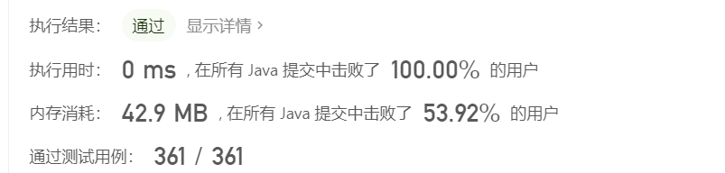

### [买卖股票的最佳时机II](https://leetcode-cn.com/leetbook/read/top-interview-questions-easy/x2zsx1/)

给你一个整数数组 prices ，其中 prices[i] 表示某支股票第 i 天的价格。

在每一天，你可以决定是否购买和/或出售股票。你在任何时候 最多 只能持有 一股 股票。你也可以先购买，然后在 同一天 出售。

返回 你能获得的 最大 利润 。

 

**示例 1：**

```
输入：prices = [7,1,5,3,6,4]
输出：7
解释：在第 2 天（股票价格 = 1）的时候买入，在第 3 天（股票价格 = 5）的时候卖出, 这笔交易所能获得利润 = 5 - 1 = 4 。
     随后，在第 4 天（股票价格 = 3）的时候买入，在第 5 天（股票价格 = 6）的时候卖出, 这笔交易所能获得利润 = 6 - 3 = 3 。
     总利润为 4 + 3 = 7 。
```

**示例 2：**

```
输入：prices = [1,2,3,4,5]
输出：4
解释：在第 1 天（股票价格 = 1）的时候买入，在第 5 天 （股票价格 = 5）的时候卖出, 这笔交易所能获得利润 = 5 - 1 = 4 。
     总利润为 4 。
```

**示例 3：**

```
输入：prices = [7,6,4,3,1]
输出：0
解释：在这种情况下, 交易无法获得正利润，所以不参与交易可以获得最大利润，最大利润为 0 。
```

**提示：**

- `1 <= prices.length <= 3 * 104`
- `0 <= prices[i] <= 104`

**相关标签**

- 贪心
- 数组
- 动态规划

**题解**

如下图是表示的一个股票价格上涨曲线，要计算这段时间内股票的最大利润，可以直接将股票所有上涨时间段内的利润累加起来就得到了


```java
class Solution {
    public int maxProfit(int[] prices) {
        int len = prices.length, ans = 0;

        for (int i = 1; i < len; i++) {
            ans += Math.max(prices[i] - prices[i-1], 0);
        }
        return ans;
        
    }
}
```

* 时间复杂度：$O(n)$
* 空间复杂度：$O(1)$

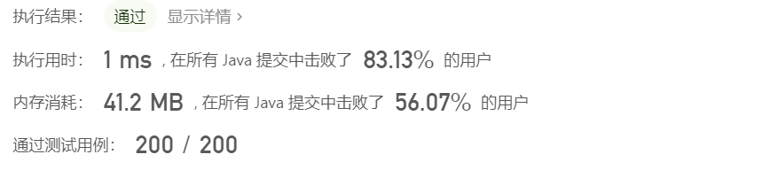

### [旋转数组](https://leetcode-cn.com/leetbook/read/top-interview-questions-easy/x2skh7/)

给你一个数组，将数组中的元素向右轮转 k 个位置，其中 k 是非负数。

 

**示例 1:**

```
输入: nums = [1,2,3,4,5,6,7], k = 3
输出: [5,6,7,1,2,3,4]
解释:
向右轮转 1 步: [7,1,2,3,4,5,6]
向右轮转 2 步: [6,7,1,2,3,4,5]
向右轮转 3 步: [5,6,7,1,2,3,4]
```

**示例 2:**

```
输入：nums = [-1,-100,3,99], k = 2
输出：[3,99,-1,-100]
解释: 
向右轮转 1 步: [99,-1,-100,3]
向右轮转 2 步: [3,99,-1,-100]
```

**提示：**

- `1 <= nums.length <= 105`
- `-231 <= nums[i] <= 231 - 1`
- `0 <= k <= 105`

**进阶：**

- 尽可能想出更多的解决方案，至少有 三种 不同的方法可以解决这个问题。
- 你可以使用空间复杂度为` O(1) `的 原地 算法解决这个问题吗？

**题解**

可以转换一下思路：

* 首先将整个数组进行反转
* 然后将数组`[0, k-1]`位置的元素进行反转
* 最后将剩下的`[k, length - 1]`位置的元素进行反转

```java
class Solution {
    public void rotate(int[] nums, int k) {
        int len = nums.length;
        k %= len;
        if (len<=1)
            return ;
        reverse(nums, 0, len-1);
        reverse(nums,0, k-1);
        reverse(nums, k, len-1);
    }

    public void reverse(int[] nums, int start, int end) {
        int left = start, right = end;
        while(left < right) {
            int temp = nums[left];
            nums[left] = nums[right];
            nums[right] = temp;
            ++left;
            --right;
        }
    }
}
```

* 时间复杂度：$O(n)$
* 空间复杂度：$O(1)$

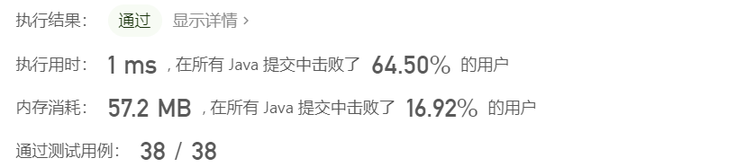

### [存在重复元素](https://leetcode-cn.com/leetbook/read/top-interview-questions-easy/x248f5/)

给你一个整数数组 nums 。如果任一值在数组中出现 至少两次 ，返回 true ；如果数组中每个元素互不相同，返回 false 。

**示例 1：**

```
输入：nums = [1,2,3,1]
输出：true
```

**示例 2：**

```
输入：nums = [1,2,3,4]
输出：false
```

**示例 3：**

```
输入：nums = [1,1,1,3,3,4,3,2,4,2]
输出：true
```

**提示：**

- `1 <= nums.length <= 105`
- `-109 <= nums[i] <= 109`

**相关标签**

- 数组
- 哈希表
- 排序

**题解**

**HashSet实现**

将元素添加到`HashSet`中，如果无法添加说明已经存在，直接返回`true`，如果数组遍历结束那么返回`false`

```java
class Solution {
    public boolean containsDuplicate(int[] nums) {
        Set<Integer> set = new HashSet<>();
        for (int num: nums) {
            if (!set.add(num))
                return true;
        }
        return false;
    }
}
```

* 时间复杂度：$O(n)$
* 空间复杂度：$O(1)$

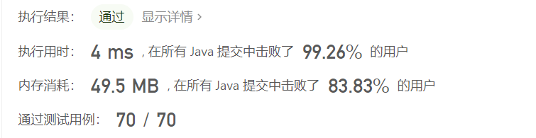

**先排序然后比较两个相邻的元素**

排序原数组，相同的元素必定相邻，判断相邻的元素是否相等，如果相等返回`true`，所有元素遍历之后都不相等，返回`false`

```java
class Solution {
    public boolean containsDuplicate(int[] nums) {
        Arrays.sort(nums);
        for (int i = 1; i < nums.length; i++) {
            if (nums[i] == nums[i - 1])
                return true;
        }
        return false;
    }
}
```

* 时间复杂度：$O(n)$
* 空间复杂度：$O(1)$

主要还是排序的时间开销过大导致的执行时间太高，这样对比还是利用`HashSet`更为高效

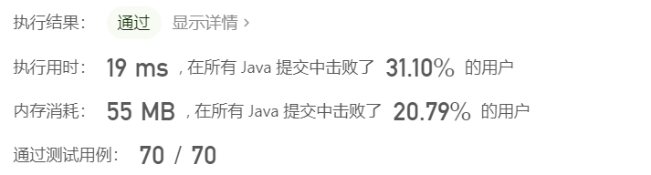

### [只出现一次的数字](https://leetcode-cn.com/leetbook/read/top-interview-questions-easy/x21ib6/)

给定一个非空整数数组，除了某个元素只出现一次以外，其余每个元素均出现两次。找出那个只出现了一次的元素。

**说明：**

你的算法应该具有线性时间复杂度。 你可以不使用额外空间来实现吗？

**示例 1:**

```
输入: [2,2,1]
输出: 1
```

示例 2:

```
输入: [4,1,2,1,2]
输出: 4
```

**相关标签**

- 位运算
- 数组

**题解**

所有的元素都出现两次，相同的元素异或为0，剩下的只出现一次的元素和0异或的结果还是其本身

```java
class Solution {
    public int singleNumber(int[] nums) {
        int res = 0;
        for (int num : nums)
            res ^= num;
        return res;
    }
}
```

* 时间复杂度：$O(n)$
* 空间复杂度：$O(1)$

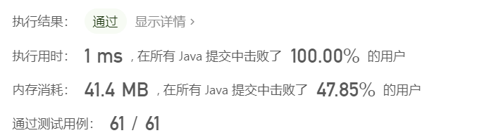

### [两个数组的交集 II](https://leetcode-cn.com/leetbook/read/top-interview-questions-easy/x2y0c2/)

给你两个整数数组 `nums1 `和 `nums2 `，请你以数组形式返回两数组的交集。返回结果中每个元素出现的次数，应与元素在两个数组中都出现的次数一致（如果出现次数不一致，则考虑取较小值）。可以不考虑输出结果的顺序。

 

**示例 1：**

```
输入：nums1 = [1,2,2,1], nums2 = [2,2]
输出：[2,2]
```

**示例 2:**

```
输入：nums1 = [4,9,5], nums2 = [9,4,9,8,4]
输出：[4,9]
```

**提示：**

- `1 <= nums1.length, nums2.length <= 1000`
- `0 <= nums1[i], nums2[i] <= 1000`

**进阶：**

- 如果给定的数组已经排好序呢？你将如何优化你的算法？

- 如果 nums1 的大小比 nums2 小，哪种方法更优？
- 如果 nums2 的元素存储在磁盘上，内存是有限的，并且你不能一次加载所有的元素到内存中，你该怎么办？

**题解**

首先对两个数组进行排序，然后设置两个指针分别指向排序后数组开头，在两个指针都分别不超过数组的情况下，比较两个指针指向元素的大小

* 如果相等，添加到结果数组中，两个指针都自增1
* 如果不等，指向元素小的指针自增

最后将保存结果的列表转换为数组输出

```java
class Solution {
    public int[] intersect(int[] nums1, int[] nums2) {
        Arrays.sort(nums1);
        Arrays.sort(nums2);
        int len1 = nums1.length, len2 = nums2.length;
        int index1 = 0, index2 = 0;
        List<Integer> ans = new ArrayList<>();
        while (index1 < len1 && index2 < len2) {
            if (nums1[index1] < nums2[index2])
                index1++;
            else if (nums1[index1] > nums2[index2])
                index2++;
            else {
                ans.add(nums1[index1]);
                index1++;
                index2++;
            }
        }

        int[] res = new int[ans.size()];
        for (int i = 0; i < ans.size(); i++) {
            res[i] = ans.get(i);
        }
        return res;
    }
}
```

* 时间复杂度：$O(n)$
* 空间复杂度：$O(1)$

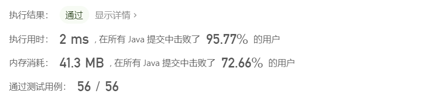

### [加一](https://leetcode-cn.com/leetbook/read/top-interview-questions-easy/x2cv1c/)

给定一个由 **整数** 组成的 **非空** 数组所表示的非负整数，在该数的基础上加一。

最高位数字存放在数组的首位， 数组中每个元素只存储**单个**数字。

你可以假设除了整数 0 之外，这个整数不会以零开头。

 

**示例 1：**

```
输入：digits = [1,2,3]
输出：[1,2,4]
解释：输入数组表示数字 123。
```

**示例 2：**

```
输入：digits = [4,3,2,1]
输出：[4,3,2,2]
解释：输入数组表示数字 4321。
```

**示例 3：**

```
输入：digits = [0]
输出：[1]
```

**提示：**

- `1 <= digits.length <= 100`
- `0 <= digits[i] <= 9`

**题解**

这道题就是模拟加法进位，注意的是在执行加法进位的时候，需要从最后一位开始计算

* 如果有进位，那么当前位结果必定为`0`，进位为`1`
* 没有进位，就将当前结果和上一次的进位相加保存

因为可能会出现进位后数位加一的情况，所以暂存结果可以用`List`来保存，然后**逆序**输出结果至`int`数组中

```java
class Solution {
    public int[] plusOne(int[] digits) {
        int carry = 1;
        List<Integer> res = new ArrayList<>();
        for (int i = digits.length-1; i >= 0; i--) {
            if (digits[i] + carry > 9) {
                carry = 1;
                res.add(0);
            }else {
                res.add(digits[i] + carry);
                carry = 0;
            }
        }
        if (carry != 0)
            res.add(carry);
        int[] ans = new int[res.size()];
        for (int i=res.size()-1; i>=0; i--)
            ans[res.size() - 1 - i] = res.get(i); 
        return ans;
    }
}
```

* 时间复杂度：$O(n)$
* 空间复杂度：$O(n)$

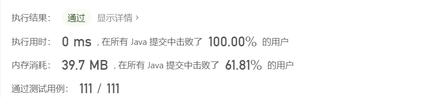

### [移动零](https://leetcode-cn.com/leetbook/read/top-interview-questions-easy/x2ba4i/)

给定一个数组 nums，编写一个函数将所有 0 移动到数组的末尾，同时保持非零元素的相对顺序。

请注意 ，必须在不复制数组的情况下原地对数组进行操作。

 

**示例 1:**

```
输入: nums = [0,1,0,3,12]
输出: [1,3,12,0,0]
```

**示例 2:**

```
输入: nums = [0]
输出: [0]
```


提示:

- `1 <= nums.length <= 104`
- `-231 <= nums[i] <= 231 - 1`

**进阶：**你能尽量减少完成的操作次数吗？

**题解**

设置一个指针`index`保存不为0的元素，然后遍历数组中的所有元素，将其保存到`index`位置，然后`index++`，最后将`index, nums.length-1`位置的数组全部改为0

```java
class Solution {
    public void moveZeroes(int[] nums) {
        int n = nums.length;
        if (n < 1)
            return ;
        int left = 0, right = 1;
        while (right < n && left < n) {
            while(left < n && nums[left] != 0)
                left++;
            right = left + 1;
            while(right < n && nums[right] == 0)
                right++;
            if (right >= n)
                return ;
            int temp = nums[left];
            nums[left] = nums[right];
            nums[right] = temp;
            left++;
        }
        
    }
}
```

* 时间复杂度：$O(n)$
* 空间复杂度：$O(1)$

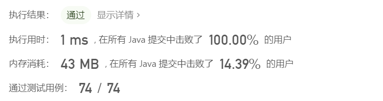

### [两数之和](https://leetcode-cn.com/leetbook/read/top-interview-questions-easy/x2jrse/)

给定一个整数数组 `nums` 和一个整数目标值 `target`，请你在该数组中找出 **和为目标值** `target  `的那 **两个** 整数，并返回它们的数组下标。

你可以假设每种输入只会对应一个答案。但是，数组中同一个元素在答案里不能重复出现。

你可以按任意顺序返回答案。

 

**示例 1：**

```
输入：nums = [2,7,11,15], target = 9
输出：[0,1]
解释：因为 nums[0] + nums[1] == 9 ，返回 [0, 1] 。
```

**示例 2：**

```
输入：nums = [3,2,4], target = 6
输出：[1,2]
```

**示例 3：**

```
输入：nums = [3,3], target = 6
输出：[0,1]
```

**提示：**

- `2 <= nums.length <= 104`
- `-109 <= nums[i] <= 109`
- `-109 <= target <= 109`
- **只会存在一个有效答案**

**进阶：**你可以想出一个时间复杂度小于 O(n2) 的算法吗？

**题解**

**HashMap法**

首先遍历一遍数组，将对应的差值和索引保存在`HashMap`中，然后再次遍历`HashMap`，如果有数组元素在`HashMap`中，取出`HashMap`中的元素以及当前遍历索引，返回结果

```java
class Solution {
    public int[] twoSum(int[] nums, int target) {
        int n = nums.length;
        int[] res = new int[2];
        Map<Integer, Integer> map = new HashMap<>();
        for (int i = 0; i < n; i++) {
            map.put(target-nums[i], i);
        }

        for (int i = 0; i < n; i++) {
            int temp = map.getOrDefault(nums[i], -1);
            if (temp != -1 && temp != i) {
                res[0] = temp;
                res[1] = i;
                break;
            }
        }

        return res;
    }
}
```

* 时间复杂度：$O(2n)$ 包括两次数组遍历
* 空间复杂度：$O(n)$ 主要是`HashMap`空间

**一次遍历**

可以通过一次遍历获取结果，可以看做前半部分的遍历是获取其中一般元素，后一半的遍历就是查看`HashMap`中是否存在和当前元素和为`target`的元素

```java
class Solution {
    public int[] twoSum(int[] nums, int target) {
        int n = nums.length;
        Map<Integer, Integer> map = new HashMap<>();
        for (int i = 0; i < n; i++) {
            if (map.get(target - nums[i]) != null)
                return new int[]{i, map.get(target-nums[i])};
            map.put(nums[i], i);
        }
        return new int[]{0, 0};
    }
}
```

* 时间复杂度：$O(n)$
* 空间复杂度：$O(1)$

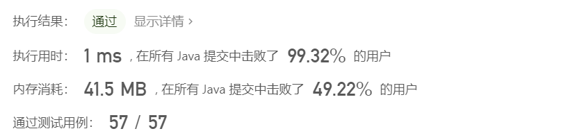

### [有效的数独](https://leetcode-cn.com/leetbook/read/top-interview-questions-easy/x2f9gg/)

请你判断一个 9 x 9 的数独是否有效。只需要 根据以下规则 ，验证已经填入的数字是否有效即可。

- 数字 1-9 在每一行只能出现一次。

- 数字 1-9 在每一列只能出现一次。
- 数字 1-9 在每一个以粗实线分隔的 3x3 宫内只能出现一次。（请参考示例图）

**注意：**

- 一个有效的数独（部分已被填充）不一定是可解的。

- 只需要根据以上规则，验证已经填入的数字是否有效即可。
- 空白格用 '.' 表示。

示例 1：

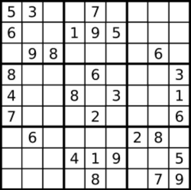

```
输入：board = 
[["5","3",".",".","7",".",".",".","."]
,["6",".",".","1","9","5",".",".","."]
,[".","9","8",".",".",".",".","6","."]
,["8",".",".",".","6",".",".",".","3"]
,["4",".",".","8",".","3",".",".","1"]
,["7",".",".",".","2",".",".",".","6"]
,[".","6",".",".",".",".","2","8","."]
,[".",".",".","4","1","9",".",".","5"]
,[".",".",".",".","8",".",".","7","9"]]
输出：true
```

**示例 2：**

```
输入：board = 
[["8","3",".",".","7",".",".",".","."]
,["6",".",".","1","9","5",".",".","."]
,[".","9","8",".",".",".",".","6","."]
,["8",".",".",".","6",".",".",".","3"]
,["4",".",".","8",".","3",".",".","1"]
,["7",".",".",".","2",".",".",".","6"]
,[".","6",".",".",".",".","2","8","."]
,[".",".",".","4","1","9",".",".","5"]
,[".",".",".",".","8",".",".","7","9"]]
输出：false
解释：除了第一行的第一个数字从 5 改为 8 以外，空格内其他数字均与 示例1 相同。 但由于位于左上角的 3x3 宫内有两个 8 存在, 因此这个数独是无效的。
```


提示：

- `board.length == 9`
- `board[i].length == 9`
- `board[i][j] 是一位数字（1-9）或者 '.'`


**题解**

表格固定形状大小为`9 x 9`，需要查看每一行，每一列，以及`3 x 3` 大小表格是否有相同元素，可以设定3个2维数组分别表示对应行、列以及小网格内`0-9`是否存在，如果有任意一个出现重复元素则返回`false`，遍历结束返回`true`

```java
class Solution {
    public boolean isValidSudoku(char[][] board) {
        int n = board.length, m = board[0].length;
        int[][] row = new int[n][10], col = new int[m][10], cell = new int[9][10];
        for (int i = 0; i < n; i++) {
            for (int j = 0; j < m; j++) {
                if (board[i][j] == '.')
                    continue;
                int num = board[i][j] - '0';
                int k = (i/3) * 3 + (j/3);
                if (row[i][num] == 1 || col[j][num] == 1 || cell[k][num] == 1)
                    return false;
                row[i][num] = col[j][num] = cell[k][num] = 1;
            }
        }
        return true;
    }
}
```

* 时间复杂度：$O(n^2)$
* 空间复杂度：$O(10 \cdot n)$ 主要是三个二维数组

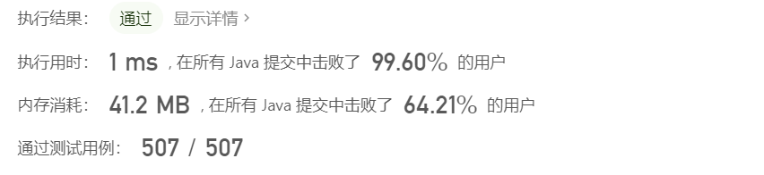

### [旋转图像](https://leetcode-cn.com/leetbook/read/top-interview-questions-easy/xnhhkv/)

给定一个` n × n` 的二维矩阵 `matrix `表示一个图像。请你将图像顺时针旋转 90 度。

你必须在 原地 旋转图像，这意味着你需要直接修改输入的二维矩阵。**请不要** 使用另一个矩阵来旋转图像。

 

示例 1：


```
输入：matrix = [[1,2,3],[4,5,6],[7,8,9]]
输出：[[7,4,1],[8,5,2],[9,6,3]]
```

**示例 2：**


```
输入：matrix = [[5,1,9,11],[2,4,8,10],[13,3,6,7],[15,14,12,16]]
输出：[[15,13,2,5],[14,3,4,1],[12,6,8,9],[16,7,10,11]]
```

**提示：**

- `n == matrix.length == matrix[i].length`
- `1 <= n <= 20`
- `-1000 <= matrix[i][j] <= 1000`

**题解**

如下图所示

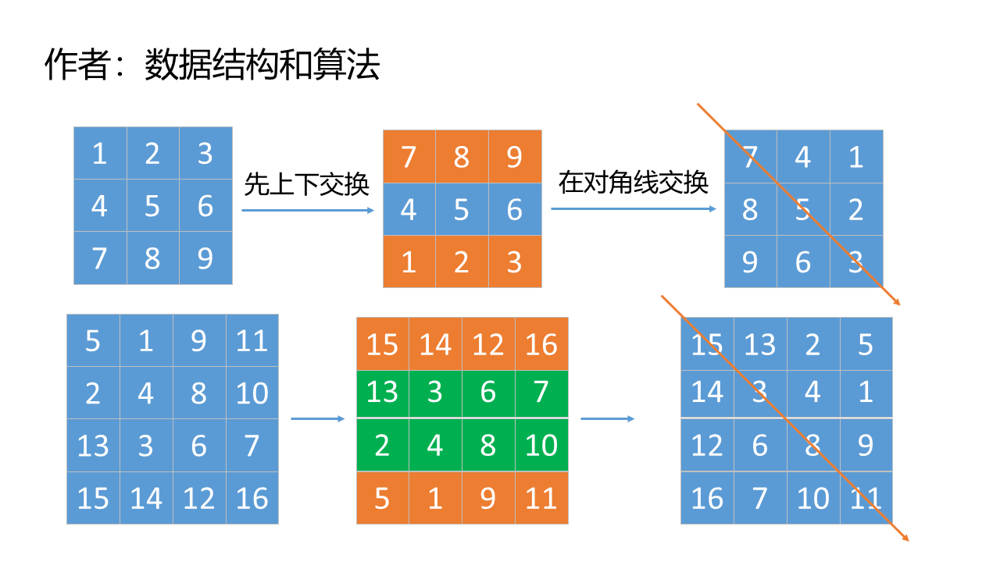

```java
class Solution {
    public void rotate(int[][] matrix) {
        int n = matrix.length;

        for (int i = 0; i < n / 2; i++) {
            for (int j = 0; j < n; j++) {
                int temp = matrix[i][j];
                matrix[i][j] = matrix[n-1-i][j];
                matrix[n-1-i][j] = temp;
            }
        }

        for (int i = 0; i < n; i++) {
            for (int j = 0; j < i; j++) {
                int temp = matrix[i][j];
                matrix[i][j] = matrix[j][i];
                matrix[j][i] = temp;
            }
        }

    }
}
```

* 时间复杂度：$O(n^2)$
* 空间复杂度：$O(1)$


## 字符串


### [反转字符串](https://leetcode-cn.com/leetbook/read/top-interview-questions-easy/xnhbqj/)

编写一个函数，其作用是将输入的字符串反转过来。输入字符串以字符数组 s 的形式给出。

不要给另外的数组分配额外的空间，你必须**原地修改输入数组**、使用` O(1) `的额外空间解决这一问题。

 

示例 1：

```
输入：s = ["h","e","l","l","o"]
输出：["o","l","l","e","h"]
```

示例 2：

```
输入：s = ["H","a","n","n","a","h"]
输出：["h","a","n","n","a","H"]
```


提示：

- `1 <= s.length <= 105`
- `s[i]` 都是 `ASCII `码表中的可打印字符

**题解**

设置两个指针：左指针，右指针，分别指向字符串数组的开头和结尾，交换两个指针指向的字符，然后两个指针同时向中间移动，移动一次交换一次指向的字符，直到两个指针相遇

```java
class Solution {
    public void reverseString(char[] s) {
        int left = 0, right = s.length - 1;
        while (left < right) {
            char temp = s[left];
            s[left] = s[right];
            s[right] = temp;
            ++left;
            --right;
        }
    }
}
```

* 时间复杂度：$O(n)$
* 空间复杂度：$O(1)$

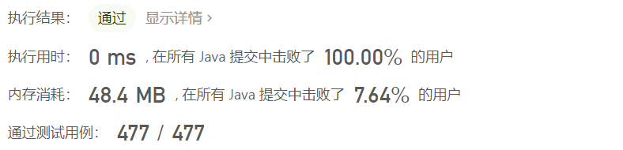

### [整数反转](https://leetcode-cn.com/leetbook/read/top-interview-questions-easy/xnx13t/)

给你一个 32 位的有符号整数 `x `，返回将 `x` 中的数字部分反转后的结果。

如果反转后整数超过 32 位的有符号整数的范围` [−231,  231 − 1] `，就返回 0。

**假设环境不允许存储 64 位整数（有符号或无符号）。**

**示例 1：**

```
输入：x = 123
输出：321
```

**示例 2：**

```
输入：x = -123
输出：-321
```

**示例 3：**

```
输入：x = 120
输出：21
```

**示例 4：**

```
输入：x = 0
输出：0
```

**提示：**

- `-231 <= x <= 231 - 1`

**题解**

**使用java API来实现**

时间开销很大，空间开销也很大，具体的思路是：

* 记录数字符号，并将数字绝对化
* 然后将数字转换为字符串，然后再转换为字符串数组
* 将字符串数组进行反转
* 然后将字符串数组转换为字符串
* 然后将字符串根据符号和对应最大数字字符串进行比较，如果大于，返回0，不大于就转换为数字返回

```java
class Solution {
    String max_str = String.valueOf(Integer.MAX_VALUE);
    public int reverse(int x) {

        boolean sign = true;
        if (x < 0) {
            x = -x;
            sign = false;
        }
        String temp = String.valueOf(x);
        char[] s = temp.toCharArray();
        if (s.length > 10)
            return 0;
        reverseString(s);
        String res = String.valueOf(s);
        if (s.length == 10 && (sign ? res.compareTo(max_str) >= 0 : res.compareTo(max_str) >= 1))
            return 0;
        int ans = Integer.parseInt(res);

        return sign ? ans : -ans;
    }

    public void reverseString(char[] s) {
        int left = 0, right = s.length - 1;
        while (left < right) {
            char temp = s[left];
            s[left] = s[right];
            s[right] = temp;
            ++left;
            --right;
        }
    }
}
```

* 时间复杂度：$O(log10(x))$ 时间复杂度和输入数字的位数成线性关系
* 空间复杂度：$O(log10(x))$ 空间复杂度也主要和输入数字的位数

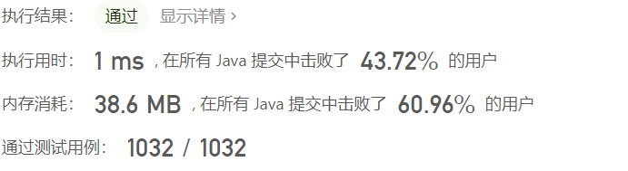

**直接利用long**

使用`long`暂存中间值，从`x`的个位开始反向保存，最后将中间值转换为`int`比较是否和中间值相等，如果相等，则直接返回转换为`int`的值，否则返回0

```java
class Solution {
    public int reverse(int x) {
        long res = 0;
        while (x != 0) {
            res = res * 10 + x % 10;
            x /= 10;
        }
        return (int)res == res ? (int)res : 0;
    }
}
```

* 时间复杂度：$O(log10(x))$ 时间复杂度和输入数字的位数成线性关系
* 空间复杂度：$O(log10(x))$ 空间复杂度也主要和输入数字的位数

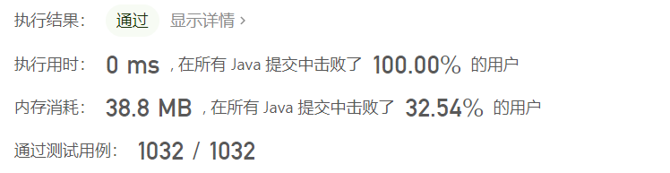

### [字符串中的第一个唯一字符](https://leetcode-cn.com/leetbook/read/top-interview-questions-easy/xn5z8r/)

给定一个字符串 `s` ，找到 **它的第一个不重复的字符，并返回它的索引** 。如果不存在，则返回 `-1` 。

 

**示例 1：**

```
输入: s = "leetcode"
输出: 0
```

**示例 2:**

```
输入: s = "loveleetcode"
输出: 2
```

**示例 3:**

```
输入: s = "aabb"
输出: -1
```

**提示:**

- `1 <= s.length <= 105`
- `s `只包含小写字母

**题解**

**数组作为set**

设置一个26长度的数组，分别保存小写字母出现的次数，首先遍历一次字符串，将对应字符出现的次数填写该数组中，然后再次遍历该数组，获取第一次出现次数为1的字符，返回当前索引，不存在就返回`-1`

```java
class Solution {
    public int firstUniqChar(String s) {
        int[] set = new int[26];
        char[] sarr = s.toCharArray();
        int len = sarr.length;
        for (int i = 0; i < len; i++) {
            int ch = sarr[i] - 'a';
            ++set[ch];
        }

        for (int i = 0; i < len; i++) {
            int ch = sarr[i] - 'a';
            if (set[ch] == 1)
                return i;
        }
        return -1;
    }
}
```

* 时间复杂度：$O(n)$
* 空间复杂度：$O(26)$

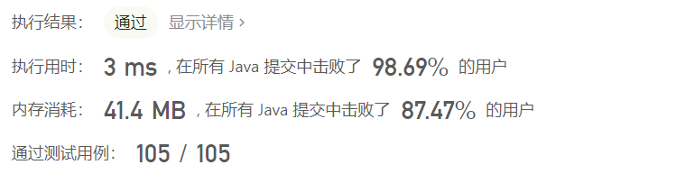

**可以使用string api实现**

```java
class Solution {
    public int firstUniqChar(String s) {
        for (int i = 0; i < s.length(); i++) {
            if (s.indexOf(s.charAt(i)) == s.lastIndexOf(s.charAt(i)))
                return i;
        }
        return -1;
    }
}
```

* 时间复杂度：$O(n)$
* 空间复杂度：$O()$

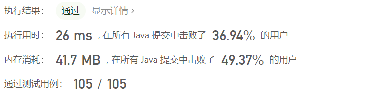


### [有效的字母异位词](https://leetcode-cn.com/leetbook/read/top-interview-questions-easy/xn96us/)

给定两个字符串 `s `和 `t` ，编写一个函数来判断 `t `是否是 `s` 的字母异位词。

**注意：**若 `s` 和` t` 中每个字符出现的次数都相同，则称 `s` 和 `t `互为字母异位词。

 

**示例 1:**

```
输入: s = "anagram", t = "nagaram"
输出: true
```

**示例 2:**

```
输入: s = "rat", t = "car"
输出: false
```

**提示:**

- `1 <= s.length, t.length <= 5 * 104`
- `s `和 `t` 仅包含小写字母

**进阶:** 如果输入字符串包含 unicode 字符怎么办？你能否调整你的解法来应对这种情况？

**题解**

首先比较两个字符串长度是否相同，不同返回`false`

使用26长度的数组保存字符串中字符出现的次数，首先遍历第一个字符串保存其字符出现次数，然后遍历第二个字符串，如果遍历过程中出现数组小于0，返回`false`，遍历结束之后返回`true`

```java
class Solution {
    public boolean isAnagram(String s, String t) {
        if (s.length() != t.length())
            return false;

        int[] set = new int[26];

        char[] cs = s.toCharArray(), ct = t.toCharArray();
        int len = cs.length;
        for (int i = 0; i < len; i++)
            set[cs[i] - 'a']++;
        
        for (int i = 0; i < len; i++) {
            int temp = ct[i] - 'a';
            if (--set[temp] < 0)
                return false;
        }
        return true;
    }
}
```

* 时间复杂度：$O(n)$
* 空间复杂度：$O(26)$

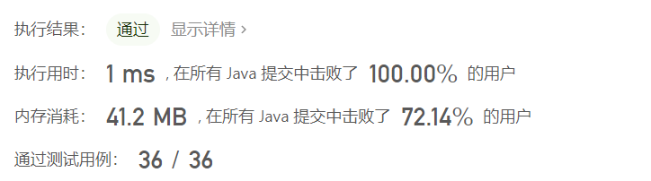

> 测试发现，对于字符串遍历，先转换为`char[]`数组遍历效率比直接遍历`string`要快很多

### [验证回文串](https://leetcode-cn.com/leetbook/read/top-interview-questions-easy/xne8id/)

给定一个字符串，验证它是否是回文串，只考虑字母和数字字符，可以忽略字母的大小写。

**说明：**本题中，我们将空字符串定义为有效的回文串。

 

**示例 1:**

```
输入: "A man, a plan, a canal: Panama"
输出: true
解释："amanaplanacanalpanama" 是回文串
```

**示例 2:**

```
输入: "race a car"
输出: false
解释："raceacar" 不是回文串
```

**提示：**

- `1 <= s.length <= 2 * 105`
- 字符串 `s` 由 ASCII 字符组成

**题解**

使用双指针分别指向字符串开头和结尾，如果不属于字母或者数字就跳过，然后比较两个指针指向的字符是否相等，不等则返回`false`，两个指针相遇返回`true`

注意大小写转换

```java
class Solution {
    public boolean isPalindrome(String s) {
        int len = s.length();
        char[] cs = s.toCharArray();

        int left = 0, right = len - 1;
        while(left < right) {
            while(left < right && !isLegal(cs[left]))
                ++left;
            while(left < right && !isLegal(cs[right]))
                --right;

            if (isUpper(cs[left]))
                cs[left] = toLowerCase(cs[left]);
            if (isUpper(cs[right]))
                cs[right] = toLowerCase(cs[right]);
            if (cs[left] != cs[right])
                return false;
            ++left;
            --right;
        }
        return true;
    }

    public boolean isLegal(char ch) {
        return (ch >= 'a' && ch <= 'z') || (ch >= 'A' && ch <= 'Z') || (ch >= '0' && ch <= '9');
    }

    public boolean isUpper(char ch) {
        return ch >= 'A' && ch <= 'Z';
    }

    public char toLowerCase(char ch) {
        return (char) ((int)ch+32);
    }
}
```

* 时间复杂度：$O(n)$
* 空间复杂度：$O(n)$

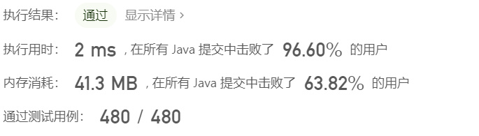

**使用Java自带api**

使用api简化代码

```java
class Solution {
    public boolean isPalindrome(String s) {
        int len = s.length();
        char[] cs = s.toCharArray();

        int left = 0, right = len - 1;
        while(left < right) {
            while(left < right && !Character.isLetterOrDigit(cs[left]))
                ++left;
            while(left < right && !Character.isLetterOrDigit(cs[right]))
                --right;


            if (Character.toLowerCase(cs[left]) != Character.toLowerCase(cs[right]))
                return false;
            ++left;
            --right;
        }
        return true;
    }
}
```

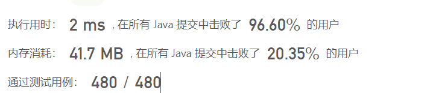

### [字符串转换整数 (atoi)](https://leetcode-cn.com/leetbook/read/top-interview-questions-easy/xnoilh/)

请你来实现一个` myAtoi(string s) `函数，使其能将字符串转换成一个 32 位有符号整数（类似 C/C++ 中的 atoi 函数）。

函数 `myAtoi(string s) `的算法如下：

- 读入字符串并丢弃无用的前导空格

- 检查下一个字符（假设还未到字符末尾）为正还是负号，读取该字符（如果有）。 确定最终结果是负数还是正数。 如果两者都不存在，则假定结果为正。
- 读入下一个字符，直到到达下一个非数字字符或到达输入的结尾。字符串的其余部分将被忽略。
- 将前面步骤读入的这些数字转换为整数（即，"123" -> 123， "0032" -> 32）。如果没有读入数字，则整数为` 0` 。必要时更改符号（从步骤 2 开始）。
- 如果整数数超过 32 位有符号整数范围` [−231,  231 − 1] `，需要截断这个整数，使其保持在这个范围内。具体来说，小于$ −2^{31}$ 的整数应该被固定为$ −2^{31}$ ，大于 $2^{31} − 1 $的整数应该被固定为$2^{31} − 1$ 。
- 返回整数作为最终结果。

**注意：**

- 本题中的空白字符只包括空格字符 ' ' 。
- 除前导空格或数字后的其余字符串外，请勿忽略 任何其他字符。

**示例 1：**

```
输入：s = "42"
输出：42
解释：加粗的字符串为已经读入的字符，插入符号是当前读取的字符。
第 1 步："42"（当前没有读入字符，因为没有前导空格）
         ^
第 2 步："42"（当前没有读入字符，因为这里不存在 '-' 或者 '+'）
         ^
第 3 步："42"（读入 "42"）
           ^
解析得到整数 42 。
由于 "42" 在范围 [-231, 231 - 1] 内，最终结果为 42 。
```

**示例 2：**

```
输入：s = "   -42"
输出：-42
解释：
第 1 步："   -42"（读入前导空格，但忽视掉）
            ^
第 2 步："   -42"（读入 '-' 字符，所以结果应该是负数）
             ^
第 3 步："   -42"（读入 "42"）
               ^
解析得到整数 -42 。
由于 "-42" 在范围 [-231, 231 - 1] 内，最终结果为 -42 。
```

**示例 3：**

```
输入：s = "4193 with words"
输出：4193
解释：
第 1 步："4193 with words"（当前没有读入字符，因为没有前导空格）
         ^
第 2 步："4193 with words"（当前没有读入字符，因为这里不存在 '-' 或者 '+'）
         ^
第 3 步："4193 with words"（读入 "4193"；由于下一个字符不是一个数字，所以读入停止）
             ^
解析得到整数 4193 。
由于 "4193" 在范围 [-231, 231 - 1] 内，最终结果为 4193 。
```

**提示：**

- `0 <= s.length <= 200`
- `s `由英文字母（大写和小写）、数字（`0-9`）、`' '`、`'+'`、`'-'` 和 `'.' `组成

**题解**

可以分为以下三个步骤来解决

* 首先通过空格去除函数去除字符串中的空格
* 查看是否存在符号，如果存在，记录符号
* 然后读取剩余字符串中的数字，并组合为结果，在组合之前，判断是否可能出现越界，如果越界，输出最大或最小的可能值，如果没有越界，添加符号，输出组合后的值

为了方便组合，符号用`+1`和`-1`表示，并且为了提高运行速度，在去除空格之后将剩余的字符串转换为`char[]`类型

```java
class Solution {
    public int myAtoi(String s) {
        s = s.trim();
        if (s.length() == 0)
            return 0;

        char[] cs = s.toCharArray();
        int len = cs.length;
        int sign = 1;
        int index = 0;
        int res = 0;
        if (cs[index] == '-' || cs[index] == '+')
            sign = cs[index++] == '+' ? 1 : -1;

        while(index < len) {
            int digit = cs[index] - '0';
            if (digit < 0 || digit > 9)
                break;

            if (res > Integer.MAX_VALUE / 10 || (res == Integer.MAX_VALUE / 10 && digit > Integer.MAX_VALUE % 10))
                return sign == 1 ? Integer.MAX_VALUE : Integer.MIN_VALUE;
            else
                res = res * 10 + digit;
            ++index;
        }
        return sign * res;

    }
}
```

* 时间复杂度：$O(n)$
* 空间复杂度：$O(n)$

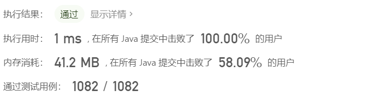

### [实现 strStr()](https://leetcode-cn.com/leetbook/read/top-interview-questions-easy/xnr003/)-==KMP算法==

实现` strStr() `函数。

给你两个字符串 `haystack `和 needle` `，请你在 `haystack `字符串中找出 needle` `字符串出现的第一个位置（下标从 0 开始）。如果不存在，则返回  -1 。

 

**说明：**

当 `needle `是空字符串时，我们应当返回什么值呢？这是一个在面试中很好的问题。

对于本题而言，当 `needle `是空字符串时我们应当返回 0 。这与 C 语言的` strstr() `以及 Java 的 `indexOf() `定义相符。

 

**示例 1：**

```
输入：haystack = "hello", needle = "ll"
输出：2
```

**示例 2：**

```
输入：haystack = "aaaaa", needle = "bba"
输出：-1
```

**示例 3：**

```
输入：haystack = "", needle = ""
输出：0
```

**提示：**

- `1 <= haystack.length, needle.length <= 104`
- `haystack `和 `needle `仅由小写英文字符组成

**题解**

可以使用kmp算法

```java
class Solution {
    public int strStr(String haystack, String needle) {
        if (needle.length() == 0)
            return 0;
        int i = 0;
        int j = 0;
        /**
         * 数组next表示pattern指定的下标前具有相同的字符串数量，语言组织能力不好，可能不是太好理解，我举个例子吧
         * ，比如ABCABA，数组next[0]是-1，这个是固定的，因为第一个A前面是没有字符的，next[1]是0，因为B的前面就一个A，没有
         * 重复的，所以是0,同理next[2]也是,next[3]也是0,而next[4]是1，因为next[4]所指向的是第二个B，第二个B前面有一个A和
         * 第一个A相同，所以是1,next[5]是2，因为next[5]所指向的是最后一个Ａ，因为前面的Ａ对比成功，并且Ｂ也对比成功，所以是２，
         * 也就是ＡＢ两个字符串匹配成功,再举个例子，比如WABCABA，数组除了第一个为-1，其他的都是为0，因为只有第一个匹配成功之后
         * 才能匹配后面的，虽然后面的AB和前面的AB匹配成功，但是后面AB的前面是C和前面AB的前面一个W不匹配，所以后面的匹配都是0.
         * 要记住只有指定字符前面的字符和第一个字符匹配成功的时候才能往后匹配，否则后面的永远都是先和第一个匹配。
         */
        int[] next = new int[needle.length()];
        getNext(needle, next);
        while (i < haystack.length() && j < needle.length()) {
            /**
             * 这里j等于-1的时候也只有在下面next数组赋值的时候才会出现，并且只有在数组next[0]的时候才会等于-1，
             其他时候是没有的，这一点要谨记，待会下面求next数组的时候就会用到。这里可以这样来理解，如果j不等于-1，
             并且下标i和j所指向的字符相等，那么i和j分别往后移一位继续比较，这个很好理解，那么如果j==-1的时候，就表示
             就表示前面没有匹配成功的，同时i往后移一位，j置为0（j==-1的时候，j++为0），再从0开始比较。
             */
            if (j == -1 || haystack.charAt(i) == needle.charAt(j)) {
                i++;
                j++;
            } else {
                /**
                 * i = i - j + 1;
                 j = 0;
                 返回到指定的位置，不是返回到匹配失败的下一个位置，这里都好理解，重点是求数组next。
                 这里只要j等于0，在next[j]赋值的之后，j就会等于-1；因为next[0]等于-1
                 */
                j = next[j]; // j回到指定位置
            }
            if (j == needle.length())
                return i - j;
        }
        return -1;
    }

    private void getNext(String p, int next[]) {
        int len = p.length();
        int i = 0;
        int j = -1;
        next[0] = -1;//这个默认的，
        /**
         * 匹配的时候是当前字符的前一个和前面的匹配，所以最后一个是不参与匹配的，可以看strStr方法的注释，
         */
        while (i < len - 1) {
            if (j == -1 || p.charAt(i) == p.charAt(j)) {
                /**
                 * 如果j不等于-1，指定的字符相等，那么i和j要往后移一位，这点很好理解，如果j为-1的时候，i往后移移位，j置为0
                 * 重新开始匹配。next[i]是匹配成功的数量
                 */
                i++;
                j++;
                next[i] = j;
            } else
            /**
             * 关键是这里不好理解，为什么匹配失败要让next[j]等于j，要记住这里的next[j]是指匹配成功的数量，有可能为0，也有可能是其他数.比如
             * 字符串ABCABXYABCABATDM,对应的next数组为{-1	0	0	0	1	2	0	0	1	2	3	4	5	1	0	0	}
             */
                j = next[j];
        }
    }

}
```

### [外观数列](https://leetcode-cn.com/leetbook/read/top-interview-questions-easy/xnpvdm/)

给定一个正整数 `n` ，输出外观数列的第 `n `项。

「外观数列」是一个整数序列，从数字 1 开始，序列中的每一项都是对前一项的描述。

你可以将其视作是由递归公式定义的数字字符串序列：

- `countAndSay(1) = "1"`
- `countAndSay(n) `是对 `countAndSay(n-1) `的描述，然后转换成另一个数字字符串。

前五项如下：

1.    ```
      1.     1
      2.     11
      3.     21
      4.     1211
      5.     111221
             第一项是数字 1 
             描述前一项，这个数是 1 即 “ 一 个 1 ”，记作 "11"
             描述前一项，这个数是 11 即 “ 二 个 1 ” ，记作 "21"
             描述前一项，这个数是 21 即 “ 一 个 2 + 一 个 1 ” ，记作 "1211"
             描述前一项，这个数是 1211 即 “ 一 个 1 + 一 个 2 + 二 个 1 ” ，记作 "111221"
      ```

要 描述 一个数字字符串，首先要将字符串分割为 最小 数量的组，每个组都由连续的最多 相同字符 组成。然后对于每个组，先描述字符的数量，然后描述字符，形成一个描述组。要将描述转换为数字字符串，先将每组中的字符数量用数字替换，再将所有描述组连接起来。

例如，数字字符串 "3322251" 的描述如下图：


**示例 1：**

```
输入：n = 1
输出："1"
解释：这是一个基本样例。
```

**示例 2：**

```
输入：n = 4
输出："1211"
解释：
countAndSay(1) = "1"
countAndSay(2) = 读 "1" = 一 个 1 = "11"
countAndSay(3) = 读 "11" = 二 个 1 = "21"
countAndSay(4) = 读 "21" = 一 个 2 + 一 个 1 = "12" + "11" = "1211"
```

**提示：**

- `1 <= n <= 30`


**题解**

使用递归处理，递归出口为`1`

```java
class Solution {
    public String countAndSay(int n) {
        if (n == 1) return "1";
        else {
            String lastStr = countAndSay(n - 1); // 1 2 1 1
            StringBuilder ans = new StringBuilder();
            int i = 0, j = 1, len = lastStr.length();
            while (j < len) {
                if (lastStr.charAt(i) != lastStr.charAt(j)) {
                    ans.append(j - i).append(lastStr.charAt(i));
                    i = j;
                }
                j++;
            }
            ans.append(j - i).append(lastStr.charAt(i));
            return ans.toString();
        }
    }
}
```

* 时间复杂度：$O(n^2)$
* 空间复杂度：$O(n)$

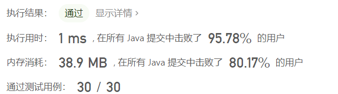

### [最长公共前缀](https://leetcode-cn.com/leetbook/read/top-interview-questions-easy/xnmav1/)

编写一个函数来查找字符串数组中的最长公共前缀。

如果不存在公共前缀，返回空字符串 ""。

 

**示例 1：**

```
输入：strs = ["flower","flow","flight"]
输出："fl"
```

**示例 2：**

```
输入：strs = ["dog","racecar","car"]
输出：""
解释：输入不存在公共前缀。
```

**提示：**

- `1 <= strs.length <= 200`
- `0 <= strs[i].length <= 200`
- `strs[i] `仅由小写英文字母组成

**题解**

使用第一个字符串作为模板，然后判断最长公共前缀，设置一个`resLen`记录当前最长公共前缀的长度，最后通过子串裁剪输出结果

```java
class Solution {
    public String longestCommonPrefix(String[] strs) {
        int len = strs.length;
        if (len < 2)
            return strs[0];

        int resLen = strs[0].length();
        char[] s1 = strs[0].toCharArray();
        for (int i = 1; i < len; i++) {
            char[] s2 = strs[i].toCharArray();
            resLen = Math.min(resLen, s2.length);
            for (int j = 0; j < resLen; j++) {
                if (s1[j] == s2[j])
                    continue;
                else {
                    resLen = j;
                    break;
                }
            }
        }
        String res = strs[0].substring(0, resLen);
        return res;
    }
}
```

* 时间复杂度：$O(n \times m)$
* 空间复杂度：$O(n \times m)$

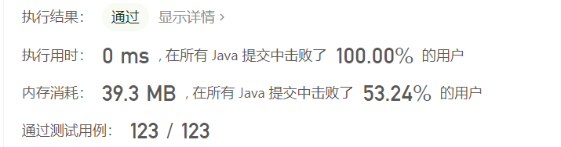

## 链表

* 链表中也常用**双指针解法**
* 可以添加一个头结点指针简化链表操作

### [删除链表中的节点](https://leetcode-cn.com/leetbook/read/top-interview-questions-easy/xnarn7/)

请编写一个函数，用于 **删除单链表中某个特定节点** 。在设计函数时需要注意，你无法访问链表的头节点 head ，只能直接访问 **要被删除的节点** 。

题目数据保证需要删除的节点 **不是末尾节点** 。

 

**示例 1：**


```
输入：head = [4,5,1,9], node = 5
输出：[4,1,9]
解释：指定链表中值为 5 的第二个节点，那么在调用了你的函数之后，该链表应变为 4 -> 1 -> 9
```

**示例 2：**


```
输入：head = [4,5,1,9], node = 1
输出：[4,5,9]
解释：指定链表中值为 1 的第三个节点，那么在调用了你的函数之后，该链表应变为 4 -> 5 -> 9
```

**提示：**

- 链表中节点的数目范围是` [2, 1000]`
- `-1000 <= Node.val <= 1000`
- 链表中每个节点的值都是 **唯一** 的
- 需要删除的节点 `node `是 **链表中的节点** ，且 **不是末尾节点**

**题解**

将要删除结点下一个结点的值覆盖到待删除结点，然后删除待删除节点的的下一个结点

```java
/**
 * Definition for singly-linked list.
 * public class ListNode {
 *     int val;
 *     ListNode next;
 *     ListNode(int x) { val = x; }
 * }
 */
class Solution {
    public void deleteNode(ListNode node) {
        node.val = node.next.val;
        node.next = node.next.next;
    }
}
```

* 时间复杂度：$O(1)$
* 空间复杂度：$O(1)$

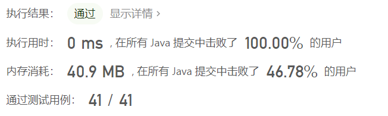

### [删除链表的倒数第N个节点](https://leetcode-cn.com/leetbook/read/top-interview-questions-easy/xn2925/)

给你一个链表，删除链表的倒数第` n` 个结点，并且返回链表的头结点。

 

**示例 1：**


```
输入：head = [1,2,3,4,5], n = 2
输出：[1,2,3,5]
```

**示例 2：**

```
输入：head = [1], n = 1
输出：[]
```

**示例 3：**

```
输入：head = [1,2], n = 1
输出：[1]
```

**提示：**

- 链表中结点的数目为 `sz`

- `1 <= sz <= 30`
- `0 <= Node.val <= 100`
- `1 <= n <= sz`

**进阶**：你能尝试使用一趟扫描实现吗？

**题解**

可以设置两个指针，一个快指针，一个慢指针，快指针提前`n`步移动，然后慢指针再移动，如果快指针移动到末尾，那么慢指针就指向要删除的结点，执行删除

注意如果快指针提前`n`步移动之后为`null`，说明`n`为当前链表长度，要删除的是头结点，可以直接返回`head.next`

```java
/**
 * Definition for singly-linked list.
 * public class ListNode {
 *     int val;
 *     ListNode next;
 *     ListNode() {}
 *     ListNode(int val) { this.val = val; }
 *     ListNode(int val, ListNode next) { this.val = val; this.next = next; }
 * }
 */
class Solution {
    public ListNode removeNthFromEnd(ListNode head, int n) {
        ListNode cur = head;
        while(n > 0) {
            cur = cur.next;
            --n;
        }
        if (cur == null) return head.next;
        ListNode pre = head;
        while (cur.next != null) {
            cur = cur.next;
            pre = pre.next;
        }
        pre.next = pre.next.next;
        return head;
    }
}
```

* 时间复杂度：$O(n)$
* 空间复杂度：$O(1)$

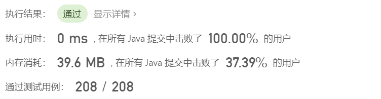

### [反转链表](https://leetcode-cn.com/leetbook/read/top-interview-questions-easy/xnnhm6/)

给你单链表的头节点` head` ，请你反转链表，并返回反转后的链表。

**示例 1：**


```
输入：head = [1,2,3,4,5]
输出：[5,4,3,2,1]
```

**示例 2：**


```
输入：head = [1,2]
输出：[2,1]
```

**示例 3：**

```
输入：head = []
输出：[]
```

**提示：**

- 链表中节点的数目范围是 [0, 5000]

- `-5000 <= Node.val <= 5000`

**进阶**：链表可以选用迭代或递归方式完成反转。你能否用两种方法解决这道题？

**题解**

可以使用一个辅助指针`pre`指向前一个结点的地址，然后反向修改`next`指向前一个结点的地址，之后将`pre`指针改为当前访问结点的地址，继续遍历下一个结点，直到所有结点都被遍历过结束

```java
/**
 * Definition for singly-linked list.
 * public class ListNode {
 *     int val;
 *     ListNode next;
 *     ListNode() {}
 *     ListNode(int val) { this.val = val; }
 *     ListNode(int val, ListNode next) { this.val = val; this.next = next; }
 * }
 */
class Solution {
    public ListNode reverseList(ListNode head) {
        ListNode pre = null;
        while(head != null) {
            ListNode temp = head.next;
            head.next = pre;
            pre = head;
            head = temp;
        }
        return pre;
    }
}
```

* 时间复杂度：$O(n)$
* 空间复杂度：$O(1)$

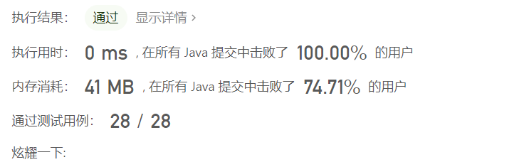

### [合并两个有序链表](https://leetcode-cn.com/leetbook/read/top-interview-questions-easy/xnnbp2/)

将两个升序链表合并为一个新的 **升序** 链表并返回。新链表是通过拼接给定的两个链表的所有节点组成的。 

 

**示例 1：**


```
输入：l1 = [1,2,4], l2 = [1,3,4]
输出：[1,1,2,3,4,4]
```

**示例 2：**

```
输入：l1 = [], l2 = []
输出：[]
```

**示例 3：**

```
输入：l1 = [], l2 = [0]
输出：[0]
```

**提示：**

- 两个链表的节点数目范围是` [0, 50]`

- `-100 <= Node.val <= 100`
- `l1 `和 `l2` 均按 非递减顺序 排列

**题解**

设置一个头结点`ans`方便操作，然后设置`cur`初始化等于`ans`，同时遍历两个链表开头的元素，小的元素插入到`ans`链表中，直到其中任意一个链表为空，然后将非空链表剩余部分再插入结果链表中

```java
/**
 * Definition for singly-linked list.
 * public class ListNode {
 *     int val;
 *     ListNode next;
 *     ListNode() {}
 *     ListNode(int val) { this.val = val; }
 *     ListNode(int val, ListNode next) { this.val = val; this.next = next; }
 * }
 */
class Solution {
    public ListNode mergeTwoLists(ListNode list1, ListNode list2) {
        ListNode ans = new ListNode();
        ListNode cur = ans;
        while(list1 != null && list2 != null) {
            if (list1.val < list2.val) {
                cur.next = list1;
                list1 = list1.next;
                cur = cur.next;
                cur.next = null;
            } else {
                cur.next = list2;
                list2 = list2.next;
                cur = cur.next;
                cur.next = null;
            }
        }

        if (list1 != null || list2 != null) {
            if (list1 != null) {
                cur.next = list1;
            } else {
                cur.next = list2;
            }
        }

        return ans.next;
    }
}
```

* 时间复杂度：$O(n+m)$
* 空间复杂度：$O(1)$

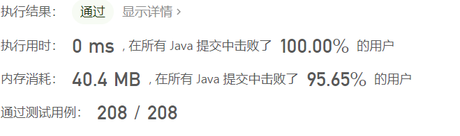

### [回文链表](https://leetcode-cn.com/leetbook/read/top-interview-questions-easy/xnv1oc/)

给你一个单链表的头节点 `head `，请你判断该链表是否为回文链表。如果是，返回 `true `；否则，返回 false` `。

 

**示例 1：**


```
输入：head = [1,2,2,1]
输出：true
```

**示例 2：**


```
输入：head = [1,2]
输出：false
```

**提示：**

- 链表中节点数目在范围$[1, 10^5] $内

- `0 <= Node.val <= 9`

**进阶：**你能否用 `O(n) `时间复杂度和` O(1)` 空间复杂度解决此题？

**题解**

首先找到链表的中间结点，然后反转中间结点开始之后的结点，之后比较反转之后的一半链表和前一半是否相同，不同返回`false`

```java
/**
 * Definition for singly-linked list.
 * public class ListNode {
 *     int val;
 *     ListNode next;
 *     ListNode() {}
 *     ListNode(int val) { this.val = val; }
 *     ListNode(int val, ListNode next) { this.val = val; this.next = next; }
 * }
 */
class Solution {
    public boolean isPalindrome(ListNode head) {
        if (head.next == null)
            return true;
        ListNode middle = findMiddle(head);
        middle = reverseList(middle);
        while(middle != null) {
            if (head.val != middle.val)
                return false;
            head = head.next;
            middle = middle.next;
        }
        return true;
    }

    public ListNode findMiddle(ListNode head) {
        ListNode fast = head, slow = head;
        while(fast != null && fast.next!=null && fast.next.next != null) {
            fast = fast.next.next;
            slow = slow.next;
        }
        return slow.next;
    }

    public ListNode reverseList(ListNode head) {
        ListNode pre = null;
        while(head != null) {
            ListNode temp = head.next;
            head.next = pre;
            pre = head;
            head = temp;
        }
        return pre;
    }
}
```

* 时间复杂度：$O(n)$
* 空间复杂度：$O(1)$

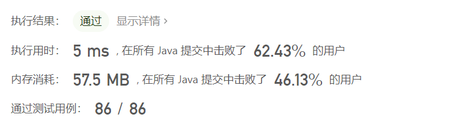

### [环形链表](https://leetcode-cn.com/leetbook/read/top-interview-questions-easy/xnwzei/)

给你一个链表的头节点 `head `，判断链表中是否有环。

如果链表中有某个节点，可以通过连续跟踪 next 指针再次到达，则链表中存在环。 为了表示给定链表中的环，评测系统内部使用整数 pos 来表示链表尾连接到链表中的位置（索引从 0 开始）。注意：`pos `不作为参数进行传递 。仅仅是为了标识链表的实际情况。

如果链表中存在环 ，则返回 `true `。 否则，返回 `false `。

 

**示例 1：**


```
输入：head = [3,2,0,-4], pos = 1
输出：true
解释：链表中有一个环，其尾部连接到第二个节点。
```

**示例 2：**


```
输入：head = [1,2], pos = 0
输出：true
解释：链表中有一个环，其尾部连接到第一个节点。
```

**示例 3：**


```
输入：head = [1], pos = -1
输出：false
解释：链表中没有环。
```

**提示：**

- 链表中节点的数目范围是` [0, 104]`

- `-105 <= Node.val <= 105`
- `pos` 为` -1 `或者链表中的一个 **有效索引** 。

**进阶：**你能用 `O(1)`（即，常量）内存解决此问题吗？

**题解**

设置两个指针，一个慢指针`slow`，一个快指针`fast`，其中`slow`从`head`开始，一个从`head.next`开始

`slow`指针一次移动一个节点，`fast`一次移动两个节点，如果`slow`节点追上`fast`节点说明链表中存在环，否则不存在环

```java
/**
 * Definition for singly-linked list.
 * class ListNode {
 *     int val;
 *     ListNode next;
 *     ListNode(int x) {
 *         val = x;
 *         next = null;
 *     }
 * }
 */
public class Solution {
    public boolean hasCycle(ListNode head) {
        if(head == null || head.next == null)
            return false;
        
        ListNode slow = head, fast = head.next;
        while(slow != fast) {
            if (fast != null && fast.next != null && fast.next.next != null)
                fast = fast.next.next;    
            else
                return false;
            slow = slow.next;
        }
        return true;
    }
}
```

* 时间复杂度：$O(n)$
* 空间复杂度：$O(1)$

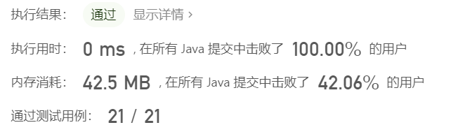

## 树

树比链表稍微复杂，因为链表是线性数据结构，而树不是。 树的问题可以由 **广度优先搜索**或 **深度优先搜索** 解决

### [二叉树的最大深度](https://leetcode-cn.com/leetbook/read/top-interview-questions-easy/xnd69e/)

给定一个二叉树，找出其最大深度。

二叉树的深度为根节点到最远叶子节点的最长路径上的节点数。

**说明:** 叶子节点是指没有子节点的节点。

**示例：**
给定二叉树` [3,9,20,null,null,15,7]`，

```
 3
/ \
  9  20
    /  \
   15   7
```

返回它的最大深度 3 。

**题解**

直接使用递归实现

* 如果当前根节点为`null`，返回0
* 如果当前左右子树都为`null`，即表示当前根节点为叶子结点，直接返回1
* 如果不是叶子结点，返回左右子树中最大深度+1

```java
/**
 * Definition for a binary tree node.
 * public class TreeNode {
 *     int val;
 *     TreeNode left;
 *     TreeNode right;
 *     TreeNode() {}
 *     TreeNode(int val) { this.val = val; }
 *     TreeNode(int val, TreeNode left, TreeNode right) {
 *         this.val = val;
 *         this.left = left;
 *         this.right = right;
 *     }
 * }
 */
class Solution {
    public int maxDepth(TreeNode root) {
        if (root == null)
            return 0;
        if (root.left == null && root.right == null)
            return 1;
        return Math.max(maxDepth(root.left), maxDepth(root.right)) + 1;
    }
}
```

* 时间复杂度：$O(n)$
* 空间复杂度：$O(n)$ 递归调用的栈深度

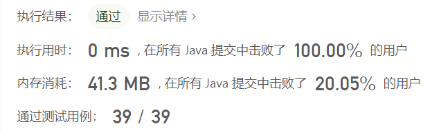

### [验证二叉搜索树](https://leetcode-cn.com/leetbook/read/top-interview-questions-easy/xn08xg/)

给你一个二叉树的根节点 `root `，判断其是否是一个有效的二叉搜索树。

**有效** 二叉搜索树定义如下：

节点的左子树只包含 **小于** 当前节点的数。
节点的右子树只包含 **大于** 当前节点的数。
所有左子树和右子树自身必须也是二叉搜索树。

**示例 1：**


```
输入：root = [2,1,3]
输出：true
```

**示例 2：**


```
输入：root = [5,1,4,null,null,3,6]
输出：false
解释：根节点的值是 5 ，但是右子节点的值是 4 。
```


**提示：**

- 树中节点数目范围在`[1, 104] `内

- $-2^{31} <= Node.val <= 2^{31} - 1$

**题解**

将二叉搜索树的中序遍历存放在数组中，然后判断数组是否有序

```java
/**
 * Definition for a binary tree node.
 * public class TreeNode {
 *     int val;
 *     TreeNode left;
 *     TreeNode right;
 *     TreeNode() {}
 *     TreeNode(int val) { this.val = val; }
 *     TreeNode(int val, TreeNode left, TreeNode right) {
 *         this.val = val;
 *         this.left = left;
 *         this.right = right;
 *     }
 * }
 */
class Solution {
    
    public boolean isValidBST(TreeNode root) {
        List<Integer> path = new ArrayList<Integer>();
        dfs(root, path);
        for (int i = 1; i < path.size(); i++) {
            if (path.get(i) <= path.get(i-1))
                return false;
        }
        return true;
    }

    public void dfs(TreeNode root, List<Integer> path) {
        if (root == null)
            return ;
        dfs(root.left, path);
        path.add(root.val);
        dfs(root.right, path);
    }
}
```

* 时间复杂度：$O(n)$
* 空间复杂度：$O(n)$

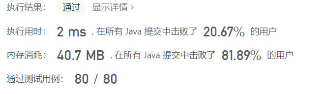

**使用栈辅助实现二叉树的中序遍历**

```java
class Solution {
    public boolean isValidBST(TreeNode root) {
        Deque<TreeNode> stack = new LinkedList<TreeNode>();
        double inorder = -Double.MAX_VALUE;

        while (!stack.isEmpty() || root != null) {
            while (root != null) {
                stack.push(root);
                root = root.left;
            }
            root = stack.pop();
              // 如果中序遍历得到的节点的值小于等于前一个 inorder，说明不是二叉搜索树
            if (root.val <= inorder) {
                return false;
            }
            inorder = root.val;
            root = root.right;
        }
        return true;
    }
}
```

* 时间复杂度：$O(n)$
* 空间复杂度：$O(n)$


**递归实现**

```java
/**
 * Definition for a binary tree node.
 * public class TreeNode {
 *     int val;
 *     TreeNode left;
 *     TreeNode right;
 *     TreeNode() {}
 *     TreeNode(int val) { this.val = val; }
 *     TreeNode(int val, TreeNode left, TreeNode right) {
 *         this.val = val;
 *         this.left = left;
 *         this.right = right;
 *     }
 * }
 */
class Solution {
    public boolean isValidBST(TreeNode root) {
        long lower = Long.MIN_VALUE, upper = Long.MAX_VALUE;
        return dfs(root, lower, upper);
    }

    public boolean dfs(TreeNode root, long lower, long upper) {
        if (root == null)
            return true;
        if (root.val <= lower || root.val >= upper)
            return false;
        return dfs(root.left, lower, root.val) && dfs(root.right, root.val, upper);

    }
}
```

* 时间复杂度：$O(n)$
* 空间复杂度：$O(n)$

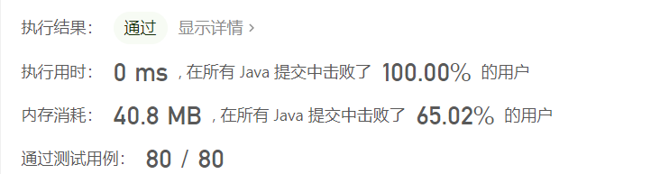

### [对称二叉树](https://leetcode-cn.com/leetbook/read/top-interview-questions-easy/xn7ihv/)

给你一个二叉树的根节点 `root `， 检查它是否轴对称。

 

**示例 1：**


```
输入：root = [1,2,2,3,4,4,3]
输出：true
```

**示例 2：**


```
输入：root = [1,2,2,null,3,null,3]
输出：false
```

**提示：**

- 树中节点数目在范围` [1, 1000] `内

- `-100 <= Node.val <= 100`

**进阶：**你可以运用递归和迭代两种方法解决这个问题吗？

**题解**

**递归实现**

对称的二叉树可以看到是一个树的左右子树镜像对称，也就是判断两个子树是否镜像对称可以判断两棵树是否镜像，所以可以将判断二叉树对称简化为判断二叉树左右子树是否对称，设置两个指针，`p`和`q`指针，一开始都指向这棵树的根，然后`p`右移，`q`左移，`p`左移，`q`右移，每次检查当前`p`和`q`结点的值是否相等，如果相等再判断左右子树是否对称

```java
/**
 * Definition for a binary tree node.
 * public class TreeNode {
 *     int val;
 *     TreeNode left;
 *     TreeNode right;
 *     TreeNode() {}
 *     TreeNode(int val) { this.val = val; }
 *     TreeNode(int val, TreeNode left, TreeNode right) {
 *         this.val = val;
 *         this.left = left;
 *         this.right = right;
 *     }
 * }
 */
class Solution {
    public boolean isSymmetric(TreeNode root) {
        return check(root, root);
    }

    public boolean check(TreeNode p, TreeNode q) {
        if (p == null && q == null)
            return true;
        
        if (p == null || q == null)
            return false;
        
        return p.val == q.val && check(p.left, q.right) && check(p.right, q.left);
    }
}
```

* 时间复杂度：$O(n)$
* 空间复杂度：$O(n)$

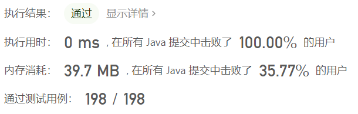

**迭代的方式**

使用队列

```java
/**
 * Definition for a binary tree node.
 * public class TreeNode {
 *     int val;
 *     TreeNode left;
 *     TreeNode right;
 *     TreeNode() {}
 *     TreeNode(int val) { this.val = val; }
 *     TreeNode(int val, TreeNode left, TreeNode right) {
 *         this.val = val;
 *         this.left = left;
 *         this.right = right;
 *     }
 * }
 */
class Solution {
    public boolean isSymmetric(TreeNode root) {
        Queue<TreeNode> queue = new LinkedList<>();
        queue.add(root);
        queue.add(root);
        while(!queue.isEmpty()) {
            TreeNode p = queue.poll();
            TreeNode q = queue.poll();
            if (p == null && q == null)
                continue;
            
            if (p == null || q == null || p.val != q.val)
                return false;
            
            queue.add(p.left);
            queue.add(q.right);

            queue.add(p.right);
            queue.add(q.left);
        }
        return true;
    }
}
```

* 时间复杂度：$O(n)$
* 空间复杂度：$O(n)$

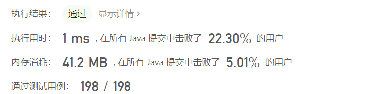

### [二叉树的层序遍历](https://leetcode-cn.com/leetbook/read/top-interview-questions-easy/xnldjj/)

给你二叉树的根节点 `root `，返回其节点值的 **层序遍历** 。 （即逐层地，从左到右访问所有节点）。

 

示例 1：


```
输入：root = [3,9,20,null,null,15,7]
输出：[[3],[9,20],[15,7]]
```


示例 2：

```
输入：root = [1]
输出：[[1]]
```

示例 3：

```
输入：root = []
输出：[]
```


提示：

- 树中节点数目在范围 `[0, 2000] `内
- `-1000 <= Node.val <= 1000`

**题解**

**使用栈来辅助完成二叉树的层序遍历**

```java
/**
 * Definition for a binary tree node.
 * public class TreeNode {
 *     int val;
 *     TreeNode left;
 *     TreeNode right;
 *     TreeNode() {}
 *     TreeNode(int val) { this.val = val; }
 *     TreeNode(int val, TreeNode left, TreeNode right) {
 *         this.val = val;
 *         this.left = left;
 *         this.right = right;
 *     }
 * }
 */
class Solution {
    public List<List<Integer>> levelOrder(TreeNode root) {
        List<List<Integer>> ans = new ArrayList<List<Integer>>();
        if (root == null)
            return ans;
        
        Queue<TreeNode> queue = new LinkedList<>();
        queue.add(root);
        while(!queue.isEmpty()) {
            List<Integer> level = new ArrayList<>();
            for (int i = queue.size(); i > 0; i--) {
                TreeNode temp = queue.poll();
                if (temp == null)
                    continue;
                level.add(temp.val);
                if (temp.left != null) queue.add(temp.left);
                if (temp.right != null) queue.add(temp.right);
            }
            ans.add(level);
        }
        return ans;
    }
}
```

* 时间复杂度：$O(n)$
* 空间复杂度：$O(n)$

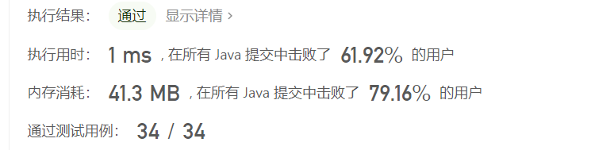

### [将有序数组转换为二叉搜索树](https://leetcode-cn.com/leetbook/read/top-interview-questions-easy/xninbt/)

给你一个整数数组 `nums `，其中元素已经按 **升序** 排列，请你将其转换为一棵 **高度平衡** 二叉搜索树。

**高度平衡** 二叉树是一棵满足「每个节点的左右两个子树的高度差的绝对值不超过 1 」的二叉树。

 

**示例 1：**


```
输入：nums = [-10,-3,0,5,9]
输出：[0,-3,9,-10,null,5]
解释：[0,-10,5,null,-3,null,9] 也将被视为正确答案：
```


**示例 2：**


```
输入：nums = [1,3]
输出：[3,1]
解释：[1,null,3] 和 [3,1] 都是高度平衡二叉搜索树。
```

**提示：**

- `1 <= nums.length <= 104`
- `-104 <= nums[i] <= 104`
- `nums `按 严格递增 顺序排列

**题解**

本来以为还需要进行左旋右旋这些操作来的，其实这一道题的解法可以直接将数组中间的值当做根节点，然后迭代建树

```java
/**
 * Definition for a binary tree node.
 * public class TreeNode {
 *     int val;
 *     TreeNode left;
 *     TreeNode right;
 *     TreeNode() {}
 *     TreeNode(int val) { this.val = val; }
 *     TreeNode(int val, TreeNode left, TreeNode right) {
 *         this.val = val;
 *         this.left = left;
 *         this.right = right;
 *     }
 * }
 */
class Solution {
    public TreeNode sortedArrayToBST(int[] nums) {
        return helper(nums, 0, nums.length - 1);
    }

    public TreeNode helper(int[] nums, int l, int r) {
        if (l > r)
            return null;
        
        int mid = (l + r) / 2;
        TreeNode root = new TreeNode(nums[mid]);
        root.left = helper(nums, l, mid - 1);
        root.right = helper(nums, mid + 1, r);
        return root;
    }
}
```

* 时间复杂度：$O(n)$
* 空间复杂度：$O(n)$

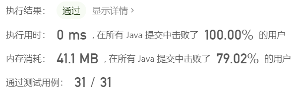

## 排序和搜索

### [合并两个有序数组](https://leetcode-cn.com/leetbook/read/top-interview-questions-easy/xnumcr/)

给你两个按 **非递减顺序** 排列的整数数组 `nums1 `和 `nums2`，另有两个整数 `m` 和 `n` ，分别表示 `nums1 `和 `nums2 `中的元素数目。

请你 **合并** `nums2 `到 `nums1 `中，使合并后的数组同样按 **非递减顺序** 排列。

**注意：**最终，合并后数组不应由函数返回，而是存储在数组 `nums1 `中。为了应对这种情况，`nums1 `的初始长度为 `m + n`，其中前` m `个元素表示应合并的元素，后` n `个元素为 `0 `，应忽略。`nums2 `的长度为 `n` 。

 

**示例 1：**

```
输入：nums1 = [1,2,3,0,0,0], m = 3, nums2 = [2,5,6], n = 3
输出：[1,2,2,3,5,6]
解释：需要合并 [1,2,3] 和 [2,5,6] 。
合并结果是 [1,2,2,3,5,6] ，其中斜体加粗标注的为 nums1 中的元素。
```

**示例 2：**

```
输入：nums1 = [1], m = 1, nums2 = [], n = 0
输出：[1]
解释：需要合并 [1] 和 [] 。
合并结果是 [1] 。
```

**示例 3：**

```
输入：nums1 = [0], m = 0, nums2 = [1], n = 1
输出：[1]
解释：需要合并的数组是 [] 和 [1] 。
合并结果是 [1] 。
注意，因为 m = 0 ，所以 nums1 中没有元素。nums1 中仅存的 0 仅仅是为了确保合并结果可以顺利存放到 nums1 中。
```

**提示：**

- `nums1.length == m + n`
- `nums2.length == n`
- `0 <= m, n <= 200`
- `1 <= m + n <= 200`
- `-109 <= nums1[i], nums2[j] <= 109`

**进阶：**你可以设计实现一个时间复杂度为 O(m + n) 的算法解决此问题吗？

**题解**

可以看到`nums1`数组长度为`n+m`，其中有`m`个元素，`n`个零，可以考虑从最大的开始查找，将最大的依次填在最末尾

这种方式并不会覆盖`nums1`中已经存在的元素，因为就算`nums2`中最小的元素也大于`nums1`中最大元素，也就是`nums2`中的`n`个全部放在末尾，也不会覆盖`nums1`中的元素，也就是末尾始终有足够的空位用于填充

```java
class Solution {
    public void merge(int[] nums1, int m, int[] nums2, int n) {
        int p1 = m - 1, p2 = n - 1;
        int tail = m + n - 1;
        int cur;
        while(p1 >= 0 || p2 >= 0) {
            if (p1 == -1)
                cur = nums2[p2--];
            else if (p2 == -1)
                cur = nums1[p1--];
            else{
                if (nums1[p1] < nums2[p2])
                    cur = nums2[p2--];
                else
                    cur = nums1[p1--];
            }
            nums1[tail--] = cur;
        }
    }
}
```

* 时间复杂度：$O(n)$
* 空间复杂度：$O(1)$

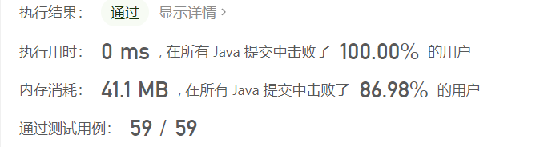

### [第一个错误的版本](https://leetcode-cn.com/leetbook/read/top-interview-questions-easy/xnto1s/)

你是产品经理，目前正在带领一个团队开发新的产品。不幸的是，你的产品的最新版本没有通过质量检测。由于每个版本都是基于之前的版本开发的，所以错误的版本之后的所有版本都是错的。

假设你有` n` 个版本 `[1, 2, ..., n]`，你想找出导致之后所有版本出错的第一个错误的版本。

你可以通过调用 `bool isBadVersion(version)` 接口来判断版本号 `version `是否在单元测试中出错。实现一个函数来查找第一个错误的版本。你应该尽量减少对调用 API 的次数。

**示例 1：**

```
输入：n = 5, bad = 4
输出：4
解释：
调用 isBadVersion(3) -> false 
调用 isBadVersion(5) -> true 
调用 isBadVersion(4) -> true
所以，4 是第一个错误的版本。
```

**示例 2：**

```
输入：n = 1, bad = 1
输出：1
```

**提示：**

- `1 <= bad <= n <= 231 - 1`

**题解**

使用二分查找实现，注意临界条件判断

```java
/* The isBadVersion API is defined in the parent class VersionControl.
      boolean isBadVersion(int version); */

public class Solution extends VersionControl {
    public int firstBadVersion(int n) {
        int left = 1, right = n;
        while(left < right) {
            int mid = left + (right - left) / 2;
            if (isBadVersion(mid))
                right = mid;
            else
                left = mid + 1;
        }
        return right;
    }
}
```

* 时间复杂度：$O(log_2(n))$
* 空间复杂度：$O(1)$

## 动态规划

这些是基本的动态规划题目

### [爬楼梯](https://leetcode-cn.com/leetbook/read/top-interview-questions-easy/xn854d/)

假设你正在爬楼梯。需要 `n` 阶你才能到达楼顶。

每次你可以爬 1 或 2 个台阶。你有多少种不同的方法可以爬到楼顶呢？

 

**示例 1：**

```
输入：n = 2
输出：2
解释：有两种方法可以爬到楼顶。

1. 1 阶 + 1 阶
2. 2 阶
```

**示例2：**

```
输入：n = 3
输出：3
解释：有三种方法可以爬到楼顶。

1. 1 阶 + 1 阶 + 1 阶
2. 1 阶 + 2 阶
3. 2 阶 + 1 阶
```

**提示：**

- `1 <= n <= 45`

**题解**

定义`dp[n]`为`n`阶台阶有多少种方法爬到，可以由`dp[n-1]+dp[n+2]`得到，并且易得
$$
dp[1]=1 \\
dp[2]=2
$$
所以可以得到当前`n`阶台阶有多少种方法仅和前两个台阶多少种方法相关，可以定义两个变量分别表示前两个台阶的方法，进行递推计算得到

```java
class Solution {
    public int climbStairs(int n) {
        if (n < 2)
            return n;
        int p = 1, q = 2;
        int temp;
        for (int i = 2; i < n; i++) {
            temp = q;
            q = p + q;
            p = temp;
        }
        return q;
    }
}
```

* 时间复杂度：$O(n)$
* 空间复杂度：$O(1)$

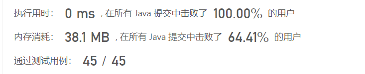


### [买卖股票的最佳时机](https://leetcode-cn.com/leetbook/read/top-interview-questions-easy/xn8fsh/)

给定一个数组 `prices `，它的第 `i `个元素 `prices[i] `表示一支给定股票第 `i `天的价格。

你只能选择 **某一天** 买入这只股票，并选择在 **未来的某一个不同的日子** 卖出该股票。设计一个算法来计算你所能获取的最大利润。

返回你可以从这笔交易中获取的最大利润。如果你不能获取任何利润，返回` 0` 。

 

**示例 1：**

```
输入：[7,1,5,3,6,4]
输出：5
解释：在第 2 天（股票价格 = 1）的时候买入，在第 5 天（股票价格 = 6）的时候卖出，最大利润 = 6-1 = 5 。
     注意利润不能是 7-1 = 6, 因为卖出价格需要大于买入价格；同时，你不能在买入前卖出股票。
```

**示例 2：**

```
输入：prices = [7,6,4,3,1]
输出：0
解释：在这种情况下, 没有交易完成, 所以最大利润为 0。
```

**提示：**

- `1 <= prices.length <= 105`
- `0 <= prices[i] <= 104`

**题解**

简单的来说要想获得当前股票价格最大的利润，也就是判断在当前日期之前最低的价格买入股票，然后计算两个差值，如果当前利润最高，就记为历史最高，所以需要一个变量记录前些时刻股票价格的最低值

```java
class Solution {
    public int maxProfit(int[] prices) {
        int pre_low = Integer.MAX_VALUE;
        int res = 0;
        for (int price : prices) {
            res = Math.max(res, price - pre_low);
            pre_low = Math.min(pre_low, price);
        }
        return res;
    }
}
```

* 时间复杂度：$O(n)$
* 空间复杂度：$O(1)$

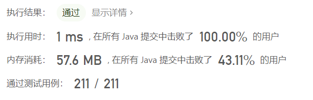

### [53. 最大子数组和](https://leetcode-cn.com/problems/maximum-subarray/)

难度简单

给你一个整数数组 `nums` ，请你找出一个具有最大和的连续子数组（子数组最少包含一个元素），返回其最大和。

**子数组** 是数组中的一个连续部分。

 

**示例 1：**

```
输入：nums = [-2,1,-3,4,-1,2,1,-5,4]
输出：6
解释：连续子数组 [4,-1,2,1] 的和最大，为 6 。
```

**示例 2：**

```
输入：nums = [1]
输出：1
```

**示例 3：**

```
输入：nums = [5,4,-1,7,8]
输出：23
```

 

**提示：**

- `1 <= nums.length <= 105`
- `-104 <= nums[i] <= 104`

 

**进阶：**如果你已经实现复杂度为 `O(n)` 的解法，尝试使用更为精妙的 **分治法** 求解。

**题解**

定义 $f(i)$ 为以 $nums[i]$ 结尾的连续子数组的最大和，所以结果就是遍历求得
$$
\max_{i=1}^n f(i)
$$
那么 $f(i)$ 如何求得，可以考虑对于 $nums[i]$ 是单独一段还是加入之前的连续子数组 $nums[i] + f(i-1)$，也就是 
$$
f(i) = \max(nums[i], nums[i] + f(i-1))
$$

```java
class Solution {
    public int maxSubArray(int[] nums) {
        int res = Integer.MIN_VALUE, pre = 0;
        for (int num : nums) {
            pre = Math.max(num, pre + num);
            res = Math.max(res, pre);
        }
        return res;
    }
}
```

* 时间复杂度：$O(n)$
* 空间复杂度：$O(1)$

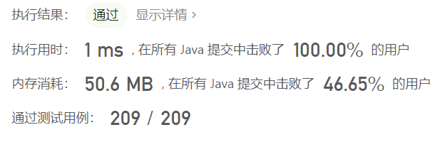

### [198. 打家劫舍](https://leetcode-cn.com/problems/house-robber/)

难度中等2105收藏分享切换为英文接收动态反馈

你是一个专业的小偷，计划偷窃沿街的房屋。每间房内都藏有一定的现金，影响你偷窃的唯一制约因素就是相邻的房屋装有相互连通的防盗系统，**如果两间相邻的房屋在同一晚上被小偷闯入，系统会自动报警**。

给定一个代表每个房屋存放金额的非负整数数组，计算你 **不触动警报装置的情况下** ，一夜之内能够偷窃到的最高金额。

 

**示例 1：**

```
输入：[1,2,3,1]
输出：4
解释：偷窃 1 号房屋 (金额 = 1) ，然后偷窃 3 号房屋 (金额 = 3)。
     偷窃到的最高金额 = 1 + 3 = 4 。
```

**示例 2：**

```
输入：[2,7,9,3,1]
输出：12
解释：偷窃 1 号房屋 (金额 = 2), 偷窃 3 号房屋 (金额 = 9)，接着偷窃 5 号房屋 (金额 = 1)。
     偷窃到的最高金额 = 2 + 9 + 1 = 12 。
```

 

**提示：**

- `1 <= nums.length <= 100`
- `0 <= nums[i] <= 400`

**题解**

对于第 `n` 个房间，可以考虑抢和不抢两种，那么定义第 `n` 间房屋偷到的金额为：
$$
dp[n] = Math.max(nums[n] + dp[n-2], dp[n-1])
$$
其中初始条件为：
$$
dp[0] = 0
dp[1] = nums[1]
$$


```java
class Solution {
    public int rob(int[] nums) {
        int n = nums.length;
        if (n < 2)
            return nums[0];

        int p = 0, q = nums[0];
        for (int i = 1; i < n; i++) {
            int temp = q;
            q = Math.max(nums[i] + p, q);
            p = temp;
        }
        return q;
    }
}
```

* 时间复杂度：$O(n)$
* 空间复杂度：$O(1)$

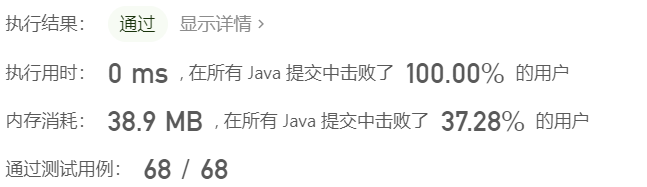

## 设计问题

这类问题通常要求你实现一个给定的类的接口，并可能涉及使用一种或多种数据结构。 这些问题对于提高数据结构是很好的练习。

### [384. 打乱数组](https://leetcode-cn.com/problems/shuffle-an-array/)

难度中等

给你一个整数数组 `nums` ，设计算法来打乱一个没有重复元素的数组。打乱后，数组的所有排列应该是 **等可能** 的。

实现 `Solution` class:

- `Solution(int[] nums)` 使用整数数组 `nums` 初始化对象
- `int[] reset()` 重设数组到它的初始状态并返回
- `int[] shuffle()` 返回数组随机打乱后的结果

 

**示例 1：**

```
输入
["Solution", "shuffle", "reset", "shuffle"]
[[[1, 2, 3]], [], [], []]
输出
[null, [3, 1, 2], [1, 2, 3], [1, 3, 2]]

解释
Solution solution = new Solution([1, 2, 3]);
solution.shuffle();    // 打乱数组 [1,2,3] 并返回结果。任何 [1,2,3]的排列返回的概率应该相同。例如，返回 [3, 1, 2]
solution.reset();      // 重设数组到它的初始状态 [1, 2, 3] 。返回 [1, 2, 3]
solution.shuffle();    // 随机返回数组 [1, 2, 3] 打乱后的结果。例如，返回 [1, 3, 2]
```

 

**提示：**

- `1 <= nums.length <= 50`
- `-106 <= nums[i] <= 106`
- `nums` 中的所有元素都是 **唯一的**
- 最多可以调用 `104` 次 `reset` 和 `shuffle`

**题解**

```java
class Solution {
    int[] nums;
    int[] original;

    public Solution(int[] nums) {
        this.nums = nums;
        this.original = new int[nums.length];
        System.arraycopy(nums, 0, original, 0, nums.length);
    }
    
    public int[] reset() {
        System.arraycopy(original, 0, nums, 0, nums.length);
        return nums;
    }
    
    public int[] shuffle() {
        int[] shuffled = new int[nums.length];
        List<Integer> list = new ArrayList<Integer>();
        for (int i = 0; i < nums.length; ++i) {
            list.add(nums[i]);
        }
        Random random = new Random();
        for (int i = 0; i < nums.length; ++i) {
            int j = random.nextInt(list.size());
            shuffled[i] = list.remove(j);
        }
        System.arraycopy(shuffled, 0, nums, 0, nums.length)
        return nums;
    }
}
```

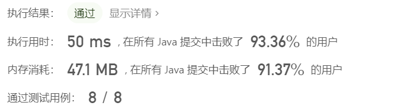

### [155. 最小栈](https://leetcode-cn.com/problems/min-stack/)

难度简单1297收藏分享切换为英文接收动态反馈

设计一个支持 `push` ，`pop` ，`top` 操作，并能在常数时间内检索到最小元素的栈。

实现 `MinStack` 类:

- `MinStack()` 初始化堆栈对象。
- `void push(int val)` 将元素val推入堆栈。
- `void pop()` 删除堆栈顶部的元素。
- `int top()` 获取堆栈顶部的元素。
- `int getMin()` 获取堆栈中的最小元素。

 

**示例 1:**

```
输入：
["MinStack","push","push","push","getMin","pop","top","getMin"]
[[],[-2],[0],[-3],[],[],[],[]]

输出：
[null,null,null,null,-3,null,0,-2]

解释：
MinStack minStack = new MinStack();
minStack.push(-2);
minStack.push(0);
minStack.push(-3);
minStack.getMin();   --> 返回 -3.
minStack.pop();
minStack.top();      --> 返回 0.
minStack.getMin();   --> 返回 -2.
```

 

**提示：**

- `-231 <= val <= 231 - 1`
- `pop`、`top` 和 `getMin` 操作总是在 **非空栈** 上调用
- `push`, `pop`, `top`, and `getMin`最多被调用 `3 * 104` 次

**题解**

```java
class MinStack {
    Deque<Integer> xStack;
    Deque<Integer> minStack;

    public MinStack() {
        xStack = new LinkedList<Integer>();
        minStack = new LinkedList<Integer>();
        minStack.push(Integer.MAX_VALUE);
    }
    
    public void push(int x) {
        xStack.push(x);
        minStack.push(Math.min(minStack.peek(), x));
    }
    
    public void pop() {
        xStack.pop();
        minStack.pop();
    }
    
    public int top() {
        return xStack.peek();
    }
    
    public int getMin() {
        return minStack.peek();
    }
}

```

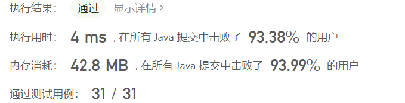

## 数学

### [412. Fizz Buzz](https://leetcode-cn.com/problems/fizz-buzz/)

难度简单177收藏分享切换为英文接收动态反馈

给你一个整数 `n` ，找出从 `1` 到 `n` 各个整数的 Fizz Buzz 表示，并用字符串数组 `answer`（**下标从 1 开始**）返回结果，其中：

- `answer[i] == "FizzBuzz"` 如果 `i` 同时是 `3` 和 `5` 的倍数。
- `answer[i] == "Fizz"` 如果 `i` 是 `3` 的倍数。
- `answer[i] == "Buzz"` 如果 `i` 是 `5` 的倍数。
- `answer[i] == i` （以字符串形式）如果上述条件全不满足。

 

**示例 1：**

```
输入：n = 3
输出：["1","2","Fizz"]
```

**示例 2：**

```
输入：n = 5
输出：["1","2","Fizz","4","Buzz"]
```

**示例 3：**

```
输入：n = 15
输出：["1","2","Fizz","4","Buzz","Fizz","7","8","Fizz","Buzz","11","Fizz","13","14","FizzBuzz"]
```

 

**提示：**

- `1 <= n <= 104`

**题解**

```java
class Solution {
    public List<String> fizzBuzz(int n) {
        List<String> ans = new ArrayList<String>();
        for (int i = 1; i <= n; i++) {
            if (i % 3 == 0 && i % 5 == 0)
                ans.add("FizzBuzz");
            else if (i % 3 == 0)
                ans.add("Fizz");
            else if (i % 5 == 0)
                ans.add("Buzz");
            else
                ans.add(String.valueOf(i));
        }
        return ans;
    }
}
```

* 时间复杂度：$O(n)$
* 空间复杂度：$O(1)$ 不算上返回结果的`List<String>`

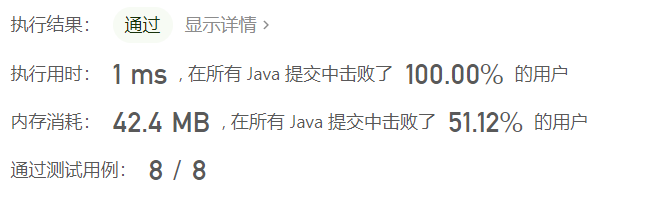

### [204. 计数质数](https://leetcode-cn.com/problems/count-primes/)-==判断质数==

难度中等883收藏分享切换为英文接收动态反馈

给定整数 `n` ，返回 *所有小于非负整数 `n` 的质数的数量* 。

 

**示例 1：**

```
输入：n = 10
输出：4
解释：小于 10 的质数一共有 4 个, 它们是 2, 3, 5, 7 。
```

**示例 2：**

```
输入：n = 0
输出：0
```

**示例 3：**

```
输入：n = 1
输出：0
```

 

**提示：**

- `0 <= n <= 5 * 106`

**题解**

一般使用**埃氏筛**算法

* 初始化长度 `O(n)` 的标记数组，表示这个数组是否为质数。数组初始化所有的数都是质数.
* 从 2 开始将当前数字的倍数全都标记为合数。标记到 $\sqrt{n}$ 时停止即可。

```java
class Solution {
    
    public int countPrimes(int n) {
        boolean[] isPrim = new boolean[n];
        Arrays.fill(isPrim, true);
        // 从 2 开始枚举到 sqrt(n)。
        for (int i = 2; i * i < n; i++) {
            // 如果当前是素数
            if (isPrim[i]) {
                // 就把从 i*i 开始，i 的所有倍数都设置为 false。
                for (int j = i * i; j < n; j+=i) {
                    isPrim[j] = false;
                }
            }
        }

        // 计数
        int cnt = 0;
        for (int i = 2; i < n; i++) {
            if (isPrim[i]) {
                cnt++;
            }
        }
        return cnt;
    }
}
```

* 时间复杂度：$O(nlog(log(n)))$
* 空间复杂度：$O(n)$

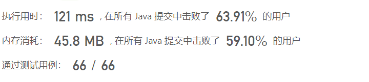

### [326. 3 的幂](https://leetcode-cn.com/problems/power-of-three/)

难度简单252收藏分享切换为英文接收动态反馈

给定一个整数，写一个函数来判断它是否是 3 的幂次方。如果是，返回 `true` ；否则，返回 `false` 。

整数 `n` 是 3 的幂次方需满足：存在整数 `x` 使得 `n == 3x`

 

**示例 1：**

```
输入：n = 27
输出：true
```

**示例 2：**

```
输入：n = 0
输出：false
```

**示例 3：**

```
输入：n = 9
输出：true
```

**示例 4：**

```
输入：n = 45
输出：false
```

 

**提示：**

- `-231 <= n <= 231 - 1`

**题解**

```java
class Solution {
    public boolean isPowerOfThree(int n) {
        if (n < 1)
            return false;

        while(n > 0) {
            if (n % 3 != 0 && n != 1)
                return false;
            n /= 3;
        }
        return true;
    }
}
```

* 时间复杂度：$O(log_3(n))$
* 空间复杂度：$O(1)$

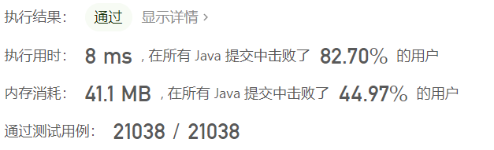

### [13. 罗马数字转整数](https://leetcode-cn.com/problems/roman-to-integer/)

难度简单1861收藏分享切换为英文接收动态反馈

罗马数字包含以下七种字符: `I`， `V`， `X`， `L`，`C`，`D` 和 `M`。

```
字符          数值
I             1
V             5
X             10
L             50
C             100
D             500
M             1000
```

例如， 罗马数字 `2` 写做 `II` ，即为两个并列的 1 。`12` 写做 `XII` ，即为 `X` + `II` 。 `27` 写做 `XXVII`, 即为 `XX` + `V` + `II` 。

通常情况下，罗马数字中小的数字在大的数字的右边。但也存在特例，例如 4 不写做 `IIII`，而是 `IV`。数字 1 在数字 5 的左边，所表示的数等于大数 5 减小数 1 得到的数值 4 。同样地，数字 9 表示为 `IX`。这个特殊的规则只适用于以下六种情况：

- `I` 可以放在 `V` (5) 和 `X` (10) 的左边，来表示 4 和 9。
- `X` 可以放在 `L` (50) 和 `C` (100) 的左边，来表示 40 和 90。 
- `C` 可以放在 `D` (500) 和 `M` (1000) 的左边，来表示 400 和 900。

给定一个罗马数字，将其转换成整数。

 

**示例 1:**

```
输入: s = "III"
输出: 3
```

**示例 2:**

```
输入: s = "IV"
输出: 4
```

**示例 3:**

```
输入: s = "IX"
输出: 9
```

**示例 4:**

```
输入: s = "LVIII"
输出: 58
解释: L = 50, V= 5, III = 3.
```

**示例 5:**

```
输入: s = "MCMXCIV"
输出: 1994
解释: M = 1000, CM = 900, XC = 90, IV = 4.
```

 

**提示：**

- `1 <= s.length <= 15`
- `s` 仅含字符 `('I', 'V', 'X', 'L', 'C', 'D', 'M')`
- 题目数据保证 `s` 是一个有效的罗马数字，且表示整数在范围 `[1, 3999]` 内
- 题目所给测试用例皆符合罗马数字书写规则，不会出现跨位等情况。
- IL 和 IM 这样的例子并不符合题目要求，49 应该写作 XLIX，999 应该写作 CMXCIX 。
- 关于罗马数字的详尽书写规则，可以参考 [罗马数字 - Mathematics ](https://b2b.partcommunity.com/community/knowledge/zh_CN/detail/10753/罗马数字#knowledge_article)。

**题解**

* 通常情况下，罗马数字中小的数字在大的数字的右边。若输入的字符串满足该情况，那么可以将每个字符视作一个单独的值，累加每个字符对应的数值即可
* 若存在小的数字在大的数字的左边的情况，根据规则需要减去小的数字。对于这种情况，我们也可以将每个字符视作一个单独的值，若一个数字右侧的数字比它大，则将该数字的符号取反

```java
class Solution {

    Map<Character, Integer> symbolValues = new HashMap<Character, Integer>() {{
        put('I', 1);
        put('V', 5);
        put('X', 10);
        put('L', 50);
        put('C', 100);
        put('D', 500);
        put('M', 1000);
    }};

    public int romanToInt(String s) {
        int ans = 0;
        int n = s.length();
        for (int i = 0; i < n; i++) {
            int value = symbolValues.get(s.charAt(i));
            if (i < n - 1 && value < symbolValues.get(s.charAt(i + 1)))
                ans -= value;
            else
                ans += value;
        }
        return ans;
    }
}
```

* 时间复杂度：$O(n)$
* 空间复杂度：$O(1)$ 

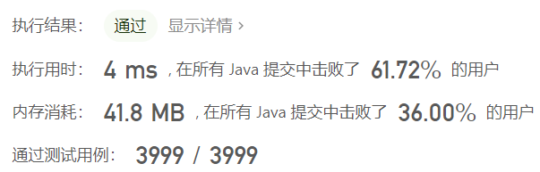

使用`switch-case`来转换罗马字符，时间复杂度和空间复杂度非常低

```java
class Solution {
    public int romanToInt(String s) {
        int sum = 0;
        int preNum = getValue(s.charAt(0));
        for(int i = 1;i < s.length(); i ++) {
            int num = getValue(s.charAt(i));
            if(preNum < num) {
                sum -= preNum;
            } else {
                sum += preNum;
            }
            preNum = num;
        }
        sum += preNum;
        return sum;
    }
    
    private int getValue(char ch) {
        switch(ch) {
            case 'I': return 1;
            case 'V': return 5;
            case 'X': return 10;
            case 'L': return 50;
            case 'C': return 100;
            case 'D': return 500;
            case 'M': return 1000;
            default: return 0;
        }
    }
}

```

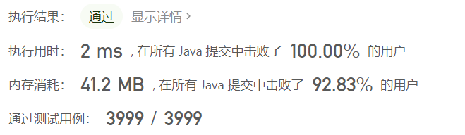

## 其他

### [191. 位1的个数](https://leetcode-cn.com/problems/number-of-1-bits/)

难度简单469收藏分享切换为英文接收动态反馈

编写一个函数，输入是一个无符号整数（以二进制串的形式），返回其二进制表达式中数字位数为 '1' 的个数（也被称为[汉明重量](https://baike.baidu.com/item/汉明重量)）。

 

**提示：**

- 请注意，在某些语言（如 Java）中，没有无符号整数类型。在这种情况下，输入和输出都将被指定为有符号整数类型，并且不应影响您的实现，因为无论整数是有符号的还是无符号的，其内部的二进制表示形式都是相同的。
- 在 Java 中，编译器使用[二进制补码](https://baike.baidu.com/item/二进制补码/5295284)记法来表示有符号整数。因此，在上面的 **示例 3** 中，输入表示有符号整数 `-3`。

 

**示例 1：**

```
输入：00000000000000000000000000001011
输出：3
解释：输入的二进制串 00000000000000000000000000001011 中，共有三位为 '1'。
```

**示例 2：**

```
输入：00000000000000000000000010000000
输出：1
解释：输入的二进制串 00000000000000000000000010000000 中，共有一位为 '1'。
```

**示例 3：**

```
输入：11111111111111111111111111111101
输出：31
解释：输入的二进制串 11111111111111111111111111111101 中，共有 31 位为 '1'。
```

 

**提示：**

- 输入必须是长度为 `32` 的 **二进制串** 。

 

**进阶**：

- 如果多次调用这个函数，你将如何优化你的算法？


**题解**

可以使用`n&=n-1`将二进制位数的最高位`1`变为`0`，统计`n`变为零之前与的次数，返回次数

```java
public class Solution {
    // you need to treat n as an unsigned value
    public int hammingWeight(int n) {
        int ans = 0;
        while(n != 0) {
            n &= (n-1);
            ++ans;
        }
        return ans;
    }
}
```

* 时间复杂度：$O(n)$
* 空间复杂度：$O(1)$

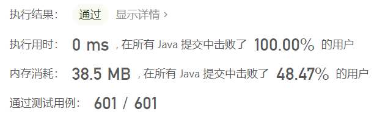

### [461. 汉明距离](https://leetcode-cn.com/problems/hamming-distance/)

难度简单598收藏分享切换为英文接收动态反馈

两个整数之间的 [汉明距离](https://baike.baidu.com/item/汉明距离) 指的是这两个数字对应二进制位不同的位置的数目。

给你两个整数 `x` 和 `y`，计算并返回它们之间的汉明距离。

 

**示例 1：**

```
输入：x = 1, y = 4
输出：2
解释：
1   (0 0 0 1)
4   (0 1 0 0)
       ↑   ↑
上面的箭头指出了对应二进制位不同的位置。
```

**示例 2：**

```
输入：x = 3, y = 1
输出：1
```

 

**提示：**

- `0 <= x, y <= 231 - 1`

**题解**

```java
class Solution {
    public int hammingDistance(int x, int y) {
        return hammingWeight(x ^ y);
    }

    public int hammingWeight(int n) {
        int ans = 0;
        while(n != 0) {
            n &= (n-1);
            ++ans;
        }
        return ans;
    }
}
```

* 时间复杂度：$O(n)$
* 空间复杂度：$O(1)$


### [190. 颠倒二进制位](https://leetcode-cn.com/problems/reverse-bits/)-==二进制位分治==

难度简单531收藏分享切换为英文接收动态反馈

颠倒给定的 32 位无符号整数的二进制位。

**提示：**

- 请注意，在某些语言（如 Java）中，没有无符号整数类型。在这种情况下，输入和输出都将被指定为有符号整数类型，并且不应影响您的实现，因为无论整数是有符号的还是无符号的，其内部的二进制表示形式都是相同的。
- 在 Java 中，编译器使用[二进制补码](https://baike.baidu.com/item/二进制补码/5295284)记法来表示有符号整数。因此，在 **示例 2** 中，输入表示有符号整数 `-3`，输出表示有符号整数 `-1073741825`。

 

**示例 1：**

```
输入：n = 00000010100101000001111010011100
输出：964176192 (00111001011110000010100101000000)
解释：输入的二进制串 00000010100101000001111010011100 表示无符号整数 43261596，
     因此返回 964176192，其二进制表示形式为 00111001011110000010100101000000。
```

**示例 2：**

```
输入：n = 11111111111111111111111111111101
输出：3221225471 (10111111111111111111111111111111)
解释：输入的二进制串 11111111111111111111111111111101 表示无符号整数 4294967293，
     因此返回 3221225471 其二进制表示形式为 10111111111111111111111111111111 。
```

 

**提示：**

- 输入是一个长度为 `32` 的二进制字符串

 

**进阶**: 如果多次调用这个函数，你将如何优化你的算法？


**题解**

二进制位分治

```java
public class Solution {
    private static final int M1 = 0x55555555; // 01010101010101010101010101010101
    private static final int M2 = 0x33333333; // 00110011001100110011001100110011
    private static final int M4 = 0x0f0f0f0f; // 00001111000011110000111100001111
    private static final int M8 = 0x00ff00ff; // 00000000111111110000000011111111

    public int reverseBits(int n) {
        n = n >>> 1 & M1 | (n & M1) << 1;
        n = n >>> 2 & M2 | (n & M2) << 2;
        n = n >>> 4 & M4 | (n & M4) << 4;
        n = n >>> 8 & M8 | (n & M8) << 8;
        return n >>> 16 | n << 16;
    }
}
```

* 时间复杂度：$O(1)$
* 空间复杂度：$O(1)$


### [118. 杨辉三角](https://leetcode-cn.com/problems/pascals-triangle/)

难度简单751收藏分享切换为英文接收动态反馈

给定一个非负整数 *`numRows`，*生成「杨辉三角」的前 *`numRows`* 行。

在「杨辉三角」中，每个数是它左上方和右上方的数的和。


 

**示例 1:**

```
输入: numRows = 5
输出: [[1],[1,1],[1,2,1],[1,3,3,1],[1,4,6,4,1]]
```

**示例 2:**

```
输入: numRows = 1
输出: [[1]]
```

 

**提示:**

- `1 <= numRows <= 30`

**题解**

* 第一行为`1`
* 第二行为`1, 1`
* 其余行开始和结尾都为`1`，该行其他位为前一行的对应列以及前一列数的和

```java
class Solution {
    public List<List<Integer>> generate(int numRows) {
        List<List<Integer>> ans = new ArrayList<List<Integer>>();
        for (int i = 0; i < numRows; i++) {
            List<Integer> temp = new ArrayList<Integer>();
            temp.add(1);
            for (int j = 1; j < i; j++) {
                temp.add(ans.get(i-1).get(j-1) + ans.get(i-1).get(j));
            }
            if (i > 0)
                temp.add(1);
            ans.add(temp);
        }
        return ans;
    }
}
```

* 时间复杂度：$O(n^2)$
* 空间复杂度：$O(n^2)$


### [20. 有效的括号](https://leetcode-cn.com/problems/valid-parentheses/)

难度简单3235收藏分享切换为英文接收动态反馈

给定一个只包括 `'('`，`')'`，`'{'`，`'}'`，`'['`，`']'` 的字符串 `s` ，判断字符串是否有效。

有效字符串需满足：

1. 左括号必须用相同类型的右括号闭合。
2. 左括号必须以正确的顺序闭合。

 

**示例 1：**

```
输入：s = "()"
输出：true
```

**示例 2：**

```
输入：s = "()[]{}"
输出：true
```

**示例 3：**

```
输入：s = "(]"
输出：false
```

**示例 4：**

```
输入：s = "([)]"
输出：false
```

**示例 5：**

```
输入：s = "{[]}"
输出：true
```

 

**提示：**

- `1 <= s.length <= 104`
- `s` 仅由括号 `'()[]{}'` 组成

**题解**

```java
class Solution {

    public boolean isMatched(char c1, char  c2) {
        if (c1 == '(' && c2 == ')')
            return true;
        else if (c1 == '{' && c2 == '}')
            return true;
        else if (c1 == '[' && c2 == ']')
            return true;
        else
            return false;
    }

    public boolean isOpen(char c1) {
        if (c1 == '(' || c1 == '[' || c1 == '{')
            return true;
        return false;
    }

    public boolean isValid(String s) {
        Stack<Character> stack = new Stack<>();
        char[] sarr = s.toCharArray();
        for (int i = 0; i < sarr.length; i++) {
            if (stack.isEmpty() || isOpen(sarr[i])) {
                stack.add(sarr[i]);
                continue;
            }

            if (isMatched(stack.peek(), sarr[i]))
                stack.pop();
            else
                return false;
        }
        if (!stack.isEmpty())
            return false;
        return true;
    }
}
```

* 时间复杂度：$O(n)$
* 空间复杂度：$O(n)$


### [268. 丢失的数字](https://leetcode-cn.com/problems/missing-number/)

难度简单604收藏分享切换为英文接收动态反馈

给定一个包含 `[0, n]` 中 `n` 个数的数组 `nums` ，找出 `[0, n]` 这个范围内没有出现在数组中的那个数。


 

**示例 1：**

```
输入：nums = [3,0,1]
输出：2
解释：n = 3，因为有 3 个数字，所以所有的数字都在范围 [0,3] 内。2 是丢失的数字，因为它没有出现在 nums 中。
```

**示例 2：**

```
输入：nums = [0,1]
输出：2
解释：n = 2，因为有 2 个数字，所以所有的数字都在范围 [0,2] 内。2 是丢失的数字，因为它没有出现在 nums 中。
```

**示例 3：**

```
输入：nums = [9,6,4,2,3,5,7,0,1]
输出：8
解释：n = 9，因为有 9 个数字，所以所有的数字都在范围 [0,9] 内。8 是丢失的数字，因为它没有出现在 nums 中。
```

**示例 4：**

```
输入：nums = [0]
输出：1
解释：n = 1，因为有 1 个数字，所以所有的数字都在范围 [0,1] 内。1 是丢失的数字，因为它没有出现在 nums 中。
```

 

**提示：**

- `n == nums.length`
- `1 <= n <= 104`
- `0 <= nums[i] <= n`
- `nums` 中的所有数字都 **独一无二**

 

**进阶：**你能否实现线性时间复杂度、仅使用额外常数空间的算法解决此问题?

**题解**

简单的求和公式
$$
\sum_{i=1}^n i = \frac{n(n+1)}{2}
$$
直接求出总和，然后遍历`nums`数组，总和减去`nums`中每一个元素

```java
class Solution {
    public int missingNumber(int[] nums) {
        int n = nums.length;
        int ans = n * (n + 1) / 2;
        for (int num : nums)
            ans -= num;
        return ans;
    }
}
```

* 时间复杂度：$O(n)$
* 空间复杂度：$O(1)$


