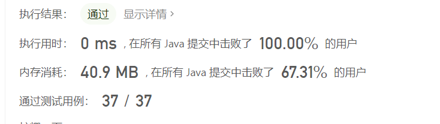

# [1184. 公交站间的距离](https://leetcode.cn/problems/distance-between-bus-stops/)

难度简单82收藏分享切换为英文接收动态反馈

环形公交路线上有 `n` 个站，按次序从 `0` 到 `n - 1` 进行编号。我们已知每一对相邻公交站之间的距离，`distance[i]` 表示编号为 `i` 的车站和编号为 `(i + 1) % n` 的车站之间的距离。

环线上的公交车都可以按顺时针和逆时针的方向行驶。

返回乘客从出发点 `start` 到目的地 `destination` 之间的最短距离。

 

**示例 1：**


```
输入：distance = [1,2,3,4], start = 0, destination = 1
输出：1
解释：公交站 0 和 1 之间的距离是 1 或 9，最小值是 1。
```

 

**示例 2：**


```
输入：distance = [1,2,3,4], start = 0, destination = 2
输出：3
解释：公交站 0 和 2 之间的距离是 3 或 7，最小值是 3。
```

 

**示例 3：**


```
输入：distance = [1,2,3,4], start = 0, destination = 3
输出：4
解释：公交站 0 和 3 之间的距离是 6 或 4，最小值是 4。
```

 

**提示：**

- `1 <= n <= 10^4`
- `distance.length == n`
- `0 <= start, destination < n`
- `0 <= distance[i] <= 10^4`

# 题解

只有两种方式可以从起点到终点：

* 顺时针，遍历从起点到终点，累加所有的距离得到temp1
* 逆时针，简单的来说可以是所有的路程减去temp1得到temp2

比较两个距离，得到最短的距离

```java
public class Solution {
    public int distanceBetweenBusStops(int[] distance, int start, int destination) {
        int res = Integer.MAX_VALUE;
        if (start > destination) {
            int temp = destination;
            destination = start;
            start = temp;
        }

        int temp = 0;
        for (int i = start; i < destination; i++) {
            temp += distance[i];
        }
        res = Math.min(res, temp);
        int sum = 0;
        for (int i = 0; i < distance.length; i++) {
            sum += distance[i];
        }
        res = Math.min(res, sum-res);
        return res;
    }
}
```

* 时间复杂度：$O(n)$
* 空间复杂度：$O(1)$

