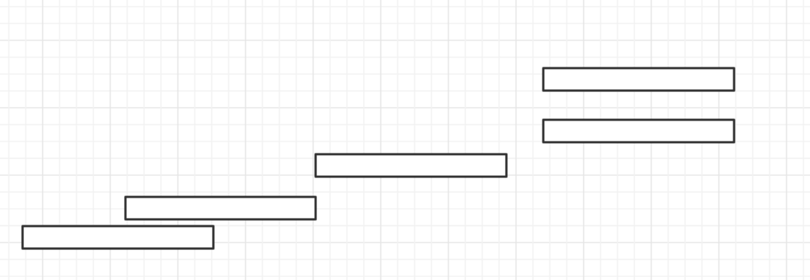
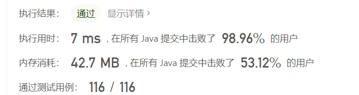

# [757. 设置交集大小至少为2](https://leetcode.cn/problems/set-intersection-size-at-least-two/)

难度困难93收藏分享切换为英文接收动态反馈

一个整数区间 `[a, b]` ( `a < b` ) 代表着从 `a` 到 `b` 的所有连续整数，包括 `a` 和 `b`。

给你一组整数区间`intervals`，请找到一个最小的集合 S，使得 S 里的元素与区间`intervals`中的每一个整数区间都至少有2个元素相交。

输出这个最小集合S的大小。

**示例 1:**

```
输入: intervals = [[1, 3], [1, 4], [2, 5], [3, 5]]
输出: 3
解释:
考虑集合 S = {2, 3, 4}. S与intervals中的四个区间都有至少2个相交的元素。
且这是S最小的情况，故我们输出3。
```

**示例 2:**

```
输入: intervals = [[1, 2], [2, 3], [2, 4], [4, 5]]
输出: 5
解释:
最小的集合S = {1, 2, 3, 4, 5}.
```

**注意:**

1. `intervals` 的长度范围为`[1, 3000]`。
2. `intervals[i]` 长度为 `2`，分别代表左、右边界。
3. `intervals[i][j]` 的值是 `[0, 10^8]`范围内的整数。

# 题解

这道题是典型贪心算法，和其他的排序贪心不同的是，在考虑区间的时候需要从每个区间的右边考虑



* 对原数据按照右边界大小开始排序
* 排序结束之后，查看两个边界是否相交
  * 相交元素超过两个，则不需要添加新的元素
  * 相交元素为1个，需要额外添加一个新的元素
  * 没有相交元素，需要额外添加两个元素
* 输出总共元素个数

代码如下所示

```java
class Solution {
    public int intersectionSizeTwo(int[][] intervals) {
        Arrays.sort(intervals, (a, b) -> a[1] - b[1]);
        int a = intervals[0][1] - 1;
        int b = intervals[0][1];
        int ans = 2;
        for (int i = 1; i < intervals.length; i++) {
            int[] interval = intervals[i];
            int l = interval[0], r = interval[1];
            if (l > b) {
                ans += 2;
                a = r - 1;
                b = r;
            } else if (l == b || l > a) {
                ans += 1;
                a = b;
                b = r;
            }
        }
        return ans;
    }
}
```

* 时间复杂度：$O(n)$
* 空间复杂度：$O(l)$

