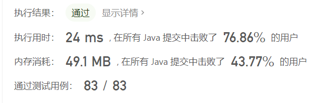

# [剑指 Offer II 115. 重建序列](https://leetcode.cn/problems/ur2n8P/)

难度中等84收藏分享切换为英文接收动态反馈

给定一个长度为 `n` 的整数数组 `nums` ，其中 `nums` 是范围为 `[1，n]` 的整数的排列。还提供了一个 2D 整数数组 `sequences` ，其中 `sequences[i]` 是 `nums` 的子序列。
检查 `nums` 是否是唯一的最短 **超序列** 。最短 **超序列** 是 **长度最短** 的序列，并且所有序列 `sequences[i]` 都是它的子序列。对于给定的数组 `sequences` ，可能存在多个有效的 **超序列** 。

- 例如，对于 `sequences = [[1,2],[1,3]]` ，有两个最短的 **超序列** ，`[1,2,3]` 和 `[1,3,2]` 。
- 而对于 `sequences = [[1,2],[1,3],[1,2,3]]` ，唯一可能的最短 **超序列** 是 `[1,2,3]` 。`[1,2,3,4]` 是可能的超序列，但不是最短的。

*如果 `nums` 是序列的唯一最短 **超序列** ，则返回 `true` ，否则返回 `false` 。*
**子序列** 是一个可以通过从另一个序列中删除一些元素或不删除任何元素，而不改变其余元素的顺序的序列。

 

**示例 1：**

```
输入：nums = [1,2,3], sequences = [[1,2],[1,3]]
输出：false
解释：有两种可能的超序列：[1,2,3]和[1,3,2]。
序列 [1,2] 是[1,2,3]和[1,3,2]的子序列。
序列 [1,3] 是[1,2,3]和[1,3,2]的子序列。
因为 nums 不是唯一最短的超序列，所以返回false。
```

**示例 2：**

```
输入：nums = [1,2,3], sequences = [[1,2]]
输出：false
解释：最短可能的超序列为 [1,2]。
序列 [1,2] 是它的子序列：[1,2]。
因为 nums 不是最短的超序列，所以返回false。
```

**示例 3：**

```
输入：nums = [1,2,3], sequences = [[1,2],[1,3],[2,3]]
输出：true
解释：最短可能的超序列为[1,2,3]。
序列 [1,2] 是它的一个子序列：[1,2,3]。
序列 [1,3] 是它的一个子序列：[1,2,3]。
序列 [2,3] 是它的一个子序列：[1,2,3]。
因为 nums 是唯一最短的超序列，所以返回true。
```

 

**提示：**

- `n == nums.length`
- `1 <= n <= 104`
- `nums` 是 `[1, n]` 范围内所有整数的排列
- `1 <= sequences.length <= 104`
- `1 <= sequences[i].length <= 104`
- `1 <= sum(sequences[i].length) <= 105`
- `1 <= sequences[i][j] <= n`
- `sequences` 的所有数组都是 **唯一** 的
- `sequences[i]` 是 `nums` 的一个子序列

# 题解

官方给的解法是拓扑排序，但是没有理解

简单的方法是构造一棵树，在树中验证是否存在一条链或者路径和nums吻合

```java
class Solution {
    public boolean sequenceReconstruction(int[] nums, int[][] sequences) {
        Map<Integer, Set> hashMap = new HashMap<Integer, Set>();
        for(int[] sequence : sequences) {
            for (int i = 1; i < sequence.length; i++) {
                hashMap.putIfAbsent(sequence[i-1], new HashSet<Integer>());
                hashMap.get(sequence[i-1]).add(sequence[i]);
            }
        }

        for (int i = 1; i < nums.length; i++) {
            if (!hashMap.getOrDefault(nums[i-1], new HashSet<Integer>()).contains(nums[i]))
                return false;
        }

        return true;
    }
}
```

* 时间复杂度：$O(n^2)$
* 空间复杂度：$O(n)$




