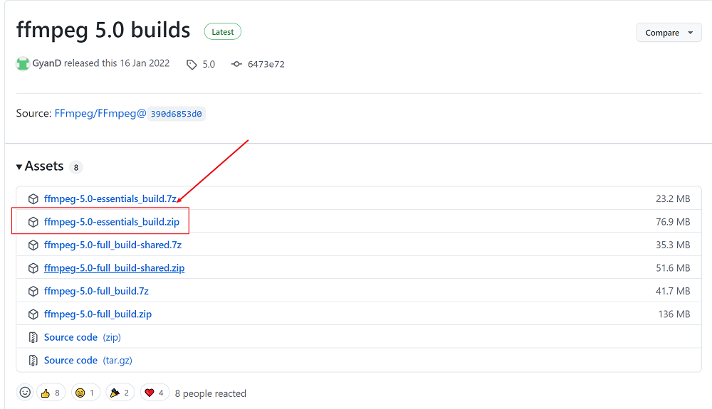
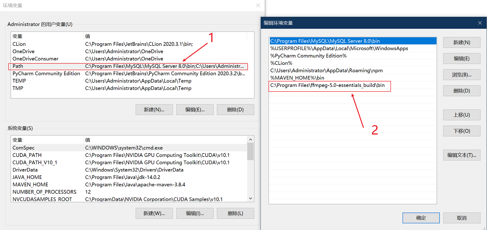

# Monitor报错安装FFmpeg

报错提示没有安装`FFmpeg`，对于Linux或者os X，可以直接安装出错提示通过命令行安装，而对于windows的解决办法可能稍微有点繁琐

首先，下载`ffmpeg`，下载链接：[ffmpeg 5.0](https://github.com/GyanD/codexffmpeg/releases/tag/5.0)



然后解压至对应文件夹，在系统设置的环境变量中的`path`添加解压文件夹的`bin`路径



然后打开命令提示符窗口，输入`ffmpeg -version`查看配置是否成功

```shell
C:\Users\Administrator>ffmpeg -version
ffmpeg version 5.0-essentials_build-www.gyan.dev Copyright (c) 2000-2022 the FFmpeg developers
built with gcc 11.2.0 (Rev5, Built by MSYS2 project)
configuration: --enable-gpl --enable-version3 --enable-static --disable-w32threads --disable-autodetect --enable-fontconfig --enable-iconv --enable-gnutls --enable-libxml2 --enable-gmp --enable-lzma --enable-zlib --enable-libsrt --enable-libssh --enable-libzmq --enable-avisynth --enable-sdl2 --enable-libwebp --enable-libx264 --enable-libx265 --enable-libxvid --enable-libaom --enable-libopenjpeg --enable-libvpx --enable-libass --enable-libfreetype --enable-libfribidi --enable-libvidstab --enable-libvmaf --enable-libzimg --enable-amf --enable-cuda-llvm --enable-cuvid --enable-ffnvcodec --enable-nvdec --enable-nvenc --enable-d3d11va --enable-dxva2 --enable-libmfx --enable-libgme --enable-libopenmpt --enable-libopencore-amrwb --enable-libmp3lame --enable-libtheora --enable-libvo-amrwbenc --enable-libgsm --enable-libopencore-amrnb --enable-libopus --enable-libspeex --enable-libvorbis --enable-librubberband
libavutil      57. 17.100 / 57. 17.100
libavcodec     59. 18.100 / 59. 18.100
libavformat    59. 16.100 / 59. 16.100
libavdevice    59.  4.100 / 59.  4.100
libavfilter     8. 24.100 /  8. 24.100
libswscale      6.  4.100 /  6.  4.100
libswresample   4.  3.100 /  4.  3.100
libpostproc    56.  3.100 / 56.  3.100
```

