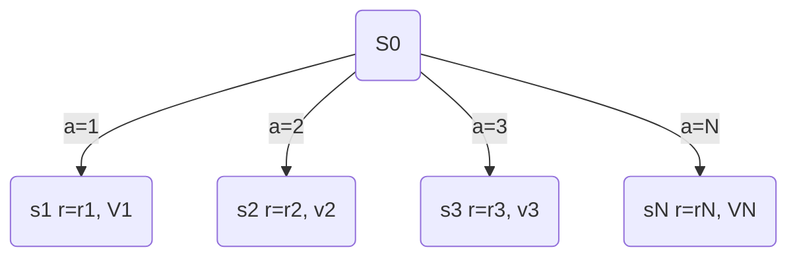
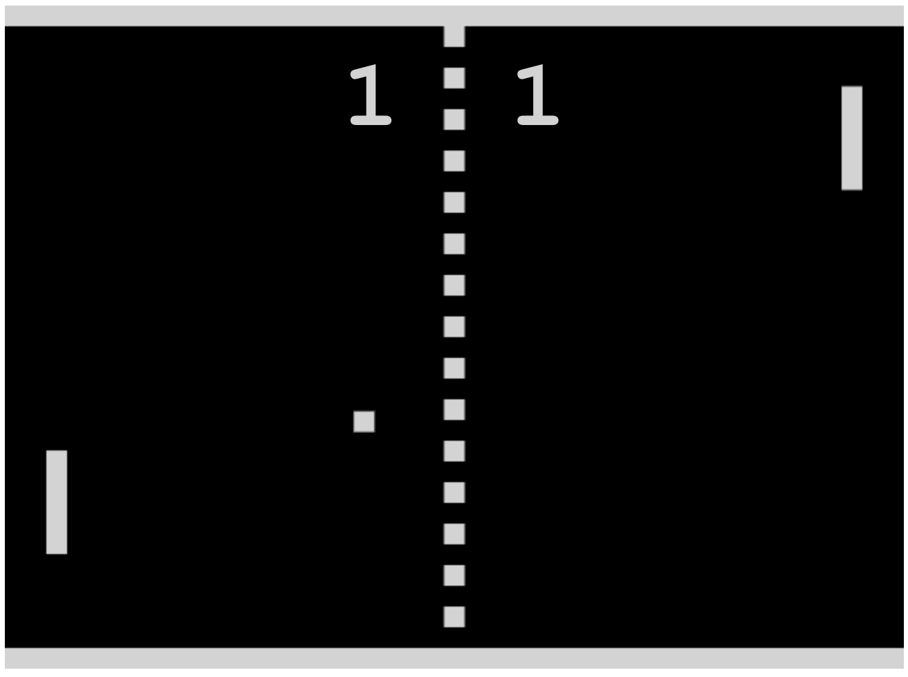
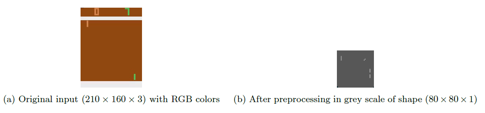
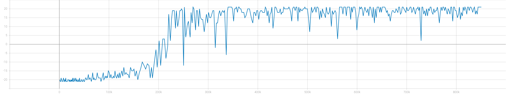

# chap5 Deep Q Networks

QLearning是强化学习中的**value-based**方法，其思想是在当前奖励的衰减的最大估计和当前所得到的奖励当成这一步的现实。类似于动态规划中获取全局最优解可以通过每一步的局部最优完成迭代。

## QLearning决策

$Q$ 是 $Q(s, a)$ 在某一个状态 $S$ 下采取动作 $a$ 动作能够获得收益的期望[<sup>[1]</sup>](#ref-1)，例如当前有两个状态 $S1, S2$ 分别表示同学玩游戏、写作业，对应的动作可以有 $a_1, a_2$。为了成为好学生当然是写作业的状态设置高的奖励，可以定义一个Q表来表示状态 $s$ 和动作 $a$ 之间的关系

| 当前状态 |  a1  |  a2  |
| :------: | :--: | :--: |
|    s1    |  -2  |  1   |
|    s2    |  -4  |  2   |

在上述Q表中，$Q(s_1, a_1)=-2$ 要小于 $Q(s_1, a_2)=1$，所以为了获取更高的奖励分数，agent 选择采取 $a_2$ 动作，状态更新为 $s_2$，然后还是有两个选择 $Q(s_2, a_1)=-4，Q(s_2, a_2）=2$，比较两者之间的大小，选择较大的一个，接着到下一个状态。

这就是QLearning的决策方式。那么问题是Q表如何得来的？

## QLearning更新



要获得最大的结果，也就是当前状态转移之后获得的奖励 $V_0=r_i+V_i$ 最大[<sup>[2]</sup>](#ref-2)，也就是
$$
V_0=\max_{a \in 1 \dots N}(r_a + \gamma V_a)
$$
其中 $\gamma$ 是一个衰减因子

这一点类似于贪婪算法，但是稍微有一点不同，我们不仅仅只是着眼于当前的即时奖励，还需要考虑长期的奖励。上述公式也可以称作为Bellman公式。

将其转换为Q值表现形式
$$
Q(s, a) = r(s, a) + \gamma \max_{a' \in A} Q(s', a')
$$
但是在实际应用中，一半会考虑新Q值和之前Q值的平衡，设置一个平衡参数 $\alpha$
$$
Q(s, a)\leftarrow (1-\alpha) Q(s, a) + \alpha(r + \gamma \max_{a' \in A} Q(s', a')) \\
$$
也可以表示为
$$
Q(s, a)\leftarrow Q(s, a) + \alpha(r + \gamma \max_{a' \in A} Q(s', a') - Q(s, a))
$$

## QLearning整体算法

整体的算法流程如下[<sup>[2]</sup>](#ref-2)：

1. 初始设置 $Q(s, a)$ 表为空
2. 从环境中获取 $s, a, r, s'$
3. 根据Bellman公式更新 $Q(s, a) \leftarrow (1-\alpha) Q(s, a) + \alpha(r + \gamma \max_{a' \in A} Q(s', a'))$
4. 查看是否达到收敛条件，如果没有继续重复2-4，否则停止迭代

## DQN on Pong

这个是一个很老的雅达利游戏 **PongGame**，可以在这个网站尝试一下 [PongGame](http://www.ponggame.org/)



左边是游戏AI控制的，右边是玩家控制，游戏的内容很简单，控制板子击打对方打过来的球，谁没接住就算谁输。在OpenAI gym的规则中，获胜的一方获得1分，输掉的一方扣掉1分。

### Wrappers

在OpenAI gym的Atari环境中，游戏图像大小为 $210 \times 160 \times 3$ 的RGB图像，但是对于我们来说，不需要这么大的彩色图像，首先需要进行预处理，减少数据量，加快运算速度和减少内存消耗。

* 编码：获取目标图片和其前一帧图片之中的像素最大值，消除flickering现象
* 降维：降彩色图片灰度化处理，并且缩放尺寸，得到$84 \times 84 \times 1$ 大小的灰度图像

下图所示(a)为原始的Atari游戏图像，(b)为处理后的灰度图像



然后将预处理后的连续4张图片堆叠在一起，作为最终的输入。四张图片堆叠在一起是为了获取小球和拍的运动方向和速度，单张的图片无法获得这些信息。

### DQN模型

对于之前理论中的Q值，状态列举的很少，可以用Q值表格进行迭代，但是对于PongGame这个环境，预处理之后也还是有 $84 \times 84 \times 1$个状态，如果用表格描述是十分繁琐和困难的。在这篇文献[<sup>[3]</sup>](#ref-3)中提出利用神经网络来近似Q值，这样就可以通过神经网络获得任意动作的Q值。

这里使用的神经网络的架构如下所示：

* $84 \times 84 \times 4$ 输入层 (堆砌4张图片输入)
* 32个尺寸为 $8 \times 8$ 步长4的二维卷积层，加上一个非线性整流层
* 64个尺寸为 $4 \times 4$ 步长为2的二维卷积层，同样有非线性整流层
* 64个尺寸为 $4 \times 4$ 步长为1的二维卷积层
* 全连接层，尺寸为卷积展平的输入，3136
* 中间层，全连接层，512尺寸
* 输出层，动作空间尺寸

如下为`pytorch`构建的模型架构：

```python
import torch
import torch.nn as nn
import numpy as np


class DQN(nn.Module):
    def __init__(self, input_shape, n_actions):
        super(DQN, self).__init__()

        self.conv = nn.Sequential(
            nn.Conv2d(input_shape[0], 32, kernel_size=8, stride=4),
            nn.ReLU(),
            nn.Conv2d(32, 64, kernel_size=4, stride=2),
            nn.ReLU(),
            nn.Conv2d(64, 64, kernel_size=3, stride=1),
            nn.ReLU()
        )

        conv_out_size = self._get_conv_out(input_shape)
        self.fc = nn.Sequential(
            nn.Linear(conv_out_size, 512),
            nn.ReLU(),
            nn.Linear(512, n_actions)
        )

    def _get_conv_out(self, shape):
        o = self.conv(torch.zeros(1, *shape))
        return int(np.prod(o.size()))

    def forward(self, x):
        conv_out = self.conv(x).view(x.size()[0], -1)
        return self.fc(conv_out)

```

为了加快训练速度，在代理初始化的时候，存储了一些环境相关的经验缓存，这些经验缓存是当前观测和目前累积的奖励的集合。

然后开始训练，以下是训练的结果：



经过超过800k次的迭代，奖励稳定在20分左右，也就是完全能够战胜游戏的AI，以下是一个回放测试的视频

<video width="160" height="210" controls>
    <source src="mon\ponggame.mp4" type="video/mp4">
</video>


## 参考

<div id="ref-1"></div>

[1] [莫烦python-强化学习](https://mofanpy.com/tutorials/machine-learning/reinforcement-learning/intro-q-learning/)

<div id="ref-2"></div>

[2]《Deep ReinforcementLearning Hands on Second Edition》

<div id="ref-3"></div>

[3] [Mnih V ,  Kavukcuoglu K ,  Silver D , et al. Playing Atari with Deep Reinforcement Learning[J]. Computer Science, 2013.](https://arxiv.org/abs/1312.5602)


