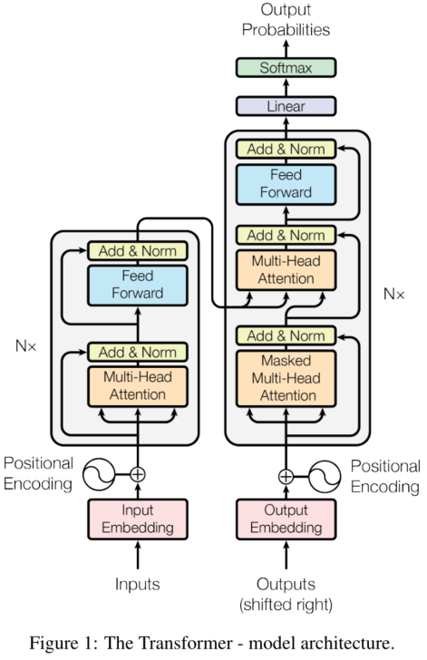
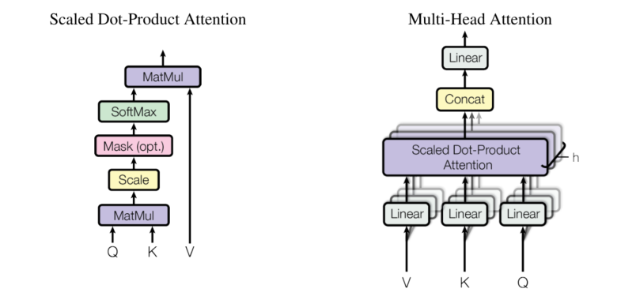

# Attention is all you need 笔记

## 引入

对于RNN来说，并行计算很难实现，需要按照时序计算

注意力机制的提升是可以实现并行计算

## 模型架构

模型的架构如下图所示

### 编码器和解码器

模型主要是由两个大模块组成：

* 编码器

  * Multi-Head Attention
  * Feed Forward

  上述两个层重复堆叠N次组成编码器

* 解码器

  * 在编码器前加上一个Masked Multi-Head Attention

### 注意力机制

对于注意力机制来说，主要的计算其实是矩阵乘法，从文章中的 Scaled Dot-Product Attention 来说，计算主要是关于 Q(Query), K(key) 以及 V(Value)的矩阵乘法
$$
\rm{Attention} \it (Q, K, V) = \rm softmax \it(\frac{QK^T}{\sqrt{d_k}})V
$$
单个计算比较缓慢，并行计算可以大幅度地提高运行速度，transformer 提出将 Q, K, V 线性投影，然后并行执行注意力机制计算，即 Multi-Head Attention
$$
MultiHead(Q, K, V) = Concat(head1, \dots, head_h)W^o \\
\qquad where \ head_i = Attention(QW_i^Q, KW_i^K, VW_i^V)
$$

### 前馈神经网络

编码层以及解码层的最后一层是 Position-wise Feed-Forward Networks

实际上应该说是 MLP ，激活函数为ReLU
$$
FFN(x) = max(0, xW_1+b_1)W_2 + b2
$$
第一层的输入维度为2048，输出层为512

### 嵌入层

这一层的主要作用是将输入的 token 转换为向量，两个嵌入层之间共享相同的权重矩阵

### Positional Encoding

位置编码信息，也可以理解为时序信息，主要的方式是根据每个词在序列中的位置，通过函数计算一个值，然后和嵌入层计算的向量相加，该函数为：
$$
PE(pos, 2i) = \sin(pos/10000^{2i/d_{model}}) \\
PE(pos, 2i+1) = \cos(pos/10000^{2i/d_{model}})
$$

