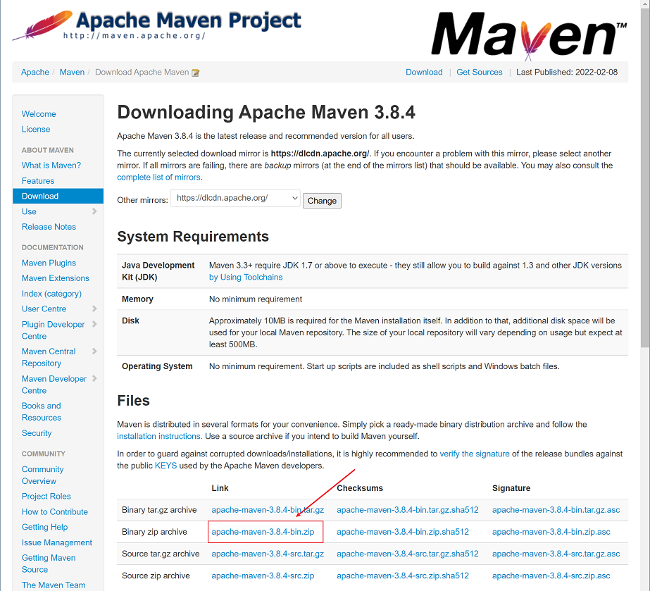
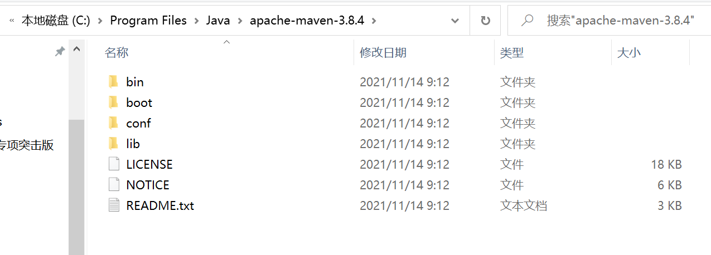
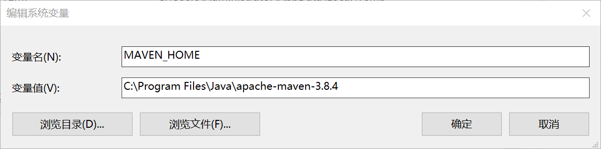
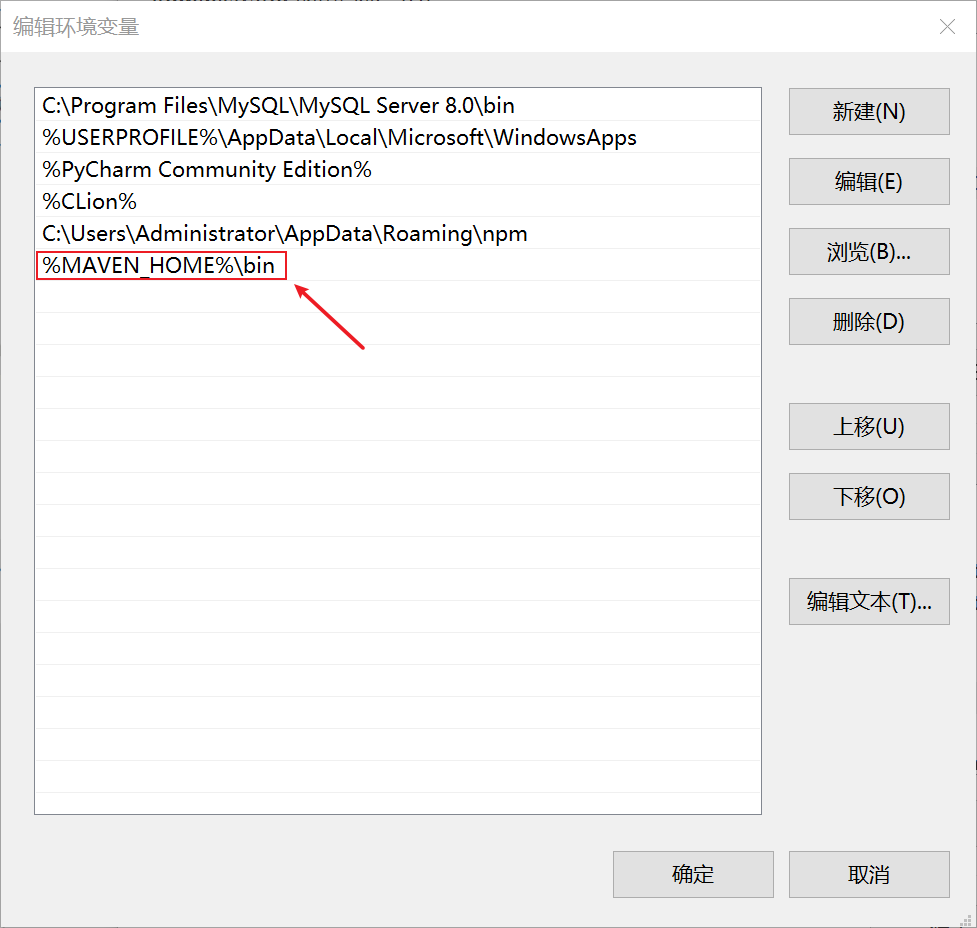
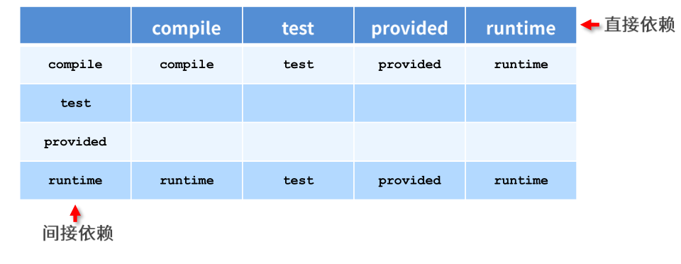

# Maven基础

`Maven`是Apache公司的一个开源项目，主要用来管理java项目，对`jar`包进行统一的管理，为了方便之后编写java项目，尝试学习一下`Maven`的操作

## Maven下载配置

### Maven下载

直接从官网[^1]下载：[Maven官网下载地址](https://maven.apache.org/download.cgi)



将下载好的jar包解压到磁盘中



> 将解压后文件夹放在想要保存的路径下，笔者这里选择的是`C:\Program Files\Java\`路径，放在`Java`同级路径下，方便同一管理

### 环境变量配置

然后就是配置环境变量，在系统变量中添加`MAVEN_HOME`，变量值为`MAVEN`的路径，笔者这里是`C:\Program Files\Java\apache-maven-3.8.4`



然后在用户变量中找到`Path`，双击之后在后面添加`%MAVEN_HOME%\bin`



然后打开命令行窗口查看是否配置成功，输入命令行`mvn -v`


这里就成功地完成了Maven的下载和配置，但是还有重要的一步就是镜像源的设置，`Maven`默认的镜像源在国外，下载比较缓慢，这里修改为国内的镜像源

### 本地仓库配置

找到`maven`放的文件夹`apache-maven-3.8.4\conf\settings.xml`，找到其中

```xml
<settings xmlns="http://maven.apache.org/SETTINGS/1.2.0"
          xmlns:xsi="http://www.w3.org/2001/XMLSchema-instance"
          xsi:schemaLocation="http://maven.apache.org/SETTINGS/1.2.0 https://maven.apache.org/xsd/settings-1.2.0.xsd">
  <!-- localRepository
   | The path to the local repository maven will use to store artifacts.
   |
   | Default: ${user.home}/.m2/repository
  <localRepository>/path/to/local/repo</localRepository>
  -->
```

可以看到默认本地仓库在`user/.m2/repository`

可以在这儿添加

```xml
<settings xmlns="http://maven.apache.org/SETTINGS/1.2.0"
          xmlns:xsi="http://www.w3.org/2001/XMLSchema-instance"
          xsi:schemaLocation="http://maven.apache.org/SETTINGS/1.2.0 https://maven.apache.org/xsd/settings-1.2.0.xsd">
  <!-- localRepository
   | The path to the local repository maven will use to store artifacts.
   |
   | Default: ${user.home}/.m2/repository
  <localRepository>/path/to/local/repo</localRepository>
  -->
  <localRepository>/path/to/local/repo</localRepository>
```

其中`/path/to/local/repo`为本地想要保存仓库的路径，如果进行了磁盘分区，可以将这个路径设置在专用保存的磁盘，没有分区的就不需要这样麻烦操作了

### 镜像源修改

找到之前`Maven`解压之后的文件路径`C:\Program Files\Java\apache-maven-3.8.4\conf`，在该文件路径下有一个`settings.xml`，打开该文件，用记事本或者其他编辑器都可以，修改其中的镜像源信息

```xml
<mirrors>
    <mirror>
        <id>alimaven</id>
        <name>aliyun maven</name>
        <url>http://maven.aliyun.com/nexus/content/groups/public/</url>
        <mirrorOf>central</mirrorOf>
    </mirror>
    <mirror>
        <id>central</id>
        <name>Maven Repository Switchboard</name>
        <url>http://repo1.maven.org/maven2/</url>
        <mirrorOf>central</mirrorOf>
    </mirror>
    <mirror>
        <id>repo2</id>
        <mirrorOf>central</mirrorOf>
        <name>Human Readable Name for this Mirror.</name>
        <url>http://repo2.maven.org/maven2/</url>
    </mirror>
    <mirror>
        <id>ibiblio</id>
        <mirrorOf>central</mirrorOf>
        <name>Human Readable Name for this Mirror.</name>
        <url>http://mirrors.ibiblio.org/pub/mirrors/maven2/</url>
    </mirror>
    <mirror>
        <id>jboss-public-repository-group</id>
        <mirrorOf>central</mirrorOf>
        <name>JBoss Public Repository Group</name>
        <url>http://repository.jboss.org/nexus/content/groups/public</url>
    </mirror>
    <!-- 中央仓库在中国的镜像 -->
    <mirror>
        <id>maven.net.cn</id>
        <name>oneof the central mirrors in china</name>
        <url>http://maven.net.cn/content/groups/public/</url>
        <mirrorOf>central</mirrorOf>
    </mirror>
  </mirrors>
```

到这一步基本上就完成了`Maven`的下载和配置

## 第一个Maven项目

### 使用IDEA创建Maven项目

打开IDEA，选择`File->New->Project`，然后选择`Maven`，再选择对应的`Project SDK`，之后直接点击`Next`


然后在弹出的窗口中选择项目`Name`，这个可以自定义，然后就是项目存放地址，注意养成良好的项目管理习惯，最后点击`Finish`


然后就完成了IDEA创建`Maven`项目，如果有需要的插件需要添加到项目中，可以在[MVN REPOSITORY](https://mvnrepository.com/)[^2]中搜索对应的依赖，然后将对应的代码贴在`Maven`项目下的`pom.xml`文件中的对应位置


然后在`pom.xml`文件编辑页面点击右键，选择`Maven->Reload project`


### 创建Mavan项目

可以直接通过Idea创建一个仓库，修改项目中的依赖

> 关于Idea如何创建项目工程就不赘述了，博客有很多类似的教程

项目的文件树如下所示：

```shell
C:.
│  pom.xml
│
├─.idea
│      .gitignore
│      compiler.xml
│      jarRepositories.xml
│      misc.xml
│      vcs.xml
│      workspace.xml
│
└─src
    ├─main
    │  ├─java
    │  │  └─com
    │  │      └─itheima
    │  │              Demo.java
    │  │
    │  └─resources
    └─test
        ├─java
        │  └─com
        │      └─itheima
        │              DemoTest.java
        │
        └─resources
```

当然，为了更好地理解并且方便后续在服务器上使用（主要是为了装逼），可以尝试使用命令行的方式创建

* 创建工程

  ```shell
  mvn archetype:generate 
      -DgroupId={project-packaging}  
      -DartifactId={project-name} 
      -DarchetypeArtifactId=maven-archetype-quickstart
      -DinteractiveMode=false
  ```

* 创建`java`工程

  ```shell
  mvn archetype:generate -DgroupId=com.itheima -DartifactId=maven-test -DarchetypeArtifactId=maven-archetype-quickstart -Dversion=0.0.1-snapshot -DinteractiveMode=false
  ```

* 创建`web`工程

  ```shell
  mvn archetype:generate -DgroupId=com.itheima -DartifactId=web-project -DarchetypeArtifactId=maven-archetype-webapp -Dversion=0.0.1-snapshot -DinteractiveMode=false
  ```

### Maven命令

* 编译

  ```shell
  mvn compile
  ```

  编译之后会在根目录生成一个`target`文件夹，如果编译的结果不想要，可以执行

* 清除

  ```shell
  mvn clean
  ```

* 测试

  ```shell
  mvn test
  ```

  `test`命令运行之后，在根目录的文件路径`target\surefire-reports\com.xxxx.xxx.txt`文件中有测试结果，同一目录下另一个文件夹的文件`.xml`是详细的测试结果

* 打包

  ```shell
  mvn package
  ```

  首先进行编译，测试，然后是打包

* 安装

  ```shell
  mvn install
  ```

  将打包之后的包放在仓库中

> 在运行编译命令的时候遇到了这个提示信息
>
> ```shell
> [ERROR] COMPILATION ERROR :
> [ERROR] 不再支持源选项 6。请使用 7 或更高版本。
> [ERROR] 不再支持目标选项 6。请使用 7 或更高版本。
> [INFO] 2 errors
> [INFO] -------------------------------------------------------------
> [INFO] ------------------------------------------------------------------------
> [INFO] BUILD FAILURE
> [INFO] ------------------------------------------------------------------------
> [INFO] Total time:  0.665 s
> [INFO] Finished at: 2022-03-03T14:41:49+08:00
> [INFO] ------------------------------------------------------------------------
> [ERROR] Failed to execute goal org.apache.maven.plugins:maven-compiler-plugin:3.1:compile (default-compile) on project java01: Compilation failure: Compilation failure:
> [ERROR] 不再支持源选项 6。请使用 7 或更高版本。
> [ERROR] 不再支持目标选项 6。请使用 7 或更高版本。
> [ERROR] -> [Help 1]
> [ERROR]
> [ERROR] To see the full stack trace of the errors, re-run Maven with the -e switch.
> [ERROR] Re-run Maven using the -X switch to enable full debug logging.
> [ERROR]
> [ERROR] For more information about the errors and possible solutions, please read the following articles:
> [ERROR] [Help 1] http://cwiki.apache.org/confluence/display/MAVEN/MojoFailureException
> PS C:\Users\Administrator\Documents\codes\notes\java-notes\maven\codes\maven-project\java01> mvn compile
> [INFO] Scanning for projects...
> 
> ```
>
> 可以在`pom.xml`中添加`mavan-compiler-plugin`，以下是`pom.xml`文件的示例，其中`finalName`指定的是项目打包之后的名称，可以修改为自己项目名
>
> ```xml
> <build>
>  <finalName>java01</finalName>
> 
>      <plugins>
>          <plugin>
>              <groupId>org.apache.maven.plugins</groupId>
>              <artifactId>maven-compiler-plugin</artifactId>
>              <configuration>
>                  <source>1.7</source>
>                  <target>1.7</target>
>              </configuration>
>          </plugin>
>      </plugins>
> 
>  </build>
> ```
>
> 修改之后，再次`mvn compile`，编译成功

## Maven依赖

### 依赖配置

```xml
<dependencies>
    
    <dependency>
        <groupId>log4j</groupId>
        <artifactId>log4j</artifactId>
        <version>1.2.12</version>
    </dependency>
   <!--...-->
</dependencies>
```

* 依赖传递
  * 直接依赖：在当前项目中通过依赖配置建立的依赖关系
  * 间接依赖：被依赖的资源如果依赖其他资源，当前项目间接依赖其他资源

> 对于`Maven`项目，可能会出现不同版本的依赖，这种情况叫做**依赖传递冲突问题**

### 依赖传递冲突问题

* **路径优先**：当依赖中出现相同的资源时，层级越深，优先级越低，**层级越浅，优先级越高**
* **声明优先**：当资源在相同层级被依赖时，配置顺序靠前的覆盖配置顺序靠后的
* **特殊优先**：当同级配置了相同资源的不同版本，后配置的覆盖先配置的

### 可选依赖

对外隐藏当前所依赖的资源

```xml
<dependency>
    <groupId>junit</groupId>
    <artifactId>junit</artifactId>
    <version>4.12</version>
    <optional>true</optional>
</dependency>
```

### 排除依赖

主动断开依赖的资源，被排除的资源无需指定版本

```xml
 <dependency>
     <groupId>com.itheima</groupId>
     <artifactId>project03</artifactId>
     <version>1.0-SNAPSHOT</version>
     
     <exclusions>
         <exclusion>
             <groupId>log4j</groupId>
             <artifactId>log4j</artifactId>
         </exclusion>
     </exclusions>
</dependency>
```

### 依赖范围

依赖的`jar`默认情况可以在任何地方使用，可以通过`scope`标签设定作用范围

作用范围

* 主程序范围有限`main`文件夹范围内
* 测试程序范围有效 `test`文件夹范围内
* 是否参与打包 `package`指令范围内


### 依赖范围传递性

带有传递范围的资源在进行传递时，作用范围将受到影响



## 生命周期与插件

### 项目构建生命周期

`Maven`构建生命周期描述的是一次构建过程经历的时间

`compile`->`test-compile`->`package`->`install`

`Maven`对项目构建的生命周期划分为3套

* `clean`：清理工作

  * `pre-clean`：执行一些需要在`clean`之前完成的工作
  * `clean`：移除所有上一次构建完成的文件
  * `post-clean`：执行一些需要在`clean`之后立刻完成的工作

* `default`：核心工作，例如编译、测试、打包、部署等

  * 如果执行`compile`，那么包括`compile`之前的命令都会执行

  

* `site`：产生报告，发布站点等

  * `pre-site`：执行一些需要生成站点文档之前完成的工作
  * `site`：生成项目的站点文档
  * `post-site`：执行一些需要在生成站点文档之后完成的工作，并且为部署做准备
  * `site-deploy`：将生成的站点文档部署都特定的服务器上

> 生命周期控制的是在执行任务的过程，每个过程对应一个插件

### 插件

* 插件与生命周期内的阶段绑定，在执行到对应生命周期时执行对应的插件功能
* 默认`maven`在各个生命周期上绑定有预设的功能
* 通过插件可以自定义其他功能

```xml
<build>
        <plugins>
            <plugin>
                <groupId>org.apache.maven.plugins</groupId>
                <artifactId>maven-source-plugin</artifactId>
                <version>2.2.1</version>
                <executions>
                    <execution>
                        <goals>
                            <goal>jar</goal>
                            <goal>test-jar</goal>
                        </goals>
                        <phase>generate-test-resources</phase>
                    </execution>
                </executions>
            </plugin>
        </plugins>
    </build>
```


## 参考

[^1]: [Maven官网](https://maven.apache.org/download.cgi)
[^2]: [MVN REPOSITORY](https://mvnrepository.com/)
