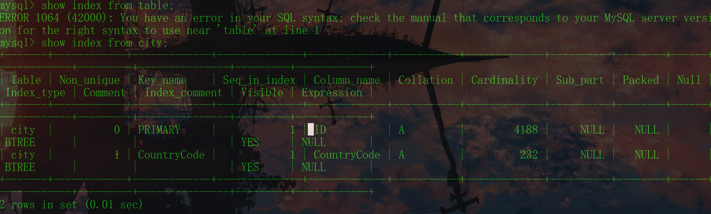

# MySQL基础

`MySQL `是一个关系型数据库管理系统，由瑞典 MySQL AB 公司开发，目前属于 Oracle 公司。MySQL 是一种关联数据库管理系统，关联数据库将数据保存在不同的表中，而不是将所有数据放在一个大仓库内，这样就增加了速度并提高了灵活性。最主要的一点就是`MySQL`是开源的。

首先直接安装对应系统的`MySQL`，安装教程可以直接参考其他博客，如果安装过的话可以直接去[MySQL官网](https://www.mysql.com/)下载

## 启动停止服务

安装成功后，在 `windows`下打开命令行窗口输入命令行启动或停止 `MySQL`服务：

启动 `MySQL`服务

```shell
sunet start mysql
```

停止 `MySQL`服务

```shell
net stop mysql
```

如果出现一下情况，说明系统没有注册 `MySQL`服务，需要注册[<sup>[1]</sup>](#ref-1)

```shell
C:\Users\Administrator>net start mysql
服务名无效。

请键入 NET HELPMSG 2185 以获得更多的帮助。
```

注册流程如下：

* 以管理员方式打开命令行窗口
* 找到 `MySQL`安装路径下的 `bin`路径，利用 `cd`命令切换到该路径下
* 输入命令行 `mysqld --install`
* 出现 `Service successfully installed.`表示注册成功

## 登录MySQL

安装完成之后，服务也正常启动之后，那么就是登录操作了，可以通过以下方式启动

* 还是打开命令行窗口
* 输入命令行`mysql -u root -p passwd`，其中`-u`后面是安装的时候的用户名，默认`root`，`passwd`是自己安装的时候设置的密码，如果密码错误可以查找博客找到安装的时候系统初始化的密码

操作完成之后想要退出`MySQL`命令行，可以输入`exit`

## 常用命令

* 查看版本号：`select version;`

  ```mysql
  mysql> select version();
  +-----------+
  | version() |
  +-----------+
  | 8.0.27    |
  +-----------+
  1 row in set (0.00 sec)
  ```

* 查看有哪些数据库:：`show databases;`

  ```mysql
  mysql> show databases;
  +--------------------+
  | Database           |
  +--------------------+
  | graph              |
  | information_schema |
  | labmanage          |
  | mysql              |
  | performance_schema |
  | sakila             |
  | sys                |
  | world              |
  +--------------------+
  8 rows in set (0.01 sec)
  ```

  可以看到以上结果，有一些数据库是笔者之前创建过的一些，但是`MySQL`安装的时候会自带一些数据库

* 使用某个数据库： `use world;`

  ```mysql
  mysql> use world;
  Database changed
  mysql> show tables;
  +-----------------+
  | Tables_in_world |
  +-----------------+
  | city            |
  | country         |
  | countrylanguage |
  +-----------------+
  3 rows in set (0.01 sec)
  ```

  可以看到数据库已经改变，也同样可以`show tables;`查看数据库对应的表

  如果不清楚使用的哪个数据库可以使用`select database();`

* 创建数据库：`create database test;`

  ```mysql
  mysql> create database test;
  Query OK, 1 row affected (0.01 sec)
  
  mysql> show databases;
  +--------------------+
  | Database           |
  +--------------------+
  | graph              |
  | information_schema |
  | labmanage          |
  | mysql              |
  | performance_schema |
  | sakila             |
  | sys                |
  | test               |
  | world              |
  +--------------------+
  9 rows in set (0.00 sec)
  ```

* 删除数据库：`drop database test;`

  ```mysql
  mysql> drop database test;
  Query OK, 0 rows affected (0.01 sec)
  
  mysql> show databases;
  +--------------------+
  | Database           |
  +--------------------+
  | graph              |
  | information_schema |
  | labmanage          |
  | mysql              |
  | performance_schema |
  | sakila             |
  | sys                |
  | world              |
  +--------------------+
  8 rows in set (0.00 sec)
  ```

* 查看命令：`select * from table;`其中`table`替换为要查看数据的`table`名称

> `MySQL`的命令不区分大小写
>
> `MySQL`的命令不见分号不结束

## 表

* 数据库中的基本单元是表，是一种存储数据的方式，表比较直观
* 任何一张表都有行和列
  * 行(row)：被称为数据/记录
  * 列(column)：被称为字段，每一个字段都有字段名，数据类型，约束等属性

* 查看数据下有哪些表：`show tables;`

  ```mysql
  mysql> use world;
  Database changed
  mysql> show tables;
  +-----------------+
  | Tables_in_world |
  +-----------------+
  | city            |
  | country         |
  | countrylanguage |
  +-----------------+
  3 rows in set (0.00 sec)
  ```

* 查看数据表的属性，属性类型，主键信息等，也就是查看有哪些列：`show columns from table;`

  ```mysql
  mysql> show columns from city;
  +-------------+----------+------+-----+---------+----------------+
  | Field       | Type     | Null | Key | Default | Extra          |
  +-------------+----------+------+-----+---------+----------------+
  | ID          | int      | NO   | PRI | NULL    | auto_increment |
  | Name        | char(35) | NO   |     |         |                |
  | CountryCode | char(3)  | NO   | MUL |         |                |
  | District    | char(20) | NO   |     |         |                |
  | Population  | int      | NO   |     | 0       |                |
  +-------------+----------+------+-----+---------+----------------+
  5 rows in set (0.01 sec)
  ```

* 显示数据表的详细索引信息，包括PRIMARY KEY（主键）：`show index from table;`

  

* 查看数据库管理系统的性能及统计信息：`show table status from database;`

  

* 查看表的结构`desc table;`

  ```mysql
  +----------+-------------+------+-----+---------+-------+
  | Field    | Type        | Null | Key | Default | Extra |
  +----------+-------------+------+-----+---------+-------+
  | EMPNO    | int         | NO   | PRI | NULL    |       |
  | ENAME    | varchar(10) | YES  |     | NULL    |       |
  | JOB      | varchar(9)  | YES  |     | NULL    |       |
  | MGR      | int         | YES  |     | NULL    |       |
  | HIREDATE | date        | YES  |     | NULL    |       |
  | SAL      | double(7,2) | YES  |     | NULL    |       |
  | COMM     | double(7,2) | YES  |     | NULL    |       |
  | DEPTNO   | int         | YES  |     | NULL    |       |
  +----------+-------------+------+-----+---------+-------+
  8 rows in set (0.00 sec)
  ```

  

## Java连接MySQL

MySQL升级到8.0版本以上之后同`5.0`版本不太一样，需要注意检查版本号仔细安装

作为参考笔者的`MySQL`版本是`8.0.27`

```mysql
C:\Users\Administrator>mysql --version
mysql  Ver 8.0.27 for Win64 on x86_64 (MySQL Community Server - GPL)
```

然后通过`IDEA`创建一个`Maven`项目，可以查看[MAVEN配置](../../java相关配置/MAVEN配置.md)了解如何配置`Maven`以及创建`Maven`项目

创建完成之后在项目根目录中的`pom.xml`文件中添加对应的`mysql-connector-java`依赖，这个项目目前仅需要这一个依赖

```xml
<dependencies>
        <dependency>
            <groupId>mysql</groupId>
            <artifactId>mysql-connector-java</artifactId>
            <version>8.0.27</version>
        </dependency>
    </dependencies>
```

在当前编辑页面点击右键，然后选择`Maven->Reload project`重新加载项目下载依赖项

然后选择`src->main->java`创建一个`main.java`文件，添加以下代码

```java
import java.sql.Connection;
import java.sql.DriverManager;
import java.sql.ResultSet;
import java.sql.Statement;

public class main {
    public static void main(String[] args){

        String driverName = "com.mysql.cj.jdbc.Driver";
        String dbURL="jdbc:mysql://localhost:3306/world";  //world为数据库名
        String userName = "root";
        String userPwd = "219admin";
        Connection con = null;
        try {
            Class.forName(driverName);
            con= DriverManager.getConnection(dbURL, userName, userPwd);
            System.out.println("连接数据库成功");
            Statement stmt = con.createStatement();
            String sql = "select Code, Name, Population from country";
            ResultSet resSet = stmt.executeQuery(sql);
            while(resSet.next()) {
                String code = resSet.getString("Code");
                String Name = resSet.getString("Name");
                String countryCode = resSet.getString("Population");

                System.out.println(code + "\t" + Name + "\t" + countryCode);
            }
        }  catch (Exception e) {
            e.printStackTrace();
            System.out.print("连接失败");
        }
    }
}

```

将`userName`以及`userPwd`修改为自己数据库的账号和密码就可以`ALT+shift+F10`运行该代码，可以看到以下输出

```mysql
连接数据库成功
ABW	Aruba	103000
AFG	Afghanistan	22720000
AGO	Angola	12878000
AIA	Anguilla	8000
... ...
```


## 参考

<div id="ref-1"></div>

1. [cmd中输入net start mysql 提示：服务名无效或者MySQL正在启动 MySQL无法启动](https://blog.csdn.net/ermaner666/article/details/79096939/)

   
