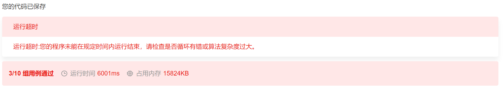

# 字节跳动2018大数据方向(第一批)

# 编程题1

时间限制：C/C++ 1秒，其他语言2秒

空间限制：C/C++ 32M，其他语言64M

P为给定的二维平面整数点集。定义 P 中某点x，如果x满足 P 中任意点都不在 x 的右上方区域内（横纵坐标都大于x），则称其为“最大的”。求出所有“最大的”点的集合。（所有点的横坐标和纵坐标都不重复, 坐标轴范围在[0, 1e9) 内）

如下图：实心点为满足条件的点的集合。请实现代码找到集合 P 中的所有 ”最大“ 点的集合并输出。


## **输入描述:**

```
第一行输入点集的个数 N， 接下来 N 行，每行两个数字代表点的 X 轴和 Y 轴。
对于 50%的数据,  1 <= N <= 10000;
对于 100%的数据, 1 <= N <= 500000;
```


## **输出描述:**

```
输出“最大的” 点集合， 按照 X 轴从小到大的方式输出，每行两个数字分别代表点的 X 轴和 Y轴。
```


## **输入例子1:**

```
5
1 2
5 3
4 6
7 5
9 0
```


## **输出例子1:**

```
4 6
7 5
9 0
```

## 题解


# 编程题2

时间限制：C/C++ 3秒，其他语言6秒

空间限制：C/C++ 128M，其他语言256M

给定一个数组序列, 需要求选出一个区间, 使得该区间是所有区间中经过如下计算的值最大的一个：

区间中的最小数 * 区间所有数的和最后程序输出经过计算后的最大值即可，不需要输出具体的区间。如给定序列  [6 2 1]则根据上述公式, 可得到所有可以选定各个区间的计算值:

 

[6] = 6 * 6 = 36;

[2] = 2 * 2 = 4;

[1] = 1 * 1 = 1;

[6,2] = 2 * 8 = 16;

[2,1] = 1 * 3 = 3;

[6, 2, 1] = 1 * 9 = 9;

 

从上述计算可见选定区间 [6] ，计算值为 36， 则程序输出为 36。

区间内的所有数字都在[0, 100]的范围内;


## **输入描述:**

```
第一行输入数组序列长度n，第二行输入数组序列。
对于 50%的数据,  1 <= n <= 10000;
对于 100%的数据, 1 <= n <= 500000;
```


## **输出描述:**

```
输出数组经过计算后的最大值。
```


## **输入例子1:**

```
3
6 2 1
```


## **输出例子1:**

```
36
```

## 题解


### 直接暴力循环

通过了三个测试案例，但是超时，暂时没有好的方法·

```java
import java.util.*;

public class Main {

    public static void main(String[] args) {
        Scanner scanner = new Scanner(System.in);
        int n = scanner.nextInt();
        int[] nums = new int[n];
        for (int i = 0; i < n; i++)
            nums[i] = scanner.nextInt();

        int[] pre_sum = new int[n+1];
        for (int i = 1; i <= n; i++) {
            pre_sum [i] = pre_sum[i-1] + nums[i-1];
        }

        int res = -1;
        for (int i = 0; i < n; i++)
            res = Math.max(res, dfs(nums, pre_sum, i, n-1));

        System.out.println(res);

    }

    public static int dfs(int[] nums, int[] pre_sum, int start, int end){
        int res = -1;
        // 结尾从start->end，开始遍历区间
        for (int i = start; i <= end; i++) {
            int max_v = Integer.MAX_VALUE;
            // 找到区间中最大值
            for (int j = start; j <= i; j++) {
                max_v = Math.min(max_v, nums[j]);
            }
            int length = pre_sum[i+1]-pre_sum[start];
            res = Math.max(res, max_v * length);
        }
        return res;
    }

}
```

