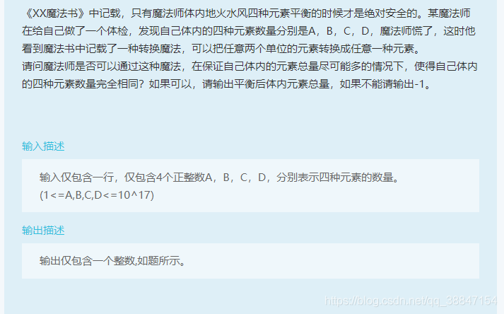

# 广联达笔试

# 2020-8-26

## 跳舞机


**题解**

主要是熟悉`Java`的输入输出

```Java
import java.util.Scanner;

public class Main {

    public static void main(String[] args) {
        Scanner scanner = new Scanner(System.in);
        int score=0;

        while(scanner.hasNext()) {
            String a = scanner.nextLine();
            String b = scanner.nextLine();
            char[] chars1 = a.toCharArray();
            char[] chars2 = b.toCharArray();

            int l = 0;
            int r = a.length();

            while(l < r) {
                if (chars1[l] == chars2[l]) {
                    score += 20;
                    l++;
                }else {
                    score = score >= 10 ? score - 10 : 0;
                    l++;
                }
            }
            System.out.println(score);

    	}
	}
}
```

## 元素平衡



> 样例输入
> 1 2 2 4
> 样例输出
> 8
> 提示
> 只要把第四种元素中的两个转换为第一种元素即平衡.

题解

```java
import java.util.Scanner;

public class Main {

    public static void main(String[] args) {
        Scanner scanner = new Scanner(System.in);


        while(scanner.hasNext()) {
            long[] eles = new long[4];
            int sum = 0;
            for (int i = 0; i < 4; i++) {
                eles[i] = scanner.nextLong();
                sum += eles[i];
            }
            long avg = sum / 4;
            long l = 0, r=0;
            for (int i = 0; i < 4; i++) {
                long sub = eles[i] - avg;
                if (sub < 0)
                    l -= sub;
                else if (sub > 0)
                    r += sub;
            }

            long x = 2 * l - r;

            if (x <= 0)
                System.out.println(avg*4);
            else
                System.out.println((long)(avg-Math.ceil(((double)x)/4))*4);
        }
    }
}
```

## 排序


题解

找到一个最大的逆序的元素，答案就是小于等于这个元素的个数，因为这些小于等于这个元素的数全都得提到前面去。

比如2，1，3，4，最大的逆序值是1；

比如2，1，3，5，4，最大的逆序值是4；

找这个元素的可以用栈来找，把第一个数压栈，后面遇到大于栈顶的元素直接压栈，遇到小于的拿出来和当前最大的逆序数比较，更新一下最大值。

```java
import java.util.Scanner;
import java.util.Stack;

public class Main {

    public static void main(String[] args) {
        Scanner scanner = new Scanner(System.in);
        int n = scanner.nextInt();
        int[] nums = new int[n];
        Stack<Integer> stack = new Stack<>();

        int minRev = 0;
        for (int i = 0; i < n; i++) {
            nums[i] = scanner.nextInt();
            if (!stack.isEmpty() && stack.peek() > nums[i])
                minRev = Math.max(minRev, nums[i]);
            else
                stack.push(nums[i]);
        }

        if (minRev == 0) {
            System.out.println(0);
            return ;
        }


        int cnt = 0;
        for (int i = 0; i < n; i++)
            if (nums[i] <= minRev)
                cnt++;
        System.out.println(cnt);
    }
}
```

# 2022-5-10

题目类型：

* 20道Java相关选择题

* 40道行测题

* 1道编程题

### 编程题

**题目**：假设有n个面试官，每个面试者预约的时间是$[a_i, b_i]$（包括边界），1号面试官在 $b_i$ 时刻结束后，至多能继续 $b_{i+1}$ 时刻开始的面试，请帮忙计算1号面试官至多能面试多少个面试者

**样例输入**：先输入一个n，表示有n个面试预约时间，之后有两行输入，每一行有n个数字，第一行表示为$a_i$，第二行表示为$b_i$

**样例输出**：输出1号面试者至多能面试多少个面试者

> 样例输入
>
> ```
> 4
> 1 2 1 4
> 3 5 4 5
> ```
>
> 样例输出
>
> ```
> 2
> ```
>
> 只有`[1, 3]`和`[4, 5]`时间能够兼容，其他时间不能，此时智能面试1号和4号面试者，所以答案为2

题解

将面试时间根据结束时间从小到大，如果结束时间相同，开始时间从小到达排序，然后从第一个面试时间开始，查看之后的面试时间是否晚于前一个面试时间的`end`，如果小于，那么记录`endtime`，计数加一，继续迭代直到数组遍历结束

```java
import java.util.*;

public class Main {

    public static void main(String[] args) {
        Scanner scanner = new Scanner(System.in);
        int n = scanner.nextInt();
        int[][] times = new int[n][2];
        for (int i = 0; i < n; i++)
            times[i][0] = scanner.nextInt();

        for (int i = 0; i < n; i++)
            times[i][1] = scanner.nextInt();

        Arrays.sort(times, (o1, o2) -> {
            if (o1[1] == o2[1]) {
                return o1[0] - o2[0];
            }else{
                return o1[1] - o2[1];
            }
        });

        int cnt = 1;
        int end = times[0][1];
        for (int i = 1; i < n; i++) {
            if (end < times[i][0]) {
                end = times[i][1];
                cnt++;
            }
        }
        System.out.println(cnt);
    }
}
```


