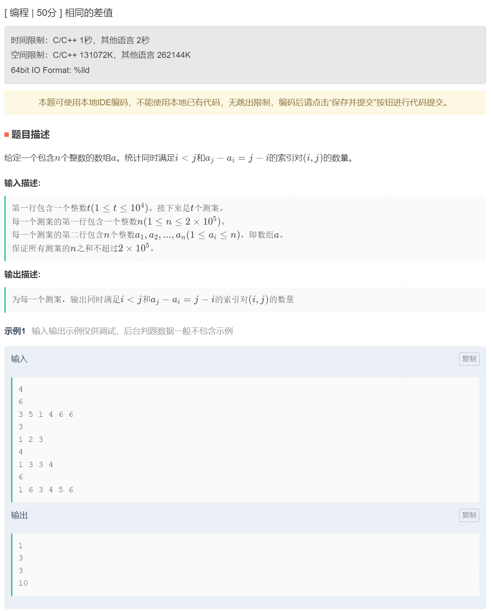
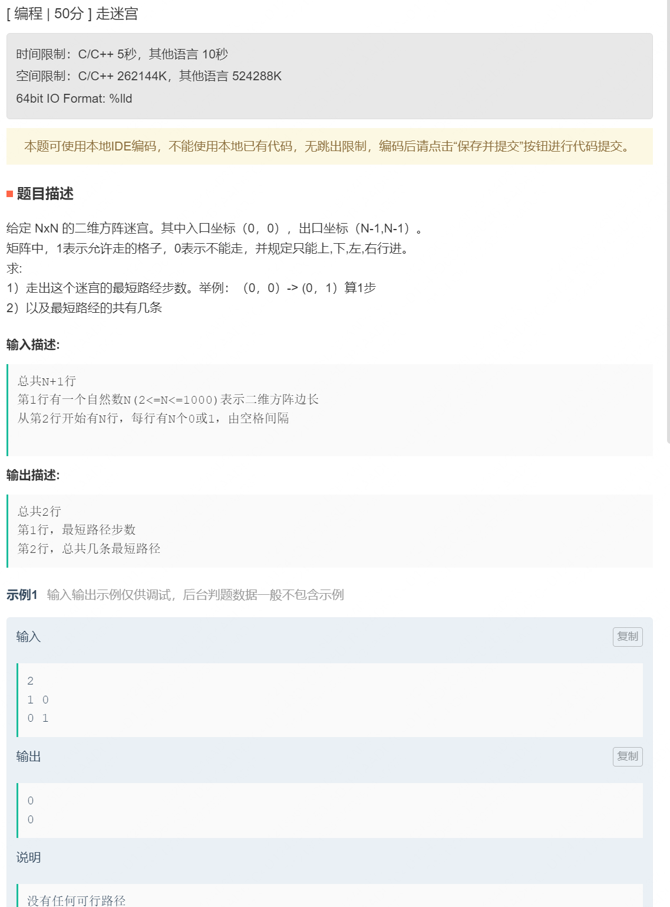
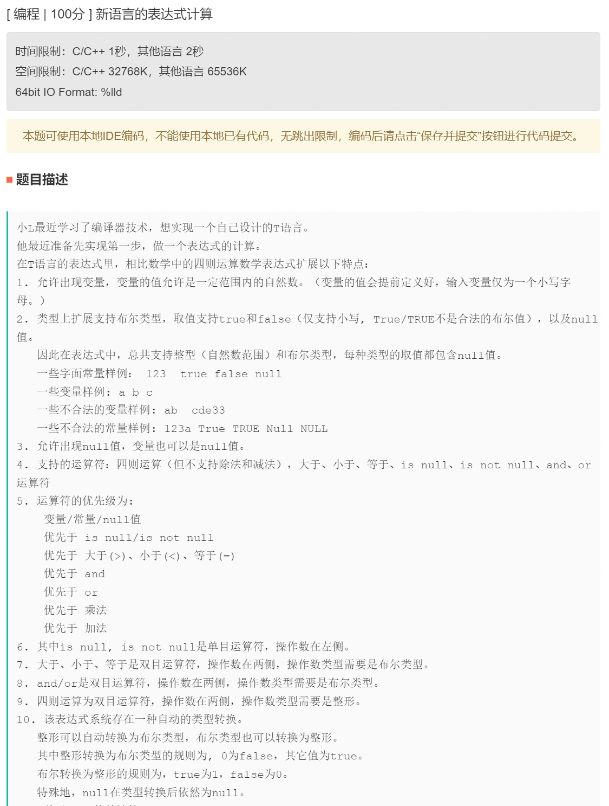
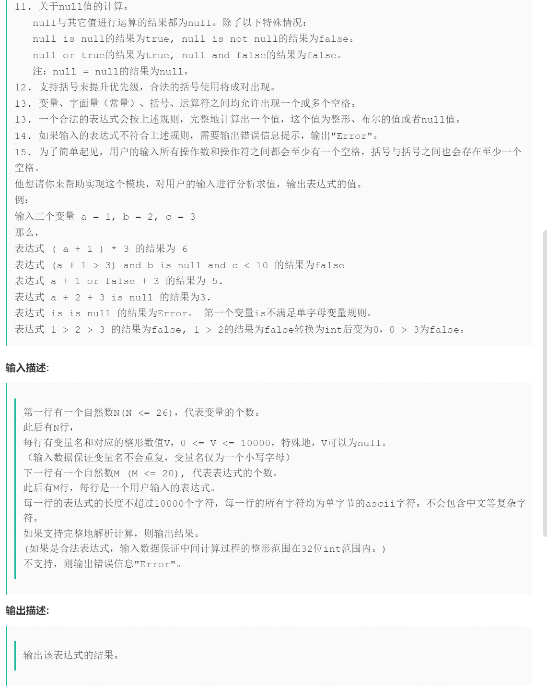
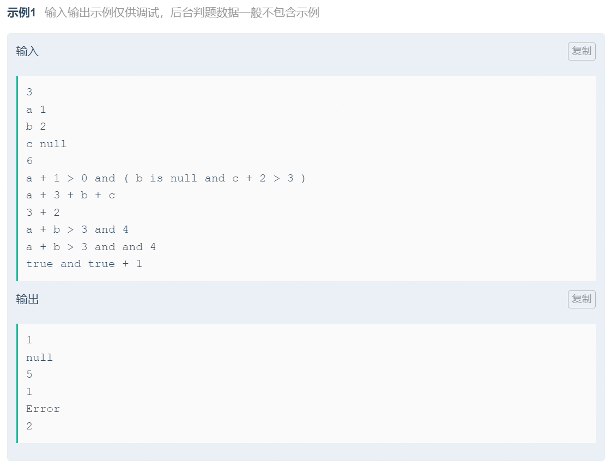

# 星环科技笔试

## 编程题1




```java
package com.xinghuan;

// code1
 import java.util.HashMap;
 import java.util.Map;
 import java.util.Scanner;

public class Main {
    public static void main(String[] args) {
        Scanner in = new Scanner(System.in);
        int t = in.nextInt();
        for (int i = 0; i < t; i++) {
            int n = in.nextInt();
            int[] nums = new int[n];
            for (int j = 0; j < n; j++) {
                nums[j] = in.nextInt();
                nums[j] -= j;
            }
            Solutions sol = new Solutions();
            System.out.println(sol.calcCnt(nums));
        }
    }
}

class Solutions {

    public int calcCnt(int[] nums) {
        int len = nums.length;
        int cnt = 0;
        HashMap<Integer, Integer> hashMap = new HashMap<>();
        for (int i = 0; i < len; i++) {
            hashMap.put(nums[i], hashMap.getOrDefault(nums[i], 0) + 1);
        }

        for (Map.Entry<Integer, Integer> entry : hashMap.entrySet()) {
            int temp = entry.getValue();
            if (temp <= 1)
                continue;
            cnt += temp * (temp-1) / 2;
        }
        return cnt;
    }
}

```

## 编程题2




```java
package com.xinghuan;

import java.util.HashMap;
import java.util.Map;
import java.util.Scanner;

public class Main {
    static int[][] directions = new int[][]{{0, 1}, {0, -1}, {1, 0}, {-1, 0}};
    static HashMap<Integer, Integer> hashMap = new HashMap<>();
    public static void main(String[] args) {
        Scanner in = new Scanner(System.in);
        int n = in.nextInt();
        int[][] nums= new int[n][n];

        for (int i = 0; i < n; i++) {
            for (int j = 0; j < n; j++) {
                nums[i][j] = in.nextInt();
            }
        }
        dfs(nums, n-1, n-1, 0);

        int max_steps = Integer.MAX_VALUE;
        int choices = 0;
        for (Map.Entry<Integer, Integer> entry : hashMap.entrySet()) {
            int step = entry.getKey();
            int choice = entry.getValue();
            if (max_steps > step) {
                max_steps = step;
                choices = choice;
            }
        }
        System.out.println(max_steps);
        System.out.println(choices);

    }

    public static void dfs(int[][] nums, int i, int j, int cnt) {
        // reach termial
        int n = nums.length;
        if (i == 0 && j == 0) {
            hashMap.put(cnt, hashMap.getOrDefault(cnt, 0) + 1);
            return ;
        }
        // not reachable
        if (i >= n || i < 0 || j >= n || j < 0 || nums[i][j] == 0)
            return ;
        // other way
        for (int d = 0; d < 4; d++) {
            nums[i][j] = 0;
            dfs(nums, i + directions[d][0], j + directions[d][1], cnt+1);
            nums[i][j] = 1;
        }
    }
}

```

## 编程题3







## 总结

* 第一个是数组加hashMap的去重
* 第二个是回溯剪枝加hashMap
* 第三个是后缀表达式加强版